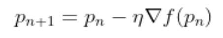

# Deep Learning

[Back](../index.md)

- [Deep Learning](#deep-learning)
  - [Deep Learning Tutorial](#deep-learning-tutorial)
    - [Architectures](#architectures)
    - [Types](#types)
  - [KEY COMPONENTS OF TRAINING PROCESS](#key-components-of-training-process)
    - [DATA](#data)
    - [MODEL](#model)
    - [OBJECTIVE FUNCTIONS](#objective-functions)
    - [ALGORITHMS](#algorithms)
  - [GRADIENT DESCENDENT](#gradient-descendent)
    - [GRADIENT](#gradient)
    - [Gradient descent algorithm](#gradient-descent-algorithm)
    - [GRADIENT DESCENT ALGORITHM’S STEPS](#gradient-descent-algorithms-steps)
  - [Framework](#framework)

---

## Deep Learning Tutorial

- `Deep learning`
  - implemented with the help of `Neural Networks`

---

### Architectures

- `Deep Neural Networks`

  - a neural network that incorporates the complexity of a certain level, which means **several numbers of hidden layers** are encompassed in between the input and output layers.
  - highly proficient in modeling and processing **non-linear associations**. 非线性

- `Deep Belief Networks`

  - a class of Deep Neural Network that **comprises of multi-layer belief networks**.
  - Steps to perform DBN:
    - with the help of the `Contrastive Divergence algorithm`, a layer of features is learned from perceptible units.
    - Next, the formerly trained features are treated as visible units, which perform learning of features.
    - Lastly, when the learning of the final hidden layer is accomplished, then the whole DBN is trained.

- `Recurrent Neural Networks`
  - It permits **parallel** as well as **sequential computation**.
  - Since they are capable enough to **reminisce** all of the imperative things related to the input they have received, so they are more precise. 因为可以记住, 所以准确.

---

### Types

- `Feed Forward Neural Network`

  - a neural network in which the nodes do not form a cycle.
    - **all** the `perceptrons` are organized **within layers**
      - input layer takes the input
      - output layer generates the output
      - hidden layers do not link with the outside world
    - **Fully connected**: 层间全连接
      - Each of the perceptrons contained in one single layer is **associated with each node in the subsequent layer**. 每个感知器都与后续层的感知器相连.
    - in the same layer: **no any visible or invisible connection** between the nodes . 相同层内的感知器不关联
    - no `back-loops`
    - the `backpropagation algorithm` can be used to update the weight values, to **minimize the prediction error**.
  - Applications:
    - Data Compression
    - Pattern Recognition
    - Computer Vision
    - Sonar Target Recognition
    - Speech Recognition
    - Handwritten Characters Recognition

- `Recurrent Neural Network`

  - a variation of feed-forward networks.
    - Here each of the `neurons` present **in the hidden layers** receives an input with a specific **delay** in time.
    - mainly accesses the preceding info of existing iterations.
    - It has a problem with reminiscing prior information.
  - Applications:
    - Machine Translation
    - Robot Control
    - Time Series Prediction
    - Speech Recognition
    - Speech Synthesis
    - Time Series Anomaly Detection
    - Rhythm Learning
    - Music Composition

- `Convolutional Neural Network`
  - a special kind of neural network mainly **used for image classification**, clustering of images and object recognition.
    - DNNs enable unsupervised construction of hierarchical image representations.
    - To achieve the best accuracy, deep convolutional neural networks are preferred more than any other neural network.
  - Applications:
    - Identify Faces, Street Signs, Tumors.
    - Image Recognition.
    - Video Analysis.
    - NLP.
    - Anomaly Detection.
    - Drug Discovery.
    - Checkers Game.
    - Time Series Forecasting.

---

## KEY COMPONENTS OF TRAINING PROCESS

1. The `data` that we can learn from.
2. A `model` of how to transform the data.
3. An `objective function` that quantifies how well (or badly) the model is doing.
4. An `algorithm to adjust the model’s parameters` to optimize the objective function.

---

### DATA

- `features` / `covariates` / `inputs`

  - a set of attributes, based on which the model must make its predictions.

- `label` / `target`

- Generally, the **more** data we have, the **easier** our job becomes.
- It is not enough to have lots of data and to process it cleverly.
  - We need the **right** data

---

### MODEL

- By model, we denote the **computational machinery** for ingesting data of one type, and spitting out predictions of a possibly different type.
- In particular, we are interested in **statistical models** that can be estimated from data

---

### OBJECTIVE FUNCTIONS

- `squared error`

  - the loss function to be used when trying to predict numerical values.
  - the square of the difference between the prediction and the ground truth target.

- **minimize error rate**
  - the most common objective for classification
  - the fraction of examples on which our predictions disagree with the ground truth

---

### ALGORITHMS

- **Popular optimization algorithms** for deep learning are based on an approach called `gradient descent`.
- In short, at each step, this method checks to see, for each parameter, which way the training set loss would move if you perturbed that parameter just a small amount. It then **updates the parameter** in the direction that **lowers the loss**.

---

## GRADIENT DESCENDENT

- `Gradient descent (GD)` is an iterative first-order optimization algorithm used to find a local minimum/maximum of a given function.
  - This method is commonly used in machine learning (ML) and deep learning (DL) **to minimize a cost/loss function** (e.g. in a linear regression)
- Gradient descent algorithm does **not work for all** functions. There are two specific requirements. A function has to be:
  - Differentiable 可微
    - differentiable function, has a derivative for each point in its domain.每个点都有导数
    - non-differentiable functions have a step, a cusp or a discontinuity. 不可微函数具有阶跃、尖点或间断点。
  - Convex 凸函数
    - 函数上任意两点的直线不会穿过函数.

---

### GRADIENT

- `Gradient`
  - a slope of a curve at a given point in a specified direction.
- In the case of a univariate function(单变量函数), it is simply the first derivative(一阶导数) at a selected point.
- In the case of a multivariate function(多元函数), it is a vector of derivatives(导数向量) in each main direction (along variable axes).
  - Because we are interested only in a slope along one axis and we don’t care about others these derivatives are called partial derivatives(偏导数).

---

### Gradient descent algorithm

- `Gradient Descent Algorithm`
  - iteratively **calculates the next point** **using gradient** at the current position, scales it (by a learning rate) and subtracts obtained value from the current position (makes a step).
- It subtracts the value because we want **to minimize the function (to maximize it would be adding)**. This process can be written as:

- `pn+1 = pn - lr*导数 n`

- parameter `η` / `learning rate`

  - scales the gradient and thus **controls the step size**.
  - have a strong influence on performance.

- The **smaller** `learning rate` the **longer** GD converges(收敛的时间越长), or may reach maximum iteration before reaching the optimum point.

- If `learning rate` is too **big** the algorithm may not converge(无法收敛) to the optimal point (jump around) or even to diverge completely(完全偏离)

---

### GRADIENT DESCENT ALGORITHM’S STEPS

1. Choose a starting point (initialization)
2. Calculate gradient at this point
3. Make a scaled step in the **opposite direction** to the gradient (objective: **minimize**)最小化 object function
4. Repeat points 2 and 3 until one of the criteria is met:
   - maximum number of iterations reached
   - step size is smaller than the tolerance (due to scaling or a small gradient).

---

## Framework

- `TensorFlow (TF)`
  - an end-to-end machine learning framework from Google that allows you to perform an extremely wide range of downstream tasks.
  - With TF2.0 and newer versions, more efficiency and convenience was brought to the game.
- `Keras`
  - built on top of TensorFlow, which makes it a wrapper for deep learning purposes.
  - It is incredibly user-friendly and easy to pick up.
  - A solid asset is its neural network block modularity and the fact that it is written in Python, which makes it easy to debug.
- `PyTorch`
  - developed by Facebook
  - widely used in research projects.
  - It allows almost unlimited customization and is well adapted to running tensor operations on `GPUs` (actually, so is TensorFlow).
- `Scikit-learn`
  - user-friendly framework that contains a great variety of useful tools: classification, regression and clustering models, as well a preprocessing, dimensionality reduction and evaluation tools.

---

[TOP](#deep-learning)
