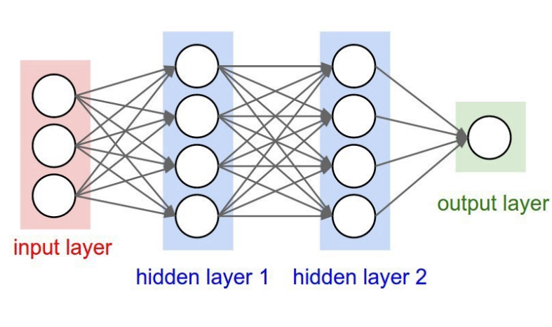
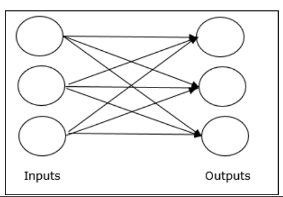
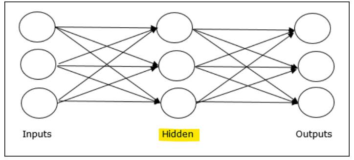

# Deep Learning: Neural Network

[Back](../../index.md)

- [Deep Learning: Neural Network](#deep-learning-neural-network)
  - [Neural Network](#neural-network)
  - [ACTIVATION FUNCTIONS](#activation-functions)
  - [Layers](#layers)
    - [Convolution Neural Network](#convolution-neural-network)
    - [TRAIN-VALIDATION-TEST SPLIT](#train-validation-test-split)
  - [SINGLE-LAYER PERCEPTRON](#single-layer-perceptron)

---

## Neural Network

- `Neural network algorithm`
  - try to create a function to **map** your input to desired output.

- Single layer

- Multilayer

---

## ACTIVATION FUNCTIONS

- `Activation Function`:

  - determine the output of each neuron or node in a neural network.

- Common Function:
  - **Linear**: `f(x) = x`
  - **Sigmoidal**(0,1)
  - **Rectified Linear Unit (ReLU)**(0,x)
    - `ReLU(x)=max(0,x)`
    - Commonly used in hidden layers due to its simplicity and effectiveness.
  - **Softmax**%
    - Used in the output layer for **multi-class classification** problems.
    - Converts a vector of real numbers into a **probability distribution**.

---

## Layers

- `input layer`

  - pick up input signals and passes them to the next Layer.

- `hidden layer`

  - does all kinds of calculations and feature extraction.

- `Output Layer` / `One-Hot Vector`
  - delivers the final result.
  - when it is hot then the value is 1, the others should be all zeros.

---

### Convolution Neural Network

- In this type, the input features are taken **in batches**—as if they pass through a filter. This allows the network to **remember an image in parts**.
- Applications include signal and image processing, such as facial recognition.

---

### TRAIN-VALIDATION-TEST SPLIT

- `Validation`

  - the portion of data which will be evaluated against **during the training process**.
  - This data is used to estimate the prediction error.

- `Test`

  - the data used to **evaluate** the **neural network model**.
  - If the network performs well on the test data, you can bring the network to the production level.

- **split strategy**

  - If your data is not that many, maybe in **thousands or tens of thousands**, then use `70–10–20` as the split strategy.

    - `70%` of the data are split into **training**,
    - `10%` into **validation**,
    - and `20%` into the **test** set.

  - If you have **millions** of data, then `90–5–5` is a better split strategy.
    - Or, if the data is more than that, maybe you can use `98–1–1` as the split strategy.

---

## SINGLE-LAYER PERCEPTRON

---

[TOP](#deep-learning-neural-network)
