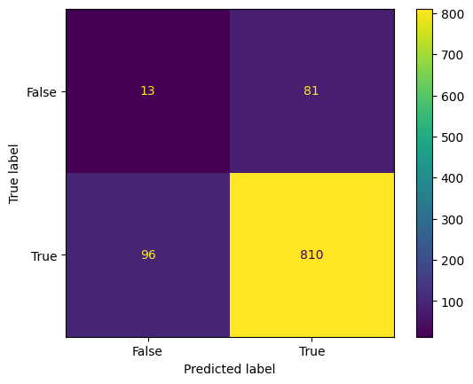

# Machine Learning - Confusion Matrix

[Back](./index.md)

- [Machine Learning - Confusion Matrix](#machine-learning---confusion-matrix)
  - [Confusion Matrix](#confusion-matrix)
    - [Creating a Confusion Matrix](#creating-a-confusion-matrix)
    - [Visulize Confusion Matrix](#visulize-confusion-matrix)
  - [Measures](#measures)
    - [Accuracy](#accuracy)
    - [Precision](#precision)
    - [Sensitivity (Recall)召回率/灵敏度](#sensitivity-recall召回率灵敏度)
    - [Specificity 特效度](#specificity-特效度)
    - [F-score](#f-score)

---

## Confusion Matrix

- `confusion matrix`: a table that is used in `classification problems` to assess <u>where errors in the model were made</u>.

  - The `rows` represent the **actual classes** the outcomes should have been.
  - The `columns` represent the **predictions** we have made.
  - easy to see which predictions are wrong.

- The Confusion Matrix created has **four different quadrants**:

  - `True Negative` (Top-Left Quadrant)
  - `False Positive` (Top-Right Quadrant)
  - `False Negative` (Bottom-Left Quadrant)
  - `True Positive` (Bottom-Right Quadrant)

- `True`: the values were accurately predicted
- `False`: an error or wrong prediction.

Now that we have made a Confusion Matrix, we can calculate different measures to quantify the quality of the model. First, lets look at Accuracy.

---

### Creating a Confusion Matrix

- `Confusion matrixes` can be created by predictions made from a `logistic regression`.

- `sklearn.metrics.confusion_matrix()`: create the confusion matrix

```py
import numpy

# numpy.random.binomial(): Draw samples from a binomial distribution二项分布.
#   n: int Parameter of the distribution
#   p: float Parameter of the distribution
#   size: Output shape.
# return: Drawn samples from the parameterized binomial distribution
actual = numpy.random.binomial(1, 0.9, size=1000)
predicted = numpy.random.binomial(1, 0.9, size=1000)

# print(actual)
# print(predicted)

from sklearn import metrics
confusion_matrix = metrics.confusion_matrix(actual, predicted)

```

---

### Visulize Confusion Matrix

- `sklearn.metrics.ConfusionMatrixDisplay()`: convert the table into a confusion matrix display.
  - parameter:
    - confusion_matrix: Confusion matrix.
    - display_labels: Display labels for plot
  - return: ConfusionMatrixDisplay object

```py
import matplotlib.pyplot as plt

cm_display = metrics.ConfusionMatrixDisplay(confusion_matrix = confusion_matrix, display_labels = [False, True])

# print(type(cm_display))

cm_display.plot()
plt.show()
```



---

## Measures

- The different measures include: `Accuracy`, `Precision`, `Sensitivity (Recall)`, `Specificity`, and the `F-score`.

### Accuracy

- `Accuracy`: how often the model is correct.

- Calculate
  - Accuracy = (True Positive + True Negative) / Total Predictions

```py
Accuracy = metrics.accuracy_score(actual, predicted)

print("Accuracy:", Accuracy)        # Accuracy: 0.823
```

---

### Precision

- Of the **positives predicted**, what percentage is truly positive?

  - 真阳/预测阳

- Calculate
  - Precision = True Positive / (True Positive + False Positive)

```py
Precision = metrics.precision_score(actual, predicted)

print("Precision:", Precision)      # Precision: 0.9090909090909091
```

---

### Sensitivity (Recall)召回率/灵敏度

- Of all the **positive cases**, what percentage are predicted positive?

  - 真阳/实际阳

- `Sensitivity (sometimes called Recall)` measures how good the model is **at predicting positives.**

  - This means it looks at true positives and false negatives (which are positives that have been incorrectly predicted as negative).

- Calculate
  - Recall = True Positive / (True Positive + False Negative)

```py
Sensitivity_recall = metrics.recall_score(actual, predicted)

print("Sensitivity_recall", Sensitivity_recall)
# Sensitivity_recall 0.8940397350993378
```

---

### Specificity 特效度

specificity = TN/N，表示的是所有负例中被分对的比例，衡量了分类器对负例的识别能力。
How well the model is at prediciting negative results?

- `Specificity` measures how good the model is **at predicting negative.**

- Calculate (the opposite of Recall)
  - Specificity = True Negative / (True Negative + False Positive)

```py
Specificity = metrics.recall_score(actual, predicted, pos_label=0)

print("Specificity", Specificity)
# pecificity 0.13829787234042554
```

---

### F-score

- `F-score` is the "harmonic mean"(调和平均数) of precision and sensitivity.

  - It considers both false positive and false negative cases and is good for imbalanced datasets.
  - This score does not take into consideration the True Negative values

- Calculate
  - F-score = 2 _ ((Precision _ Sensitivity) / (Precision + Sensitivity))

```py
F1_score = metrics.f1_score(actual, predicted)

print("F1_score", F1_score)
# F1_score 0.9015025041736227
```

---

[TOP](#machine-learning---confusion-matrix)
