# PyTorch - Convolutional Neural Network

[Back](../index.md)

- [PyTorch - Convolutional Neural Network](#pytorch---convolutional-neural-network)
  - [Convolutional Neural Network](#convolutional-neural-network)
  - [Architecture](#architecture)
    - [Convolution Layer](#convolution-layer)
      - [Strides](#strides)
      - [Padding](#padding)
    - [NONLINEAR LAYER](#nonlinear-layer)
    - [Pooling Layer](#pooling-layer)
      - [Max Pooling](#max-pooling)
      - [Average Pooling](#average-pooling)
      - [Sum Pooling](#sum-pooling)
    - [Fully Connected Layer](#fully-connected-layer)
  - [Steps](#steps)
  - [Example](#example)

---

## Convolutional Neural Network

- `digital image`

  - a binary representation of visual data.
  - It contains a series of pixels arranged **in a grid-like fashion** that contains pixel values to denote how bright and what color each pixel should be.

- `Convolutional Neural Network`

  - usually used to do image classification and image recognition in neural networks.
  - a class of neural networks that specializes in processing data that has a grid-like topology, such as an image.
  - a special type of **feed-forward artificial neural network**

- Image resolution

  - `h * w * d`:
    - RGB image: 6 _ 6 _ 3
    - grayscale image: 4 _ 4 _ 1

- Layers:
  - a convolutional layer
  - a pooling layer
  - a fully connected layer

---

## Architecture

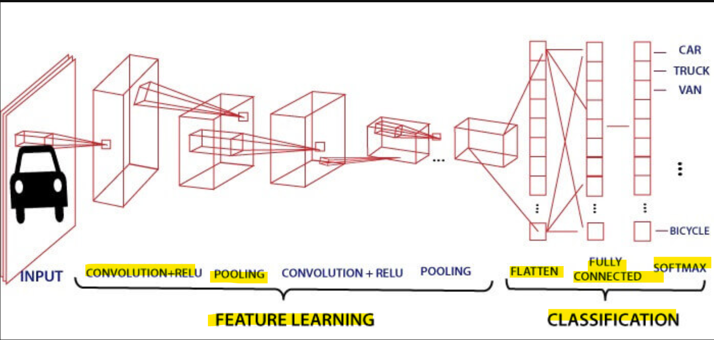

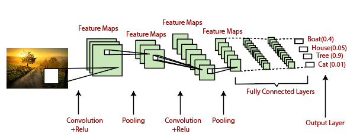

- a sequence of `convolution layers` along with `pooling`,
- `fully connected layers`,
- `Soft-max function` to **classify** an object with probabilistic values 0 and 1.

---

### Convolution Layer

- `Convolution layer`

  - the first layer to **extract features** from an input image.
  - a layer used to **extract hierarchical features from input data** using `learnable filters` and **convolutional operations**.
  - performs a **dot product** between two matrices, where one matrix is the set of `learnable parameters`/`kernel`, and the other matrix is the restricted portion of the receptive field.

- The dimension of the `image matrix` is `h×w×d`.
- The dimension of the `filter` is `fh×fw×d`.
- The dimension of the output is `(h-fh+1)×(w-fw+1)×1`.
- `Features Map`:
  - the **dot product** of input image and filter.

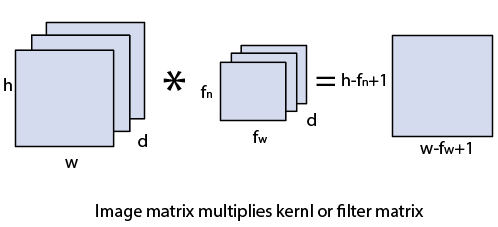

- `learnable parameters`/`kernel`

  - a **matrix of weights** that are trainable during the model's training process, allowing the model to automatically learn and extract meaningful features from the input data.
  - spatially smaller than an image but is **more indepth**.
    - if the image is composed of three (`RGB`) channels, the kernel height and
      width will be spatially small, but the depth extends up to all three channels.
  - smaller size but more depth

- used to **collect neightbore region info**

---

#### Strides

- `Stride`
  - each individual step that filter of `Convolutional layer` slides.
  - the number of pixels which are **shift over** the input matrix.
  - When the stride is equaled to `1`, then we move the filters to 1 pixel at a time and similarly,
  - if the stride is equaled to 2, then we move the filters to 2 pixels at a time.

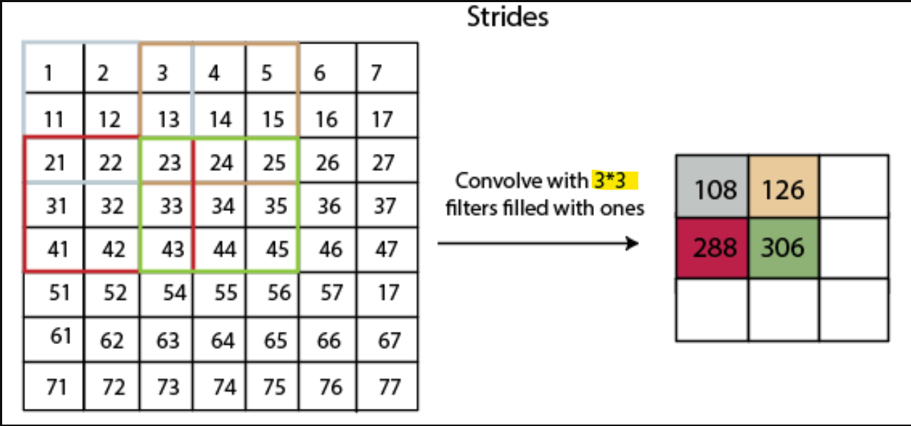

> - Example: filter/kernel = 3\*3; stride = 2.

---

#### Padding

- `Padding`
  - an additional layer which can add to the border of an image.
  - the pixel in the corner will only get covers one time, but the middle pixel will get covered more than once. It means that we have more information on that middle pixel

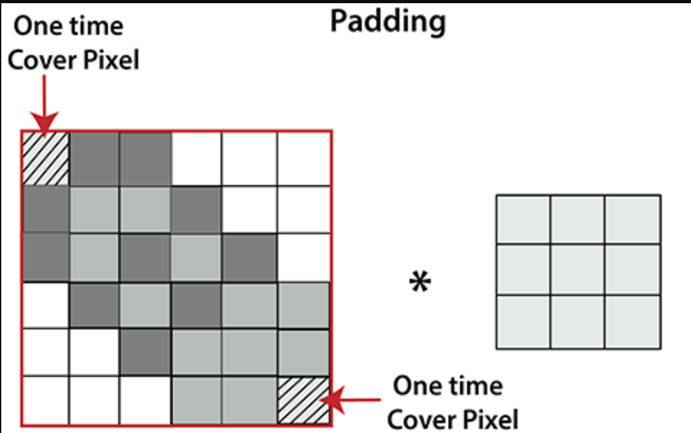

---

### NONLINEAR LAYER

- `NONLINEAR LAYER`

  - the layers that **introduce nonlinearity** into the network
  - achieved through the use of activation functions.
  - enable the model to learn and approximate complex, nonlinear relationships within the data. 可以学习非线性关系.

- Common activation functions used as nonlinear layers include:
  - ReLU
  - Sigmoid
  - Tanh

---

### Pooling Layer

- `Pooling layer`

  - a layer used to down-sample and reduce spatial dimensions using max or average pooling operations.
  - **reduces the number of parameters** when the images are too large.
  - Pooling is "downscaling" of the image obtained from the previous layers.

- Purpose:

  - By selecting a subset of **representative values** (e.g., maximum or average values) within local regions, pooling **reduces the size** of the feature maps. 提取代表性数据, 减少 size
  - This down-sampling helps manage **computational complexity**, as subsequent layers have fewer parameters to process.
  - **reduces the risk of overfitting**, as the network becomes less sensitive to minor variations in the input.
  - allows the network to **focus on the presence of relevant features**
  - **reduce size of the images**

- `Spatial pooling` / `downsampling` / `subsampling`
  - reduces the dimensionality of each map but retains the important information.

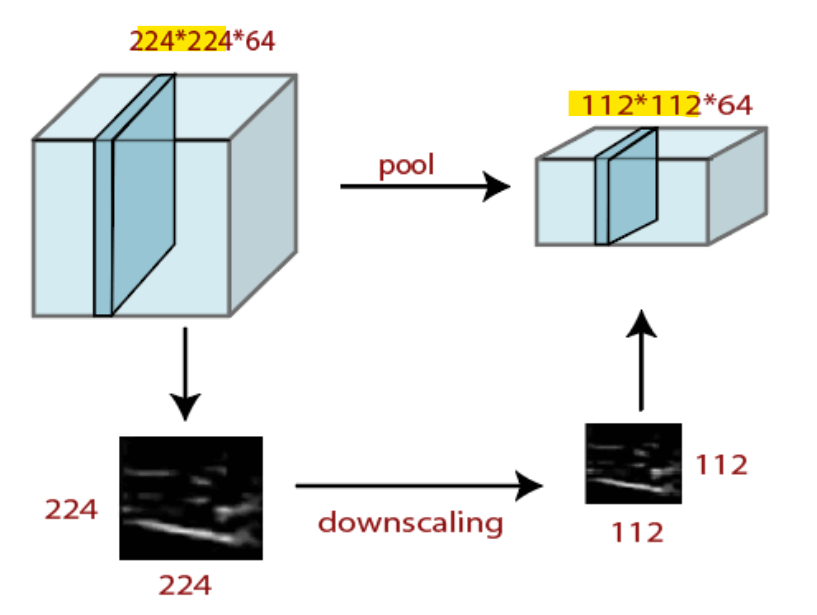

---

#### Max Pooling

- `Max pooling`
  - a sample-based **discretization** process.
  - by **applying a max filter** to non-overlapping sub-regions of the initial representation.

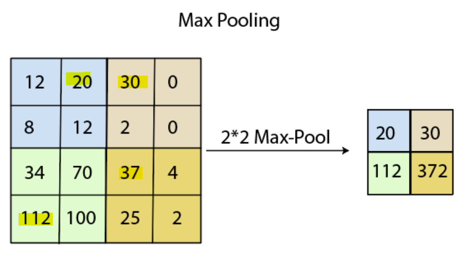

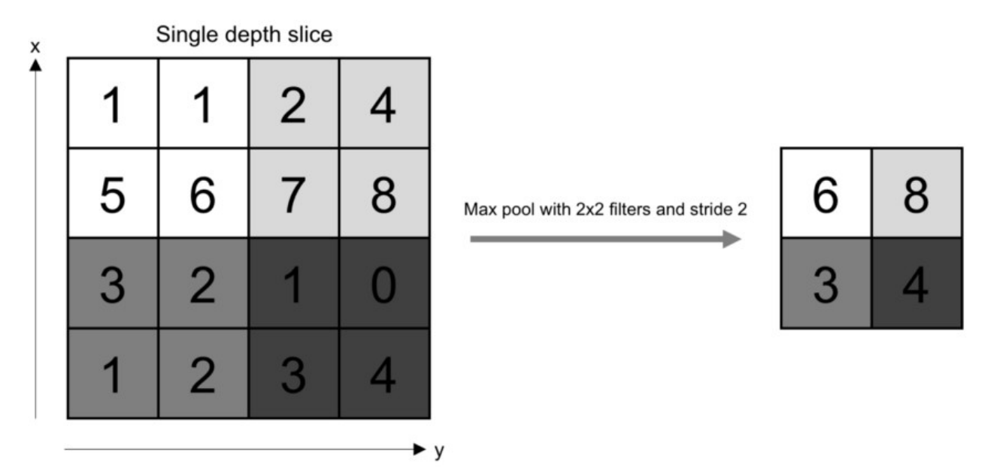

---

#### Average Pooling

- `Average Pooling`
  - perform through **average pooling** by dividing the input into rectangular pooling regions and computing the average values of each region.

---

#### Sum Pooling

- `Sum Pooling`:
  - use sum.

---

### Fully Connected Layer

- `fully connected layer`
  - a layer in which the input from the other layers will be **flattened into a vector** and sent.
  - transform the output into the desired number of classes by the network.

---

## Steps

- Step 1:
  - Size the same
  - depth = kernel

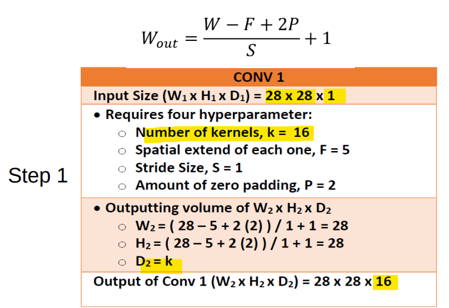

---

- Step 2:
  - Size reduces
  - depth the same

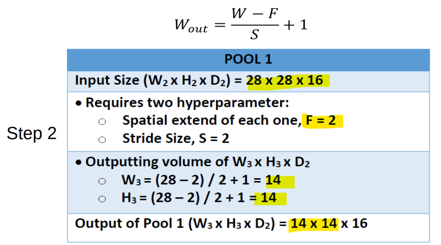

---

- Step 3:
  - size the same
  - depth = kernel

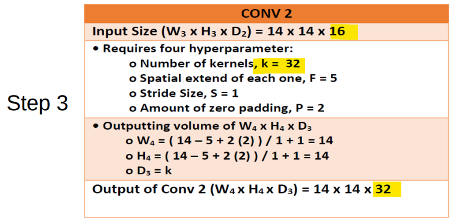

---

- Step 4:
  - Size reduces
  - depth the same

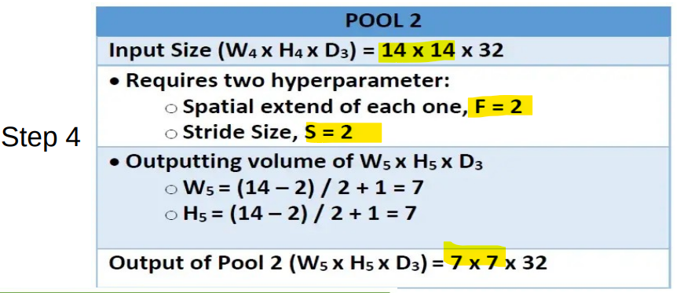

---

- Step 5:


---

## Example

https://www.geeksforgeeks.org/implementation-of-a-cnn-based-image-classifier-using-pytorch/

- 待续

```py
import torch
import matplotlib.pyplot as plt
import numpy as np
import torch.nn.functional as func
import PIL.ImageOps
from torch import nn
from torchvision import datasets, transforms
import requests
from PIL import Image

# Prepare Dataset
transform1 = transforms.Compose([transforms.Resize(
    (28, 28)), transforms.ToTensor(), transforms.Normalize((0.5,), (0.5,))])
training_dataset = datasets.MNIST(
    root='./data', train=True, download=True, transform=transform1)
validation_dataset = datasets.MNIST(
    root='./data', train=False, download=True, transform=transform1)
training_loader = torch.utils.data.DataLoader(
    dataset=training_dataset, batch_size=100, shuffle=True)
validation_loader = torch.utils.data.DataLoader(
    dataset=validation_dataset, batch_size=100, shuffle=False)


# def im_convert(tensor):
#     image = tensor.clone().detach().numpy()
#     image = image.transpose(1, 2, 0)
#     print(image.shape)
#     image = image*(np.array((0.5, 0.5, 0.5))+np.array((0.5, 0.5, 0.5)))
#     image = image.clip(0, 1)
#     return image


# dataiter = iter(training_loader)
# images, labels = dataiter.next()
# fig = plt.figure(figsize=(25, 4))
# for idx in np.arange(20):
#     ax = fig.add_subplot(2, 10, idx+1)
#     plt.imshow(im_convert(images[idx]))
#     ax.set_title([labels[idx].item()])


# class classification1(nn.Module):
#     def __init__(self, input_layer, hidden_layer1, hidden_layer2, output_layer):
#         super().__init__()
#         self.linear1 = nn.Linear(input_layer, hidden_layer1)
#         self.linear2 = nn.Linear(hidden_layer1, hidden_layer2)
#         self.linear3 = nn.Linear(hidden_layer2, output_layer)

#     def forward(self, x):
#         x = func.relu(self.linear1(x))
#         x = func.relu(self.linear2(x))
#         x = self.linear3(x)
#         return x


# model = classification1(784, 125, 65, 10)
# criteron = nn.CrossEntropyLoss()
# optimizer = torch.optim.Adam(model.parameters(), lr=0.0001)
# epochs = 12
# loss_history = []
# correct_history = []
# val_loss_history = []
# val_correct_history = []
# for e in range(epochs):
#     loss = 0.0
#     correct = 0.0
#     val_loss = 0.0
#     val_correct = 0.0
#     for input, labels in training_loader:
#         inputs = input.view(input.shape[0], -1)
#         outputs = model(inputs)
#         loss1 = criteron(outputs, labels)
#         optimizer.zero_grad()
#         loss1.backward()
#         optimizer.step()
#         _, preds = torch.max(outputs, 1)
#         loss += loss1.item()
#         correct += torch.sum(preds == labels.data)
#     else:
#         with torch.no_grad():
#             for val_input, val_labels in validation_loader:
#                 val_inputs = val_input.view(val_input.shape[0], -1)
#                 val_outputs = model(val_inputs)
#                 val_loss1 = criteron(val_outputs, val_labels)
#                 _, val_preds = torch.max(val_outputs, 1)
#                 val_loss += val_loss1.item()
#                 val_correct += torch.sum(val_preds == val_labels.data)
#         epoch_loss = loss/len(training_loader.dataset)
#         epoch_acc = correct.float()/len(training_dataset)
#         loss_history.append(epoch_loss)
#         correct_history.append(epoch_acc)

#         val_epoch_loss = val_loss/len(validation_loader.dataset)
#         val_epoch_acc = val_correct.float()/len(validation_dataset)
#         val_loss_history.append(val_epoch_loss)
#         val_correct_history.append(val_epoch_acc)
#         print('training_loss:{:.4f},{:.4f}'.format(
#             epoch_loss, epoch_acc.item()))
#         print('validation_loss:{:.4f},{:.4f}'.format(
#             val_epoch_loss, val_epoch_acc.item()))

# url = 'https://images.homedepot-static.com/productImages/007164ea-d47e-4f66-8d8c-fd9f621984a2/svn/architectural-mailboxes-house-letters-numbers-3585b-5-64_1000.jpg'
# response = requests.get(url, stream=True)
# img = Image.open(response.raw)
# img = PIL.ImageOps.invert(img)
# img = img.convert('1')
# img = transform1(img)
# plt.imshow(im_convert(img))
# img = img.view(img.shape[0], -1)
# output = model(img)
# _, pred = torch.max(output, 1)
# print(pred.item())

# dataiter = iter(validation_loader)
# images, labels = dataiter.next()
# images_ = images.view(images.shape[0], -1)
# output = model(images_)
# _, preds = torch.max(output, 1)
# fig = plt.figure(figsize=(25, 4))
# for idx in np.arange(20):
#     ax = fig.add_subplot(2, 10, idx+1, xticks=[], yticks=[])
#     plt.imshow(im_convert(images[idx]))
#     ax.set_title("{}({})".format(str(preds[idx].item()), str(
#         labels[idx].item())), color=("green" if preds[idx] == labels[idx] else "red"))
# plt.show()

```

---

[TOP](#pytorch---convolutional-neural-network)
