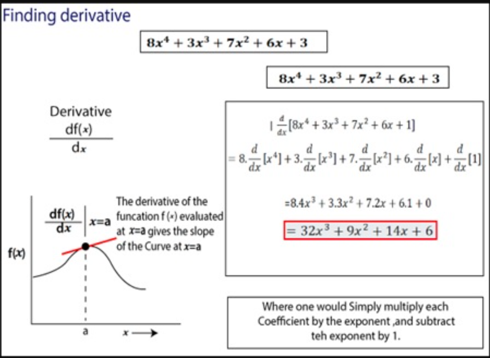
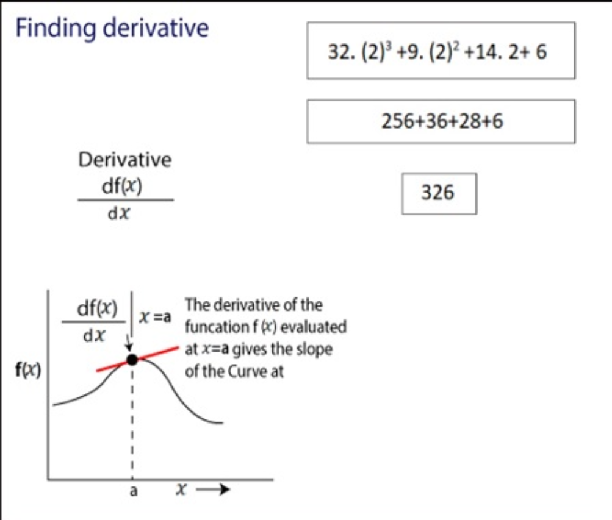

# PyTorch - Gradient

[Back](../index.md)

- [PyTorch - Gradient](#pytorch---gradient)
  - [Gradient](#gradient)
  - [Example 1: Calculate Derivatives](#example-1-calculate-derivatives)
  - [Example 2: Calculate Derivatives](#example-2-calculate-derivatives)

---

## Gradient

- `gradient`
  - used to find the `derivatives` of the function.用来找导数
  - In mathematical terms, `derivatives` mean differentiation of a function partially and finding the value.(导数是指对函数进行部分微分并求其值。)

---

## Example 1: Calculate Derivatives

- 根据函数, 求给定值的导数





```py
import torch
# requires_grad: require a gradient to find the derivative of the function.
x = torch.tensor(2.0, requires_grad=True)
print(x)        # tensor(2., requires_grad=True)
y = 8*x**4+3*x**3+7*x**2+6*x+3      # define function
# compute the derivative of the function
y.backward()
# .grad: The attribute of tensor. The value is the gradients computed and future calls to backward().
print(x.grad)  # tensor(326.)
```

---

## Example 2: Calculate Derivatives

```py
import torch
x = torch.tensor(2.0, requires_grad=True)
z = torch.tensor(4.0, requires_grad=True)

# define function
y = x**2+z**3

y.backward()    # get Derivatives
print(x.grad)   # tensor(4.)
print(z.grad)   # tensor(48.)
```

---

[TOP](#pytorch---gradient)
