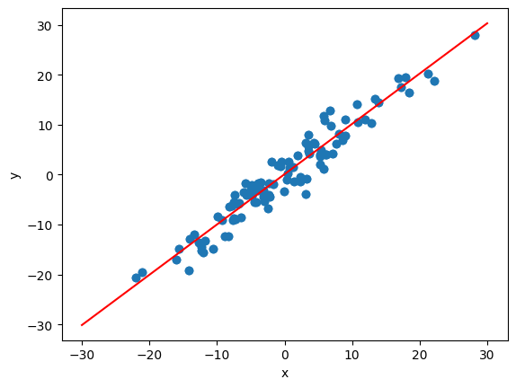

# PyTorch - Linear Regression

[Back](../index.md)

- [PyTorch - Linear Regression](#pytorch---linear-regression)
  - [Linear regression](#linear-regression)
  - [Example:](#example)
    - [Model class](#model-class)
    - [Optimizer](#optimizer)
    - [Criterion](#criterion)
  - [Example: Linear Regression](#example-linear-regression)
  - [Prediction `.forward()`](#prediction-forward)
  - [Example: Linear Regression - plot](#example-linear-regression---plot)

## Linear regression

- `Linear regression`
  - find the linear **relationship** between the dependent and independent variable by minimizing the distance.
  - a **supervised** machine learning approach.

---

## Example:

- Suppose linear regression relationship:

  - `Y=AX+b`
  - `A` is the slope.
  - `b` is y-intercept.

- three essential component
  - model
  - objective function(loss functions)
  - algorithm

---

### Model class

- using `nn.Module`
- `nn.Module`: Base class for all neural network modules.
  - `forward()`: Define the computation performed at every call.

---

### Optimizer

- `Optimizer`

  - used to optimize weight to fit the model into the dataset.

- optimization algorithms

  - algorithms used for optimizer
  - e.g., gradient descent and backpropagation

- `torch.optim` package

  - `optim.SGD(params)`: Implements stochastic gradient descent
  - `optim.Adam(params)`: Implements Adam algorithm.

- `.step()`: implemented by all optimizer, which **updates** the parameters.每个算法都有.
  - two ways to use:
    - `Optimizer.step()`
    - `Optimizer.step(closure)`

---

### Criterion

- `criterion`
  - `loss function`,
  - used to find loss.
  - e.g., `nn.MSELoss(size_average = False)`

---

## Example: Linear Regression

- `nn.Linear(in_features, out_features)`:
  - Applies a linear transformation to the incoming data

```py
import torch
from torch.autograd import Variable
# prepare data
xdata = Variable(torch.Tensor([[1.0], [2.0], [3.0]]))
print(xdata)
# tensor([[1.],
#         [2.],
#         [3.]])
ydata = Variable(torch.Tensor([[2.0], [4.0], [6.0]]))
print(ydata)
# tensor([[2.],
#         [4.],
#         [6.]])


# define model
class LRM(torch.nn.Module):
    def __init__(self):
        super(LRM, self).__init__()
        # nn.Linear(in_features, out_features): Applies a linear transformation to the incoming data
        self.linear = torch.nn.Linear(1, 1)

    # define Activation function
    def forward(self, x):
        ypred = self.linear(x)
        return ypred


# create model
ourmodel = LRM()
# define criterion, objective function
criterion = torch.nn.MSELoss(size_average=False)
# define optimizer, algorithm.
optimizer = torch.optim.SGD(ourmodel.parameters(), lr=0.01)

# train model
for epoch in range(100):
    predy = ourmodel(xdata)         # get predited value
    loss = criterion(predy, ydata)  # get loss

    optimizer.zero_grad()           # Reset gradients of all model parameters.
    loss.backward()                 # Computes the gradient/To compute derivatives
    optimizer.step()                # Performs optimization, Update the parameters
    print('epoch {}, loss {}'.format(epoch, loss.item()))

# create a data for prediction
newvar = Variable(torch.Tensor([[4.0]]))
predy = ourmodel(newvar)
print(predy.data)   # tensor([[7.3094]])

```

---

## Prediction `.forward()`

```py
import torch
from torch.nn import Linear

torch.manual_seed(42)
model = Linear(in_features=1, out_features=1)
print(model.bias)               # the value assosicated with seed.
# Parameter containing:
# tensor([0.8300], requires_grad=True)
print(model.weight)             # the value assosicated with seed.
# Parameter containing:
# tensor([[0.7645]], requires_grad=True)

# -------- For single data
# define a single data
x = torch.tensor([2.0])
print(model(x))     # prediction
# tensor([2.3591], grad_fn=<AddBackward0>)


# -------- For multiple data
x = torch.tensor([[2.0], [4.0], [6.0]])
print(model(x))
# tensor([[2.3591],
#         [3.8882],
#         [5.4172]], grad_fn=<AddmmBackward0>)
```

## Example: Linear Regression - plot

- Define Data

```py
import torch
import matplotlib.pyplot as plt
import numpy as np

# Define data
X = torch.randn(100, 1)*10
y = X+3*torch.randn(100, 1)

#  plot data
plt.plot(X.numpy(), y.numpy(), 'o')
plt.ylabel('y')
plt.xlabel('x')
```

- Define Model

```py
import torch
import torch.nn as nn

class LR(nn.Module):
    def __init__(self, input_size, output_size):
        super().__init__()
        self.linear = nn.Linear(input_size, output_size)

    # activation function
    def forward(self, x):
        pred = self.linear(X)
        return pred

# set seed
torch.manual_seed(42)  # For consistency of random result
# create model
model = LR(1, 1)

print(model)
# LR(
#   (linear): Linear(in_features=1, out_features=1, bias=True)
# )
```

- Define Objective function and algorithm

```py
# defein objective function
criterion = nn.MSELoss()  # Using Loss Function
# define algorithm
# Using optimizer which uses GD algorithm
optimizer = torch.optim.SGD(model.parameters(), lr=0.01)

```

- Train

```py

[a, b] = model.parameters()  # Unpacking of parameters
epochs = 100
losses = []

for i in range(epochs):
    ypred = model.forward(X)            # predict

    loss = criterion(ypred, y)          # get loss
    print("epoch:", i, "loss:", loss.item())
    losses.append(loss)

    # gradient descent
    optimizer.zero_grad()
    loss.backward()
    optimizer.step()
```

- Plot LR

```py


# get weight and bias


def grtparameters():
    return (a[0][0].item(), b[0].item())

# plot


def plotfit(title):
    plt.title = title
    a1, b1 = grtparameters()
    x1 = np.array([-30, 30])
    y1 = a1*x1+b1
    plt.plot(x1, y1, 'r')
    plt.scatter(X, y)
    plt.show()


plotfit('Trained Model')
```



---

[TOP](#pytorch---linear-regression)
