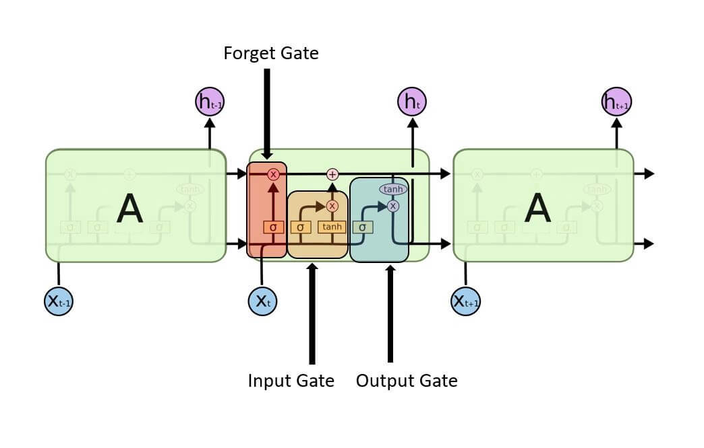
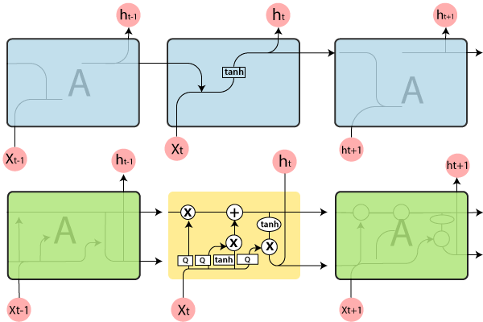
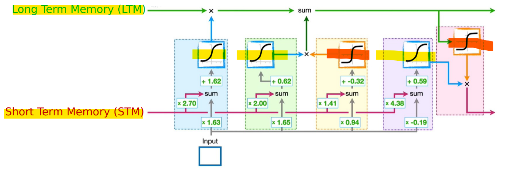

# Deep Learning - Long Short-Term Memory (LSTM)

[Back](../index.md)

- [Deep Learning - Long Short-Term Memory (LSTM)](#deep-learning---long-short-term-memory-lstm)
  - [Long Short-Term Memory (LSTM)](#long-short-term-memory-lstm)
  - [Architecture of LSTM Networks](#architecture-of-lstm-networks)

---

## Long Short-Term Memory (LSTM)

- `Long Short-Term Memory (LSTM)`:

  - an advanced recurrent neural network (RNN) design that was developed to better accurately reflect chronological sequences and related brief relationships.

- Applications:

  - Text Generation
  - Image Processing
  - Speech and Handwriting Recognition
  - Music Generation
  - Language Translation

- Disadvantages
  - Training Time and Resource Intensiveness
  - Complex Cell Structure:
  - Overfitting and Dropout Execution
  - Sensitivity to Random Initialization
  - Limited Long-Term Memory

---

## Architecture of LSTM Networks

---

- `Forget gate`: decide forget

  - The output **determines the percentage of the `Longe-Term Menory` to be remembered.**
  - A `sigmoid function` decides it.
    - It looks at 监控 2 个
      - the `previous state` (ht-1) 前状态
      - and the `content input` (Xt) 内容输入
    - outputs a number between `0`(omit this) and `1`(keep this) for each number in the cell state Ct-1

---

- `Input gate`:

  - create a `New Long-Term Memory`
  - **`Sigmoid function`**:
    - decides which **values to let through** 0 or 1.
    - determine the % of `Potential Long-Term memory` to add to the `Long-Term Memory`
  - **`tanh function`**
    - gives weightage to the values which are passed, **deciding their level of importance** ranging from -1 to 1.
    - **combines** the `Short-Term Memory` and the `Input`
    - Create a `Potential Long-Term Memory`

- `Output gate`
  - The **input** and the **memory of the block** are used to decide the output.
    - `Sigmoid function` decides **which values to let through** 0 or 1.
      - determine % of a `Potential memory`
    - And `tanh function` gives weightage to the values which are passed, **deciding their level of importance** ranging from -1 to 1 and multiplied with an output of sigmoid.
      - create a `Potential Short-Term memory`
    - determines the **present hidden state** that will be passed to the next LSTM unit.

---

- vs `RNN`

- Hidden Layer Structure

  - the hidden layer of LSTM is the **gated unit or cell**.
  - **4 layers** that work with each other to create the **output of the cell**, as well as the **cell's state**.
    - Both of these are transferred to the next layer.

- Gating Mechanisms

  - **3 logistic `sigmoid gates`** and 2 `Tanh layer`.
    - `Gates` were added to **restrict the information that goes through cells**.
      - They decide which **portion of the data** is required in the next cell and which parts must be eliminated.
    - The **output** will typically fall in the range of `0-1`
      - `0` is a reference to **"reject all'**
      - `1` means **"include all."**
    - Each LSTM cell is equipped with **three inputs** and **two outputs**

- Activation Functions:
  - **3** `sigmoid` activation functions (0,1)
  - **2** hyperbolic `tangent` activation functions (-1,1)

---

[TOP](#deep-learning---long-short-term-memory-lstm)
