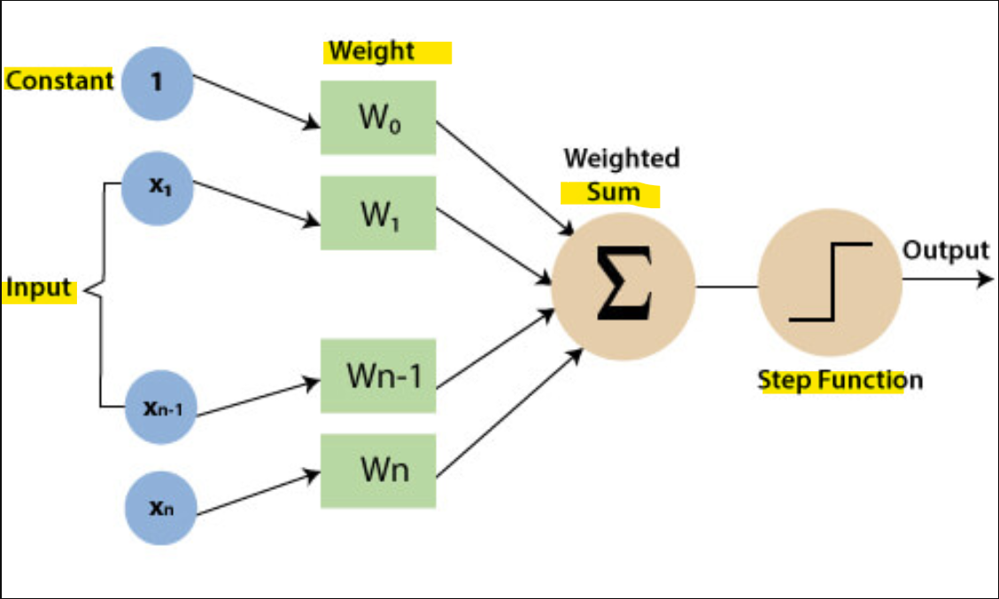

# PyTorch - Perceptron

[Back](../index.md)

- [PyTorch - Perceptron](#pytorch---perceptron)
  - [Perceptron](#perceptron)
  - [Example(待续)](#example待续)

---

## Perceptron

- `Perceptron` / `Linear Binary Classifier`.

  - a single layer neural network
  - a binary classifier used in supervised learning

- `multi-layer perceptron` = a neural network

- `binary classifiers`
  - A function that can decide whether or not an input which is represented by a vector of number **belongs to some specific class**. 是否某个类.

---

- Perceptron consist of four parts:
  - `Input values` / one `input layer`
  - `Weights` and `bias`
    - `Weight`
      - represents the strength or dimension of the connection between units.
      - determined the influence of the input will have on the output
      - shows the **strength** of the particular node.
    - `Bias`
      - similar to the intercept added in a linear equation.
      - an additional parameter to adjust the output along with the weighted sum of the inputs to the neuron.
      - A bias value allows you to shift the activation function curve up or down. 平移
  - `Activation Function`
    - determined whether a neuron is activated or not
    - calculates a weighted sum and further adding bias with it to give the result.
    - used to **map** the `input` between the required value like (0, 1) or (-1, 1)



---

- steps:
  - 1. all the input x are multiplied with their weights, denoted as `K`.
  - 2. calculate `weighted sum`:
    - add all the multiplied value from `K1` to `Kn`
  - 3. applied to the correct activation function.


---

- Since perception returns a binary output,
  - loss function = `cross-entropy()`
  - optimizer = sigmoid gradient descent

---

## Example(待续)

- creating the dataset

```py

import torch
import numpy as np
import matplotlib.pyplot as plt
from sklearn import datasets

# define number of points
no_of_points = 100
# define clusters' centers
centers = [[-0.5, 0.5], [0.5, -0.5]]
# .make_blobs(): Generate isotropic Gaussian blobs for clustering.
x, y = datasets.make_blobs(
    n_samples=no_of_points,
    random_state=42,
    centers=centers,
    cluster_std=0.4
)

print(x)
print(y)
```

- Plot data

```py
def Scatter():
    plt.scatter(x[y == 0, 0], x[y == 0, 1])
    plt.scatter(x[y == 1, 0], x[y == 1, 1])

Scatter()
```

---

[TOP](#pytorch---perceptron)
