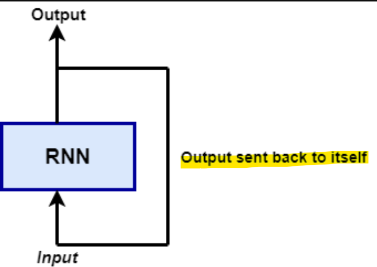
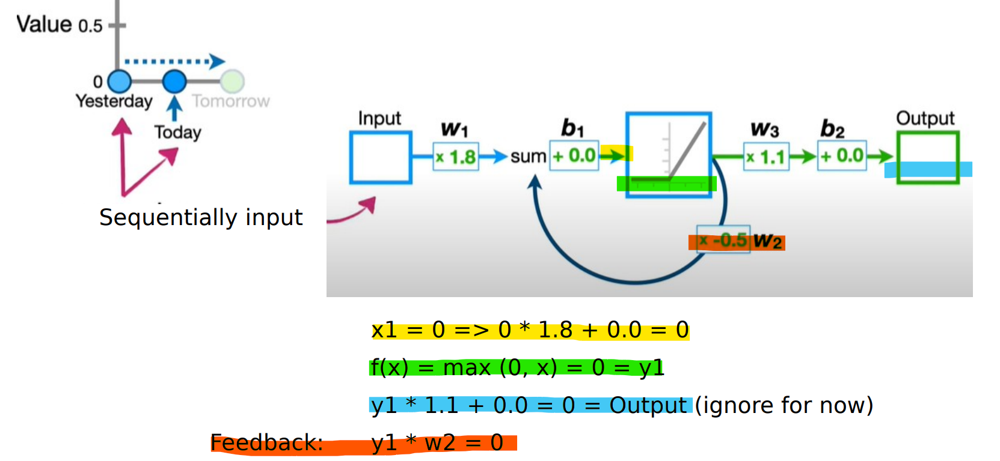

# PyTorch - Recurrent Neural Network (RNN)

[Back](../index.md)

- [PyTorch - Recurrent Neural Network (RNN)](#pytorch---recurrent-neural-network-rnn)
  - [Recurrent Neural Networks](#recurrent-neural-networks)
    - [Architecture](#architecture)
  - [Limitations of RNN: Vanishing and Exploding gradient](#limitations-of-rnn-vanishing-and-exploding-gradient)

---

## Recurrent Neural Networks

- `Recurrent Neural Networks`

  - designed to recognize patterns in sequences of data
  - used to model **time-dependent and sequential data** problems.时序数据与序列数据
  - e.g.:
    - stock market prediction,
    - machine translation,
    - and text generation.

- **RNN vs traditional deep neural networks:**

  - similar to a traditional neural network **except that a memory-state is added to the neurons**.
    - The computation is to include a simple memory.
  - traditional deep neural networks:
    - assume that **inputs and outputs are independent of each other**,
  - RNN:
    - assume that each input and output is **dependent** on all other layers.

- Variants:

  - Bidirectional recurrent neural networks (BRNN),
  - Long short-term memory (LSTM),
  - Gated recurrent units (GRUs)

- Different amounts of inputs

- Usage:
  - speech recognition
  - natural language processing (NLP)
  - numerical time series data

---

### Architecture

> - Input Layer
> - Hidden Layer:
>
>   - Linear function(**input**) + Linear function(**Feedback**) -> Hidden state
>   - Non-linear function -> Non-lear ouput
>
> - Output Layer:
>   - Linear function -> Logit State
>   - Softmax function -> Softmax

> - Hidden Layer's
>   - Linear function(**input**): Yellow
>   - Non-linear function -> Non-lear ouput: Green
>   - Linear function -> Logit State: Output
>   - Linear function(**Feedback**): Orange

---

## Limitations of RNN: Vanishing and Exploding gradient

- `vanishing gradient problem`

  - When a network has too many deep layers, it becomes untrainable.

- The model **learns from** a change in its **gradient**; this change **affects the network's output**.

  - The gradient **stays constant**: no space for improvement.
  - If the difference in the gradient is **too small** (i.e., the weight change a little), the system **can't learn** anything and so the output.
    - model cannot converge towards the right solution.

- 原因:
  - GD 时需要 backpropagation 求导; 
  - 同时每次 feedback 时, 都会乘以 weight; 所以导致 GD 求导时, weight 对 GD 有大影响.
  - 要么太大, Exploding gradient; 要么太小,vanishing gradient;
  - 两种情况都无法收敛.

---

[TOP](#pytorch---recurrent-neural-network-rnn)
