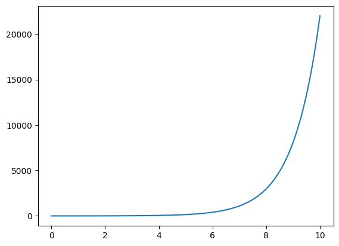
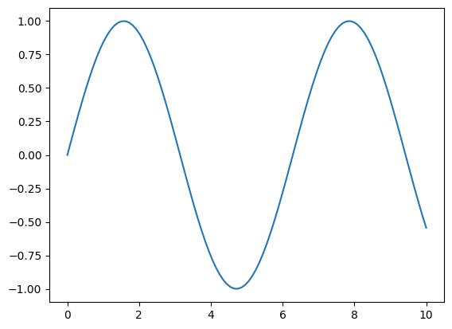

# PyTorch - Tensor

[Back](../index.md)

- [PyTorch - Tensor](#pytorch---tensor)
  - [Tensor](#tensor)
    - [Lab: Create Tensor](#lab-create-tensor)
    - [Lab: Creating one-dimensional Tensor](#lab-creating-one-dimensional-tensor)
  - [Vector Operations](#vector-operations)
    - [Mathematical Operations](#mathematical-operations)
    - [Dot Product and linspace](#dot-product-and-linspace)
  - [Plot](#plot)
  - [Two-dimensional](#two-dimensional)
    - [Tensors Multiplication](#tensors-multiplication)
  - [Three Dimensional Tensor](#three-dimensional-tensor)

---

## Tensor

- `tensor`

  - represents a (possibly multi-dimensional) **array of numerical values**. 数组
  - = `ndaaray` in NumPy library

- `scalar`:

  - a **zero**-dimensional tensor

- `vector`:

  - a tensor with one axis.
  - 1D-Tensor
    - has only one row

- `matrix` / `metrics`:

  - a tensor with two axes.

- `cube`:

  - 3d- tensor

- `cube vector`:

  - 4d-tensor.

- `kth order tensor`:
  - a tensor with k > 2 axes

---

```py
Import torch
arr = [[3, 4], [8, 5]]
pytensor = torch.Tensor(arr)
print(pytensor)
```

---

### Lab: Create Tensor

```py
import torch
# -------- Create Tensor from an array

arr = [[3, 4], [8, 5]]
pytensor = torch.Tensor(arr)
print(pytensor)
# tensor([[3., 4.],
#         [8., 5.]])

# -------- Create Tensor with all one
# ones(size): Returns a tensor filled with the scalar value 1,
#     size: shape of the output tensor
ones_t = torch.ones((2, 2))
print(ones_t)
# tensor([[1., 1.],
#         [1., 1.]])

# -------- Create Tensor with the random number
# rand(size): Returns a tensor filled with random numbers
torch.manual_seed(0)        # Set the seed for generating random numbers
#     size: shape of the output tensor
rand_t = torch.rand(size=(2, 2))
print(rand_t)
# tensor([[0.8085, 0.2602],
#         [0.7068, 0.0452]])


# -------- Create a Tensor from numpy array
# from_numpy(ndarray): Creates a Tensor from a numpy.ndarray.
import torch
import numpy as np
a=np.array([1,2,3,4,5,6])
tensorcon=torch.from_numpy(a)
print(tensorcon)            # tensor([1, 2, 3, 4, 5, 6], dtype=torch.int32)
print(tensorcon.type())     # torch.IntTensor

print(t)
# tensor([1, 2, 3], dtype=torch.int32)
```

---

### Lab: Creating one-dimensional Tensor

```py
import torch
n = torch.tensor([1, 2, 3, 4])
print(n)
# tensor([1, 2, 3, 4])


# Accessing of Tensor's elements
print(n[2])     # tensor(3)
print(n[0:2])   # tensor([1, 2])
print(n[0:])    # tensor([1, 2, 3, 4])
print(n[-1])    # tensor(4)

print(n[2:-1])   # tensor([3])

# Creating of Floating Point Tensor
n=torch.FloatTensor([1,2,3,4,5,6,7])
print(n)    # tensor([1., 2., 3., 4., 5., 6., 7.])


# tensor info
print(n.dtype)      # torch.float32
print(n.size())     # torch.Size([7])

# change view
n.view(7, 1)
# tensor([[1.],
#         [2.],
#         [3.],
#         [4.],
#         [5.],
#         [6.],
#         [7.]])
```

---

## Vector Operations

### Mathematical Operations

```py
import torch
A = torch.tensor([1, 2, 3])
B = torch.tensor([4, 5, 6])
print(A*2)  # tensor([2, 4, 6])
print(A-2)  # tensor([-1,  0,  1])
print(A*2)  # tensor([2, 4, 6])
print(A/2)  # tensor([0.5000, 1.0000, 1.5000])
print(A^2)  # tensor([3, 0, 1])

print(A+B)  # tensor([5, 7, 9])
print(A-B)  # tensor([-3, -3, -3])
print(A*B)  # tensor([ 4, 10, 18])
print(B/A)  # tensor([4.0000, 2.5000, 2.0000])
```

---

### Dot Product and linspace

- `dot()`: Computes the dot product of two 1D tensors.

```py
import torch
t1 = torch.tensor([1, 2, 3])
t2 = torch.tensor([4, 5, 6])
DotProduct = torch.dot(t1, t2)
print(DotProduct)   # tensor(32)
```

---

## Plot

```py
import torch
import numpy as np
import matplotlib.pyplot as plt
x = torch.linspace(0, 10, 100)
y = torch.exp(x)
plt.plot(x.numpy(), y.numpy())
plt.show()
```



```py
import torch
import numpy as np
import matplotlib.pyplot as plt
x = torch.linspace(0, 10, 100)
y = torch.sin(x)
plt.plot(x.numpy(), y.numpy())
plt.show()
```



---

## Two-dimensional

```py
# Two-dimensional

import torch
# arange(start=0, end, step=1): Returns a 1-D tensor
x = torch.arange(0, 9)      # [0,8]
print(x)
# tensor([0, 1, 2, 3, 4, 5, 6, 7, 8])

# view(*shape): reshape
y = x.view(3, 3)
print(y)
# tensor([[0, 1, 2],
#         [3, 4, 5],
#         [6, 7, 8]])

# dim(): Returns the number of dimensions
print(x.dim())      # 1
print(y.dim())      # 2

# access
print(y[0, 2])      # tensor(2)
```

---

### Tensors Multiplication

```py
import torch
mat_a = torch.tensor([1, 3, 5, 7, 9, 2, 4, 6, 8])
mat_a = mat_a.view(3, 3)
print(mat_a)
# tensor([[1, 3, 5],
#         [7, 9, 2],
#         [4, 6, 8]])


mat_b = torch.tensor([1, 3, 5, 7, 9, 2, 4, 6, 8])
mat_b = mat_b.view(3, 3)
print(mat_b)
# tensor([[1, 3, 5],
#         [7, 9, 2],
#         [4, 6, 8]])


# matmul(input): Matrix product of two tensors.
torch.matmul(mat_a, mat_b)
# tensor([[ 42,  60,  51],
#         [ 78, 114,  69],
#         [ 78, 114,  96]])
```

---

## Three Dimensional Tensor

```py
import torch
x = torch.arange(18)
print(x)
# tensor([ 0,  1,  2,  3,  4,  5,  6,  7,  8,  9, 10, 11, 12, 13, 14, 15, 16, 17])

y = x.view(3, 2, 3)
print(y)
# tensor([[[ 0,  1,  2],
#          [ 3,  4,  5]],

#         [[ 6,  7,  8],
#          [ 9, 10, 11]],

#         [[12, 13, 14],
#          [15, 16, 17]]])

print(y[1, 1, 1])       # tensor(10)
print(y[1, 0:2, 0:3])
# tensor([[6,  7,  8],
#         [9, 10, 11]])
```

---

[TOP](#pytorch---tensor)
