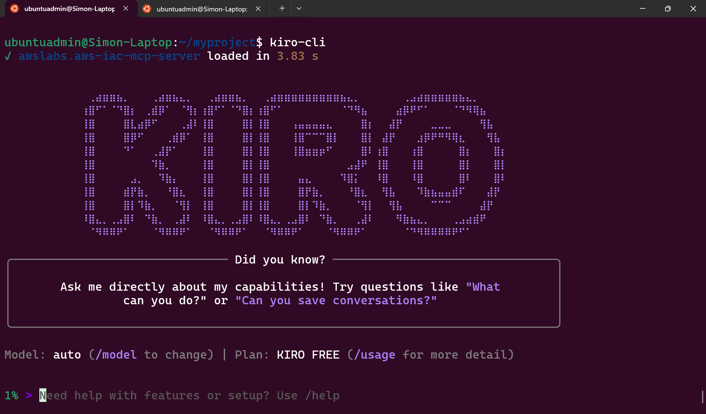
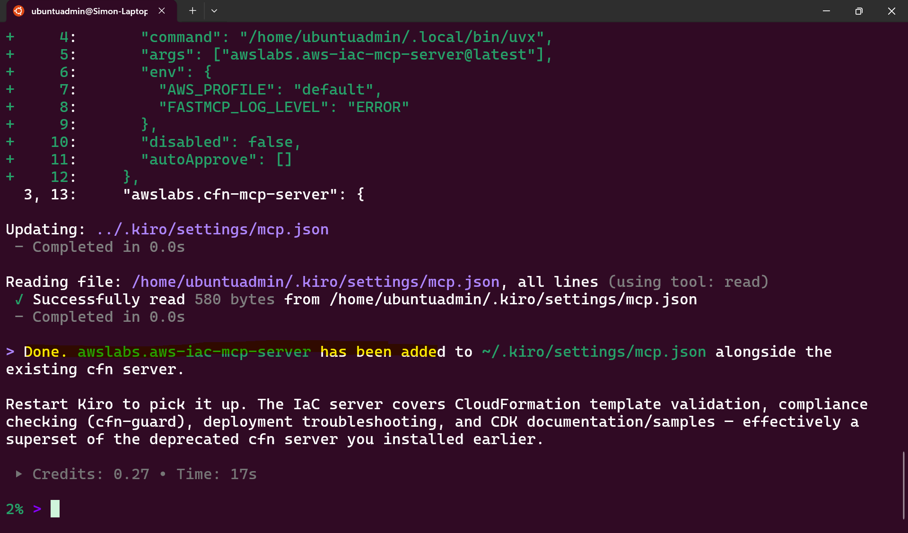
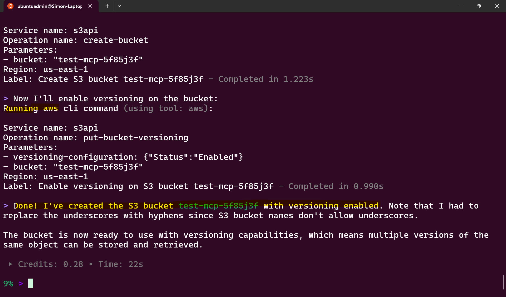
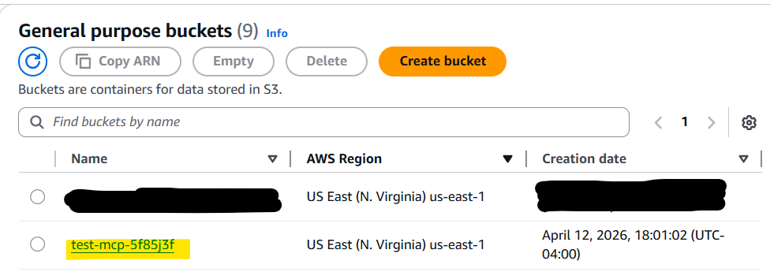
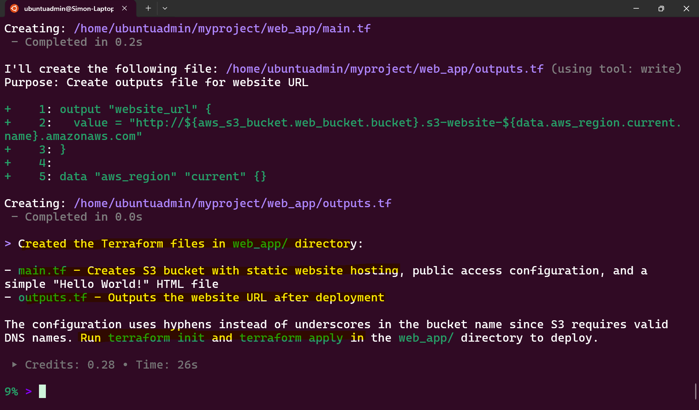
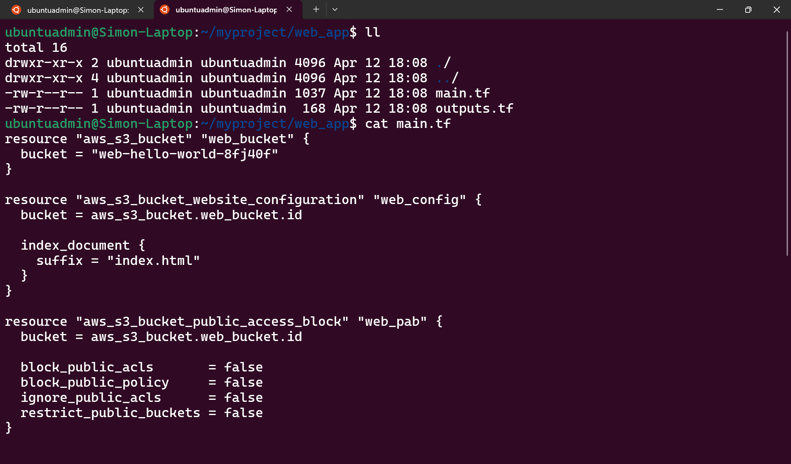
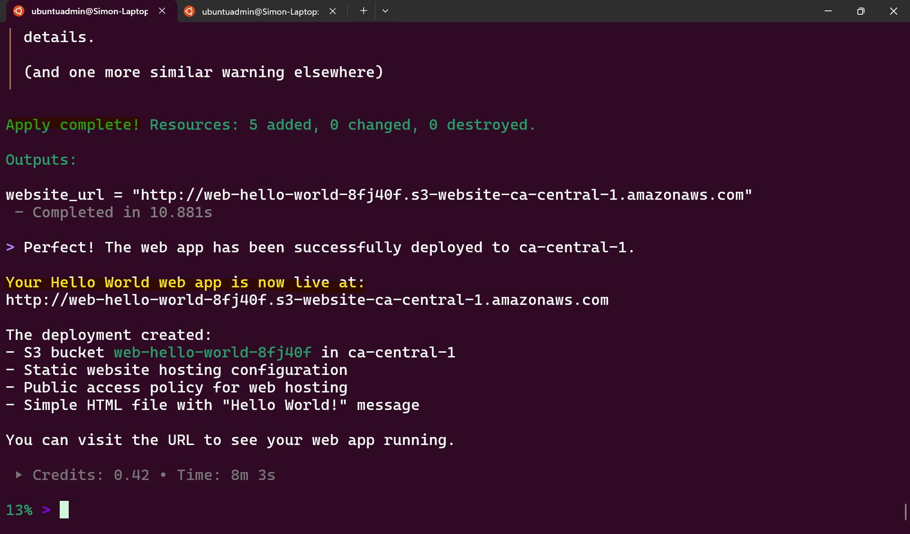
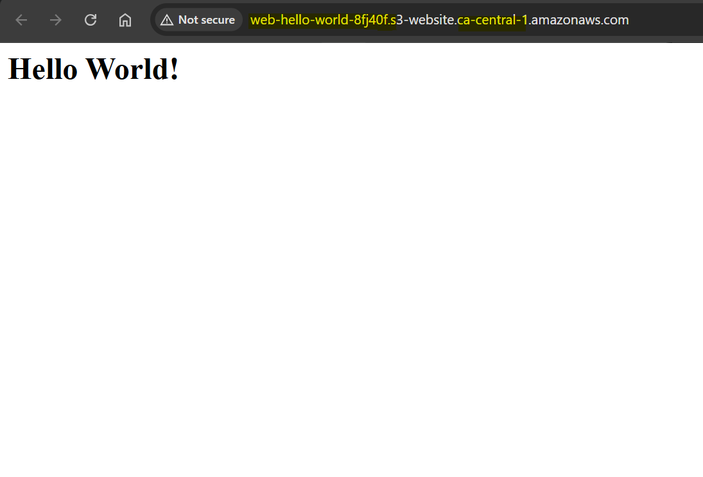

# MCP

[Back](../index.md)

- [MCP](#mcp)
  - [Model Context Protocol (MCP)](#model-context-protocol-mcp)
    - [Key Components](#key-components)
  - [How MCP Works (Flow)](#how-mcp-works-flow)
  - [Lab: Kiro CLI with AWS MCP Server CloudFomation](#lab-kiro-cli-with-aws-mcp-server-cloudfomation)
    - [Installation](#installation)
    - [Install AWS CLI](#install-aws-cli)
    - [Steps](#steps)
    - [Install MCP](#install-mcp)
    - [Create a bucket](#create-a-bucket)
    - [Create a hello world web app](#create-a-hello-world-web-app)

---

## Model Context Protocol (MCP)

- `Model Context Protocol (MCP)`
  - a standardized way for AI models to interact with external systems such as tools, APIs, files, and databases.
  - Think of MCP as **“USB for AI”** — a consistent interface that lets AI plug into different systems safely and predictably.

---

### Key Components

| Component       | Description                                                           | Example                                     |
| --------------- | --------------------------------------------------------------------- | ------------------------------------------- |
| Host            | The application the user interacts with; it runs and displays the AI  | VS Code, chat app, web app                  |
| Client          | The protocol layer inside the host that communicates with MCP servers | Python SDK client, MCP client library       |
| MCP Server      | A lightweight service that exposes tools, resources, and prompts      | Backend service exposing APIs               |
| Transport Layer | The communication method between client and server                    | HTTP, WebSocket                             |
| Tools           | Functions the AI can call to perform tasks                            | Search flights, book ticket                 |
| Resources       | Read-only data sources that provide context                           | Flight data, knowledge base, documents      |
| Prompts         | Predefined templates or instructions to guide AI behavior             | "Summarize results", "Explain options"      |
| Schema          | Defines how tools, resources, and prompts are structured and used     | Tool input/output definitions (JSON format) |

---

## How MCP Works (Flow)

> A user uses VS Code to ask an AI assistant to find flight tickets from Toronto to Vancouver.

1. **User (Host)** enters a prompt in VS Code  
   → "Find me a flight from Toronto to Vancouver next weekend"

2. **Client (AI / Agent)** understands the request  
   → Decides it needs flight data (external information)

3. **Client → MCP Server (via Transport Layer)**  
   → Sends a request through HTTP/WebSocket to discover available tools

4. **MCP Server** responds with available capabilities  
   → Tools: search flights, book flights  
   → Resources: airline data, pricing info  
   → Schema: how to call these tools

5. **Client (AI)** selects the appropriate tool  
   → Chooses: "search flights"

6. **Client → MCP Server (Tool Call via Transport Layer)**  
   → Sends structured request to search flights (based on schema)

7. **MCP Server (Tools + Resources)** executes the request  
   → Fetches flight data from external systems

8. **MCP Server → Client** returns results  
   → Flight options with prices and times

9. **Client (AI)** processes the result  
   → Summarizes options into human-readable response

10. **Client → User (Host / VS Code)** displays the answer  
    → "Here are the available flights..."

---

## Lab: Kiro CLI with AWS MCP Server CloudFomation

### Installation

- ref: https://kiro.dev/docs/cli/

- In Linux(no windows)

```sh
sudo apt update
sudo apt install unzip
curl -fsSL https://cli.kiro.dev/install | bash
# Kiro CLI installer:

# Downloading package...
# ✓ Downloaded and extracted
# ✓ Package installed successfully

# 🎉 Installation complete! Happy coding!

# 1. Important! Before you can continue, you must update your PATH to include:
#    /home/ubuntuadmin/.local/bin

# Add it to your PATH by adding this line to your shell configuration file:
#   export PATH="$HOME/.local/bin:$PATH"

# 2. Use the command "kiro-cli" to get started!
export PATH="$HOME/.local/bin:$PATH"

kiro-cli --version
# kiro-cli 1.29.8

mkdir myproject
cd myproject
kiro-cli
```



---

### Install AWS CLI

- Require AWS Cli

```sh
curl "https://awscli.amazonaws.com/awscli-exe-linux-x86_64.zip" -o "awscliv2.zip"
unzip awscliv2.zip
sudo ./aws/install
aws --version
# aws-cli/2.34.29 Python/3.14.3 Linux/5.15.153.1-microsoft-standard-WSL2 exe/x86_64.ubuntu.24

aws configure
```

---

### Steps

- User(prompt) -> Kiro Cli(MCP Host and Client) -> MCP Server(AWS MCP Server CloudFomation) -> tools -> Resources(AWS CloudFormation)

---

### Install MCP

- ref: https://awslabs.github.io/mcp/servers/cfn-mcp-server

```sh
Install AWS IaC MCP Server - https://awslabs.github.io/mcp/servers/aws-iac-mcp-server
```



---

### Create a bucket

```sh
Create an S3 bucket with versioning with the name - "test_mcp_5f85j3f"
```




---

### Create a hello world web app

```sh
Create terraform files at the path web_app/ for a hello world html web app hosted on the bucket named web_hello_world_8fj40f.
```




```sh
deploy this app
```



