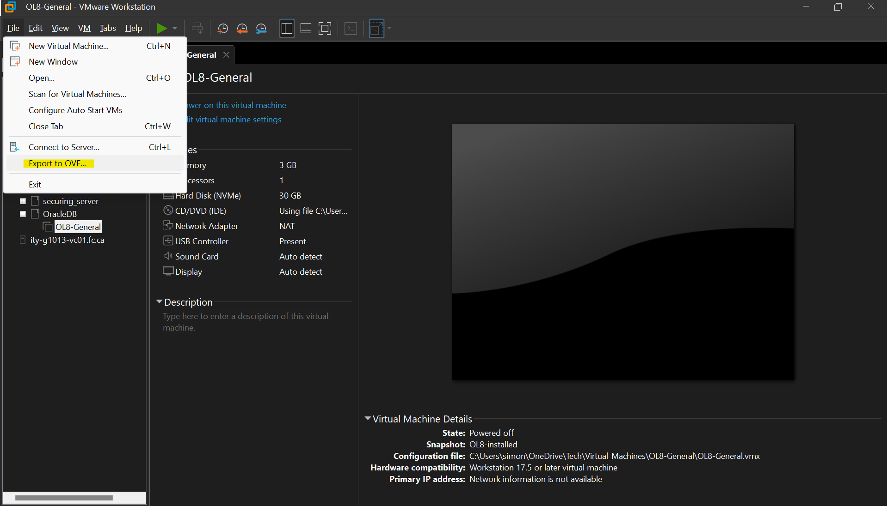
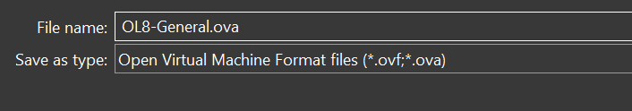
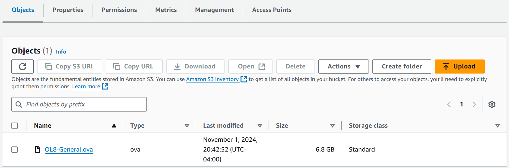

# AWS Project - Import VM Image Into AWS AMI

[Back](../../index.md)

---

## Prerequisites

### Install AWS CLI

- Download link:

  - https://docs.aws.amazon.com/cli/latest/userguide/getting-started-install.html

- Verify

```sh
aws --version
```

---

### Setting up the AWS CLI

```sh
aws configure
# AWS Access Key ID [None]: access_key_id
# AWS Secret Access Key [None]: secret_access_key
# Default region name [None]: us-east-1
# Default output format [None]: json
```

---

### Configure required service role

1. Create a file named `trust-policy.json` on computer.

```json
{
  "Version": "2012-10-17",
  "Statement": [
    {
      "Effect": "Allow",
      "Principal": { "Service": "vmie.amazonaws.com" },
      "Action": "sts:AssumeRole",
      "Condition": {
        "StringEquals": {
          "sts:Externalid": "vmimport"
        }
      }
    }
  ]
}
```

2. Create a role named `vmimport` and grant VM Import/Export access to it.

```sh
aws iam create-role --role-name vmimport --assume-role-policy-document "file://path\to\trust-policy.json"
```

3. Create a specific bucket for imported disk images.

4. Create a file named `role-policy.json` with policy.
   - Replace the `amzn-s3-demo-import-bucket` and `amzn-s3-demo-export-bucket` with bucket.

```json
{
  "Version": "2012-10-17",
  "Statement": [
    {
      "Effect": "Allow",
      "Action": ["s3:GetBucketLocation", "s3:GetObject", "s3:ListBucket"],
      "Resource": [
        "arn:aws:s3:::amzn-s3-demo-import-bucket",
        "arn:aws:s3:::amzn-s3-demo-import-bucket/*"
      ]
    },
    {
      "Effect": "Allow",
      "Action": [
        "s3:GetBucketLocation",
        "s3:GetObject",
        "s3:ListBucket",
        "s3:PutObject",
        "s3:GetBucketAcl"
      ],
      "Resource": [
        "arn:aws:s3:::amzn-s3-demo-export-bucket",
        "arn:aws:s3:::amzn-s3-demo-export-bucket/*"
      ]
    },
    {
      "Effect": "Allow",
      "Action": [
        "ec2:ModifySnapshotAttribute",
        "ec2:CopySnapshot",
        "ec2:RegisterImage",
        "ec2:Describe*"
      ],
      "Resource": "*"
    }
  ]
}
```

5. Use command to attach the policy to the role created above.

```sh
aws iam put-role-policy --role-name vmimport --policy-name vmimport --policy-document "file://path\to\role-policy.json"
```

---

## Upload VM Image

### Export VM Image in VMware Workstation

- Export image as `.ova` file.





---

### Upload `.ova` file to S3 bucket



---

### Import VM from S3 bucket

1. Create `containers.json` file that specifies the image using an S3 bucket.

```json
[
  {
    "Description": "image_description",
    "Format": "ova",
    "UserBucket": {
      "S3Bucket": "bucket_name",
      "S3Key": "ova_object_name"
    }
  }
]
```

2. Command to import an image with a single disk.

```sh
aws ec2 import-image --description "My server VM" --disk-containers "file://path\to\containers.json"
# copy the import-ami-id for the next step.
```

3. Command to monitor an import image task

```sh
aws ec2 describe-import-image-tasks --import-task-ids import-ami-id
# Status values include the following:
#   active — The import task is in progress.
#   deleting — The import task is being canceled.
#   deleted — The import task is canceled.
#   updating — Import status is updating.
#   validating — The imported image is being validated.
#   validated — The imported image was validated.
#   converting — The imported image is being converted into an AMI.
#   completed — The import task is completed and the AMI is ready to use.
```

---

## Create EC2 Instance using imported image

- For ssh access:
  - Instance must be in a public subnet.
  - Attach SSH Security Group.
  - Access key cannot apply.
  - Access with public IP: `ssh user_name@public_ip`.
    - SSH must enable within the image.

---

[TOP](#aws-project---import-vm-image-into-aws-ami)
