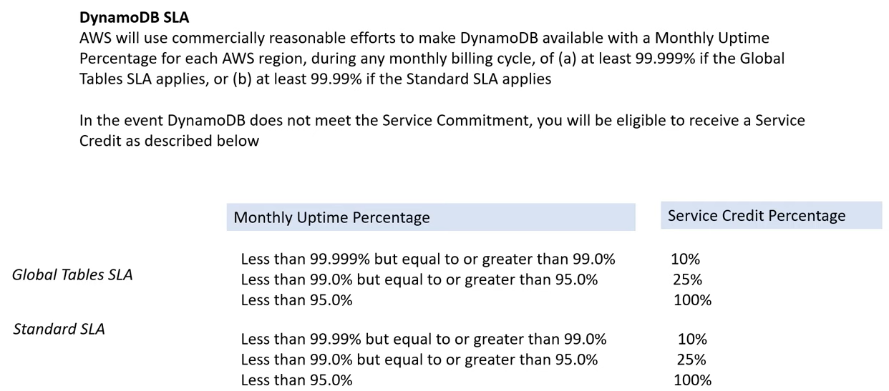
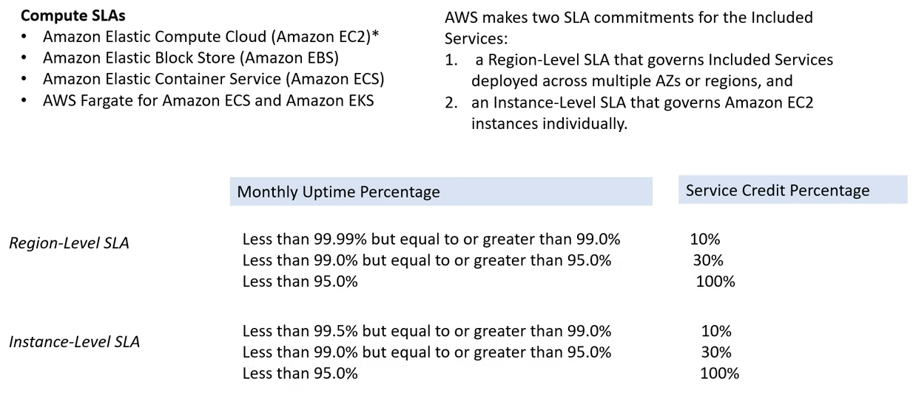

# AWS - Billing

[Back](../index.md)

- [AWS - Billing](#aws---billing)
  - [Billing and Costing Tools](#billing-and-costing-tools)
    - [`AWS Pricing Calculator` - Estimate the cost](#aws-pricing-calculator---estimate-the-cost)
    - [`AWS Billing Dashboard` - Tracking, Dashboard](#aws-billing-dashboard---tracking-dashboard)
    - [`Cost Allocation Tags` - Tracking, detailed](#cost-allocation-tags---tracking-detailed)
      - [Tagging and `Resource Groups`](#tagging-and-resource-groups)
    - [`Cost and Usage Reports` - Tracking, comprehensive](#cost-and-usage-reports---tracking-comprehensive)
    - [`Cost Explorer` - tracking, Visualize, Forecast, Savings Plan](#cost-explorer---tracking-visualize-forecast-savings-plan)
    - [`Billing Alarms` in CloudWatch - Monitor, simple Alarm](#billing-alarms-in-cloudwatch---monitor-simple-alarm)
    - [`AWS Budgets` - monitor, budget, alarms, forecasted](#aws-budgets---monitor-budget-alarms-forecasted)
    - [`AWS Cost Anomaly Detection` - monitor, Anomaly, alerts](#aws-cost-anomaly-detection---monitor-anomaly-alerts)
  - [Supportive Services](#supportive-services)
    - [`AWS Compute Optimizer` - recommend optimal,ml, s3](#aws-compute-optimizer---recommend-optimalml-s3)
    - [`AWS Service Quotas` - Alarms, Quotas](#aws-service-quotas---alarms-quotas)
    - [`AWS Credits` - Credit](#aws-credits---credit)
    - [`AWS Marketplace`](#aws-marketplace)
    - [Service Level Agreements (SLA)](#service-level-agreements-sla)
    - [`AWS Partner Network (APN)`](#aws-partner-network-apn)
  - [Best Practices](#best-practices)
  - [Summary](#summary)

---

## Billing and Costing Tools

- **Estimating** costs in the cloud:
  - `Pricing Calculator`
- **Tracking** costs in the cloud:
  - `Billing Dashboard`
  - `Cost Allocation Tags`
  - `Cost and Usage Reports`
  - `Cost Explorer`
- **Monitoring** against costs plans:
  - `Billing Alarms`
  - `Budgets`

---

### `AWS Pricing Calculator` - Estimate the cost

- Available at https://calculator.aws/
- **Estimate the cost** for your solution architecture

---

### `AWS Billing Dashboard` - Tracking, Dashboard

---

### `Cost Allocation Tags` - Tracking, detailed

- Use **cost allocation tags** to **track** your AWS costs on a detailed level
- **AWS generated tags**
  - **Automatically** applied to the resource you create
  - Starts with Prefix **aws**: (e.g. aws: createdBy)
- **User-defined tags**
  - Defined by the user
  - Starts with Prefix **user**:

#### Tagging and `Resource Groups`

- Tags are used for **organizing resources**:

  - EC2: instances, images, load balancers, security groups…
  - RDS, VPC resources, Route 53, IAM users, etc…
  - Resources created by CloudFormation are all tagged the same way

- Free naming, common tags are: Name, Environment, Team …
- **Tags** can be used to create `Resource Groups`
  - Create, maintain, and view a **collection of resources that share common tags**
  - Manage these tags using the **Tag Editor**

---

### `Cost and Usage Reports` - Tracking, comprehensive

- Dive deeper into your AWS costs and usage
- The AWS Cost & Usage Report contains the **most comprehensive** set of AWS **cost and usage** data available, including additional **metadata** about AWS services, pricing, and reservations (e.g., Amazon EC2 Reserved Instances (RIs)).
- The AWS Cost & Usage Report lists AWS usage for each service category used by an account and its IAM users in hourly or daily line items, as well as any tags that you have activated for cost allocation purposes.
- Can be integrated with **Athena, Redshift or QuickSight**

---

### `Cost Explorer` - tracking, Visualize, Forecast, Savings Plan

- **Visualize**, understand, and manage your AWS costs and usage **over time**
- Create custom reports that analyze **cost and usage** data.
- Analyze your data **at a high level**: total costs and usage across all accounts
- Or Monthly, hourly, **resource level** granularity
- Choose an optimal `Savings Plan` (to lower prices on your bill)
- Forecast usage up to **12 months** based on previous usage
- Use case:
  - Monthly Cost by AWS Service
  - Hourly & Resource Level
  - **Savings Plan - Alternative to Reserved Instances**
  - Forecast Usage

---

### `Billing Alarms` in CloudWatch - Monitor, simple Alarm

- Billing data metric is **stored** in CloudWatch `us-east1`
- Billing data are **for overall worldwide** AWS costs
- It’s for **actual cost**, **not for projected costs**
- Intended a **simple alarm** (not as powerful as AWS Budgets)

---

### `AWS Budgets` - monitor, budget, alarms, forecasted

- Create **budget** and send **alarms** when costs exceeds the budget
- **forecasted** to exceed your budgeting
- 4 types of **budgets**:
  - Usage, Cost, Reservation, Savings Plans
- For Reserved Instances (RI)
  - Track utilization
  - Supports EC2, ElastiCache, RDS, Redshift
- Up to **5 SNS notifications** per budget
- Can **filter** by: Service, Linked Account, Tag, Purchase Option, Instance Type, Region, Availability Zone, API Operation, etc…
- Same options as AWS Cost Explorer!
- **2 budgets are free**, then $0.02/day/budget

---

### `AWS Cost Anomaly Detection` - monitor, Anomaly, alerts

- Continuously monitor your cost and usage using **ML** to detect unusual spends
- It learns your unique, historic spend patterns to detect one-time cost spike
  and/or continuous cost increases (you don’t need to define thresholds)
- **Monitor** AWS services, member accounts, cost allocation tags, or cost categories
- Sends you the anomaly detection report with root-cause analysis
- Get notified with individual **alerts** or daily/weekly summary (using SNS)

---

## Supportive Services

### `AWS Compute Optimizer` - recommend optimal,ml, s3

- **Reduce costs** and **improve performance** by **recommending optimal AWS resources** for your workloads

- Helps you choose optimal configurations and right-size your workloads (over/under provisioned)

- Uses **Machine Learning** to analyze your resources’ configurations and their utilization `CloudWatch metrics`

- Supported resources

  - **EC2 instances**
  - **EC2 Auto Scaling Groups**
  - **EBS volumes**
  - **Lambda functions**

- Lower your costs by up to 25%
- Recommendations can be **exported to S3**

---

### `AWS Service Quotas` - Alarms, Quotas

- Notify you when you’re close to a service quota value threshold
- Create `CloudWatch Alarms` on the Service Quotas console
- Example: Lambda concurrent executions
- Request a quota **increase** from AWS Service Quotas or shutdown resources before limit is reached

---

### `AWS Credits` - Credit

- `AWS Promotional Credit`

  - are the equivalent to USD dollars on the AWS platform.

- AWS Credits can be earned several ways, such as joining the AWS Activate startup program.

- AWS Credits generally have an expiry date attached to them.

- AWS Credits can be used for most services but there are **exceptions** where AWS Credits cannot be used .
  - e.g.: purchasing a domain via Route53.

---

### `AWS Marketplace`

- `AWS Marketplace`

  - a curated digital catalogue with thousands of software listing from independent software vendors.

- The product can be free to use or can have an associated charge. The charge becomes part of AWS bill, and once user pays, AWS Marketplace **pays the provider**.

- The sales channel for ISVs and Consulting Partners allow to **sell solutions** to other AWS customers.

---

### Service Level Agreements (SLA)

- `Service Level Agreements (SLA)`

  - a **formal commitment** about the **expected level of service** between a customer and provider.
  - When a service level is not met and if Customer meets its obligations under the SLA, Customer will be eligible to **receive the compensation**.e.g **Financial or Service Credits**.

- `Service Level Indicator (SLI)`

  - a **metric/measurement** that indicates what measure of performance a customer is receiving at a given time.
  - A SLI metric could be uptime, performance, availability, throughput, latency, error rate, durability, and correctness.

- `Service Level Objective (SLO)`

  - The objective that the provider has agreed to meet.
  - SLOs are represented as a specific **target percentage** over a period of time.

- Example of SLA

  

  

  

---

### `AWS Partner Network (APN)`

- `AWS Partner Network (APN)`
  - a global partner program for AWS.
  - Joining the APN will open user's organization up to business opportunities and allows exclusive trainings and marketing events.

---

## Best Practices

- Account

  - `Organizations`

    - Operate **multiple accounts**
    - Use `SCP (service control policies)` to **restrict account power**

  - `IAM` guidelines:

    - MFA, least-privilege, password policy, password rotation

  - If your Account is **compromised**:

    - change the root **password**, delete and rotate all passwords / keys, contact the **AWS support**

- Compliance

  - `AWS Control Tower`

    - Easily setup multiple accounts with best-practices

  - `AWS Service Catalog`
    - Allow users to create **pre-defined stacks** defined by admins

- Monitoring

  - `CloudTrail`

    - to record API calls made within your account

  - `Tags & Cost Allocation Tags`

    - easy management & billing

  - `Config`

    - to **record** all resources configurations & compliance over time

  - `CloudFormation`

    - to **deploy stacks** across accounts and regions

  - Send Service Logs and Access Logs to S3 or `CloudWatch Logs`

---

## Summary

- Predict

  - `Pricing Calculator`:
    - cost of services on AWS

- Tracking 查看

  - `Billing Dashboard`:
    - high level overview + free tier **dashboard**
  - `Cost Allocation Tags`:
    - tag resources to create **detailed** reports
  - `Cost and Usage Reports`:
    - most **comprehensive** billing dataset
  - `Cost Explorer`:
    - **View** current usage (detailed) and **forecast** usage

- Monitoring 警报

  - `Billing Alarms`:
    - in **us-east-1** – **track** overall and per-service billing
  - `Budgets`: more advanced – track usage, costs, RI, and get **alerts**
  - `Cost Anomaly Detection`:
    - detect unusual spends using **Machine Learning**

- Optimal

  - `Compute Optimizer`:

    - **recommends** resources’ configurations to reduce cost

  - `Savings Plans`:

    - easy way to save based on **long-term usage** of AWS

  - `Service Quotas`:
    - notify you when you’re close to service quota threshold

---

[TOP](#aws---billing)
