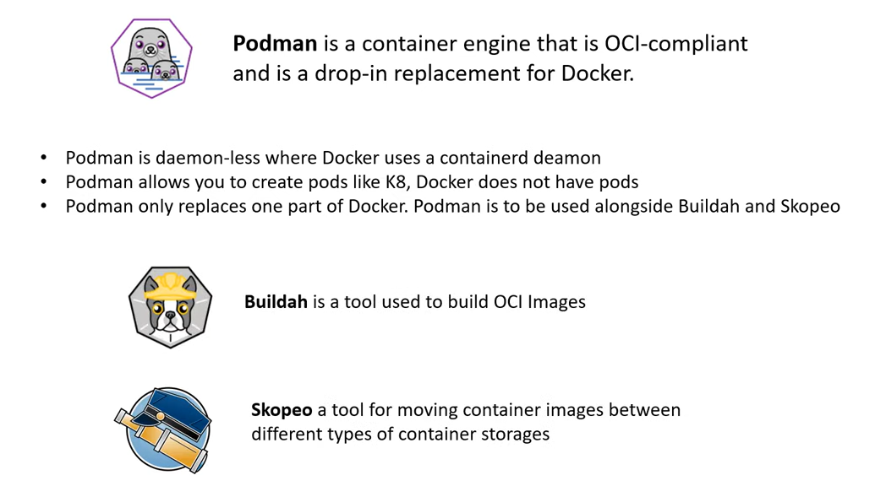
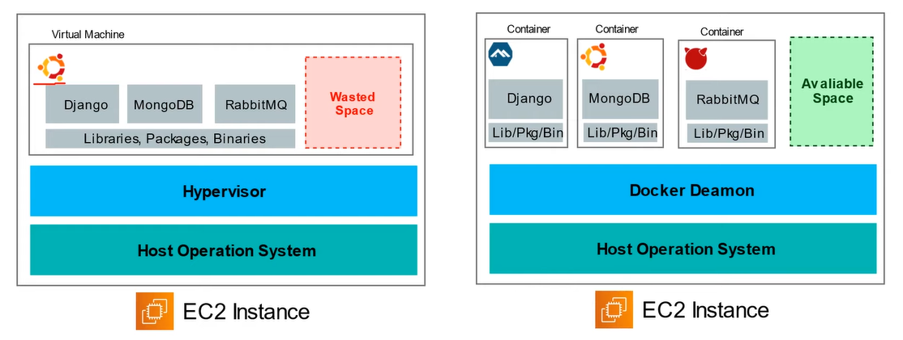

# AWS - Containers

[Back](../index.md)

- [AWS - Containers](#aws---containers)
  - [Docker](#docker)
    - [Podman](#podman)
    - [VMs vs Containers](#vms-vs-containers)
    - [Docker images](#docker-images)
  - [Container Services On AWS](#container-services-on-aws)
    - [`Elastic Container Service (ECS)` - Docker + Instances](#elastic-container-service-ecs---docker--instances)
    - [`Fargate` - Docker, Serverless](#fargate---docker-serverless)
    - [`Elastic Container Registry (ECR)` - Docker images](#elastic-container-registry-ecr---docker-images)
    - [`Batch` - dynamically instance](#batch---dynamically-instance)
      - [Batch vs Lambda](#batch-vs-lambda)
  - [Kuberenetes](#kuberenetes)
    - [`Elastic Kubernetes Service (EKS)` - Kubernetes](#elastic-kubernetes-service-eks---kubernetes)
  - [Serverless](#serverless)
    - [`Lambda` - Serverless](#lambda---serverless)
    - [`API Gateway` - serverless API, with Lambda](#api-gateway---serverless-api-with-lambda)
  - [Microservices](#microservices)
  - [Summary](#summary)

---

## Docker

- `Docker`
  - a set of Platform as Service (PaaS) products that use OS-level virtualization to deliver software in **packages called containers**.
  - a software development platform **to deploy apps**
- Apps are **packaged** in **containers** that can be run on any OS
- Apps **run the same**, regardless of where they’re run
  - Any machine
  - No compatibility issues
  - Predictable behavior
  - Less work
  - Easier to maintain and deploy
  - Works with any language, any OS, any technology
- Scale containers up and down very quickly (seconds)

---

### Podman

---

### VMs vs Containers

- `VMs`

  - VMs do **not make best use of space**.
  - Apps are **not isolated** which could cause config conflicts, security problems or resource hogging.

- `Containers`
  - containers allow to run multiple apps which are **virtually isolated** from each other.
  - Launch new containers and configures OS Dependencies per container.

---

### Docker images

- `Docker images` are stored in **Docker Repositories**
- Private: `Amazon ECR (Elastic Container Registry)`

---

## Container Services On AWS

### `Elastic Container Service (ECS)` - Docker + Instances

- `Elastic Container Service (ECS)`
  - Launch **Docker containers** on AWS
- Has integrations with the `Application Load Balancer`
- You **must provision & maintain the infrastructure (the EC2 instances)**
- AWS takes care of **starting / stopping containers**

---

### `Fargate` - Docker, Serverless

- `Fargate`

  - Launch Docker containers on AWS
  - **Serverless** offering

  - You do **not provision the infrastructure** (**no EC2 instances** to manage) – simpler!
  - AWS just **runs containers** for you based on the CPU / RAM you need

---

### `Elastic Container Registry (ECR)` - Docker images

- Elastic Container Registry

  - Private Docker Registry on AWS

- This is where you store your **Docker images** so they can be run by ECS or Fargate

---

### `Batch` - dynamically instance

- Fully managed **batch processing** at any scale
- Efficiently run 100,000s of computing batch jobs on AWS
- A **“batch” job** is a job with a **start** and an **end** (opposed to continuous)
- Batch will dynamically launch **EC2 instances** or **Spot Instances**
- AWS Batch provisions the right amount of compute / memory
- You **submit or schedule batch jobs** and AWS Batch does the rest!
- Batch jobs are **defined as Docker images** and run on **ECS**
- Helpful for cost optimizations and focusing less on the infrastructure
- AWS Batch **dynamically provisions** the optimal quantity and type of compute resources. 用户无需管理硬件

#### Batch vs Lambda

- Lambda:

  - **Time limit**
  - Limited **runtimes**
  - Limited temporary disk **space**
  - **Serverless**

- Batch:
  - **No time limit**
  - Any **runtime** as long as it’s packaged as a Docker image
  - Rely on EBS / instance store for disk **space**
  - Relies on **EC2** (can be managed by AWS)

---

## Kuberenetes

- `Kuberenetes`

  - an open-source container orchestration system for automating deployment, scaling, and management of containers.
  - commonly called `K8`

- The advantage of Kubernetes over Docker is the ability to **run containers distributed** across multiple VMs.

- A unique component of Kubernetes are **Pods**.

  - A pod is a group of one more containers with shared storage, network resources, and other shared settings.

- Kuberenetes is ideally for micro-service architectures where a company has tems to hundreds of services they need to manage.

---

### `Elastic Kubernetes Service (EKS)` - Kubernetes

- `Elastic Kubernetes Service (EKS)`
  - a managed Kubernetes service to run Kubernetes in the AWS cloud and on-premises data centers.

---

## Serverless

- Serverless is a new paradigm in which the developers **don’t have to manage servers** anymore…
- They just **deploy code**
- They just **deploy… functions** !
- Initially... **Serverless == FaaS (Function as a Service)**
- Serverless was pioneered by AWS Lambda but now also includes anything that’s managed: “databases, messaging, storage, etc.”
- Serverless does not mean there are no servers…
  it means you just **don’t manage / provision / see them**

- Serverless
  - Amazon S3
  - DynamoDB
  - Fargate
  - Lambda

---

### `Lambda` - Serverless

- Amazon EC2

  - Virtual **Servers** in the Cloud
  - Limited by RAM and CPU
  - **Continuously** running
  - Scaling means **intervention to add / remove servers**

- Amazon Lambda

  - Virtual **functions** – no servers to manage!
  - Limited **by time** - short executions
  - Run **on-demand**
  - Scaling is **automated**!

- **Benefits** of AWS Lambda

  - Easy Pricing:
    - Pay per request and compute time
    - Free tier of 1,000,000 AWS Lambda requests and 400,000 GBs of compute time
  - Integrated with the whole AWS suite of services
  - **Event-Driven**: functions **get invoked by AWS** **when needed**
  - Integrated with many programming **languages**
  - Easy **monitoring** through AWS CloudWatch
  - Easy to get more resources per functions (up to 10GB of RAM!)
  - Increasing RAM will also improve CPU and network!

- Lambda Container Image

  - The **container image** must implement the **Lambda Runtime API**
  - **ECS / Fargate** is preferred for running arbitrary Docker images

- Example: Serverless **CRON** Job

  - `CloudWatch Events` EventBridge -> `AWS Lambda Function` Perform a task

- **Pricing**

  - **Pay per calls**:

    - First 1,000,000 requests are free
    - $0.20 per 1 million requests thereafter ($0.0000002 per request)

  - **Pay per duration**: (in increment of 1 ms )

    - 400,000 GB-seconds of compute time per month for FREE
    - == 400,000 seconds if function is 1GB RAM
    - == 3,200,000 seconds if function is 128 MB RAM
    - After that $1.00 for 600,000 GB-seconds

- It is usually very **cheap** to run AWS Lambda so it’s very **popular**

---

### `API Gateway` - serverless API, with Lambda

- Example:
  - building a **serverless** **API**
- Fully managed service for developers to easily create, publish, maintain, monitor, and secure **APIs**
- Serverless and scalable
- Supports **RESTful** APIs and **WebSocket** APIs
- Support for security, user **authentication**, API **throttling**, API keys, monitoring...

---

## Microservices

- `Monolithic Architecture`

  - **One app** which is resonsible **for everyting** functionality is tightly coupled.

- `Microservices Architecture`
  - Multiple apps which are **each resonsible for one thing functionality** is isolate and stateless.

---

## Summary

- **Docker**: container technology to run applications

  - `ECS`: run Docker containers on EC2 **instances**
  - `Fargate`:
    - Run Docker containers **without provisioning the infrastructure**
    - **Serverless** offering (no EC2 instances)
  - `ECR`: Private Docker Images Repository
  - `Batch`: run **batch jobs** on AWS across **managed EC2 instances**

- `Lambda` is Serverless, Function as a Service, seamless scaling, reactive
  - Lambda Billing:
    - **By the time** run x by the RAM provisioned
    - **By the number of invocations**
  - Language Support: many programming languages **except (arbitrary) Docker**
  - Invocation time: up to **15 minutes**
  - Use cases:
    - Create Thumbnails for images uploaded onto S3
    - Run a Serverless cron job
  - `API Gateway`: expose Lambda functions as HTTP API

---

[TOP](#aws---containers)
