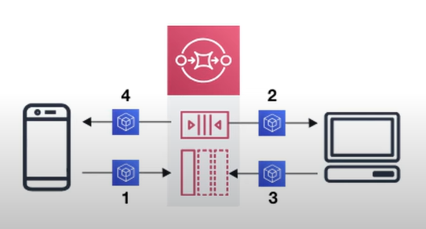
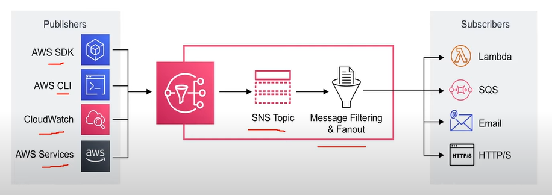
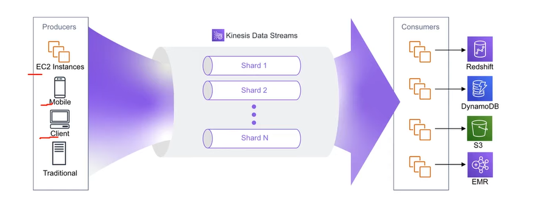
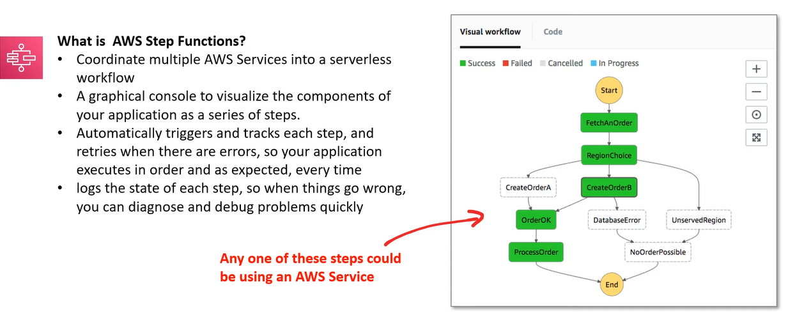
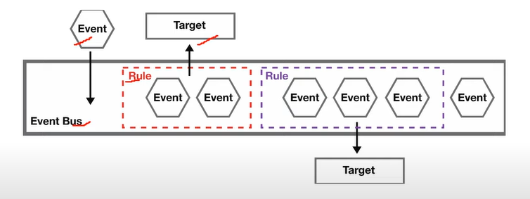
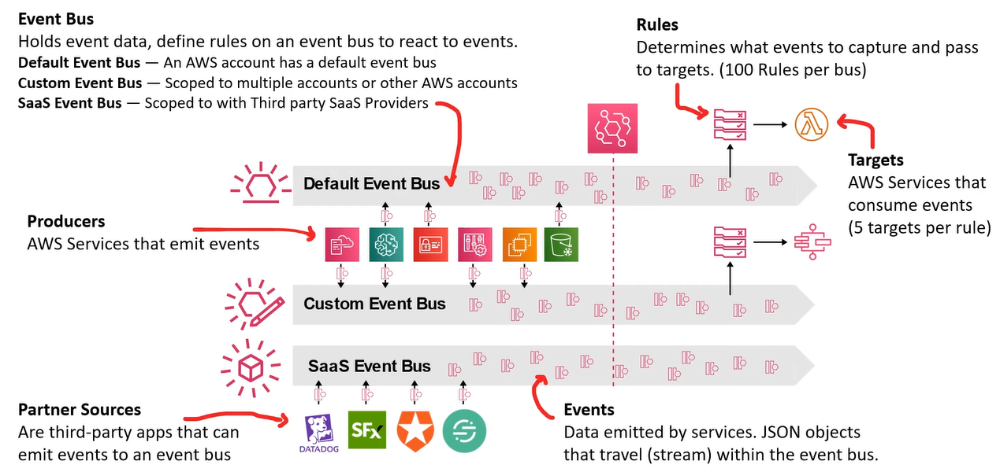
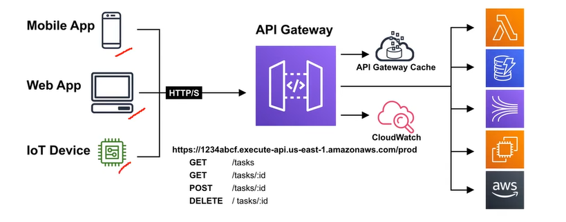
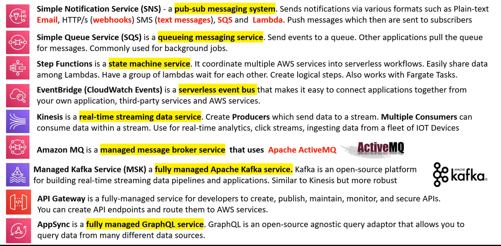

# AWS - Application Integration

[Back](../index.md)

- [AWS - Application Integration](#aws---application-integration)
  - [Application Integration](#application-integration)
  - [`Simple Queueing Service (SQS)` - Queuing, decouple, pull-based](#simple-queueing-service-sqs---queuing-decouple-pull-based)
  - [`SNS` - Pub/Sub, topic 分组, push-based](#sns---pubsub-topic-分组-push-based)
  - [`Kinesis` - real-time Streaming](#kinesis---real-time-streaming)
  - [`MQ`- RabbitMQ and ActiveMQ](#mq--rabbitmq-and-activemq)
  - [`Step Functions` - State Machine](#step-functions---state-machine)
  - [`EventBridge` - Event Bus, scheduled](#eventbridge---event-bus-scheduled)
  - [`API Gateway`](#api-gateway)
  - [Application Integration Services](#application-integration-services)
  - [Summary](#summary)

---

## Application Integration

- `Application Integration`

  - the process of letting two independent applications to communicate and **work with each other**, commonly facilitated by an intermediate system.

- When we start deploying multiple applications, they will inevitably need to **communicate** with one another

- There are two patterns of application communication

  - **Synchronous communications** (application to application)

    - Synchronous between applications can be problematic if there are sudden spikes of traffic

  - **Asynchronous / Event based** (application to queue to application)
    - it’s better to **decouple** your applications:
      - using **SQS**: queue model
      - using **SNS**: pub/sub model
      - using **Kinesis**: real-time data streaming model

- The common system or design pattern utilized for Application Integration are:
  - Queueing
  - Streaming
  - Pub/Sub
  - API Gateways
  - State Machine
  - Event Bus

---

## `Simple Queueing Service (SQS)` - Queuing, decouple, pull-based

- `Messaging System`

  - Used to **provide asynchronous communication and decouple processes** via message/events from a sender and receiver (producer and consumer)

- `Queueing System`

  - a message system that generally will delete messages once they are consumed.
  - Simple communication.
  - Not Real-time.
  - Have to pull. Not reactive.

- `Simple Queueing Service (SQS)`

  - Fully managed queueing service that enables user to decouple and scale microservices, distributed system, and serverless applications.
  - Use Case:
    - User need to queue up transaction emails to be sent. e.e. Signup, Reset Password

- **Oldest** AWS offering (over 10 years old)
- Fully managed service (~serverless), use to **decouple** applications
- Scales from 1 message per second to 10,000s per second
- Default retention of messages: **4 days**, maximum of **14 days**
- **No limit to how many messages** can be in the queue
- Messages are **deleted after they’re read** by consumers
- Low **latency** (<10 ms on publish and receive)
- Consumers **share the work to read messages & scale horizontally**
- uses a **pull-based** system.

---

## `SNS` - Pub/Sub, topic 分组, push-based

- `Pub/Sub`

  - **Publish-Subscribe pattern** commonly implement in messaging systems.
  - In a pub/sub system the sender of message (**publishers**) **do not send their messages directly** to receivers.
  - **Publishers** send messages to an event bus that categorizes the messages into groups.
  - **Subscribers** subscribe to these groups.
  - Whenever new messages appear within subscribers subscription the messages are immediately delivered to subscribers.

- Publishers have no knowledge of who their subscribers are.
- Subscribers do not pull for messages.
- Messages are immediately pushed to subscribers.
- Messages and events are interchangable terms in pub/sub.

- Use Case:

  - a real-time chat system.
  - a web-hook system.

- `Simple Notification Service (SNS)`

  - a highly available, durable, secure, fully managed **pub/sub messaging service** that enables user **to decouple** miscroservices, distributed system, and serverless applications.
    - **push-based** system

  

- The “event publishers” **only sends message to one SNS topic**
- As many “event subscribers” as we want to listen to the SNS topic notifications
- **Each subscriber to the topic** will get all the messages
- Up to 12,500,000 subscriptions per topic, **100,000 topics limit**

---

## `Kinesis` - real-time Streaming

- `Streaming`

  - Multiple consumers **can react to event** (messages)
  - Events **live in the stream for long periods** of time, so complex operations can be applied.
  - **Real-time**.

- `Amazon Kinesis`

  - the AWS fully managed solution for collecting, processing, and analyzing **streaming data** in the cloud.

  

- Managed service to collect, process, and analyze **real-time streaming data** at any scale
- Too detailed for the Cloud Practitioner exam but good to know:
  - `Kinesis Data Streams`: low latency streaming to **ingest data** at scale from hundreds of thousands of sources
  - `Kinesis Video Streams`: monitor real-time **video streams** for analytics or ML
  - `Kinesis Data Analytics`: perform **real-time analytics** on streams using SQL
  - `Kinesis Data Firehose`: **load streams into** S3, Redshift, ElasticSearch, etc…

---

## `MQ`- RabbitMQ and ActiveMQ

- SQS, SNS are “cloud-native” services: proprietary protocols from AWS
- Traditional applications running from on-premises may use **open protocols** such as: MQTT, AMQP, STOMP, Openwire, WSS
- **When migrating to the cloud**, instead of re-engineering the application to use SQS and SNS, we can use Amazon MQ
- Amazon MQ is a managed message broker service for **RabbitMQ** and **ActiveMQ**.

- Amazon MQ **doesn’t “scale”** as much as SQS / SNS
- Amazon MQ **runs on servers, can run in Multi-AZ** with failover
- Amazon MQ has **both queue feature (~SQS) and topic features (~SNS)**

---

## `Step Functions` - State Machine

- `State Machine`

  - an abstract model which decides how **one state moves to another** based on a series of conditions.
  - Think of a state machine like a flow chart.

- `AWS Step Functions`

  

---

## `EventBridge` - Event Bus, scheduled

- `Event Bus`

  - receives events from a source and routes events to a target based on rules.

  

- `Amazon EventBridge` (formerly CloudWatch Events)

  - Schedule: **Cron jobs** (scheduled scripts)
  - Event **Pattern**: **Event rules to react to a service** doing something
  - Trigger Lambda functions, send SQS/SNS messages…

  - a **serverless** event but service that is used for application integration by streaming real-time data to applications.
  - formerly called `Amazon CloudWatch` Events.

- `Schema Registry`: model event schema
- You can **archive events** (all/filter) sent to an event bus (indefinitely or set period)

  - Ability to **replay archived events**

- **Event Bus**

  - Default Event Bus: AWS Services
  - Partner Event Bus: AWS SaaS Partners
  - Custom Event Bus: Custom Apps

- Example:

  - IAM Root User Sign in Event -> SNS Topic with Email Notifica

  

---

## `API Gateway`

- `API Gateway`

  - a program that sits between a single-entry point and multiple backends.
  - allows to throttle, logging, routing logic or formatting of the request and resonse.

- `Amazon API Gateway`

  - a solution for creating secure APIs in cloud environment at any scale.
  - Create APIs that act as a front door for applications to access data, business logic, or functionality from back-end services.

  

---

## Application Integration Services

---

## Summary

- `SQS`:
  - **Queue** service in AWS
  - **Multiple Producers**, messages are kept up to **14 days**
  - Multiple Consumers **share the read** and **delete** messages when done
  - Used to **decouple** applications in AWS
- `SNS`:
  - **Notification service** in AWS
  - **Subscribers**: Email, Lambda, SQS, HTTP, Mobile…
  - Multiple Subscribers, **send all messages to all** of them
  - **No** message **retention**
- `Kinesis`:
  - **real-time data streaming**, persistence and **analysis**
- `Amazon MQ`:
  - managed **message broker** for ActiveMQ and RabbitMQ in the cloud (MQTT, AMQP.. **protocols**)

---

[TOP](#aws---application-integration)
