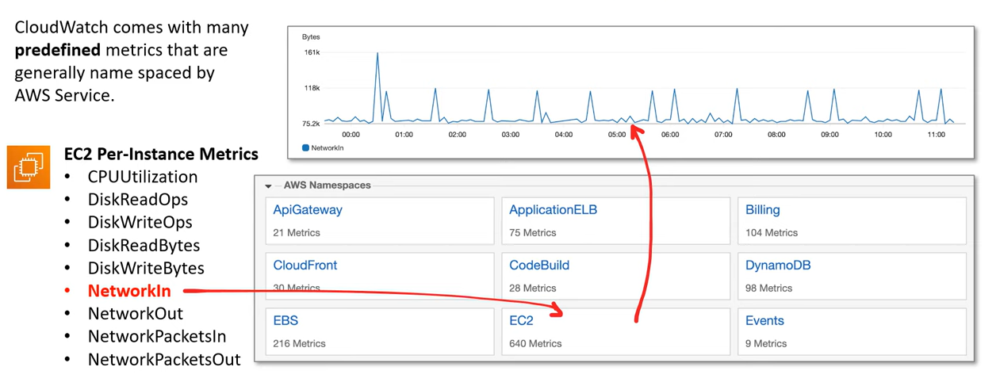

# AWS - Cloud Monitoring

[Back](../index.md)

- [AWS - Cloud Monitoring](#aws---cloud-monitoring)
  - [`CloudTrail` - audit, API](#cloudtrail---audit-api)
  - [`Health Dashboard - Service History` -status of AWS services,rss](#health-dashboard---service-history--status-of-aws-servicesrss)
  - [`Health Dashboard –Your Account` - impact](#health-dashboard-your-account---impact)
  - [`CloudWatch Metrics`](#cloudwatch-metrics)
  - [`CloudWatch Alarms`](#cloudwatch-alarms)
  - [`CloudWatch Logs`](#cloudwatch-logs)
    - [`CloudWatch Logs for EC2` - Hibrid](#cloudwatch-logs-for-ec2---hibrid)
    - [`CloudWatch Logs Insights` - analyze](#cloudwatch-logs-insights---analyze)
  - [`CodeGuru` - ML, code reviews, recommendations](#codeguru---ml-code-reviews-recommendations)
    - [`Amazon CodeGuru Reviewer` - ML, code debug](#amazon-codeguru-reviewer---ml-code-debug)
    - [`Amazon CodeGuru Profiler` - runtime behavior, hybrid](#amazon-codeguru-profiler---runtime-behavior-hybrid)
  - [`X-Ray` - log analysis, Debugging for distributed](#x-ray---log-analysis-debugging-for-distributed)
  - [Summary](#summary)

---

## `CloudTrail` - audit, API

- `AWS CloudTrail`

  - a service that enables **governance, compliance, operational auditing, and risk auditing** of AWS account.
  - CloudTrail is **enabled by default!**
  - used to monitor **API calls** and **Actions made** on an AWS account.
    - Where: Source IP Address
    - When: EventTime
    - Who: User, UserAgent
    - What: Region, Resource, Action

  

- Can put logs from CloudTrail **into CloudWatch Logs or S3**

- If a resource is deleted in AWS, **investigate CloudTrail first!**

- CloudTrail is already logging by default and will collect logs for last **90 days** via Event History.

- If user needs more than 90 days, user need to create a Trail.
- A trail can be applied to **All Regions (default)** or a **single Region**.

  - Trails are output to S3 and have to use `Amazon Athena`(Analyze).

  

---

## `Health Dashboard - Service History` -status of AWS services,rss

- Shows **all regions, all services** health
- Shows historical information **for each day**
- Has an **RSS feed** you can subscribe to
- Previously called AWS Service Health Dashboard

---

## `Health Dashboard –Your Account` - impact 

- Previously called AWS Personal Health Dashboard (PHD)
- AWS Account Health Dashboard **provides alerts and remediation guidance** when AWS is experiencing **events that may impact you**.
- While the `Service Health Dashboard` **displays the general status** of AWS services, `Account Health Dashboard` gives you a **personalized view** into the performance and availability of the AWS services underlying your AWS resources.
- The dashboard displays relevant and timely information to help you manage events in progress and provides proactive notification to help you plan for scheduled activities.
- Can **aggregate data from an entire AWS Organization**

- **Global service**
- Shows how AWS outages directly **impact** you & your AWS resources
- **Alert**, remediation, proactive, **scheduled** activities

---

## `CloudWatch Metrics`

- `Metric`

  - a **variable to monitor** (CPUUtilization, NetworkIn…)
  - Metrics have **timestamps**

- `CloudWatch Metric`

  - CloudWatch provides metrics for every services in AWS
  - represents a **time-ordered set of data points**.
  - Its a variable that is monitored over time.

- Can create **CloudWatch dashboards** of metrics

- **Important Metrics**

  - EC2 instances:
    - **CPU** Utilization, **Status** Checks, **Network** (**not RAM)**
    - **Default** metrics every **5 minutes**
    - Option for **Detailed Monitoring ($$$)**: metrics every 1 minute
  - **EBS** volumes: Disk Read/Writes
  - **S3** buckets: BucketSizeBytes, NumberOfObjects, AllRequests
  - **Billing**:Total Estimated Charge (**only in us-east-1**)
  - **Service** Limits: how much you’ve been using a service API
  - **Custom** metrics: push your own metrics

  

---

## `CloudWatch Alarms`

- `CloudWatch Alarm`

  - monitor a **CloudWatch Metric** based on a **defined threshold**.

- Alarms are used to **trigger notifications for any metric**
- **Alarms actions**…
  - **Auto Scaling**: increase or decrease EC2 instances “desired” count
  - **EC2 Actions**: stop, terminate, reboot or recover an EC2 instance
  - **SNS notifications**: send a notification into an SNS topic
- Various options (sampling, %, max, min, etc…)
- Can **choose the period** on which to evaluate an alarm
- Example: create a **billing alarm** on the CloudWatch Billing metric
- Alarm States: OK. INSUFFICIENT_DATA, ALARM

  

  

---

## `CloudWatch Logs`

- CloudWatch Logs can **collect log** from:
  - Elastic Beanstalk: collection of logs **from application**
  - ECS: collection from containers
  - AWS Lambda: collection from function logs
  - **CloudTrail** based on filter
  - CloudWatch **log agents**: on EC2 machines or on-premises servers
  - Route53: Log DNS queries
- Enables **real-time monitoring** of logs
- Adjustable CloudWatch Logs **retention**

- `Log Streams`

  - A log stream represents a sequence of events from an application or instance being monitored.

  

- `Log Events`

  - represents a single event in a log file. Log events can be seen within a `Log Stream`.

  

---

### `CloudWatch Logs for EC2` - Hibrid

- By **default, no logs** from your EC2 instance will go to CloudWatch
- You need to **run a CloudWatch agent on EC2** to push the log files you want
- Make sure **IAM permissions** are correct
- The CloudWatch log agent can be **setup on-premises** too

---

### `CloudWatch Logs Insights` - analyze

- `CloudWatch Logs Insights`

  - enable to interactively **search and analyze CloudWatch log** data.

- Advantages
  - more robust **filtering** then using the simple filter events in a Log Stream.
  - Less burdensome then having to **export** logs to S3 and **analyze** them via Athena.

---

## `CodeGuru` - ML, code reviews, recommendations

- An **ML-powered** service for automated **code reviews** and application performance recommendations
- Provides two functionalities
- CodeGuru Reviewer: automated code reviews for static code analysis (development)
- CodeGuru Profiler: visibility/recommendations about application performance during runtime (production)

### `Amazon CodeGuru Reviewer` - ML, code debug

- Identify critical issues, security vulnerabilities, and hard-to-find **bugs**
- Example: common coding best practices, resource leaks, security detection, input validation
- Uses Machine Learning and automated reasoning
- Hard-learned lessons across millions of code reviews on 1000s of open-source and Amazon repositories
- Supports Java and Python
- Integrates with **GitHub, Bitbucket, and AWS CodeCommit**

### `Amazon CodeGuru Profiler` - runtime behavior, hybrid

- Helps understand the **runtime behavior** of your application
- Example: identify if your application is consuming excessive CPU capacity on a logging routine
- Features:
  - Identify and remove **code inefficiencies**
  - Improve application **performance** (e.g., reduce CPU utilization)
  - Decrease compute **costs**
  - Provides **heap** summary (identify which objects using up memory)
  - **Anomaly** Detection
- Support applications running on AWS or on-premise
- Minimal overhead on application

---

## `X-Ray` - log analysis, Debugging for distributed

- Debugging in Production, the good old way:
  - Test locally
  - Add log statements everywhere
  - Re-deploy in production
- Log **formats differ** across applications and log analysis is hard.
- Debugging: one big monolith “easy”, distributed services “hard”
- No common views of your entire architecture
- **Visual analysis** of our applications

- **advantages**
  - Troubleshooting **performance** (bottlenecks)
  - Understand **dependencies** in a microservice architecture
  - Pinpoint service **issues**
  - **Review request** behavior
  - Find **errors** and **exceptions**
  - Are we meeting time SLA?
  - Where I am throttled?
  - Identify users that are **impacted**

---

## Summary

- `CloudTrail`: **audit API calls** made within your AWS account

  - `CloudTrail Insights`: automated **analysis** of your CloudTrail Events

- `AWS Health Dashboard`: status of **all AWS services** across all regions
- `AWS Account Health Dashboard`: AWS **events that impact** your infrastructure

- `CloudWatch`:

  - **Metrics**: monitor the **performance** of AWS services and billing metrics
  - **Alarms**: **automate notification**, perform EC2 action, notify to SNS based on metric
  - **Logs**: **collect log** files from EC2 instances, servers, Lambda functions…
  - **Events** (or EventBridge): **react to events** in AWS, or trigger a rule on a schedule

- `Amazon CodeGuru`: automated **code reviews** and application **performance recommendations**

- `X-Ray`: trace requests made through your **distributed** applications

---

[TOP](#aws---cloud-monitoring)
