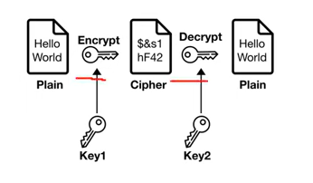
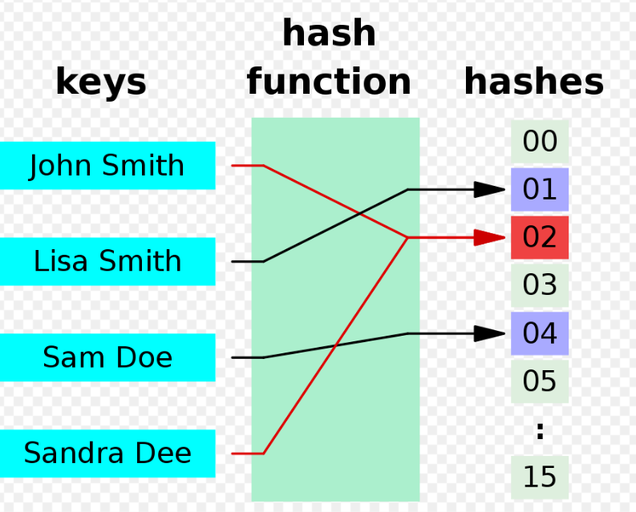
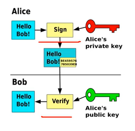
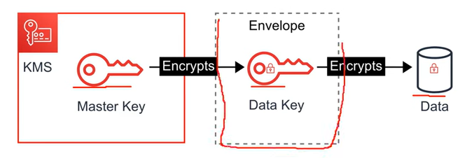
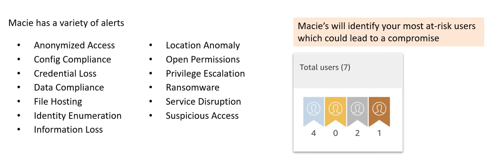
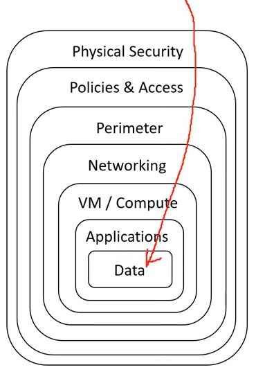

# AWS - Security

[Back](../index.md)

- [AWS - Security](#aws---security)
  - [AWS Shared Responsibility Model](#aws-shared-responsibility-model)
    - [Example, for RDS](#example-for-rds)
    - [Example, for S3](#example-for-s3)
  - [Distributed Denial of Service (DDos)](#distributed-denial-of-service-ddos)
    - [AWS Services](#aws-services)
    - [`AWS Shield` - DDoS, network+transport layer](#aws-shield---ddos-networktransport-layer)
    - [`AWS Web Application Firewall (WAF)` - DDoS, App layer](#aws-web-application-firewall-waf---ddos-app-layer)
  - [Penetration Testing on AWS Cloud](#penetration-testing-on-aws-cloud)
  - [Encryption - Confidentiality](#encryption---confidentiality)
    - [Terminology](#terminology)
    - [Symmetric Encryption vs Asymmetric Encryption](#symmetric-encryption-vs-asymmetric-encryption)
    - [Hashing and Salting](#hashing-and-salting)
    - [Encryption In-Transit and At-Rest](#encryption-in-transit-and-at-rest)
    - [Digital Signatures and Signing](#digital-signatures-and-signing)
  - [Access Keys - Encryption](#access-keys---encryption)
    - [Hardware Security Module](#hardware-security-module)
    - [Types of Customer Master Keys: CMK](#types-of-customer-master-keys-cmk)
    - [`AWS Key Management Service (KMS)` - Encryption keys, software, AWS mange](#aws-key-management-service-kms---encryption-keys-software-aws-mange)
    - [`AWS CloudHSM` - Encryption keys, hardware, user managed](#aws-cloudhsm---encryption-keys-hardware-user-managed)
    - [`AWS Certificate Manager (ACM)` - Free, HTTPS, SSL/TLS Certificates](#aws-certificate-manager-acm---free-https-ssltls-certificates)
    - [`AWS Secrets Manager` - store secrets, rotation of secrets, RDS](#aws-secrets-manager---store-secrets-rotation-of-secrets-rds)
  - [Intrusion Detection System / Intrusion Protection System (IDS/IPS)](#intrusion-detection-system--intrusion-protection-system-idsips)
    - [`Amazon Guard Duty` - Malicious Activity, Intelligent, ml, SNS, CryptoCurrency](#amazon-guard-duty---malicious-activity-intelligent-ml-sns-cryptocurrency)
  - [Hardening](#hardening)
    - [`AWS Inspect` - Assessments, EC2(SSM), Container Img, Lambda](#aws-inspect---assessments-ec2ssm-container-img-lambda)
  - [Others](#others)
    - [`AWS Macie` - S3, data security\&privacy, PII, ml](#aws-macie---s3-data-securityprivacy-pii-ml)
    - [`AWS Security Hub` - Central dashboards, account(s), +compliance](#aws-security-hub---central-dashboards-accounts-compliance)
    - [`Amazon Detective` - investigates root cause, ml, unified visualizations](#amazon-detective---investigates-root-cause-ml-unified-visualizations)
    - [`AWS Abuse` - abusive use](#aws-abuse---abusive-use)
  - [Security Principle: Confidentiality, Integrity, and Availability (CIA) triad](#security-principle-confidentiality-integrity-and-availability-cia-triad)
  - [Summary: Security](#summary-security)

---

## AWS Shared Responsibility Model

- **AWS responsibility** - Security **of** the Cloud

  - Protecting **infrastructure** (hardware, software, facilities, and networking) that runs all the AWS services
  - **Managed services** like S3, DynamoDB, RDS, etc.

- **Customer responsibility** - Security **in** the Cloud

  - For EC2 instance, customer is responsible for management of the guest **OS** (including security patches and updates), **firewall** & **network** configuration, **IAM**
  - **Encrypting** application data

- **Shared controls:**
  - **Patch** Management, **Configuration** Management, **Awareness** & **Training**

---

### Example, for RDS

- **AWS responsibility:**

  - Manage the underlying EC2 instance, disable SSH access
  - Automated **DB patching**
  - Automated **OS patching**
  - **Audit** the underlying instance and disks & guarantee it functions

- **Your responsibility**:

  - Check the ports / IP / security group **inbound rules** in DB’s SG
  - In-database **user creation and permissions**
  - Creating a database with or without **public access**
  - Ensure parameter groups or DB is configured to only allow **SSL** connections
  - Database **encryption** setting

---

### Example, for S3

- **AWS responsibility:**

  - Guarantee you get **unlimited storage**
  - Guarantee you get **encryption**
  - Ensure **separation of the data** between different customers
  - Ensure **AWS employees can’t access** your data

- **Your responsibility:**
  - Bucket **configuration**
  - Bucket **policy** / public setting
  - **IAM** user and roles
  - **Enabling** encryption

---

## Distributed Denial of Service (DDos)

- `Distributed Denial of Service (DDos)`
  - A malicious attempt to disrupt normal traffic by flooding a website with large amounts of fake traffic.

### AWS Services

- `AWS Shield Standard`
  - protects **against DDOS attack** for your website and applications,
  - for all customers at **no additional costs**
- `AWS Shield Advanced`
  - 24/7 **premium** DDoS protection
- `AWS WAF`
  - Filter specific requests **based on rules**
- `CloudFront` and `Route 53`:
  - Combined with `AWS Shield`, provides attack mitigation at the edge
  - Availability protection using global edge network
- `AWS Auto Scaling`
  - Be ready to scale

---

### `AWS Shield` - DDoS, network+transport layer

- `AWS Shield`

  - a managed **DDoS (Distributed Denial of Service) protection service** that safeguards application running on AWS.

- `AWS Shield Standard`:

  - **Free** service that is activated for **every** AWS customer
  - Provides protection from attacks such as SYN/UDP Floods, Reflection attacks and other **layer 3(network layer)/layer 4(Transport-layer)** attacks

- `AWS Shield Advanced`:

  - Optional DDoS mitigation service ($3,000 per month per organization)
  - Protect against more sophisticated attack on Amazon EC2, Elastic Load Balancing (ELB), Amazon CloudFront, AWS Global Accelerator, and Route 53
  - 24/7 access to AWS DDoS response team (DRP)
  - Protect against higher fees during usage spikes due to DDoS

- Both plans integrate with `AWS Web Application Firewall (WAF)` to give **Layer 7 (Application)** protection.

---

### `AWS Web Application Firewall (WAF)` - DDoS, App layer

- `AWS Web Application Firewall (WAF)`

  - Protects your web applications from **common web exploits** (Layer 7 (application layer))

- Write users their own rules to **ALLOW or DENY traffic** based on the contents of an HTTP requests.

- Can use a ruleset from a trusted AWS Security Partner in the AWS WAF rules **Marketplace**.

- Layer 7 is `HTTP` (vs Layer 4 is TCP)
- Deploy on `Application Load Balancer`, `API Gateway`, `CloudFront`

- Define **Web ACL (Web Access Control List)**:

  - Rules can include **IP addresses, HTTP headers, HTTP body, or URI strings**
  - Protects from **common attack** - SQL injection and Cross-Site Scripting (XSS)
  - Size constraints, geo-match (**block countries**)
  - Rate-based rules (to count **occurrences of events**) – for DDoS protection

---

## Penetration Testing on AWS Cloud

- `Pen Testing`

  - An authorized simulated cyberattack on a computer system, performed to evaluate the security of the system.

- Pen Testing is allowed to be performed on AWS.

- AWS customers are welcome to carry out security assessments or penetration tests against their AWS infrastructure **without prior approval for 8 services**:

  - Amazon EC2 instances, NAT Gateways, and Elastic Load Balancers
  - Amazon RDS
  - Amazon CloudFront
  - Amazon Aurora
  - Amazon API Gateways
  - AWS Lambda and Lambda Edge functions
  - Amazon Lightsail resources
  - Amazon Elastic Beanstalk environments
  - List can increase over time (you won’t be tested on that at the exam)

- Prohibited Activities
  - **DNS zone walking** via Amazon Route 53 Hosted Zones
  - Denial of Service (**DoS**), Distributed Denial of Service (DDoS), Simulated DoS, Simulated DDoS
  - Port **flooding**
  - Protocol **flooding**
  - Request **flooding** (login request flooding, API request flooding)

---

## Encryption - Confidentiality

### Terminology

- `Cryptography密码术`

  - the pratice and study of techniques for **secure communication** in the presence of **third parties**, called `adversary`
  - the **science of concealing messages** with a secret code.

- `Encryption密码术`

  - the process of encoding(scrabbling) information using a key and a cypher 密码算法 to store sensitive data in an unintelligible 费解的 format as a means of protection.
  - An encryption takes in **plaintext 明码文本** and produces **ciphertext 密文**.
  - the way to encrypt and decrypt data.

- `Cypher`

  - An algorithm that performs encryption or decryption.
  - synonymous with "code".

- `Ciphertext`

  - the result of encryption performed on plaintext via an algorithm.

- `Crytographic key`

  - a **variable** used in conjunction with an encryption algorithm in order to encrypt or decrypt data.

---

### Symmetric Encryption vs Asymmetric Encryption

- `Symmetric Encryption对称加密`

  - The same key is used for encoding and decoding.
  - eg.`Advanced Encryption Standard (AES)高级加密标准`

  

- `Asymmetric Encryption`

  - Two keys are used. One to encode and one to decode.
  - eg. `Rivest-Shamir-Adleman (RSA)`

  

---

### Hashing and Salting

- `Hashing`

  - the process of using a mathematical function to convert **input data** into a **fixed-length output**.
  - Hashing can reduce the size of the store value.
  - Hasing is an **one-way process** and is **deterministic**.

- `Hashing function`

  - A function that accepts arbitrary size value and maps it to a fixed-size data structure.
  - A deterministic function that always **returns the same output for the same input**.

- `Hashing functions` are **used to store passwords in database** so that a password does not reside in a plaintext format.

  - To authenticate a user, when a user inputs their password, it is hashed and the hash is compared to the store hashed. If they match then the user has successful logged in.

- Popular hashing functions are `MD5`, `SHA256`, and `Bcrypt`.

  - If attacks know what hashing function are used and steal a database, they could enumerated a dictionary of password to detemine the password.

---

- `Salting Passowrds`
  - A `salt` is a **random string** not known to the attacker that the hashing function accepts to **mitigate the deterministic nature** of hashing functions.

---

### Encryption In-Transit and At-Rest

- `At rest`: data stored or archived **on a device**
  - On a hard disk, on a RDS instance, in S3 Glacier Deep Archive, etc.
- `In transit (in motion)`: data being **moved** from one location to another

  - Transfer from on-premises to AWS, EC2 to DynamoDB, etc.
  - Means data transferred on the network

- `Encryption In-Transit`

  - defends data against potential attackers, after a connection is established and authenticated
  - Data that is secure when moving between locations.
  - Algorithms: TLS, SSL

- `Transport Layer Security (TLS)`

  - a **cryptographic protocol** that provides end-to-end security of data sent between applications over the Internet.
  - uses a combination of symmetric and asymmetric cryptography

- `Secure Sockets Layers (SSL)`

  - a **networking protocol** designed for securing connections between web clients and web servers over an insecure network.
  - It uses both **symmetric and asymmetric cryptography**.
  - provides **server** authentication and **client** authentication

---

- `Encryption At-Rest`

  - encryption that is used to help protect data that is **stored on a disk** (including solid-state drives) or backup media.
  - Data that is secure when residing on storage or within a database.
  - Algorithms: `AES`, `RSA`

- **On AWS, we leverage encryption keys**

---

### Digital Signatures and Signing

- `Digital Signature`

  - a mathematical scheme to **verify the authenticity** of digital messages or document.

- `Digital signature` gives users tamper-evidence 防篡改.

- Three algorithms to digital signatures:

  - `Key generation`, generates a public and private key.
  - `Signing`, the process of **generating a digital signature** with a private key and inputted message.
  - `Signing Verification`, verify the authenticity of the message with a **public key**.

  

- `SSH` uses a **public and private key** to authorize remote access into a remote machine.

  - eg.Virtual Machine, it is common to use `RSA(Asymmetric Encryption)`.
  - `ssh-keygen`, a well known command to generate a **public** and **private** key.
    - `ssh-keygen -t rsa`

- `Code Signing`

  - a process by which the software developer **signs** the applications and executables before releasing them.
  - by **placing a digital signature** onto the executable, program, software update or file.

- `Code Signing Certificate`
  - assesses whether the software that is being **downloaded comes directly** from the publisher.
  - ensures that the software **has not been tempered** and the user can safely download it.
  - proves the publisher’s **authenticity** and code **integrity**.
  - allows users to trust any upgrades, and all major browsers and operating systems support code signing.

---

## Access Keys - Encryption

### Hardware Security Module

- `Hardware Security Module`

  - its a **piece of hardware** designed to **store encrytion keys**.
  - HSM hold keys in memory and **never write them to disk**.

- HSM's that are **multi-tenant** are **FIPS 140-2 Level 2 Compliant**.

  - multiple customers virtually isolated on an HSM
  - `AWS KMS`

- HSM's that are **single-tenant** are **FIPS 140-2 Level 3 Compliant**.
  - single customer on a dedicated HSM
  - `AWS CloudHSM`

---

### Types of Customer Master Keys: CMK

- **Customer** Managed CMK:

  - **Create, manage and used** by the customer, can enable or disable
  - Possibility of **rotation policy** (new key generated every year, old key preserved)
  - Possibility to **bring-your-own-key**

- **AWS** managed CMK:

  - Created, managed and used **on the customer’s behalf** by AWS
  - **Used by AWS services** (aws/s3, aws/ebs, aws/redshift)

- **AWS owned** CMK:

  - Collection of CMKs that an **AWS service owns and manages** to use in multiple accounts
  - AWS can use those to protect resources in your account (but **you can’t view the keys**)

- **CloudHSM Keys (custom keystore)**:
  - Keys generated from your own `CloudHSM` **hardware device**
  - Cryptographic **operations** are performed within the `CloudHSM` **cluster**

---

### `AWS Key Management Service (KMS)` - Encryption keys, software, AWS mange

- `AWS Key Management Service (KMS)`

  - a managed service that makes it easy to create and control the **encryption keys** used to encrypt data.

- KMS => AWS manages the **software** for encryption
- Anytime you hear “encryption” for an AWS service, it’s most likely KMS
- KMS = AWS **manages the encryption keys** for us
- Encryption Opt-in:

  - EBS volumes: encrypt volumes
  - S3 buckets: Server-side encryption of objects
  - Redshift database: encryption of data
  - RDS database: encryption of data
  - EFS drives: encryption of data

- Encryption Automatically enabled:

  - CloudTrail Logs
  - S3 Glacier
  - Storage Gateway

- KMS is a multi-tenant `HSM (Hardware Security Module)`
- Many AWS services are integrated to use KMS to **encrypt data** with a simple checkbox.
- KMS uses **Envelope Encryption**.

- `Envelope Encryption`
  - When user encrypt data, data is protected but user has to protect encryption key.
  - When user encrypt data key with a master key as an additional layer of security.

---

### `AWS CloudHSM` - Encryption keys, hardware, user managed

- `CloudHSM`

  - a single-tenant HSM as a service that automates hardware provisioning, software patching, high availability, and backups.

- `AWS CloudHSM` enables user to generate and use user's encryption keys on a FIPS 140-2 Level 3 validated **hardware**.

- `CloudHSM` => AWS provisions encryption **hardware**
- Dedicated Hardware (`HSM` = Hardware Security Module)
- You **manage your own encryption keys entirely** (not AWS)
- HSM device is tamper resistant, FIPS 140-2 Level 3 compliance

---

### `AWS Certificate Manager (ACM)` - Free, HTTPS, SSL/TLS Certificates

- Let’s you easily provision, manage, and **deploy SSL/TLS Certificates**
- Used to provide **in-flight encryption for websites (HTTPS)**
- Supports **both public and private TLS** certificates
- **Free** of charge for public TLS certificates
- Automatic TLS certificate renewal
- Integrations with (load TLS certificates on)
  - **Elastic Load Balancers**
  - **CloudFront** Distributions
  - **APIs** on API Gateway

---

### `AWS Secrets Manager` - store secrets, rotation of secrets, RDS

- Newer service, meant for storing secrets
- Capability to **force rotation of secrets** every X days
- Automate generation of secrets on **rotation** (uses Lambda)
- Integration with Amazon **RDS** (MySQL, PostgreSQL, Aurora)
- Secrets are encrypted using **KMS**
- Mostly meant for RDS integration

---

## Intrusion Detection System / Intrusion Protection System (IDS/IPS)

- `Intrusion Detection System / Intrusion Protection System (IDS/IPS)`

  - A device or software application that monitors a network or systems for malicious activity or policy violations.

---

### `Amazon Guard Duty` - Malicious Activity, Intelligent, ml, SNS, CryptoCurrency

- `Amazon Guard Duty`

  - **Intelligent Threat discovery** to protect your AWS Account
  - a threat detection service that continuously **monitors for malicious**, suspicious activity and unauthorized behavior.
  - It uses Machine Learning to analyze AWS logs:
    - CloudTrail Logs
    - VPC Flow Logs
    - DNS Logs

- it will alert user of findings which user can automate a incident response via CloudWatch Events or with 3rd Party Services.

- Uses **Machine Learning algorithms**, anomaly detection, 3rd party data
- One click to enable (30 days trial), **no need to install** software
- Input data includes:
  - `CloudTrail Events Logs` – unusual API calls, unauthorized deployments
  - `CloudTrail Management Events` – create VPC subnet, create trail, …
  - `CloudTrail S3 Data Events` – get object, list objects, delete object, …
  - `VPC Flow Logs` – unusual internal traffic, unusual IP address
  - `DNS Logs` – compromised EC2 instances sending encoded data within DNS queries
  - `Kubernetes Audit Logs` – suspicious activities and potential EKS cluster compromises
- Can setup `EventBridge` rules to be **notified** in case of findings
- EventBridge rules can target AWS Lambda or **SNS**
- Can protect against **CryptoCurrency** attacks (has a dedicated “finding” for it)

---

## Hardening

- `Hardening`

  - In computer security, hardening is usually the process of securing a system by reducing its surface of vulnerability.
  - is common for Virtual Machines where user runs a collection of **security checks**, known as a `security benchmark`.

---

### `AWS Inspect` - Assessments, EC2(SSM), Container Img, Lambda

- `AWS Inspector`

  - Automated Security Assessments
  - runs a security **benchmark** against specific **EC2 instances**.
  - can perform both Network and Host Assessments.
  - can run a variety of security benchmarks.
    - install the AWS agent on EC2 instances.
    - Run an assessment for assessment target.
    - Review findings and remediate security issues.

- For **EC2 instances**
  - Leveraging the AWS **System Manager (SSM) agent**
  - Analyze against unintended network accessibility
  - Analyze the running OS against known vulnerabilities
- For **Container Images** push to Amazon ECR
  - Assessment of Container Images as they are pushed
- For **Lambda** Functions
  - Identifies software **vulnerabilities** in function code and package
    **dependencies**
  - Assessment of functions as they are deployed
- Reporting & integration with `AWS Security Hub`
- Send findings to `Amazon Event Bridge`

- **_Remember_**:
  - **only for EC2 instances, Container Images & Lambda functions**
- Continuous scanning of the infrastructure, **only when needed**
- Package vulnerabilities (EC2, ECR & Lambda) – database of CVE
- Network reachability (EC2)
- A **risk score** is associated with all vulnerabilities for prioritization

---

## Others

### `AWS Macie` - S3, data security&privacy, PII, ml

- `Macie`

  - a fully managed service that continuously monitors **S3 data access** activity for anomalies, and generates detailed alerts when it detects risk of unquthorized access or inadvertent data leaks.

- Macie works by uses Machine Learning to Analyze `CloudTrail logs`.

- Amazon Macie is a fully managed **data security** and **data privacy** service that uses **machine learning** and pattern matching to discover and protect your **sensitive data** in AWS.
- Macie helps identify and alert you to sensitive data, such as **personally identifiable information (PII)**

---

### `AWS Security Hub` - Central dashboards, account(s), +compliance

- **Central security tool** to manage security across several AWS accounts and automate security checks
- Integrated dashboards showing current **security** and **compliance** status to quickly take actions
- Automatically aggregates **alerts** in predefined or personal findings formats from various AWS services & AWS partner tools:
  - GuardDuty
  - Inspector
  - Macie
  - IAM Access Analyzer
  - AWS Systems Manager
  - AWS Firewall Manager
  - AWS Partner Network Solutions
  - Must first **enable the AWS Config** Service

---

### `Amazon Detective` - investigates root cause, ml, unified visualizations

- GuardDuty, Macie, and Security Hub are used to identify potential security issues, or findings
- Sometimes security findings require deeper analysis to isolate the root cause and take action – it’s a complex process
- `Amazon Detective` analyzes, investigates, and quickly identifies the root cause of security issues or suspicious activities (using **ML** and graphs)
- Automatically collects and processes events from `VPC Flow Logs`, `CloudTrail`, `GuardDuty` and create a unified view
- Produces **visualizations** with details and context to get to the root cause

---

### `AWS Abuse` - abusive use

- `AWS Trust & Safety`

  - a team that specifically deals with **abuses** occuring on the AWS platform for the following issues:

- Report suspected AWS **resources used for abusive or illegal purposes**

- Abusive & prohibited behaviors are:

  - **Spam** – receving undesired emails from AWS-owned IP address, websites & forums
    spammed by AWS resources
  - **Port scanning** – sending packets to your ports to discover the unsecured ones
  - **DoS** or DDoS attacks – AWS-owned IP addresses attempting to overwhlem or crash your servers/softwares
  - **Intrusion attempts** – logging in on your resources
  - Hosting objectionable or copyrighted **content** – distributing illegal or copyrighted content without consent
  - Distributing **malware** – AWS resources distributing softwares to harm computers or machines

- AWS Support does not deal with Abuse tickets. User need to contact **abuse@amazonaws.com** or fill out the Report **Amazon AWS abuse form**.

---

## Security Principle: Confidentiality, Integrity, and Availability (CIA) triad

- `Confidentiality, Integrity, and Availability (CIA) triad`

  - a model describing the foundation to **security principle** and their trade-off relationship.

- `Confidentiality`

  - a component of privacy that implements to **protect user's data from unauthorized viewers.**
  - In practice, it can be using **cryptographic keys to encrypt data**, and using keys to encrypt keys.

- `Integrity`

  - maintaining and **assuring the accuracy and completeness** of data over its entire lifecycle.
  - In practice, utilizing ACID compliant databases for valid transactions, utilizing tamper-evident or tamper proof `Hardware Security Modules (HSM)`.

- `Availability`
  - Information needs to be made be **available** when needed.
  - In practice: High Availability, Migtigating DDoS, Decryption access.

- `Vulnerabilities`
  - A hole or a weekness in the applications, which can be a design flaw or an implementation bug, that allows an attacker to cause harm to the stakeholders of an application.

---

## Summary: Security

- Shared Responsibility on AWS

- DDoS

  - `Shield`:
    - Automatic **DDoS** Protection + 24/7 support for advanced
  - `WAF`:
    - Firewall to filter **incoming requests based on rules**

- Encryption

  - `KMS`:
    - **Encryption keys** managed by AWS
  - `CloudHSM`:
    - **Hardware encryption**, **we manage** encryption keys
  - `AWS Certificate Manager`:
    - provision, manage, and deploy **SSL/TLS Certificates**

- Hardening
  - `GuardDuty`:
    - Find **malicious behavior** with VPC, DNS & CloudTrail Logs
- EC2

  - `Inspector`:
    - find software vulnerabilities in **EC2**, **ECR Images**, and **Lambda** functions

- S3

  - `Macie`:
  - Find sensitive data (ex: PII data) in Amazon S3 buckets

- API

  - `CloudTrail`:
    - Track **API** calls made by users within account

- Others
  - `AWS Security Hub ` :
    - gather security findings from multiple AWS accounts
  - `Amazon Detective`:
    - find the root cause of security issues or suspicious activities
  - `AWS Abuse`:
    - Report AWS resources used for abusive or illegal purposes

---

[TOP](#aws---security)
