# AWS - Well-Architectured Framework

[Back](../index.md)

- [AWS - Well-Architectured Framework](#aws---well-architectured-framework)
  - [Well-Architectured Framework](#well-architectured-framework)
    - [On Architecture](#on-architecture)
  - [Leadership Principle](#leadership-principle)
  - [General Design Principles](#general-design-principles)
  - [Anatomy of a Pillar](#anatomy-of-a-pillar)
    - [Operational Excellence](#operational-excellence)
    - [Security](#security)
    - [Reliability](#reliability)
    - [Performance Efficiency](#performance-efficiency)
    - [Cost Optimization](#cost-optimization)
  - [Architecture Tools](#architecture-tools)
  - [Architecture Center](#architecture-center)

---

## Well-Architectured Framework

- `AWS Well-Architectured Framework`

  - a Whitepaper created by AWS to help customers build using best-practices defined by AWS.

- Website: https://aws.amazon.com/architecture/well-architected/

- The framework is divided into 5 sections, called pillars.
  - the sections address different aspects or 'lenses' that can be applied to a cloud workload.

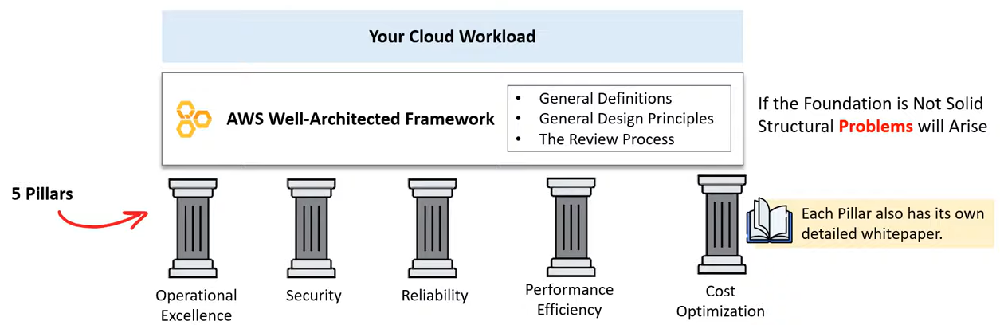

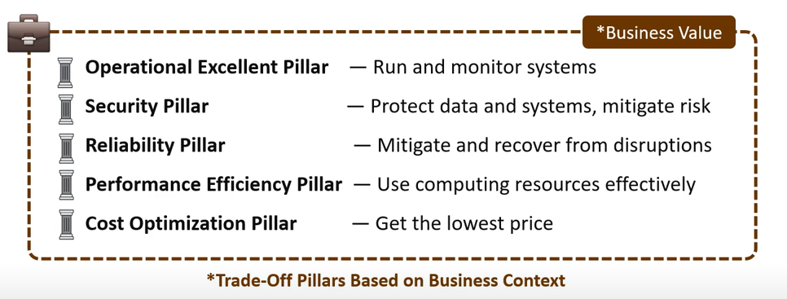

- `General Definition`
  - `Component`: Code, Configuration, and AWS Resource against a requirement.
  - `Workload`: A set of components that work together to deliver business value.
  - `Milestones`: Key changes of architecture through product life cycle.
  - `Architecture`: How components work together in a workload.
  - `Technology Portfolio`: A collection of workloads required for the business to operate.

---

### On Architecture

- The AWS Well-Architectured Framework is designed around a different kind of team structure.
  - Enterprises generally have centralized teams with specific roles where AWS has distrubted teams with flexible roles.
  - Distributed teams can come with new risks, AWS mitigates these with Practices, Mechanisms, and Leadership Principles.

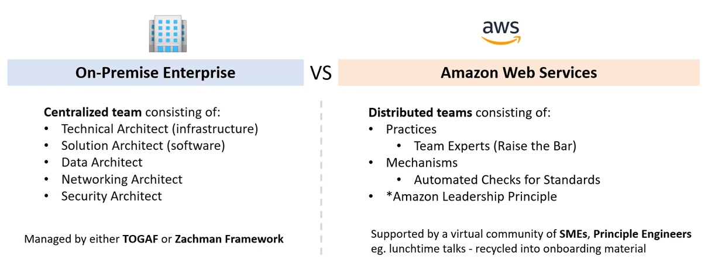

---

## Leadership Principle

- `Amazon Leadership Principle`
  - a set of principles used during the company decision-making, problem-solving, simple brainstorming, and hiring.

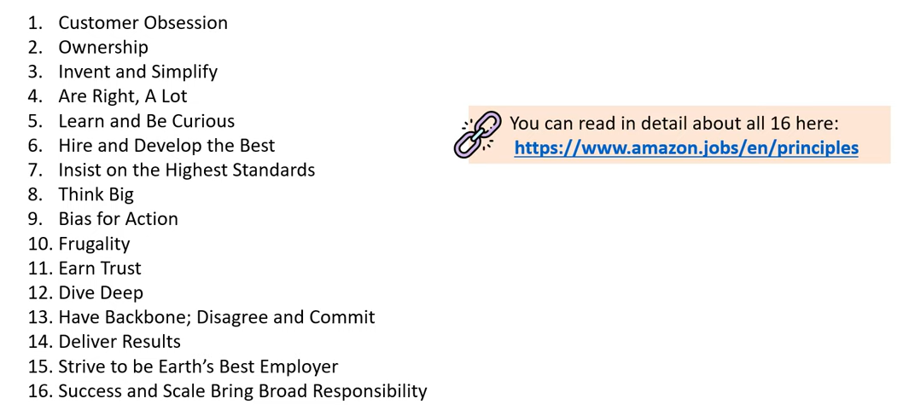

---

## General Design Principles

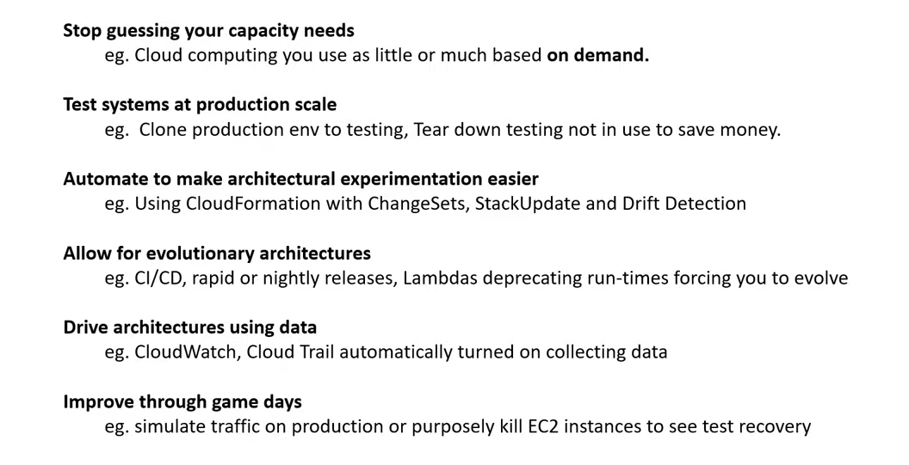

---

## Anatomy of a Pillar

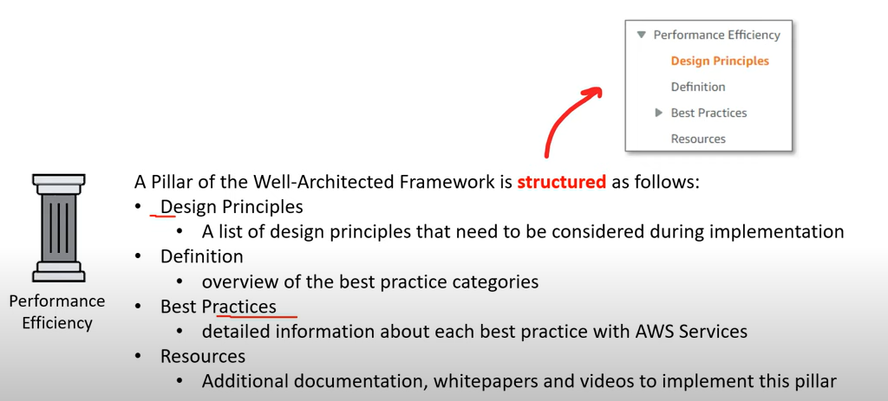

---

### Operational Excellence

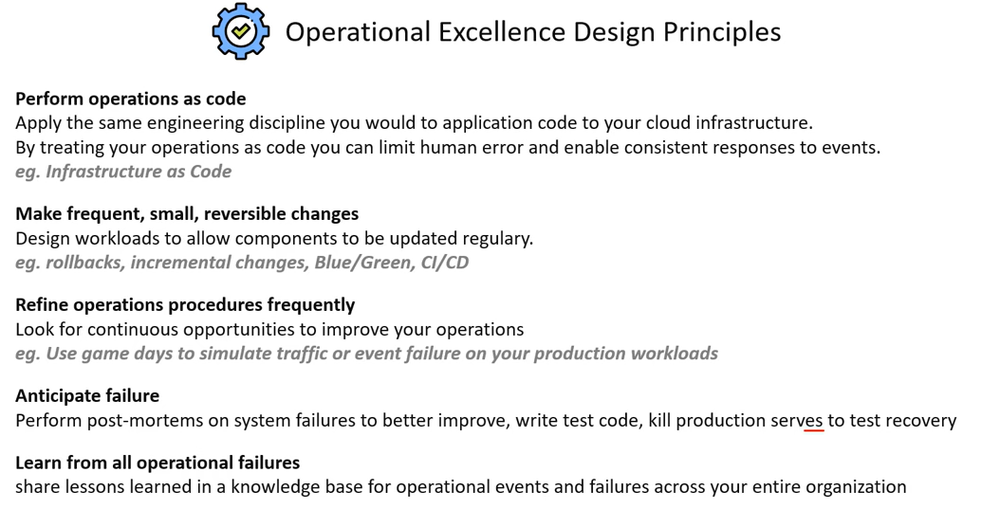

---

### Security

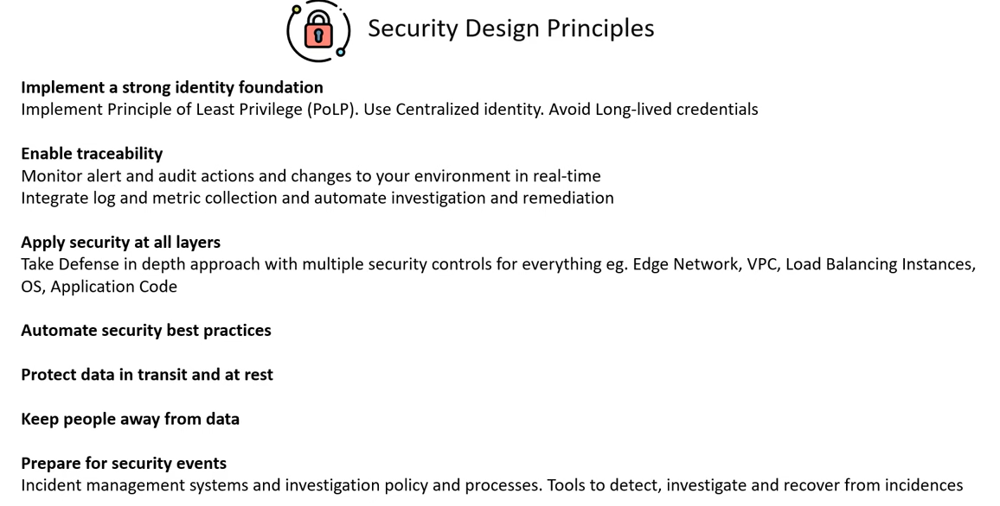

---

### Reliability

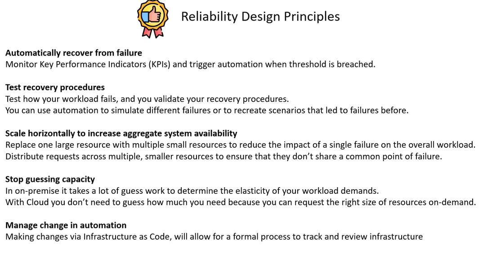

---

### Performance Efficiency

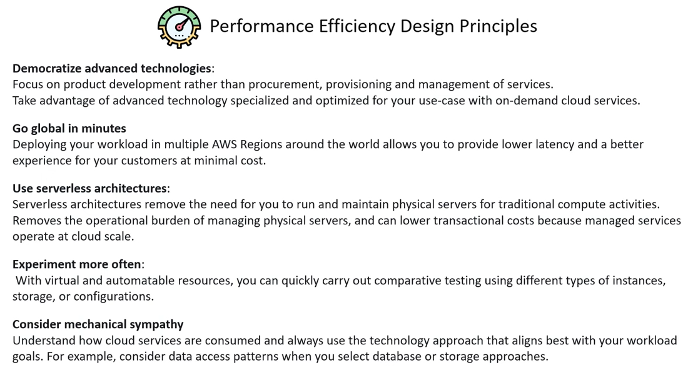

---

### Cost Optimization

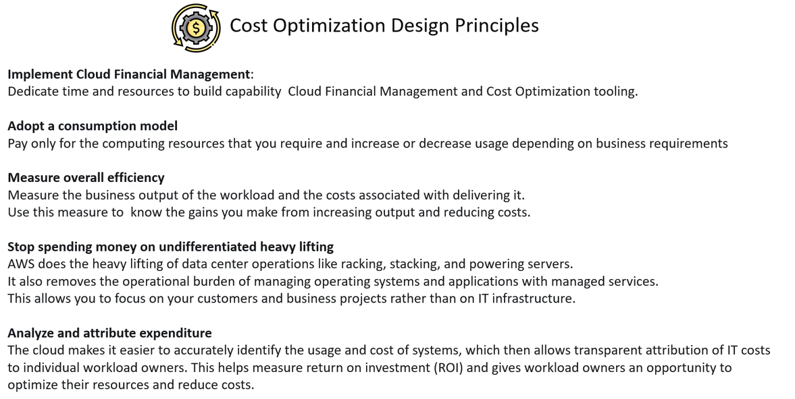

---

## Architecture Tools

- `Well-Architected Tool`
  - an auditing tool to be used to asset cloud workloads for alignment with the AWS Well Architecture Framework.

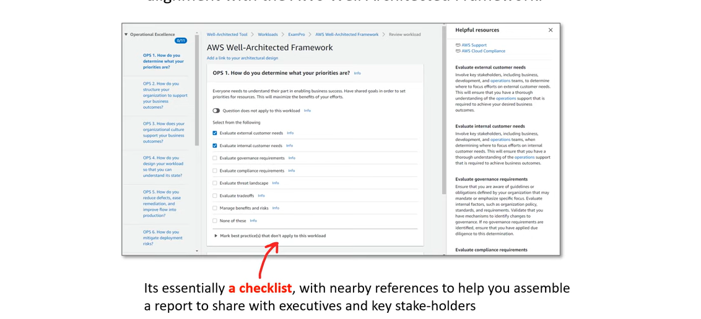

---

## Architecture Center

- `Architecture Center`
  - a web-portal that contains best practices and reference architectures for a variety of difference workloads.
  - Web: https://aws.amazon.com/architecture/

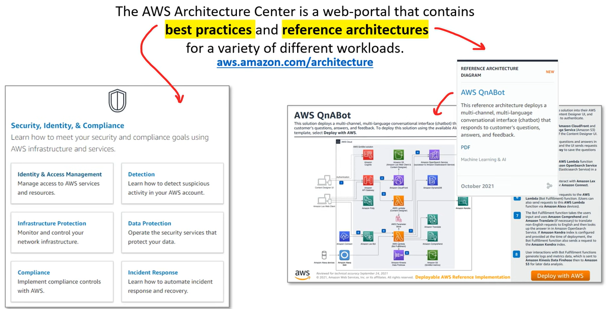

---

[Top](#aws---well-architectured-framework)
