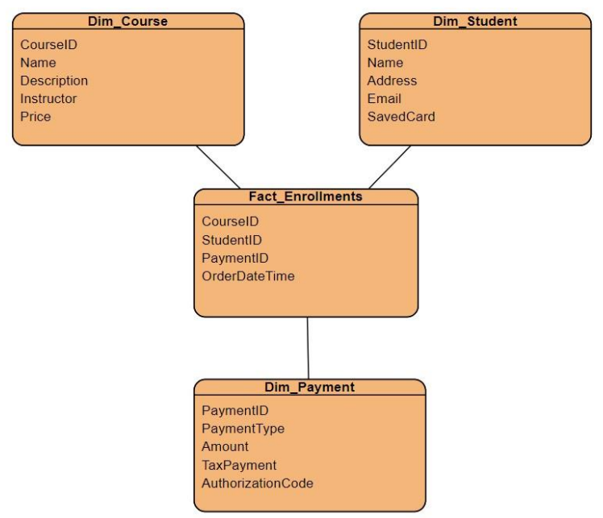
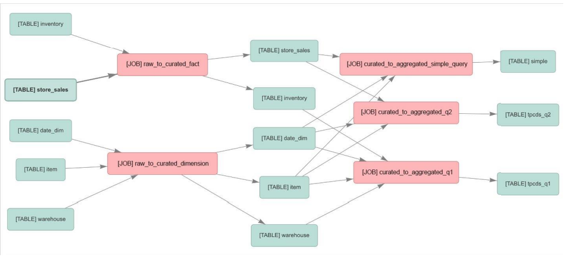

# Data Engineering Fundamental

[Back](../index.md)

- [Data Engineering Fundamental](#data-engineering-fundamental)
  - [Types of Data](#types-of-data)
  - [Properties of Data](#properties-of-data)
  - [Data Warehouses vs. Data Lakes](#data-warehouses-vs-data-lakes)
    - [Data Mesh](#data-mesh)
  - [ETL Pipelines](#etl-pipelines)
  - [Data Sources](#data-sources)
    - [Common Data Formats](#common-data-formats)
  - [Data Modeling](#data-modeling)
    - [Data Lineage](#data-lineage)
    - [Schema Evolution](#schema-evolution)
  - [Database Performance Optimization](#database-performance-optimization)

---

## Types of Data

- **Structured**

  - Data that is **organized in a defined manner** or schema, typically found in **relational databases**.
  - Characteristics:
    - Easily queryable
    - Organized in **rows** and **columns**
    - Has a **consistent structure**
  - e.g.:
    - Database tables
    - CSV files with consistent columns
    - Excel spreadsheets

- **Unstructured**

  - Data that **doesn't have a predefined structure** or schema.
  - Characteristics:
    - Not easily queryable without **preprocessing**
    - May come in **various formats**
  - e.g.:
    - Text files without a fixed format
    - Videos and audio files
    - Images
    - Emails and word processing documents

- **Semi-Structured**

  - Data that is **not as organized** as structured data but **has some level of structure** in the form of **tags**, **hierarchies**, or other **patterns**.

  - Characteristics:

    - Elements might be tagged or categorized in some way
    - More flexible than structured data but not as chaotic as unstructured data

  - e.g.:

    - XML and JSON files
    - Email headers (which have a mix of structured fields like date, subject, etc., and unstructured data in the body)
    - Log files with varied formats

---

## Properties of Data

- **Volume**

  - Refers to the **amount or size of data** that organizations are dealing with at any given time.
  - Characteristics:
    - May range from gigabytes to petabytes or even more
    - Challenges in **storing**, **processing**, and **analyzing** high volumes of data
  - e.g.:
    - A popular social media platform processing terabytes of data daily from user posts, images, and videos.
    - Retailers collecting years' worth of transaction data, amounting to several petabytes.

- **Velocity**

  - Refers to the **speed** at which new data is **generated, collected, and processed**.
  - Characteristics:
    - High velocity requires **real-time** or **near-real-time** processing capabilities
    - **Rapid ingestion and processing** can be critical for certain applications
  - e.g.:
    - Sensor data from IoT devices streaming readings every millisecond.
    - High-frequency trading systems where milliseconds can make a difference in decision-making.

- **Variety**
  - Refers to the different **types**, **structures**, and **sources** of data.
  - Characteristics:
    - Data can be structured, semi-structured, or unstructured
    - Data can come from multiple **sources** and in various **formats**
  - e.g.:
    - A business analyzing data from relational databases (structured), emails(unstructured), and JSON logs (semi-structured).
    - Healthcare systems collecting data from electronic medical records, wearable health devices, and patient feedback forms.

---

## Data Warehouses vs. Data Lakes

- **Data Warehouse**

  - A **centralized repository** optimized for analysis where data from different sources is stored in a structured format.

  - Characteristics:

    - Designed for complex **queries** and **analysis**
    - Data is **cleaned**, **transformed**, and **loaded** (ETL process)
    - Typically uses a **star** or **snowflake schema**
    - Optimized for **read-heavy** operations

  - e.g.:
    - Amazon **Redshift**
    - Google **BigQuery**
    - Microsoft Azure **SQL Data Warehouse**

---

- **Data Lake**

  - A storage **repository** that holds vast amounts of **raw data in its native format**, including structured, semi-structured, and unstructured data.

  - Characteristics:
    - Can store large volumes of **raw data without predefined schema**
    - Data is loaded as-is, **no need for preprocessing**
    - Supports batch, real-time, and stream processing
    - Can be **queried** for data transformation or exploration purposes
  - e.g.:
    - Amazon Simple Storage Service (**S3**) when used as a data lake
    - Azure **Data Lake Storage**
    - Hadoop Distributed File System (**HDFS**)

---

- Comparing the two
- **Schema**:
  - **Data Warehouse**: Schema-on-write (predefined schema before writing data)
    - Extract – Transform – Load (**ETL**)
  - **Data Lake**: Schema-on-read (schema is defined at the time of reading data)
    - Extract – Load – Transform (**ELT**)
- **Data Types**:
  - **Data Warehouse**: Primarily **structured** data
  - **Data Lake**: Both structured and **unstructured** data
- **Agility**:
  - **Data Warehouse**: Less agile due to predefined schema
  - **Data Lake**: More agile as it accepts raw data without a predefined structure
- **Processing**:
  - **Data Warehouse**: ETL (Extract, Transform, Load)
  - **Data Lake**: ELT (Extract, Load, Transform) or just Load for storage purposes
- **Cost**:
  - **Data Warehouse**: Typically more **expensive** because of optimizations for complex queries
  - **Data Lake**: **Cost-effective** storage solutions, but costs can rise when processing large amounts of data

---

- Choosing a Warehouse vs. a Lake

- Use a **Data Warehouse** when:

  - You have **structured data sources** and require fast and complex queries.
  - Data **integration** from different sources is essential.
  - Business intelligence and **analytics** are the primary use cases.

- Use a **Data Lake** when:

  - You have a **mix** of structured, semi-structured, or unstructured data.
  - You need a scalable and cost-effective solution to store massive amounts of data.
  - Future needs for data are **uncertain**, and you want **flexibility** in storage and processing.
  - Advanced analytics, machine learning, or data discovery are key goals.

- Often, organizations use a combination of both, ingesting raw data into a data lake and then processing and moving refined data into a data warehouse for analysis.

---

- **Data Lakehouse**

  - A hybrid data architecture that **combines** the best features of **data lakes** and **data warehouses**, aiming to provide the performance, reliability, and capabilities of a **data warehouse** while maintaining the flexibility, scale, and low-cost storage of **data lakes**.

  - Characteristics:

    - Supports **both** structured and unstructured data.
    - Allows for **schema-on-write** and **schema-on-read**.
    - Provides capabilities for both detailed **analytics** and **machine learning** tasks.
    - Typically built on top of cloud or distributed architectures.
    - Benefits from technologies like **Delta Lake**, which bring ACID transactions to big data.

  - e.g.:
    - AWS **Lake Formation** (with **S3** and **Redshift Spectrum**)
    - **Delta Lake**: An open-source storage layer that brings ACID transactions to Apache Spark and big data workloads.
    - **Databricks Lakehouse Platform**: A unified platform that combines the capabilities of data lakes and data warehouses.
    - Azure **Synapse Analytics**: Microsoft's analytics service that brings together big data and data warehousing.

---

### Data Mesh

- **Data Mesh**

  - Coined in 2019; it’s more about **governance** and **organization**
  - Individual teams **own** “data products” **within a given domain**

  - These data products serve various “use cases” around the organization

  - **“Domain-based** data management”

  - Federated governance with **central standards**

  - Self-service tooling & infrastructure - Data lakes, warehouses, etc. may be part of it
    - But a “data mesh” is more about the “data management paradigm” and not the specific technologies or architectures.

---

## ETL Pipelines

- `ETL`:

  - ETL stands for Extract, Transform, Load.
  - It's a process used to **move data from** _source systems_ **into** a _data warehouse_.

- **`Extract`**:

  - **Retrieve** raw data from source systems, which can be databases, CRMs, flat files, APIs, or other data repositories.
  - Ensure data integrity during the extraction phase.
  - Can be done in real-time or in batches, depending on requirements.

- **`Transform`**

  - **Convert** the extracted data **into a format suitable** for the target data warehouse.
  - Can involve various operations such as:
    - `Data cleansing` (e.g., removing duplicates, fixing errors)
    - `Data enrichment` (e.g., adding additional data from other sources)
    - Format changes (e.g., `date formatting`, string manipulation)
    - **Aggregations** or computations (e.g., calculating totals or averages)
    - **Encoding** or **decoding** data
    - Handling **missing values**

- **`Load`**:
  - **Move** the transformed data into the target data warehouse or another data repository.
  - Can be done in batches (all at once) or in a streaming manner (as data becomes available).
  - Ensure that data maintains its integrity during the loading phase.

---

- `ETL Pipelines`

  - set of processes used for ETL
  - This process must be **automated** in some **reliable** way

  - `AWS Glue`
  - Orchestration services
    - `EventBridge `
    - Amazon Managed Workflows for Apache Airflow [`Amazon MWAA`]
    - `AWS Step Functions`
    - `Lambda`
    - `Glue Workflows`

---

## Data Sources

- `JDBC`
  - Java Database Connectivity
  - Platform-independent, due to jvm
  - Language-dependent: java
- `ODBC`
  - Open Database Connectivity
  - Platform-dependent (thx to drivers)
  - Language-independent
- Raw logs
- API’s
- Streams

---

### Common Data Formats

- **`CSV`**

  - `Comma-Separated Values`
  - **Text-based** format that represents data in a **tabular form** where each **line** corresponds to a **row** and values within a row are **separated by commas**.

  - When to Use:

    - For small to medium datasets.
    - For data interchange between **systems** with different technologies.
    - For **human-readable** and editable data storage.
    - Importing/Exporting data from databases or spreadsheets.

  - Systems:
    - Databases (SQL-based),
    - Excel,
    - Pandas in Python,
    - R,
    - many ETL tools.

---

- **`JSON`**
  - `JavaScript Object Notation`
  - Lightweight, text-based, and human-readable data interchange format that represents structured or **semistructured** data based on **key-value pairs**.
  - When to Use:
    - Data interchange between a web **server** and a web **client**.
    - **Configurations** and settings for software applications.
    - Use cases that need a **flexible schema** or nested data structures.
  - Systems:
    - Web browsers,
    - many programming languages (like JavaScript,
      Python, Java, etc.),
      RESTful APIs,
      NoSQL databases (like MongoDB).

---

- **`Avro`**
  - **Binary format** that stores both the data and its schema, allowing it to be processed later with different systems **without needing the original system's context**.
  - When to Use:
    - With **big data** and **real-time** processing systems.
    - When **schema evolution** (changes in data structure) is needed.
    - Efficient **serialization** for data transport between systems.
  - Systems:
    - Apache Kafka,
    - Apache Spark,
    - Apache Flink,
    - Hadoop ecosystem

---

- **`Parquet`**
  - **Columnar storage format** optimized for **analytics**.
  - Allows for efficient **compression** and encoding schemes.
  - When to Use:
    - Analyzing **large** datasets with analytics engines.
    - Use cases where reading **specific columns** instead of entire records is beneficial.
    - Storing data on **distributed systems** where I/O operations and storage need optimization.
  - Systems:
    - Hadoop ecosystem,
    - Apache Spark,
    - Apache Hive,
    - Apache Impala,
    - Amazon Redshift Spectrum.

---

## Data Modeling

- **`Star schema`**
  - the schema in which data are organized into **facts** and **dimensions**.
  - **`Fact tables`**
    - A `fact` is an event that is counted or measured, such as a sale or log in.
    - A table in a star schema which **contains facts** and **connected to dimensions**.
  - **`Dimensions tables`**
    - A `dimension` includes **reference data** about the fact, such as date, item, or customer.
  - `Primary` / `foreign keys`:
    - used to connect dimension tables and fact table to minimize the amount of data to be stored.
- `Entity Relationship Diagram (ERD)`:
  

---

### Data Lineage

- **`Data Lineage`**

  - A visual representation that **traces the flow and transformation** of data through its lifecycle, **from** its source **to** its final destination.

- Importance:

  - Helps in **tracking errors** back to their source.
  - Ensures compliance with regulations.
  - Provides a clear understanding of how data is moved, transformed, and consumed within systems.

- e.g.:

---

### Schema Evolution

- **`Schema Evolution`**

  - The ability to **adapt and change the schema** of a dataset over time without disrupting existing processes or systems.

- Importance:

  - **Ensures data systems can adapt** to changing business requirements.
  - Allows for the addition, removal, or modification of **columns/fields** in a dataset.
  - Maintains backward compatibility with **older data** records.

- `Glue Schema Registry`
  - Schema discovery, compatibility, validation, registration…

---

## Database Performance Optimization

- `Indexing`
  - **Avoid full table scans**!
  - Enforce data **uniqueness** and integrity
- `Partitioning`
  - **Reduce** amount of data scanned
  - Helps with data lifecycle management
  - Enables **parallel processing**
- `Compression`
  - Speed up data transfer, reduce storage & disk reads
  - GZIP, LZOP, BZIP2, ZSTD (Redshift examples)
  - Various tradeoffs between compression & speed
  - `Columnar compression`

---

[TOP](#data-engineering-fundamental)
