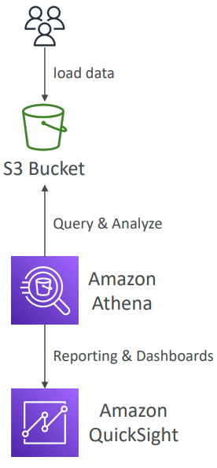
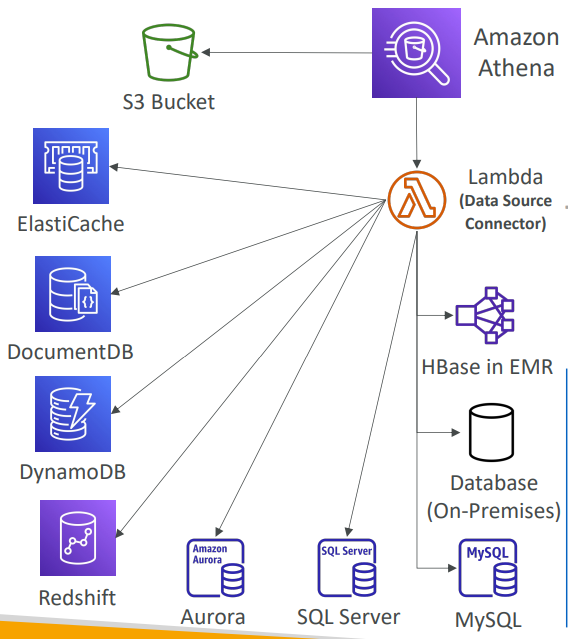
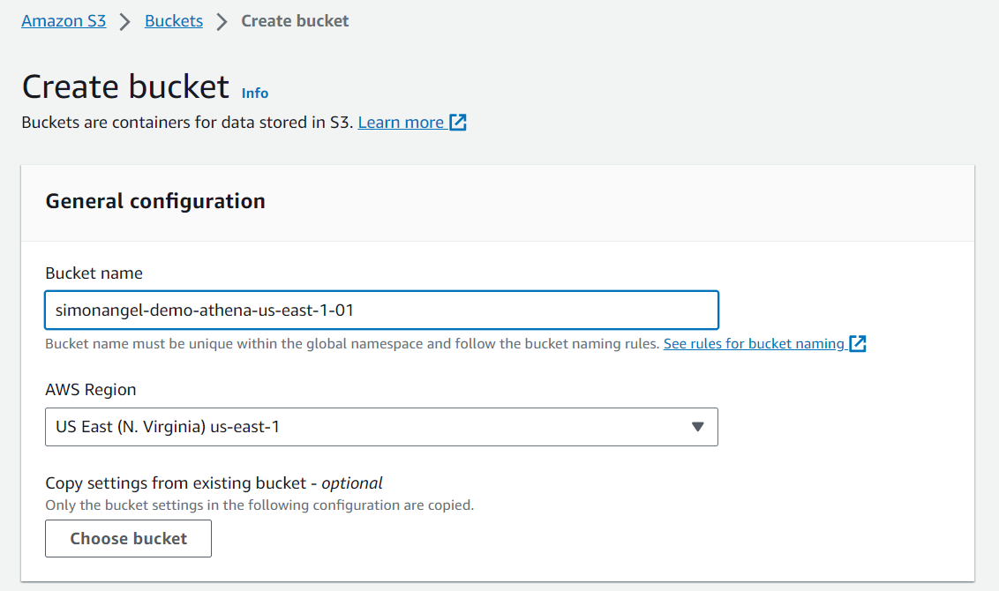
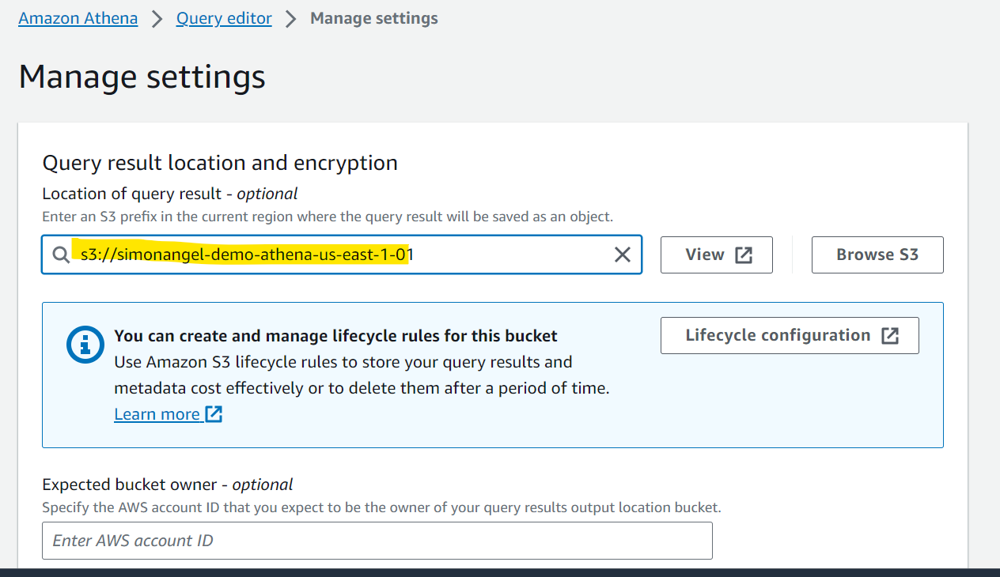
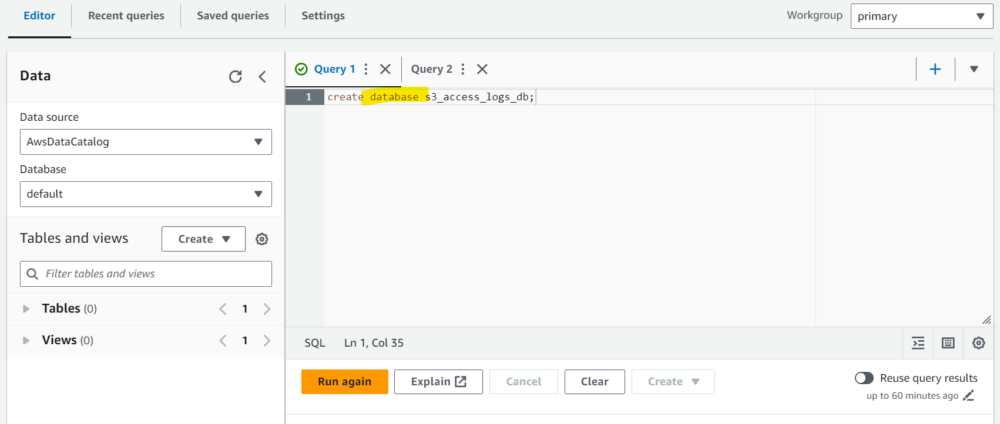
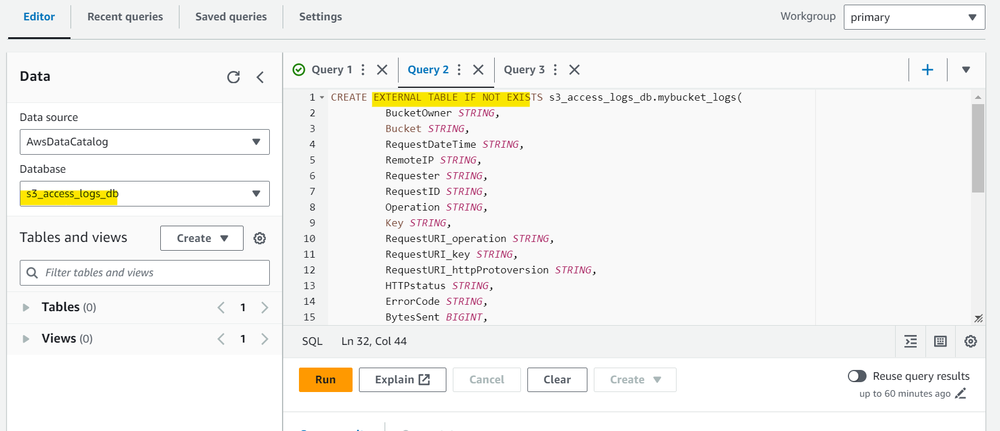
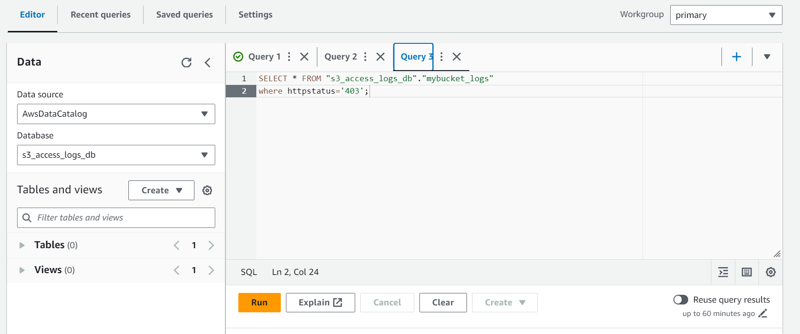

# AWS - Amazon Athena

[Back](../index.md)

- [AWS - Amazon Athena](#aws---amazon-athena)
  - [Amazon Athena](#amazon-athena)
    - [Performance Improvement](#performance-improvement)
    - [Federated Query](#federated-query)
  - [Hands-on](#hands-on)

---

## Amazon Athena

- `Amazon Athena`

  - Serverless **query service to analyze data** stored in Amazon `S3`

- Uses standard `SQL` language to query the files (built on `Presto`)
- Supports `CSV`, `JSON`, `ORC`, `Avro`, and `Parquet`
- Pricing: **$5.00 per TB** of data scanned
- Commonly used with `Amazon Quicksight` for reporting/dashboards

- **Use cases**:

  - Business intelligence
  - analytics
  - reporting
  - analyze & query VPC Flow **Logs**,
  - ELB **Logs**,
  - CloudTrail **trails**, etc...

- Exam Tip: analyze data in `S3` using serverless `SQL`, use `Athena`



---

### Performance Improvement

- Use **columnar data** for cost-savings (**less scan**)

  - `Apache Parquet` or `ORC` is recommended
  - Huge performance improvement
  - Use `Glue` to **convert** your data to `Parquet` or `ORC`

- **Compress data** for smaller retrievals (bzip2, gzip, lz4, snappy, zlip, zstd…)
- **Partition datasets** in S3 for easy querying on virtual columns

```txt
s3://yourBucket/pathToTable
/<PARTITION_COLUMN_NAME>=<VALUE>
/<PARTITION_COLUMN_NAME>=<VALUE>
/<PARTITION_COLUMN_NAME>=<VALUE>
/etc…
```

- Example: `s3://athena-examples/flight/parquet/year=1991/month=1/day=1/`
- Use **larger files (> 128 MB)** to minimize overhead

---

### Federated Query

- `Federated Query`
  - Allows you to **run SQL queries across data** stored in relational, non-relational, object, and custom **data sources** (**AWS** or **on-premises**)
- Uses `Data Source Connectors` that run on `AWS Lambda` to run `Federated Queries` (e.g., CloudWatch Logs, DynamoDB, RDS, …)
- **Store** the results back in Amazon `S3`



---

## Hands-on

- Create s3 bucket for athena result



- Set result location



- Create DB



- Create table



- Query



---

[Top](#aws---amazon-athena)
