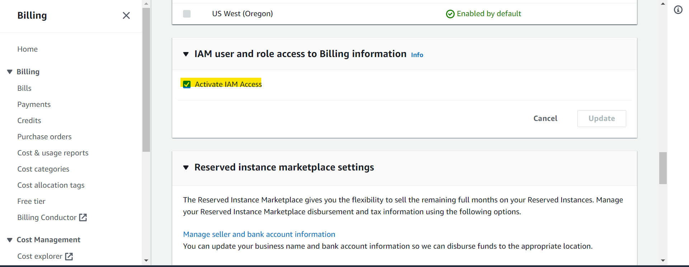
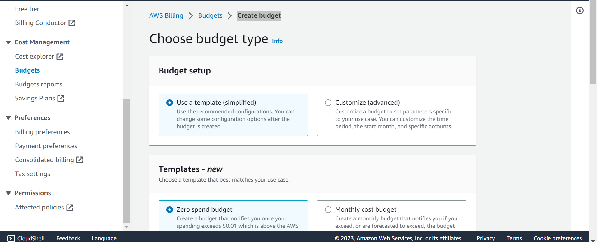
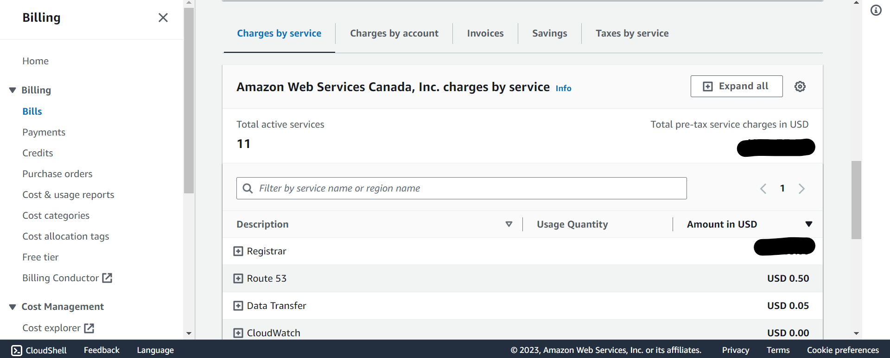
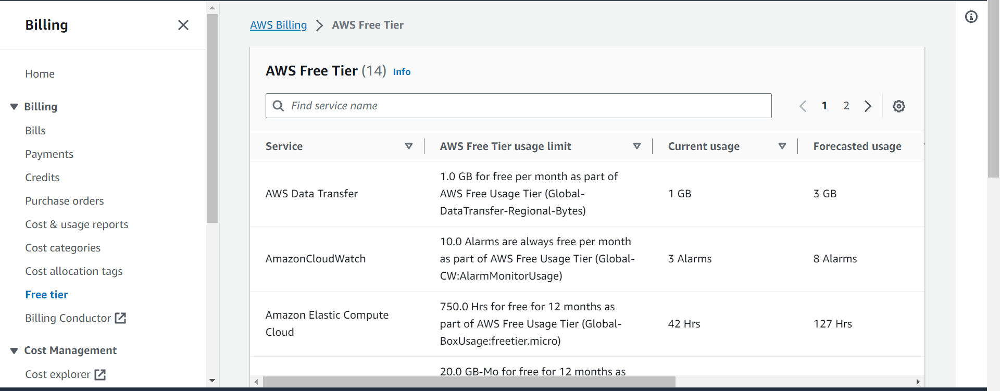

# AWS Billing - Budget Report

[Back](../../index.md)

---

## `Budget Report`

- Enable IAM User and role access to billing info:
  - sign in as root > `AWS Billing` > `Account` > `IAM user and role access to Billing information` > `Activate IAM Access`

- Create budget alarm

  - `AWS Billing` > `Budgets` > `Overview` > `Create budget`

---

## View Billing

- View charges by service

  - `AWS Billing` > `Bills` > `Charges by service`

- View usage of freetier
  - `AWS Billing` > `AWS Free Tier`

---

[TOP](#aws---budget)
