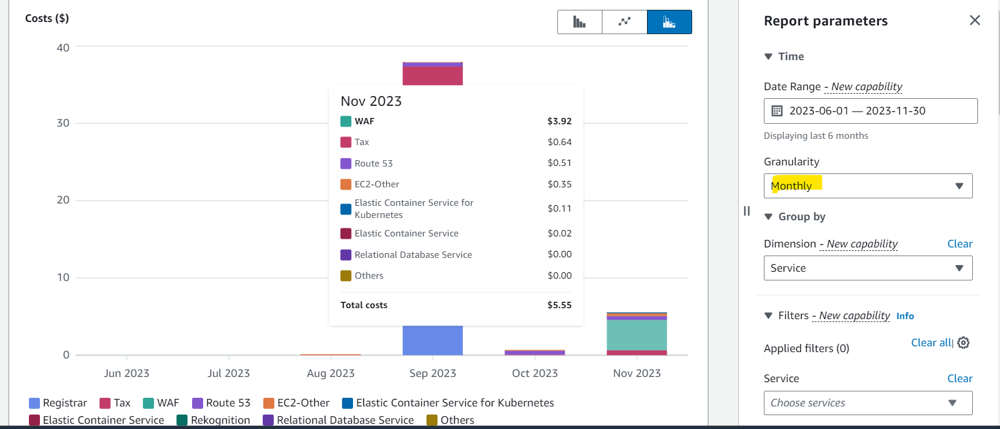
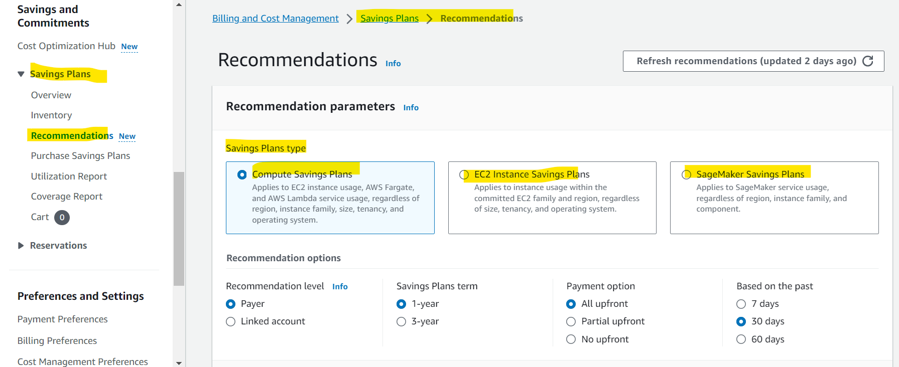
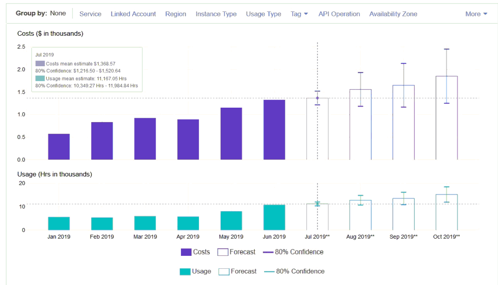

# AWS Billing - Cost Explorer

[Back](../../index.md)

- [AWS Billing - Cost Explorer](#aws-billing---cost-explorer)
  - [Cost Explorer](#cost-explorer)
    - [Visualization](#visualization)
    - [Saving plan](#saving-plan)
    - [Forecast Usage](#forecast-usage)

---

## Cost Explorer

- `Cost Explorer`

  - **Visualize**, understand, and manage your AWS **costs and usage** over time
  - Allow to **create custom reports** that analyze cost and usage data.

- Features:
  - Analyze your data at a high level:
    - **total** costs and usage across **all accounts**
    - Or **Monthly**, hourly, **resource** level granularity
  - **Choose** an optimal `Savings Plan` (to lower prices on your bill)
  - **Forecast** usage up to **12 months** based on previous usage

---

### Visualization

---

### Saving plan

- Saving plan
  - Alternative to `Reserved Instances`

---

### Forecast Usage

---

[TOP](#aws-billing---cost-explorer)
