# AWS Certification Path

[Back](../index.md)

- [AWS Certification Path](#aws-certification-path)
  - [Architecture](#architecture)
  - [Development](#development)
  - [Operations](#operations)
  - [DevOps](#devops)
  - [Security](#security)
  - [Networking](#networking)
  - [Data Analytics](#data-analytics)
  - [AI/ML](#aiml)

---

## Architecture

- `Solutions Architect`
  - Design, develop, and manage **cloud infrastructure and assets**, work with `DevOps` to **migrate** applications to the cloud

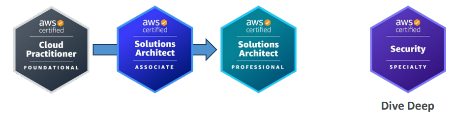

- `Application Architect`
  - Design significant aspects of **application architecture** including user interface, middleware, and infrastructure, and ensure enterprise-wide scalable, reliable, and manageable systems

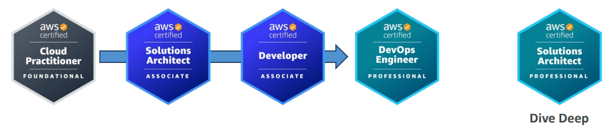

---

## Development

- `Software Development Engineer`
  - Develop, construct, and maintain **software** across platforms and devices

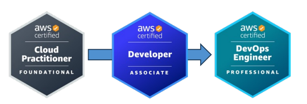

---

## Operations

- `Systems Administrator`
  - Install, upgrade, and maintain **computer components and software**, and integrate **automation processes**

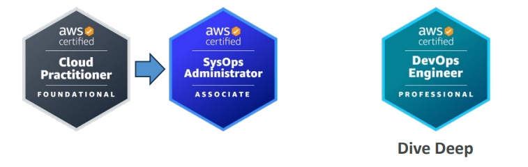

- `Cloud Engineer`
  - Implement and operate an **organization’s networked computing infrastructure** and Implement **security systems** to maintain data safety

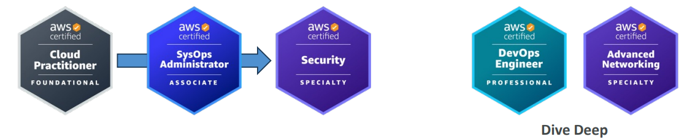

---

## DevOps

- `Test Engineer`
  - Embed **testing** and **quality best practices** for software development from design to release, throughout the product life cycle

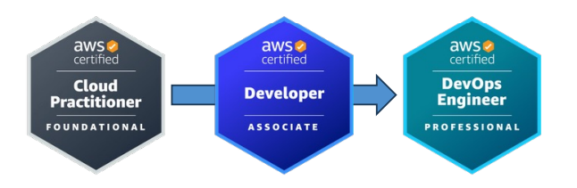

- `Cloud DevOps Engineer`
  - Design, deployment, and operations of large-scale global hybrid **cloud computing environment**, advocating for end-to-end **automated CI/CD DevOps pipelines**

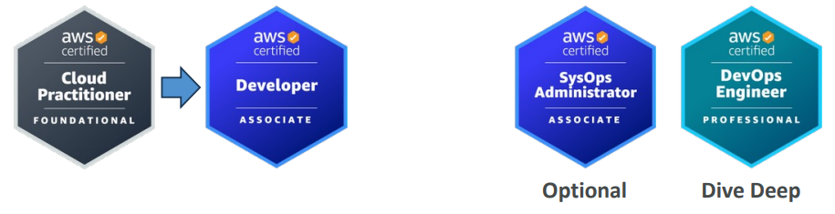

- `DevSecOps Engineer`
  - Accelerate enterprise **cloud adoption** while enabling rapid and stable delivery of capabilities using CI/CD principles, methodologies, and technologies

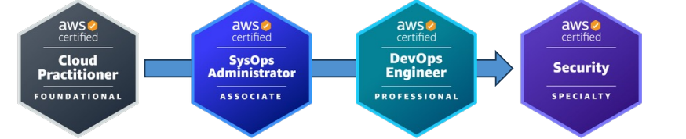

---

## Security

- `Cloud Security Engineer`
  - Design computer **security architecture** and develop detailed **cyber security designs**. Develop, execute, and track performance of security measures to protect information

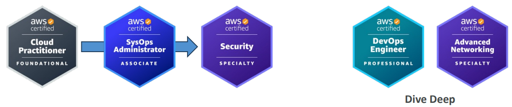

- `Cloud Security Architect`
  - Design and implement **enterprise cloud solutions** applying governance to identify, communicate, and minimize business and technical **risks**

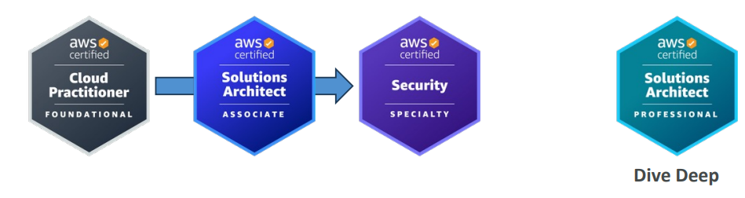

---

## Networking

- `Network Engineer`
  - Design and implement **computer and information networks**, such as local area networks (LAN), wide area networks (WAN), intranets, extranets, etc.

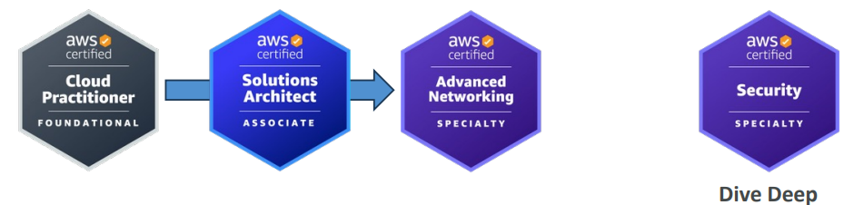

---

## Data Analytics

- `Cloud Data Engineer`
  - **Automate collection and processing** of structured/semi-structured data and monitor data pipeline performance

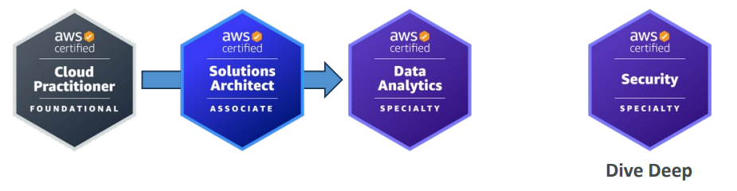

---

## AI/ML

- `Machine Learning Engineer`
  - Research, build, and design **artificial intelligence (AI) systems** to **automate** predictive models, and design **machine learning systems, models, and schemes**

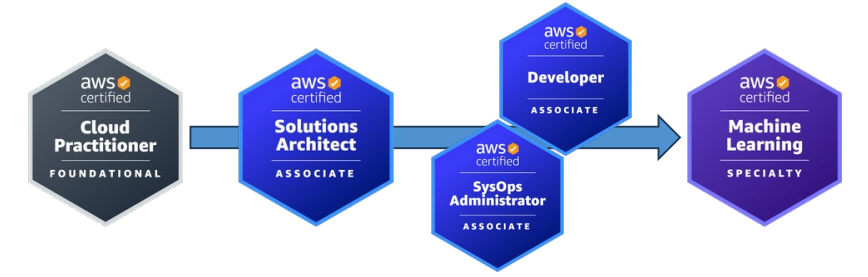

---
