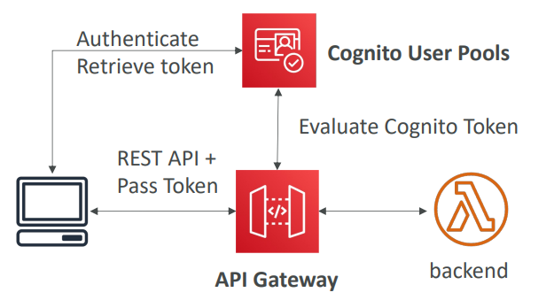
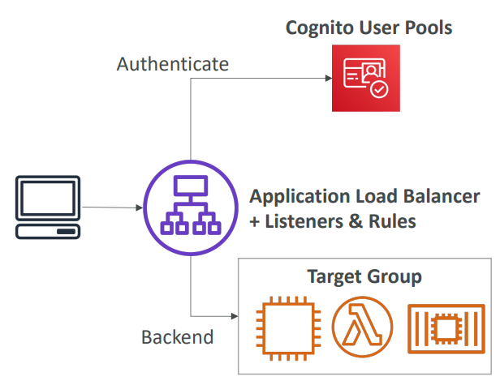
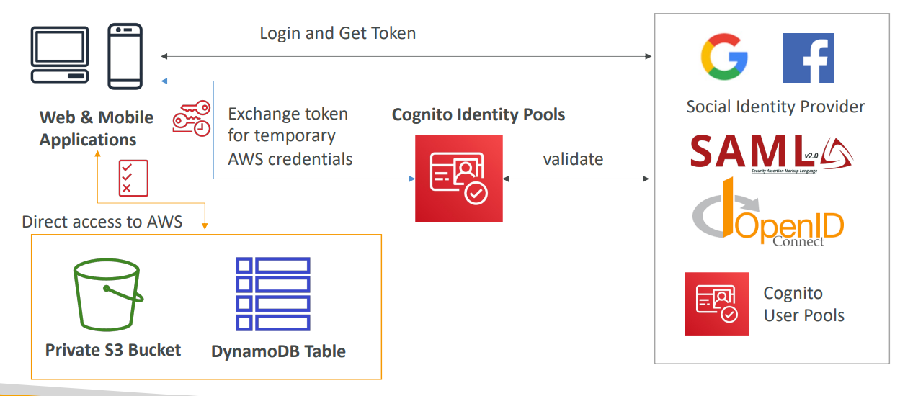
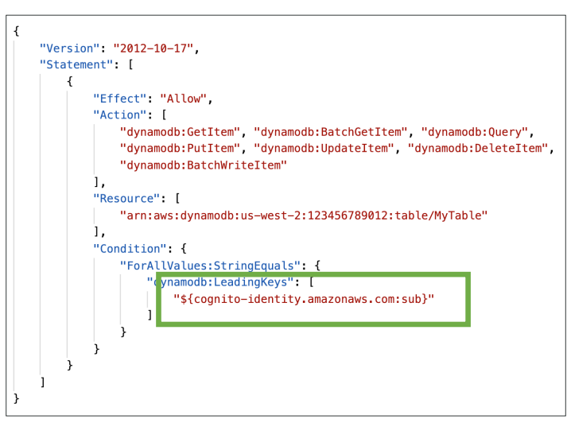

# AWS - Amazon Cognito

[Back](../index.md)

- [AWS - Amazon Cognito](#aws---amazon-cognito)
  - [`Amazon Cognito`](#amazon-cognito)
    - [`Cognito User Pools (CUP)` – User Features](#cognito-user-pools-cup--user-features)
    - [`Cognito Identity Pools` (Federated Identities)](#cognito-identity-pools-federated-identities)
    - [Use Case: Row Level Security in DynamoDB](#use-case-row-level-security-in-dynamodb)

---

## `Amazon Cognito`

- `Amazon Cognito`

  - Give users an **identity** to interact with our **web** or **mobile** application

- **Cognito User Pools**:

  - **Sign in** functionality for app users
  - **Integrate** with `API Gateway` & `Application Load Balancer`

- **Cognito Identity Pools (Federated Identity)**:

  - Provide **AWS credentials** to users so they can **access AWS resources** directly
  - Integrate with `Cognito User Pools` as an identity provider

- `Cognito` vs `IAM`:
  - Congnito: “hundreds of users”, ”mobile users”, “authenticate with SAML

---

### `Cognito User Pools (CUP)` – User Features

- Create a **serverless database of user** for your web & mobile apps
- Simple login:
  - **Username** (or email) / **password** combination
- Password reset
- **Email** & **Phone Number** Verification
- **Multi-factor authentication (MFA)**
- Federated Identities:
  - users from **Facebook**, **Google**, **SAML…**

---

- Integrations
  - CUP integrates with `API Gateway` and `Application Load Balancer`

- sample:
  - You are developing a new **web and mobile** application that will be hosted on AWS and currently, you are working on developing the **login and signup page**. The application backend is serverless and you are using **Lambda**, DynamoDB, and **API Gateway**. Which of the following is the best and easiest approach to configure the authentication for your backend?
    - cup

---

### `Cognito Identity Pools` (Federated Identities)

- Get identities for “users” who try to **access AWS resources** so they **obtain temporary** **AWS credentials**
- **Users source** can be `Cognito User Pools`, **3rd party logins**, etc…
- Users can then access _AWS services_ **directly** or through **`API Gateway`**
- The `IAM policies` applied to the **credentials** are defined in Cognito
- They can be **customized** based on the `user_id` for fine grained control
- **Default** `IAM roles` for authenticated and guest users

- sample:
  - You have a **mobile application** and would like to give your **users access** to their own personal space in the **S3 bucket**. How do you achieve that?
    - Cognito Identity Federation
  - You are running a **mobile application** where you want each registered user to upload/download images to/from his own folder in the **S3 bucket**. Also, you want to give your users to sign-up and sign in **using their social media accounts** (e.g., Facebook). Which AWS service should you choose?
    - Amazon Cognito lets you add user sign-up, sign-in, and access control to your web and mobile apps quickly and easily. Amazon Cognito scales to millions of users and **supports sign-in with social identity providers**, such as Apple, Facebook, Google, and Amazon, and enterprise identity providers via SAML 2.0 and OpenID Connect.

---

### Use Case: Row Level Security in DynamoDB

- Allow operations on items, not tables, only with the contidtion that LeadingKeys equal to congnito identity.

---

[TOP](#aws---amazon-cognito)
