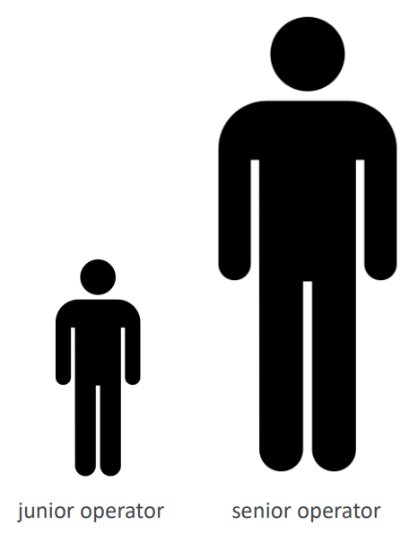
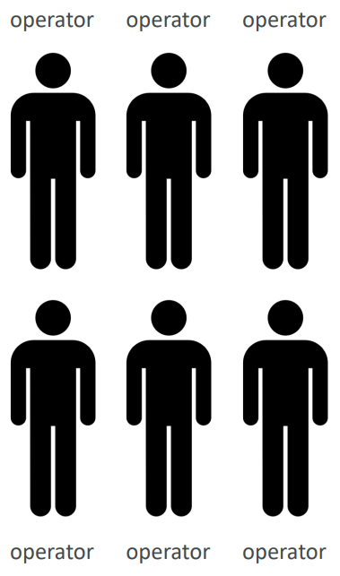
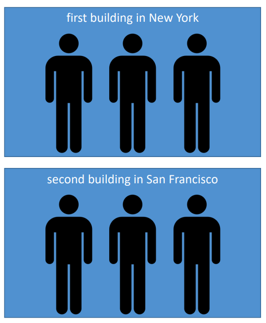

# AWS - High Availability & Scalability

[Back](../../index.md)

- [AWS - High Availability \& Scalability](#aws---high-availability--scalability)
  - [Scalability](#scalability)
  - [High Availability](#high-availability)
  - [High Availability \& Scalability For EC2](#high-availability--scalability-for-ec2)

---

## Scalability

- `Scalability` means that an application / system can **handle greater loads by adapting**.

- There are two kinds of scalability:

  - **Vertical** Scalability
  - **Horizontal** Scalability (= elasticity)

- **Vertical Scalability**

  - Vertically scalability means **increasing the size** of the instance
    - For example, your application runs on a `t2.micro`
    - Scaling that application vertically means running it on a t2.large
  - Vertical scalability is very common **for non distributed systems**, such as a database.
    - RDS, ElastiCache are services that can scale vertically.
  - There’s usually a **limit** to how much you can vertically scale (hardware limit)

- **Horizontal Scalability**

  - Horizontal Scalability means **increasing the number** of instances / systems for your application
  - Horizontal scaling implies **distributed** systems.
  - This is very common for web applications / modern applications
  - It’s easy to horizontally scale thanks the cloud offerings such as Amazon EC2

- `Scalability` is linked but different to High `Availability`

---

## High Availability

- High Availability usually goes hand in hand with horizontal scaling
- High availability means running your application / system **in at least 2 data centers** (== Availability Zones)
- The goal of high availability is to **survive a data center loss**
- The high availability can be passive (for RDS Multi AZ for example)
- The high availability can be active (for horizontal scaling)

---

## High Availability & Scalability For EC2

- **Vertical Scaling**:

  - Increase instance **size** (= **scale up / down**)
  - From: t2.nano - 0.5G of RAM, 1 vCPU
  - To: u-12tb1.metal – 12.3 TB of RAM, 448 vCPUs

- **Horizontal Scaling**:

  - Increase **number** of instances (= **scale out / in**)
  - `Auto Scaling Group`
  - `Load Balancer`

- **High Availability**:
  - Run instances for the same application across **multi AZ**
    - `Auto Scaling Group` **multi AZ**
    - `Load Balancer` **multi AZ**

---

[TOP](#aws---high-availability--scalability)
