# AWS Compute - Auto Scaling Group

[Back](../../index.md)

- [AWS Compute - Auto Scaling Group](#aws-compute---auto-scaling-group)
  - [`Auto Scaling Group`](#auto-scaling-group)
    - [ASG Launch Template](#asg-launch-template)
    - [CloudWatch Alarms \& Scaling](#cloudwatch-alarms--scaling)
    - [Hands-On: ASG](#hands-on-asg)
    - [Scalling](#scalling)
      - [Dynamic Scaling Policies](#dynamic-scaling-policies)
      - [Scheduled Actions](#scheduled-actions)
      - [Predictive Scaling](#predictive-scaling)
    - [Scaling Cooldowns](#scaling-cooldowns)
    - [Hands-on: ASG Scalling](#hands-on-asg-scalling)

---

## `Auto Scaling Group`

- In real-life, the load on your websites and application can change
- In the cloud, you can create and get rid of servers very quickly

- The goal of an Auto Scaling Group (ASG) is to:

  - **Scale out (add** EC2 instances) to match an increased load
  - **Scale in (remove** EC2 instances) to match a decreased load
  - Ensure we have a minimum and a maximum number of EC2 instances running
  - **Automatically register** new instances to a `load balancer`
  - Re-create an EC2 instance in case a previous one is terminated (ex: if unhealthy)

- The Auto Scaling Group **can't go over the maximum capacity** (you configured) during scale-out events.

- ASG are **free** (you only pay for the underlying EC2 instances)

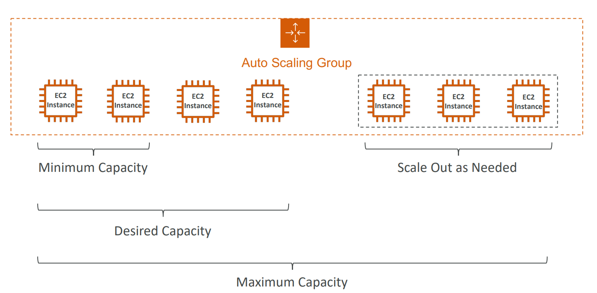

- **Work with load balancer**
  - You can configure the `Auto Scaling Group` to determine the EC2 instances' health based on **`Application Load Balancer` Health Checks** instead of EC2 Status Checks (default).
  - When an EC2 instance fails the ALB Health Checks, it is marked unhealthy and will be **terminated** while the ASG **launches a new** EC2 instance.

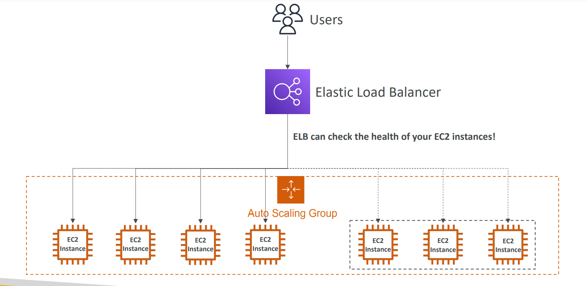

---

### ASG Launch Template

- A Launch Template (older “Launch Configurations” are deprecated)

  - AMI + Instance Type
  - EC2 User Data
  - EBS Volumes
  - Security Groups
  - SSH Key Pair
  - IAM Roles for your EC2 Instances
  - Network + Subnets Information
  - Load Balancer Information

- Min Size / Max Size / Initial Capacity
- Scaling Policies

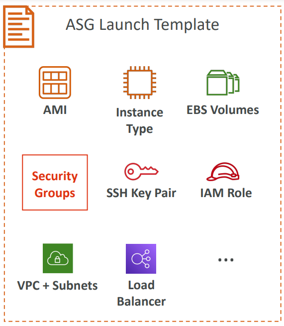

---

### CloudWatch Alarms & Scaling

- It is possible to scale an ASG based on **CloudWatch alarms**
  - There's no CloudWatch Metric for "requests per minute" for backend-to-database connections. You need to **create a CloudWatch Custom Metric**, then **create a CloudWatch Alarm**.
- An alarm **monitors a metric** (such as Average CPU, or a custom metric)
- Metrics such as Average CPU are computed for the overall ASG instances

- Based on the alarm:
  - We can create **scale-out policies** (increase the number of instances)
  - We can create **scale-in policies** (decrease the number of instances)

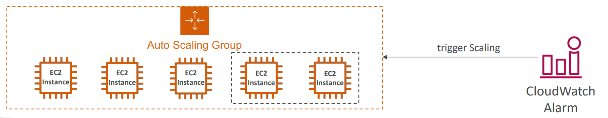

---

### Hands-On: ASG

- Create

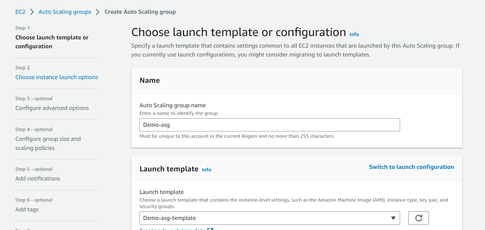

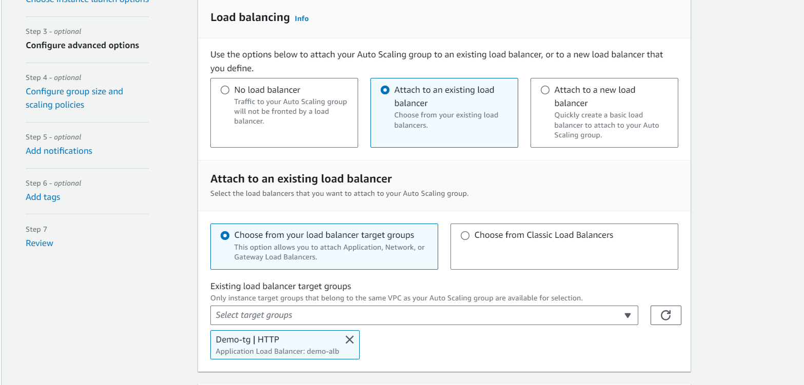

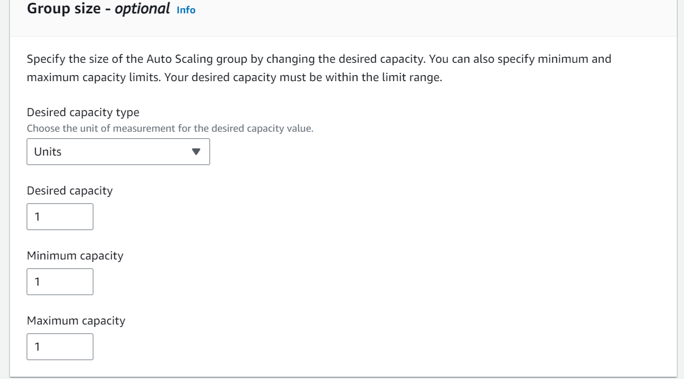

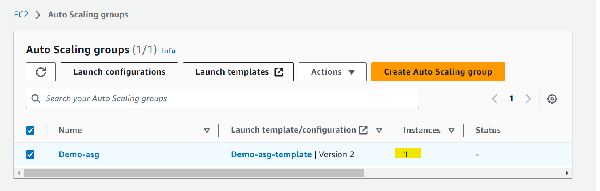

- Update

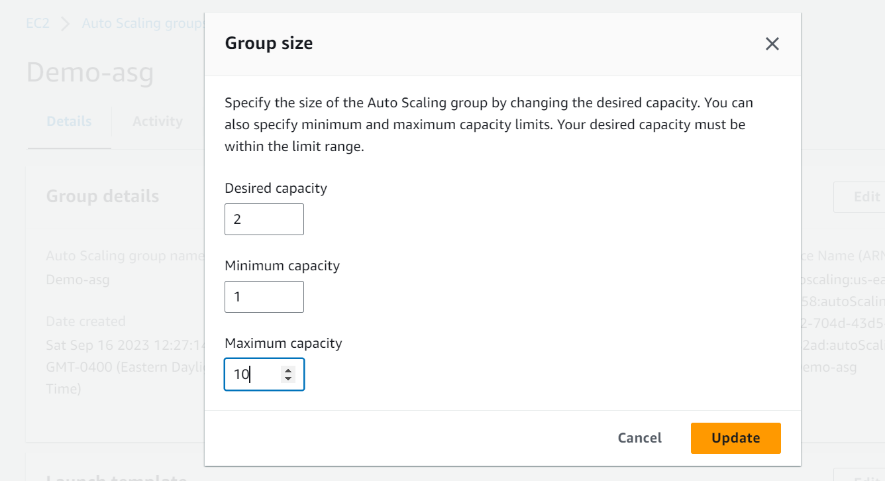

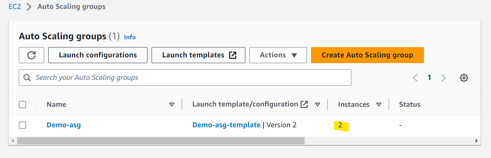

---

### Scalling

#### Dynamic Scaling Policies

- **Target Tracking Scaling**

  - Most simple and easy to set-up
  - Example: I want the average ASG CPU to stay at around 40%

- **Simple / Step Scaling**

  - When a CloudWatch alarm is triggered (example CPU > 70%), then add 2 units
  - When a CloudWatch alarm is triggered (example CPU < 30%), then remove 1

---

#### Scheduled Actions

- Anticipate a scaling based on **known usage patterns**
- Example: increase the min capacity to 10 at 5 pm on Fridays

---

#### Predictive Scaling

- Predictive scaling: continuously forecast load and schedule scaling ahead

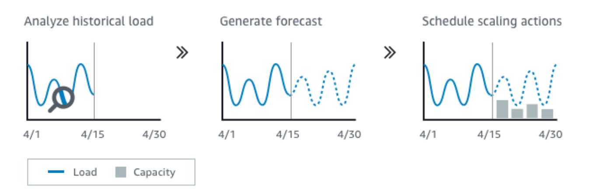

- Good metrics to scale on

  - **CPUUtilization**:
    - Average CPU utilization across your instances
  - **RequestCountPerTarget**:

    - to make sure the number of requests per EC2 instances is stable

    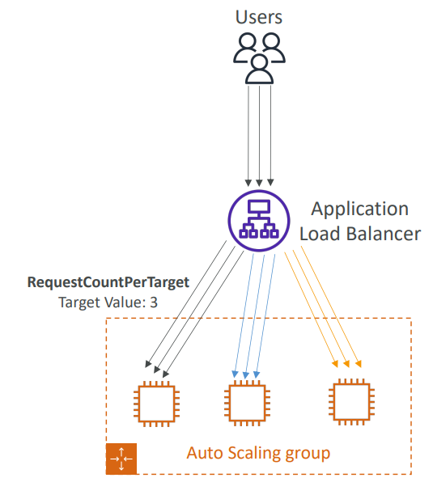

  - **Average Network In / Out**
    - (if you’re application is network bound)
  - **Any custom metric**
    - (that you push using CloudWatch)

---

### Scaling Cooldowns

- After a scaling activity happens, you are in the **cooldown period** (default 300 seconds)
- During the cooldown period, the ASG will **not launch or terminate additional** instances (to allow for metrics to stabilize)
- Advice:
  - Use a ready-to-use **AMI** to reduce configuration time in order to be serving request fasters and reduce the cooldown period

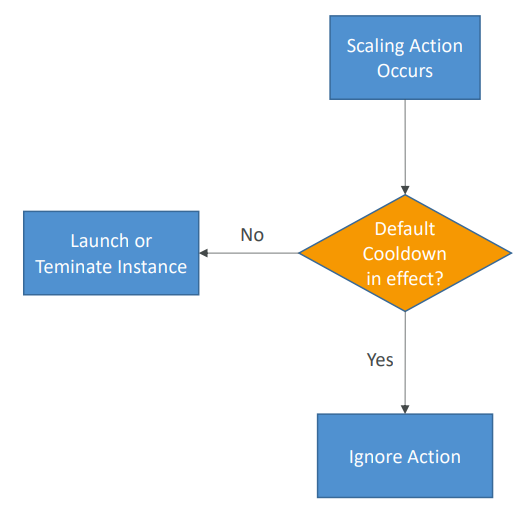

---

### Hands-on: ASG Scalling

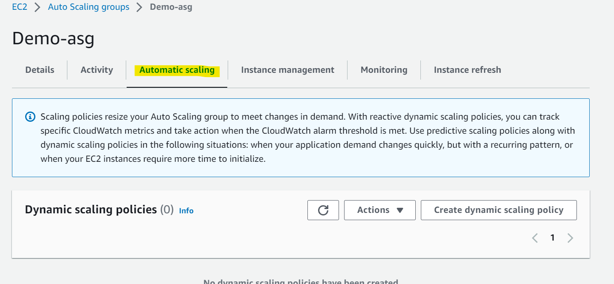

- Scheduled

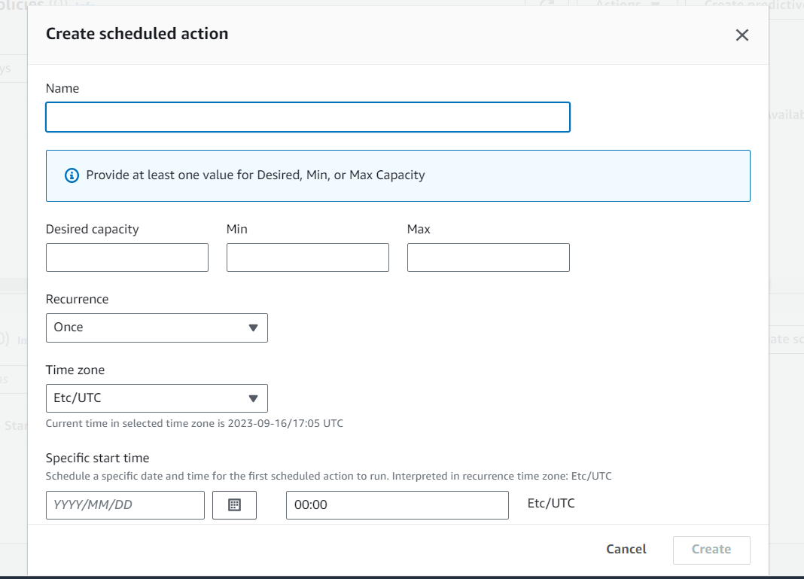

- Predictive scaling policy

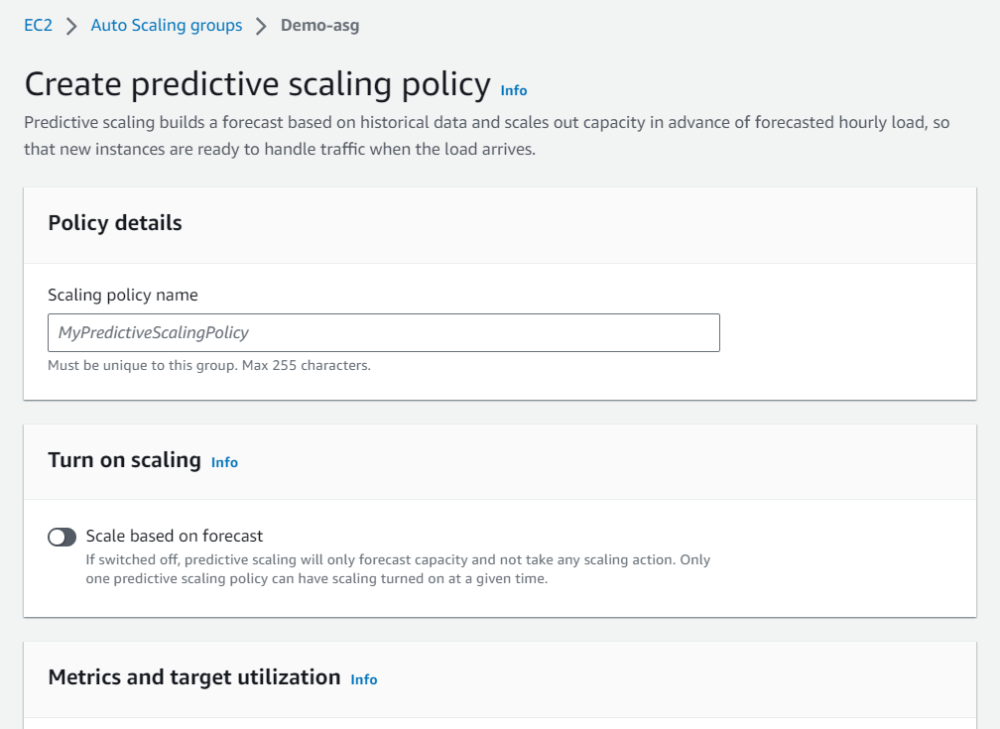

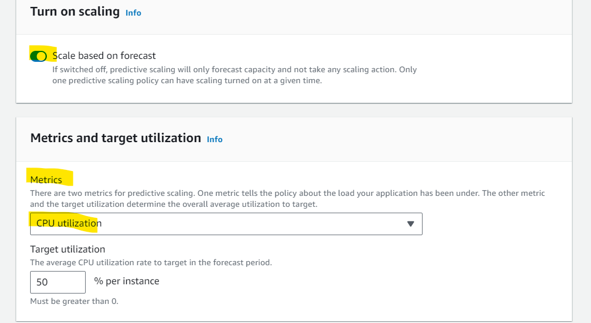

- Dynamic scaling policy

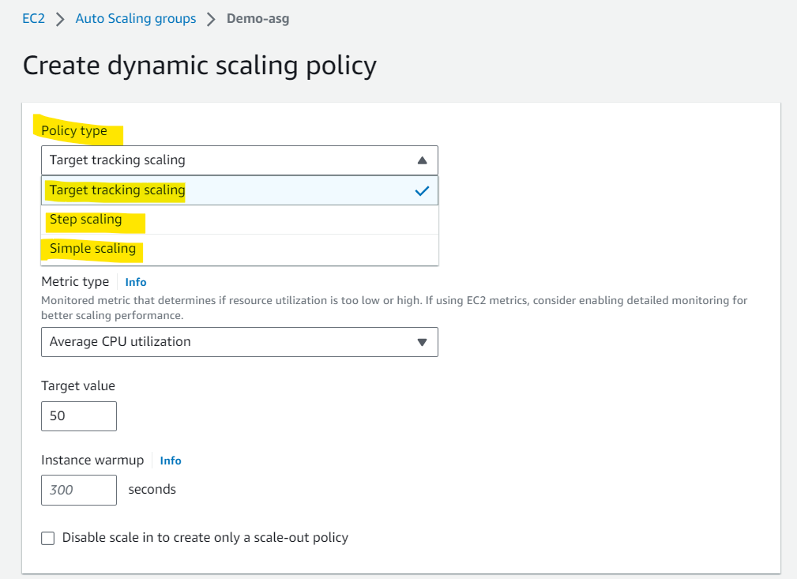

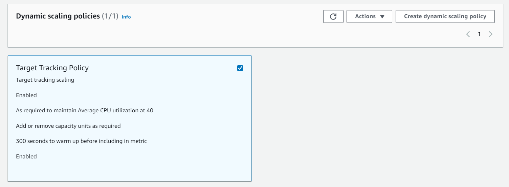

---

[TOP](#aws-compute---auto-scaling-group)
