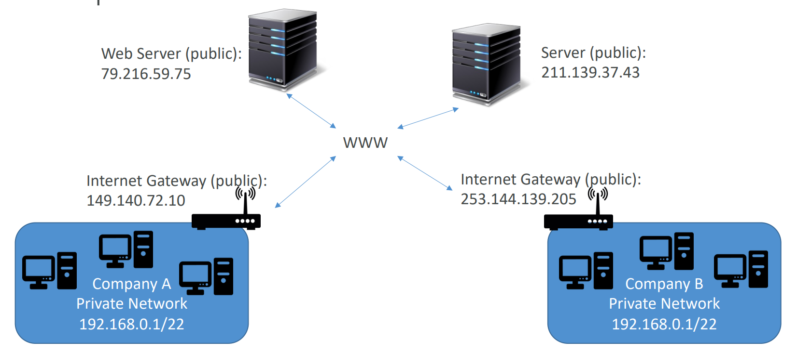
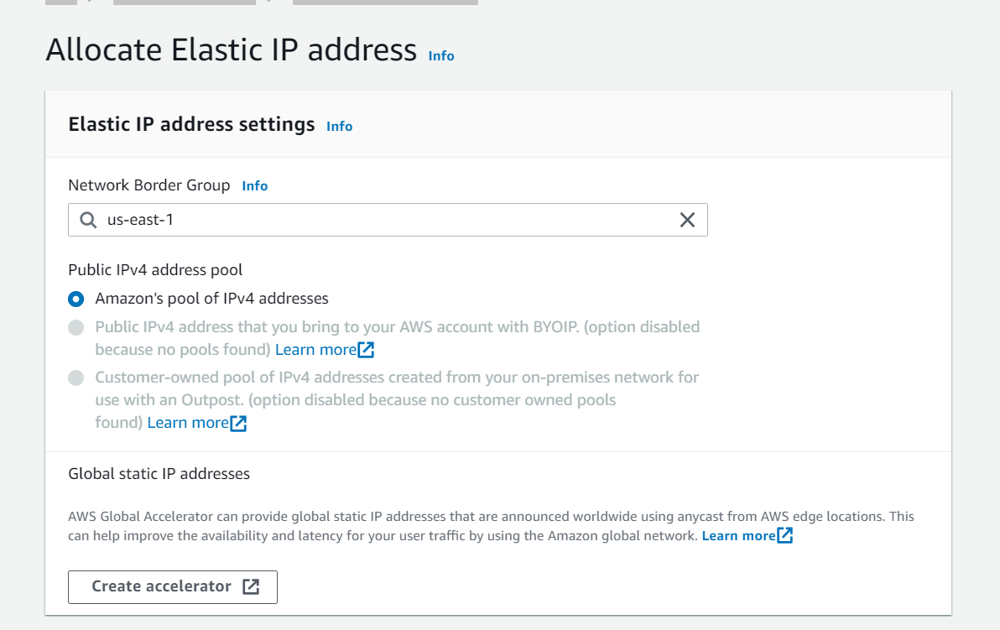
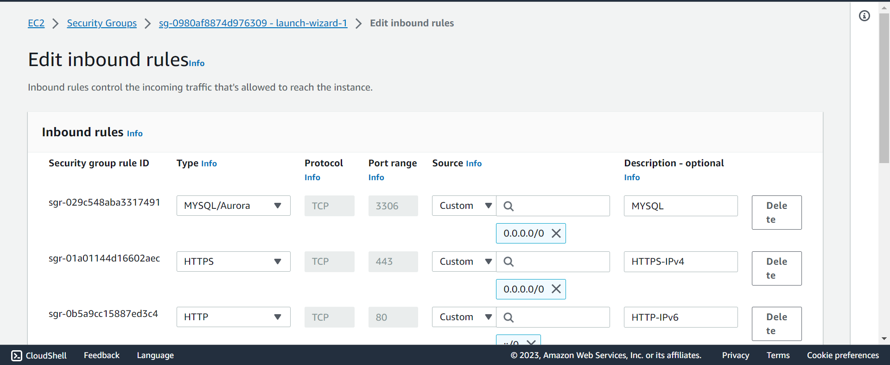
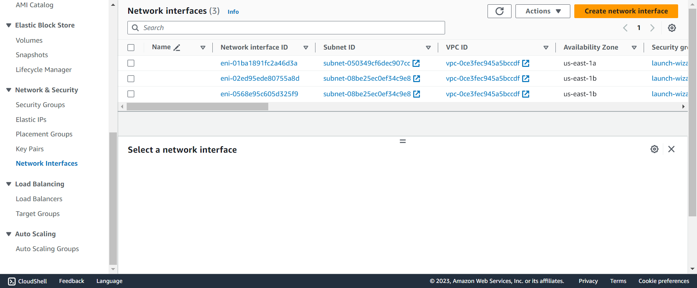
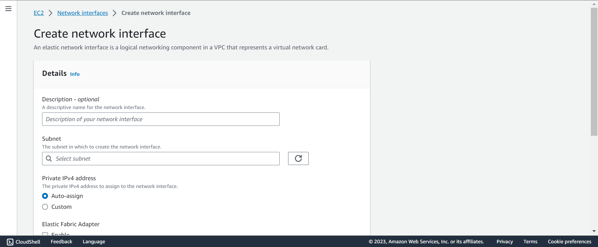
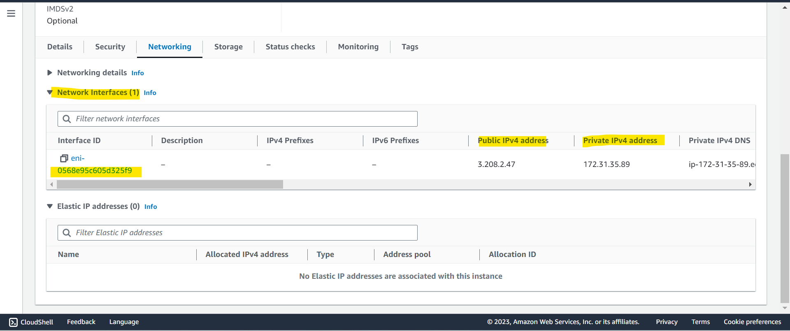

# AWS EC2 - Network

[Back](../../index.md)

- [AWS EC2 - Network](#aws-ec2---network)
  - [IPv4 vs IPv6](#ipv4-vs-ipv6)
    - [Public IP vs Private IP](#public-ip-vs-private-ip)
    - [Elastic IPs](#elastic-ips)
      - [Hands-on: Elastic IP address](#hands-on-elastic-ip-address)
  - [Security Groups](#security-groups)
  - [Connect with Instance](#connect-with-instance)
    - [SSH](#ssh)
    - [EC2 Instance Connect](#ec2-instance-connect)
    - [Summary: 3 ways to access EC2 instance](#summary-3-ways-to-access-ec2-instance)
  - [Elastic Network Interfaces (ENI)](#elastic-network-interfaces-eni)
    - [Hands-on: ENI](#hands-on-eni)

---

## IPv4 vs IPv6

- Networking has two sorts of IPs. `IPv4 `and `IPv6`:

  - IPv4: 1.160.10.240
  - IPv6: 3ffe:1900:4545:3:200:f8ff:fe21:67cf

- IPv4 is still the most common format used online.
  - In this course, we will only be using IPv4.
  - IPv4 allows for 3.7 billion different addresses in the public space
  - IPv4: [0-255].[0-255].[0-255].[0-255].
- IPv6 is newer and solves problems for the `Internet of Things (IoT)`.

---

### Public IP vs Private IP

- `Public IP`:

  - Public IP means the machine **can be identified on the internet (WWW)**
  - Must be **unique** across the whole web (not two machines can have the same public IP).
  - Can be **geo-located** easily

- `Private IP`:

  - Private IP means the machine can only be **identified on a private network only**
  - The IP must be **unique across the private network**
  - BUT two different private networks (two companies) can have the same IPs.
  - Machines connect to WWW using a `NAT(Network address translation)` + `internet gateway` (a proxy)
  - Only a specified **range** of IPs can be used as private IP

- `EC2`
  - By default, your EC2 machine comes with:
    - A `private IP` for the internal AWS Network
    - A `public IP`, for the WWW.
  - When we are doing `SSH` into our EC2 machines:
    - We **can’t use a private IP**, because we are not in the same network
    - We can only use the `public IP`.
  - If your machine is stopped and then started, the **public IP can change**

---

### Elastic IPs

- When you stop and then start an EC2 instance, it can **change its public IP**.
- If you need to have **a fixed public IP for your instance,** you need an `Elastic IP`
- An Elastic IP is a public IPv4 IP you own as long as you don’t delete it
- You can attach it to one instance at a time

- With an `Elastic IP address`, you can mask the failure of an instance or software by rapidly remapping the address to another instance in your account.
- You can only have **5** Elastic IP in your account (you can ask AWS to increase that).

- Overall, try to avoid using Elastic IP:
  - They often reflect **poor** architectural decisions
  - Instead, use a **random public IP** and **register a DNS name** to it
  - Or, as we’ll see later, use a `Load Balancer` and don’t use a public IP

---

#### Hands-on: Elastic IP address

- EC2 > Elastic IP addresses > Allocate Elastic IP address

---

## Security Groups

- `Security Groups`

  - acts as a “firewall” on EC2 instances that control how traffic is allowed into or out of an EC2 Instances.
  - only contain rules
  - can reference by IP or by security group
  - Does live “outside” the EC2 – if traffic is blocked the EC2 instance won’t see it
  - It’s good to maintain one separate security group for SSH access

- They regulate:

  - Access to Ports
  - Authorised IP ranges - IPv4 and IPv6
  - Control of **inbound network** (from other to the instance)
    - All **inbound** traffic is **blocked by default**
  - Control of **outbound network** (from the instance to other)
    - All **outbound** traffic is **authorised by default**

- SG can be attached to **multiple** instances; An instance can have **multiple** SG.

- SG Locked down to a **region** / VPC combination

  - SG is not effect in different region or VPC

- Troubleshooting:

  - If your application is not accessible (**`time out`**), then it’s a security group issue
  - If your application gives a “`connection refused`“ error, then it’s an application error or it’s not launched

- Classic Ports

| Port   | Protocol                             | Use case                       |
| ------ | ------------------------------------ | ------------------------------ |
| `22`   | SSH (Secure Shell)                   | log into a Linux instance      |
| `22`   | SFTP (Secure File Transfer Protocol) | upload files using SSH         |
| `21`   | FTP (File Transfer Protocol)         | upload files into a file share |
| `80`   | HTTP                                 | access unsecured websites      |
| `443`  | HTTPS                                | access secured websites        |
| `3389` | RDP (Remote Desktop Protocol)        | log into a Windows instance    |

- `0.0.0.0/0`: any IPv4
- `::/0`: any IPv6

---

## Connect with Instance

### SSH

- `SSH`: `Secure Shell` or `Secure Socket Shell`

  - a network **protocol** that gives users, particularly system administrators, **a secure way to access** a computer over an unsecured network.

- `ssh -i pem_file hostname@public_ip`

---

### EC2 Instance Connect

- Connect to your EC2 instance within your browser
- No need to use your key file that was downloaded
- The “magic” is that a temporary key is uploaded onto EC2 by AWS
- Works only out-of-the-box with Amazon Linux 2
- **Need to make sure the port 22** is still opened!

---

### Summary: 3 ways to access EC2 instance

- **SSH**

  - port 22 + SSH key

- **EC2 instance Connect**

  - temporarily + SG(port 22)

- **SSM Session manager**
  - assign IAM role for ssm, no port or key

---

## Elastic Network Interfaces (ENI)

- Logical component in a `VPC` that represents a **virtual network card**
- The `ENI` can have the following attributes:
  - `Primary private IPv4`, one or more secondary IPv4
  - One `Elastic IP (IPv4)` per private IPv4
  - One `Public IPv4`
  - One or more `security groups`
  - A `MAC address`
- You can create ENI **independently** and **attach** them on the fly (move them) on EC2 instances for failover(出故障时自动备份)
- **Bound to a specific availability zone (AZ)**

---

### Hands-on: ENI

- When creating an ec2, one ENI will be created; when deleting an ec2, the automatic-built ENI will be deleted as well.
- If an ENI is created by user, it will still available even the ec2 to which ENI is attatched is terminated.

- List ENI

- Create ENI
  - EC2 > Network interfaces > Create network interface

- Check ENI attached on an EC2

---

[TOP](#aws-ec2---network)
