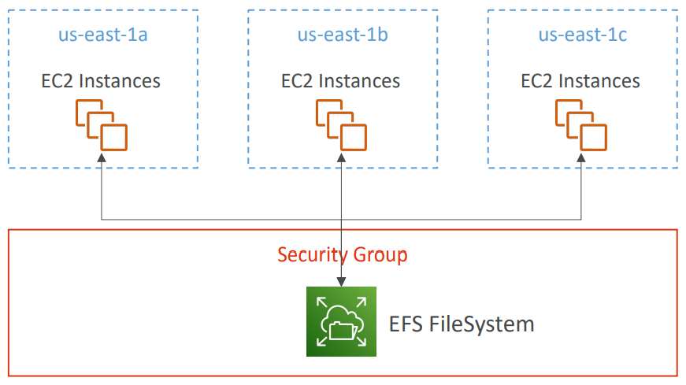
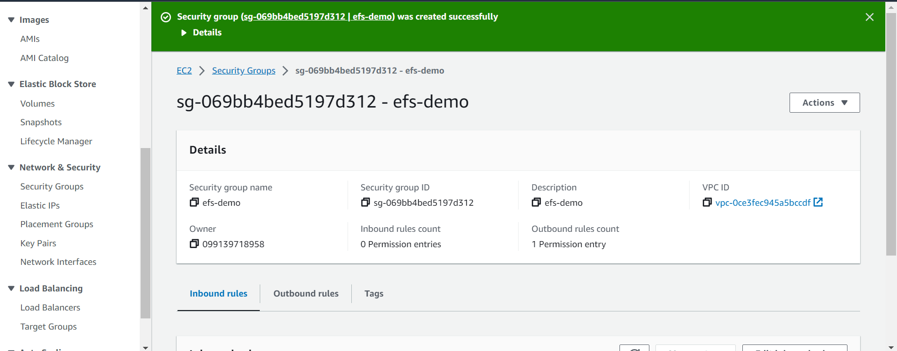
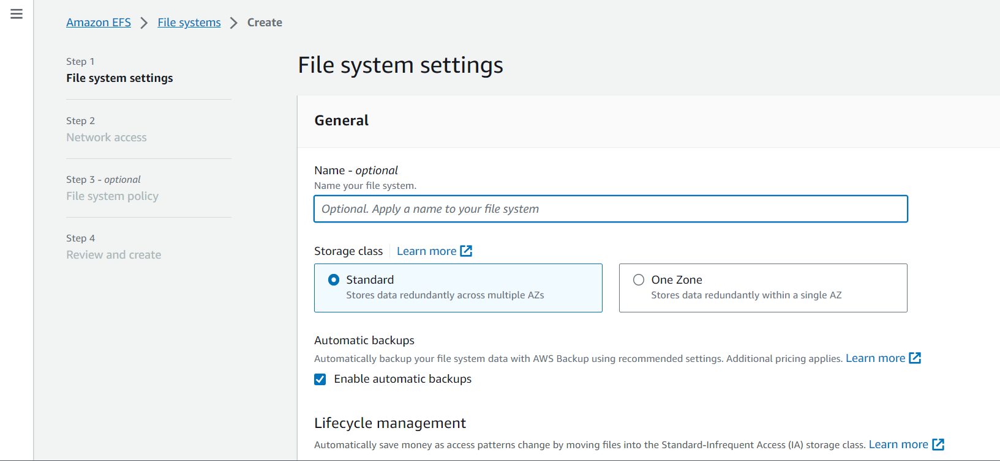
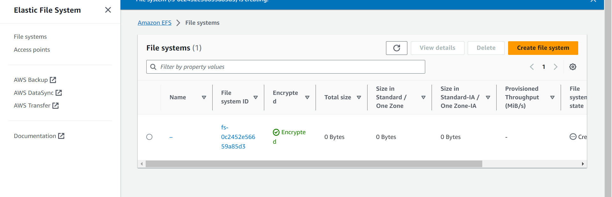
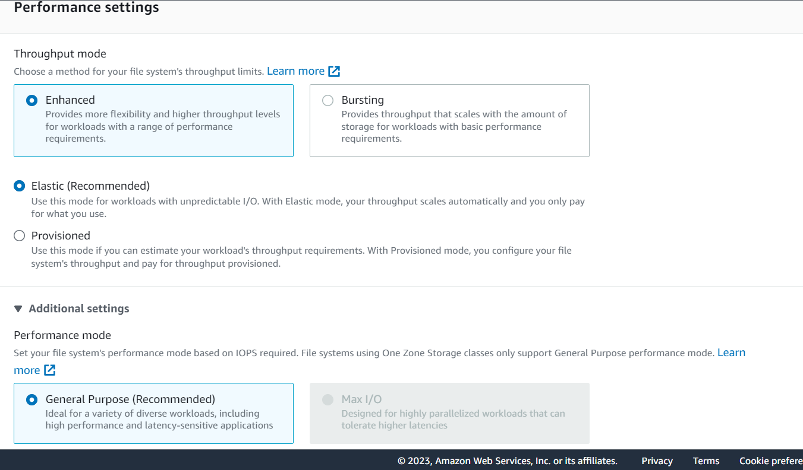
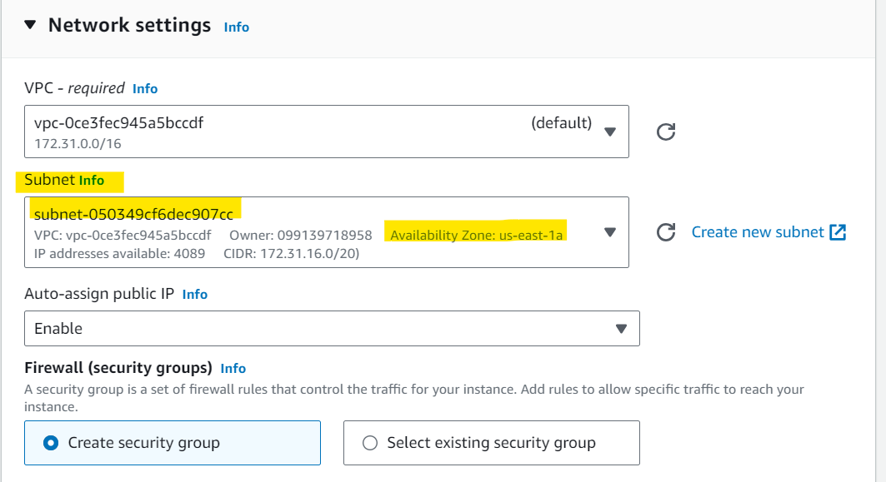
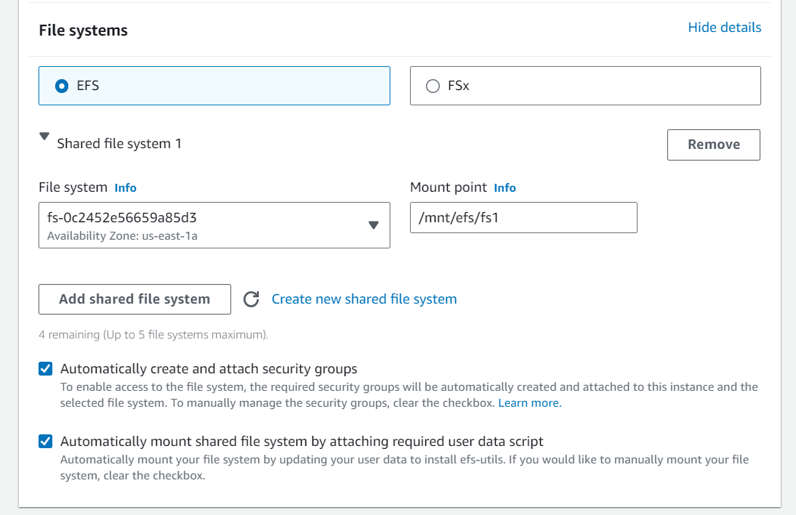
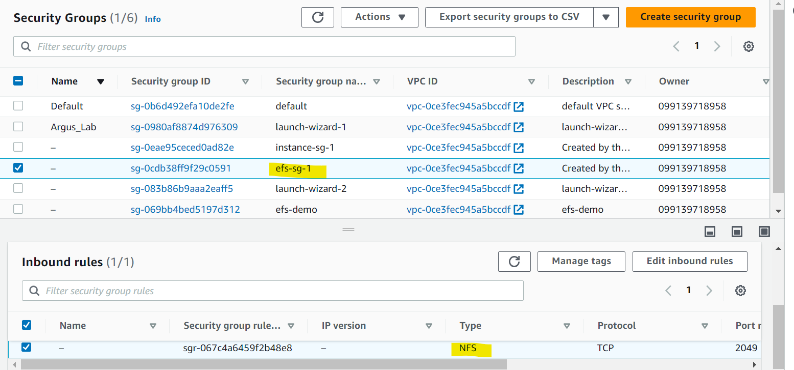
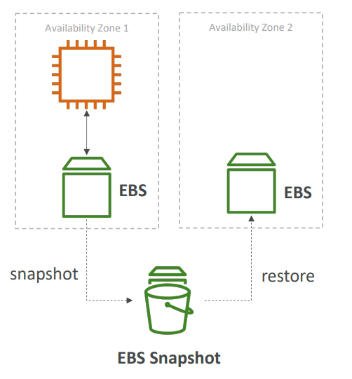
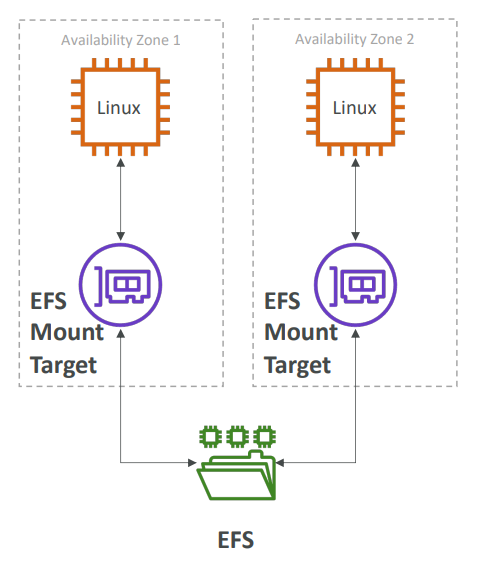

# AWS Storage - Elastic File System

[Back](../../index.md)

- [AWS Storage - Elastic File System](#aws-storage---elastic-file-system)
  - [`Elastic File System`](#elastic-file-system)
    - [Elastic File System](#elastic-file-system-1)
    - [Performance](#performance)
    - [Storage Classes](#storage-classes)
    - [Hands-on: EFS](#hands-on-efs)
  - [`EBS` vs `EFS`](#ebs-vs-efs)
    - [Elastic Block Storage](#elastic-block-storage)
    - [Elastic File System](#elastic-file-system-2)

---

## `Elastic File System`

### Elastic File System

- Managed `NFS (network file system)` that **can be mounted** on many EC2
- EFS works with EC2 instances in **multi-AZ**
- Highly available, scalable, expensive (3x gp2), **pay per use**

- **Use cases**:

  - content management, web serving, data sharing, Wordpress

- Uses NFSv4.1 protocol
- Uses **security group** to control access to EFS
- Compatible with **Linux** based AMI (not Windows)
- Encryption at rest using KMS

- `POSIX` file system (~Linux) that has a standard file API
- File system **scales automatically**, pay-per-use, no capacity planning!

---

### Performance

- **EFS Scale**
  - 1000s of concurrent NFS clients, 10 GB+ /s throughput
  - Grow to Petabyte-scale network file system, automatically
- **Performance Mode** (set at EFS creation time)

  - **General Purpose (default)**:
    - latency-sensitive use cases (web server, CMS, etc…)
  - **Max I/O**
    - higher latency, throughput, highly parallel (big data, media processing)

- **Throughput Mode**
  - **Bursting**
    - 1 TB = 50MiB/s + burst of up to 100MiB/s
  - **Provisioned**:
    - set your throughput regardless of storage size, ex: 1 GiB/s for 1 TB storage
  - **Elastic**
    - automatically scales throughput up or down based on your workloads
    - Up to 3GiB/s for reads and 1GiB/s for writes
    - Used for workloads

---

### Storage Classes

- **Storage Tiers (lifecycle management feature – move file after N days)**
  - **Standard**: for frequently accessed files
  - **Infrequent access (EFS-IA)**: cost to retrieve files, lower price to store. Enable EFS-IA with a Lifecycle Policy

- **Availability and durability**

  - **Standard**: Multi-AZ, great for prod
  - **One Zone**: One AZ, great for dev, backup enabled by default, compatible with IA (EFS One Zone-IA)

- Over 90% in cost savings

---

### Hands-on: EFS

- Create security group

- Create efs

- Attach to multple EC2

---

## `EBS` vs `EFS`

### Elastic Block Storage

- EBS volumes…

  - one instance (**except multi-attach io1/io2**)
  - are locked at the **Availability Zone (AZ)** level
  - gp2: IO increases if the disk size increases
  - io1: can increase IO independently

- To migrate an EBS volume **across AZ**
  - Take a **snapshot**
  - Restore the snapshot to another AZ
  - EBS backups use IO and you shouldn’t run them while your application is handling a lot of traffic

- Root EBS Volumes of instances get **terminated** by default if the EC2 instance gets terminated. (you can disable that)

---

### Elastic File System

- Mounting 100s of instances **across AZ**
- EFS **share** website files (WordPress)
- Only for **Linux** Instances (POSIX)
- EFS has a higher **price** point than EBS
- Can leverage **EFS-IA** for cost savings
- Remember: EFS vs EBS vs Instance Store

---

[TOP](#aws-ec2---storage)
