# AWS - Lambda

[Back](../../index.md)

- [AWS - Lambda](#aws---lambda)
  - [`AWS Lambda`](#aws-lambda)
    - [Benefits of AWS Lambda](#benefits-of-aws-lambda)
      - [Programming languages](#programming-languages)
      - [Integration with AWS services](#integration-with-aws-services)
    - [Pricing](#pricing)
  - [Lambda SnapStart](#lambda-snapstart)
    - [Lambda Limits to Know - per region (常考)](#lambda-limits-to-know---per-region-常考)
    - [Use Case Example](#use-case-example)
  - [Customization At The Edge](#customization-at-the-edge)
    - [`CloudFront Functions`](#cloudfront-functions)
    - [`Lambda@Edge`](#lambdaedge)
    - [`CloudFront Functions` vs. `Lambda@Edge`](#cloudfront-functions-vs-lambdaedge)
  - [Lambda in VPC](#lambda-in-vpc)
    - [Use Case: Lambda with RDS Proxy](#use-case-lambda-with-rds-proxy)
    - [Use Case: Invoking Lambda from RDS \& Aurora](#use-case-invoking-lambda-from-rds--aurora)
      - [vs `RDS Event Notifications`](#vs-rds-event-notifications)
  - [Hands-on](#hands-on)

---

## `AWS Lambda`

- `EC2` vs `Lambda`

- **EC2**:

  - Virtual **Servers** in the Cloud
  - limitations:
    - Limited by RAM and CPU
    - **Continuously** running
    - Scaling means intervention to add / remove servers

- **Lambda**

  - Virtual **functions** – no servers to manage!
  - advatages:
    - Run **on-demand**
    - Limited by time - **short executions**
    - **Scaling** is automated!

- sample:
  - You have configured a Lambda function to run each time an item is added to a DynamoDB table using DynamoDB Streams. The function is meant to insert messages into the SQS queue for further long processing jobs. Each time the Lambda function is invoked, it seems **able to read from the DynamoDB Stream** but it **isn't able to insert the messages into the SQS queue**. What do you think the problem is?
    - Lambda Execution IAM **role** misses **permission**.
  - You would like to create an architecture for a micro-services application whose sole purpose is to encode videos stored in an S3 bucket and store the encoded videos back into an S3 bucket. You would like to make this micro-services application reliable and has the ability to retry upon failures. Each video may take **over 25 minutes** to be processed. The services used in the architecture should be asynchronous and should have the capability to **be stopped for a day and resume the next day** from the videos that haven't been encoded yet. Which of the following AWS services would you recommend in this scenario?
    - Amazon `SQS` allows you to **retain messages for days** and process them later, while we can take down our `EC2 instances`.

---

### Benefits of AWS Lambda

- Easy Pricing:

  - Pay per **request** and **compute time**
  - Free tier of 1,000,000 AWS Lambda requests and 400,000 GBs of compute time

- Easy **monitoring** through AWS `CloudWatch`
- Easy to get more **resources** per functions (up to 10GB of RAM!)
- Increasing **RAM** will also improve **CPU** and **network**!

---

#### Programming languages

- Integrated with many **programming languages**
- Lambda language support

  - Node.js (JavaScript)
  - Python
  - Java (Java 8 compatible)
  - C# (.NET Core)
  - Golang
  - C# / Powershell
  - Ruby
  - Custom Runtime API (community supported, example Rust)

- **Lambda Container Image**考点
  - The `container image` must implement the `Lambda Runtime API`必须, 否则选择 ECS/Fargate
  - `ECS / Fargate` is preferred for running arbitrary `Docker images`

---

#### Integration with AWS services

- Integrated with the whole **AWS suite of services**

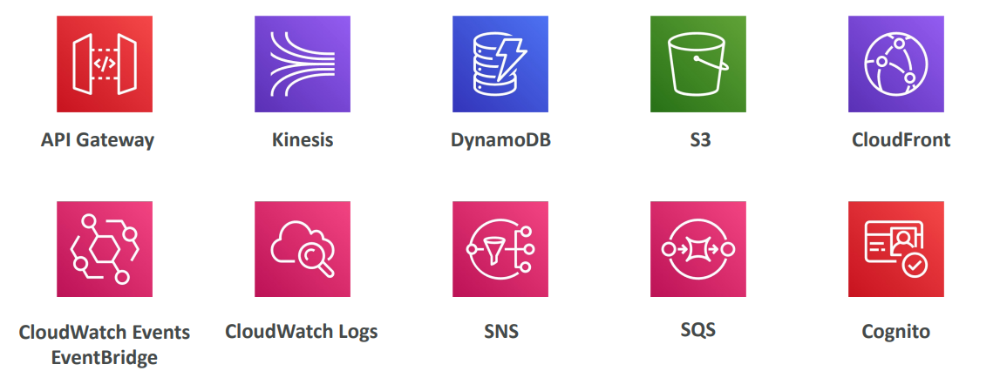

---

### Pricing

- You can find overall pricing information here:

  - https://aws.amazon.com/lambda/pricing/

- Pay per **calls** :

  - First **1**,000,000 requests are **free**
  - $**0.20** per 1 million requests thereafter ($0.0000002 per request)

- Pay per **duration**: (in increment of 1 ms )

  - **400,000 GB-seconds** of compute time per month for **FREE**
  - == 400,000 seconds if function is **1GB RAM**
  - == 3,200,000 seconds if function is **128 MB RAM**
  - After that $1.00 for 600,000 GB-seconds

- It is usually very **cheap** to run AWS Lambda so it’s very popular

---

## Lambda SnapStart

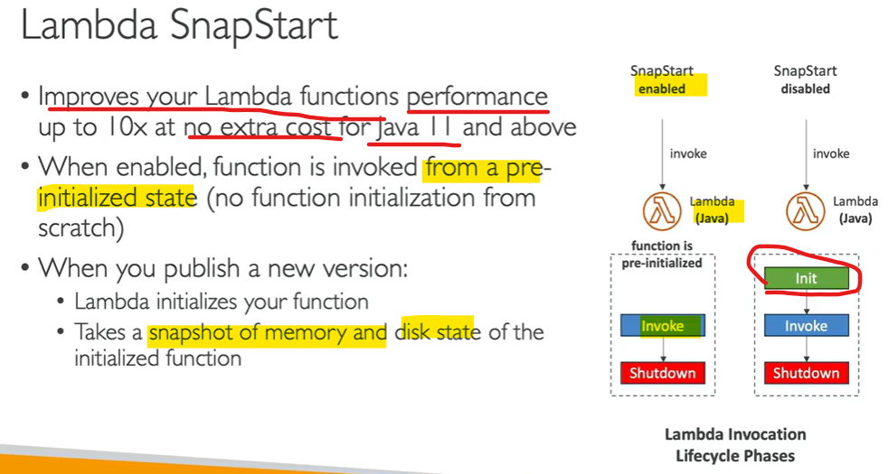

---

### Lambda Limits to Know - per region (常考)

- **Execution**:

  - **Memory** allocation: 128 MB – **10GB** (1 MB increments)
    - more memory, more cpu and improve internet.
  - **Disk capacity** in the “function container” (in `/tmp`): 512 MB to **10GB**
  - Maximum **execution time**: **900** seconds (**15 minutes**)
  - **Concurrency** executions: 1000 (can be increased)
  - **Environment variables** (**4** KB)

- **Deployment**:

  - Size:
    - Lambda function **deployment size** (**compressed** .zip): **50 MB**
    - **uncompressed** deployment (code + dependencies): **250 MB**
  - Can use the `/tmp` directory to **load other files at startup**
  - **Size** of **environment variables**: 4 KB

- Sample:

  - not to usd lambda, if need:
    - memory > 10 GB
    - big file > 50MB / 250MB
    - Env Var > 4KB
    - Execution Time: >900s

- Sample:
  - You have created a Lambda function that typically will take around **1 hour** to process some data. The code works fine when you run it locally on your machine, but when you invoke the Lambda function it fails with a "**timeout**" **error** after 3 seconds. What should you do?
    - Lambda's maximum execution time is **15 minutes**. You can run your code somewhere else such as an **EC2 instance** or use Amazon **ECS**.

---

### Use Case Example

- Serverless Thumbnail creation

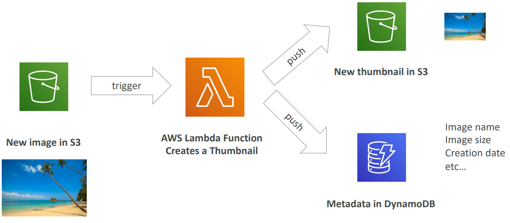

- Serverless CRON Job

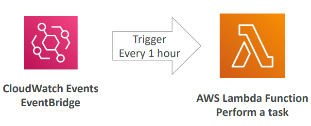

---

## Customization At The Edge

- Many modern applications execute some form of the logic **at the edge**

- `Edge Function`:
  - A code that you write and attach to `CloudFront` distributions
  - Runs close to your users to **minimize latency**
- `CloudFront` provides two types:

  - `CloudFront Functions`
  - `Lambda@Edge`

- **Benefits**:

  - Fully **serverless**
    - You **don’t** have to manage any **servers**
  - **deployed globally**
  - Pay only for what you use

- **Use case**:
  - Website **Security** and **Privacy**
  - **Dynamic** Web Application at the Edge
  - Search Engine Optimization (**SEO**)
  - Intelligently **Route Across** Origins and Data Centers
  - **Bot Mitigation** at the Edge
  - Real-time **Image Transformation**
  - A/B **Testing**
  - User **Authentication** and **Authorization**
  - User **Prioritization**
  - User **Tracking** and **Analytics**

---

### `CloudFront Functions`

- Features:

  - **Lightweight** functions written in `JavaScript`
  - For **high-scale**, **latency**-sensitive `CDN` customizations
  - **Sub-ms** startup times, **millions** of requests/second

- Native feature of `CloudFront` (manage **code entirely within** `CloudFront`)

- Used to **change** `Viewer` requests and responses:
  - `Viewer Request`: **after** CloudFront **receives a request** from a viewer
  - `Viewer Response`: **before** CloudFront **forwards** the response to the viewer

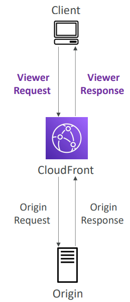

---

### `Lambda@Edge`

- Lambda functions written in `NodeJS` or `Python`
- **Scales** to **1000s** of requests/second

- **Author** your functions in one **AWS Region (us-east-1)**, then CloudFront **replicates** to its locations

- Used to **change** `CloudFront` requests and responses:

  - `Viewer Request`
    - **after** CloudFront **receives** a request from a viewer
  - `Origin Request`
    - **before** CloudFront **forwards** the request to the origin
  - `Origin Response`
    - **after** CloudFront **receives** the response from the origin
  - `Viewer Response`
    - **before** CloudFront **forwards** the response to the viewer

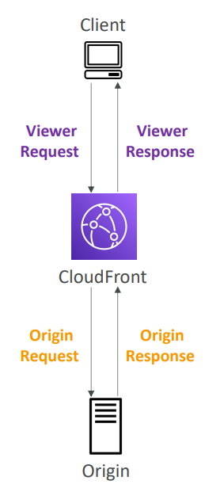

- Sample:
  - You have an application that is served globally using CloudFront Distribution. You want to **authenticate** users **at the CloudFront Edge Locations** instead of authentication requests go all the way to your origins. What should you use to satisfy this requirement?
  - Lambda@Edge is a feature of CloudFront that lets you run code closer to your users, which improves performance and reduces latency.

---

### `CloudFront Functions` vs. `Lambda@Edge`

|                                                   | CloudFront Functions                         | Lambda@Edge                                       |
| ------------------------------------------------- | -------------------------------------------- | ------------------------------------------------- |
| Runtime Support                                   | `JavaScript`                                 | `Node.js`, `Python`                               |
| # of Requests                                     | **Millions** of requests per second          | **Thousands** of requests per second              |
| CloudFront Triggers                               | Viewer Request/Response                      | Viewer Request/Response + Origin Request/Response |
| Max. Execution Time                               | < 1 ms                                       | 5 – 10 seconds                                    |
| Max. Memory                                       | 2 MB                                         | 128 MB up to 10 GB                                |
| Total Package Size                                | 10 KB                                        | 1 MB – 50 MB                                      |
| Network Access, File System Access                | No                                           | Yes                                               |
| Access to the Request Body                        | No                                           | Yes                                               |
| Pricing Free tier available, 1/6th price of @Edge | No free tier, charged per request & duration |

---

- **Use Cases**

  - `CloudFront Functions`

    - Cache **key normalization**
      - Transform **request attributes** (headers, cookies, query strings, URL) to create an optimal Cache Key
    - **Header** manipulation
      - Insert/modify/delete HTTP **headers** in the request or response
    - **URL** rewrites or redirects
    - Request **authentication** & **authorization**
      - Create and validate **user-generated token**s (e.g., JWT) to allow/deny requests

  - `Lambda@Edge`

    - **Longer execution time** (several ms)
    - **Adjustable** CPU or memory
    - Your code depends on a **3rd libraries** (e.g., AWS SDK to access other AWS services)
    - Network access to **use external services** for processing
    - **File system access** or access to the body of HTTP requests

---

## Lambda in VPC

- **By Default**

  - By default, your Lambda function is **launched outside** your own `VPC` (in an AWS-owned VPC)
  - Therefore, it **cannot access resources** in your VPC (RDS, ElastiCache, internal ELB…)

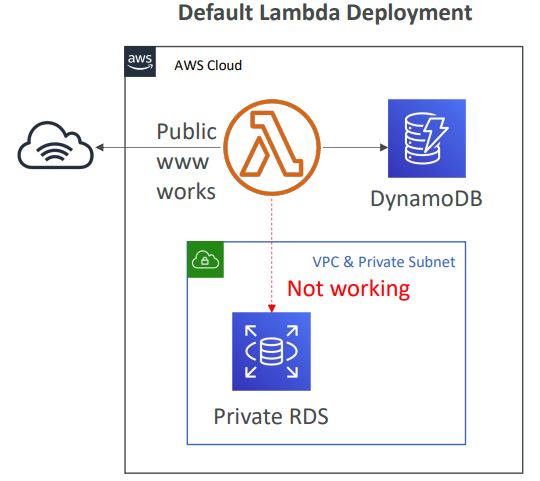

- **VPC**

  - You must **define**
    - the `VPC ID`,
    - the `Subnets`
    - the `Security Groups`

- `Lambda` will create an `ENI (Elastic Network Interface)` in your subnets

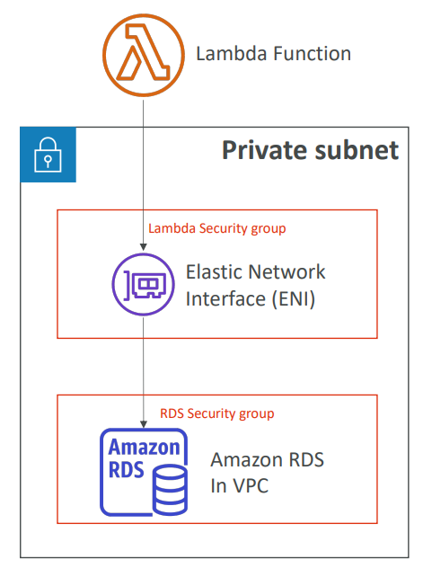

---

### Use Case: Lambda with RDS Proxy

- If Lambda functions **directly access** your database, they may open too many connections under **high load**

- `RDS Proxy` benefits:

  - Improve **scalability** by **pooling and sharing DB connections**
  - Improve **availability** by **reducing by 66% the failover time** and preserving connections
  - Improve **security** by enforcing `IAM authentication` and storing **credentials** in `Secrets Manager`

- The `Lambda function` **must** be deployed **in your VPC**, because `RDS Proxy` is **never publicly accessible**

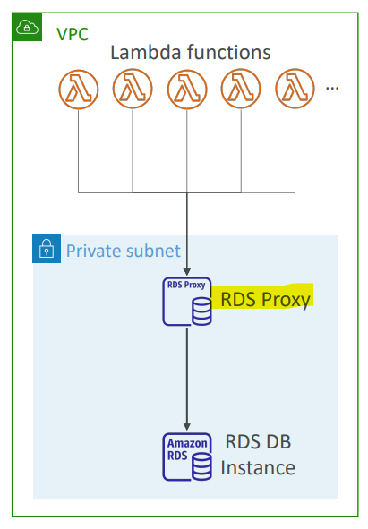

---

### Use Case: Invoking Lambda from RDS & Aurora

- Goal

  - **Invoke** `Lambda functions` from within your `DB instance`
  - Allows you to **process data events** from within a database

- Supported for `RDS` for `PostgreSQL` and `Aurora MySQL`

- Must:
  - Must **allow outbound traffic** to your `Lambda function` from within your DB instance (**Public**, **NAT GW**, **VPC Endpoints**)
  - DB instance must have the required **permissions** to invoke the `Lambda function` (Lambda Resource-based **Policy** & **IAM Policy**)

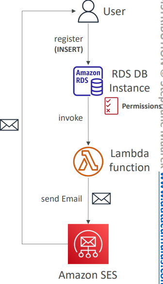

- Example:
  - new user signs up then recieve a welcome email.

---

#### vs `RDS Event Notifications`

- **Notifications** that tells information about the `DB instance` itself (created, stopped, start, …)只是关于数据库实例的信息
- You **don’t** have any information about the **data itself** 与数据本身无关.
- **Subscribe** to the following event categories:
  - DB instance,
  - DB snapshot,
  - DB Parameter Group,
  - DB Security Group,
  - RDS Proxy,
  - Custom Engine Version
- **Near real-time events** (up to 5 minutes)
- Send notifications to `SNS` or subscribe to events using `EventBridge`

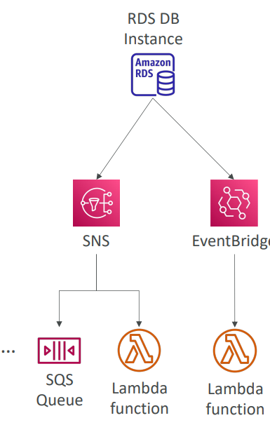

- 注意:
  - lambda 也涉及其中
  - 与 Invoke lambda 是两个方面的应用
    - Invoke 与数据有关, 需要 outbound 和 permission
    - notification 与数据库本身有关, 订阅即可.

---

## Hands-on

- Create Lambda Function

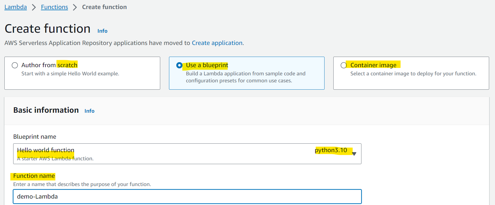

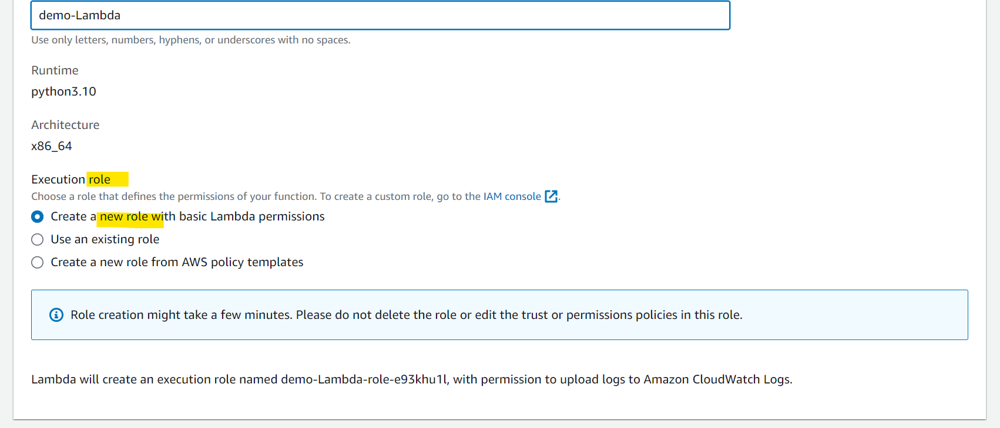

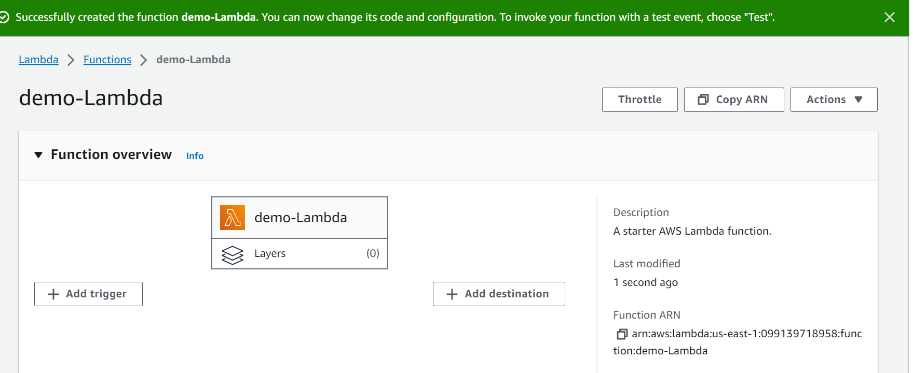

- Create an event

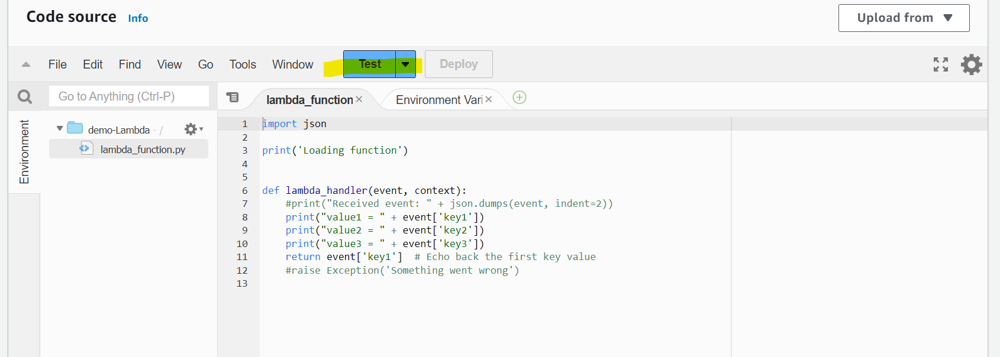

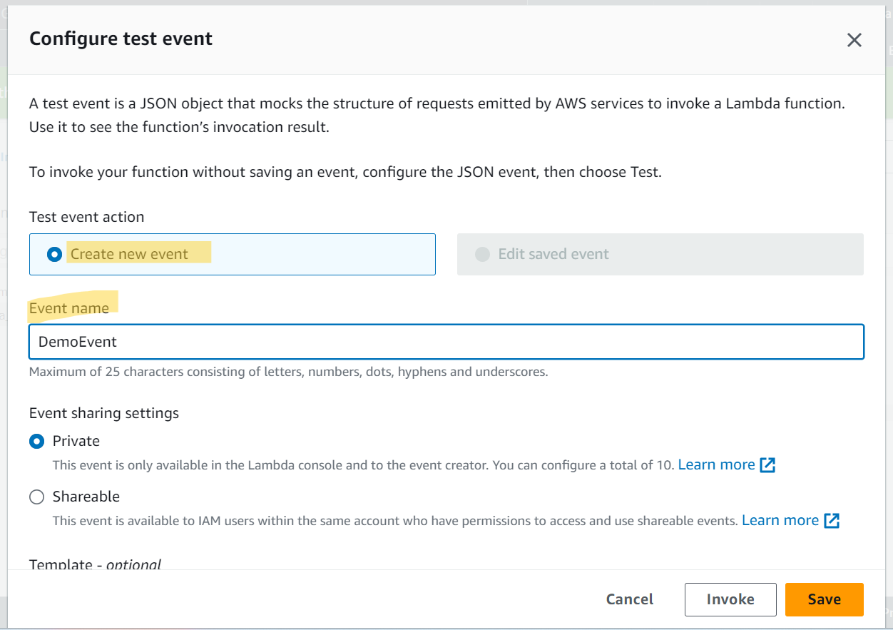

- Test

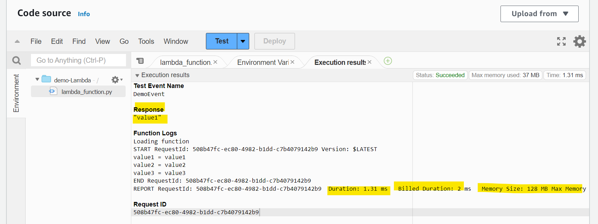

- Configuration

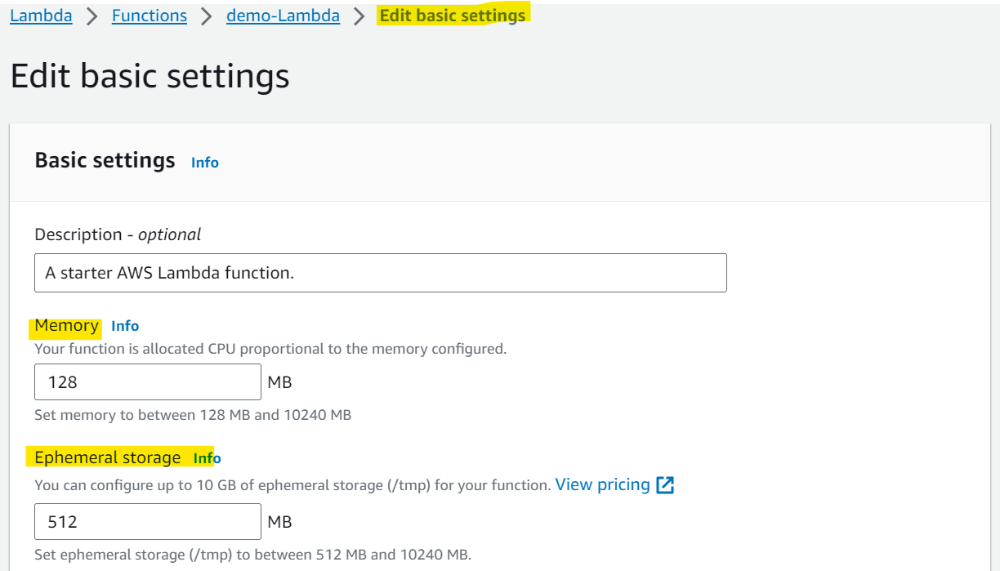

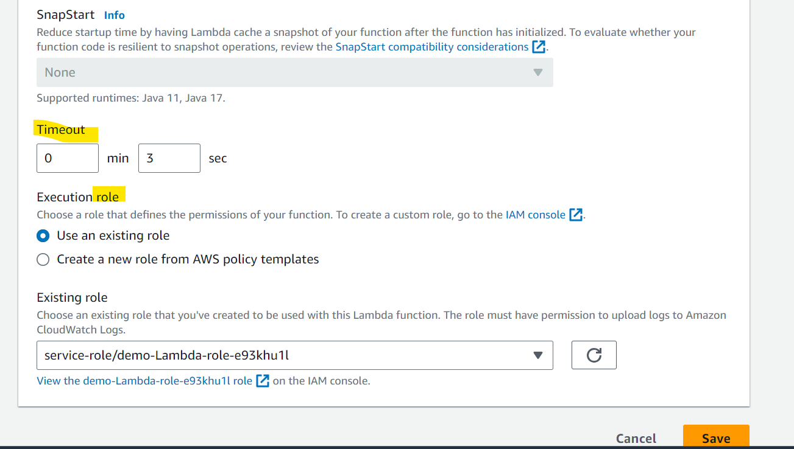

- Monitoring

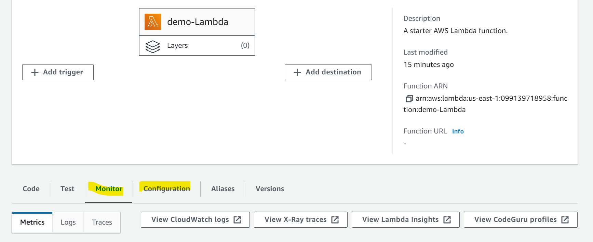

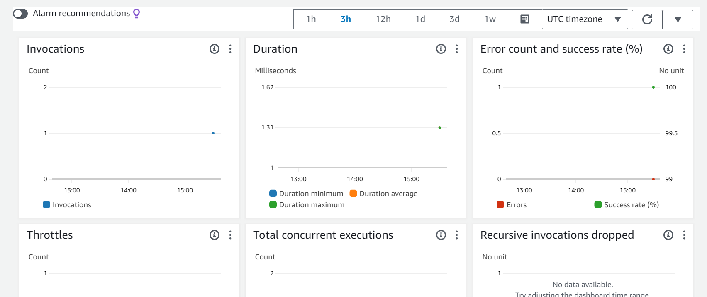

- Integrate with CloudWatch Log

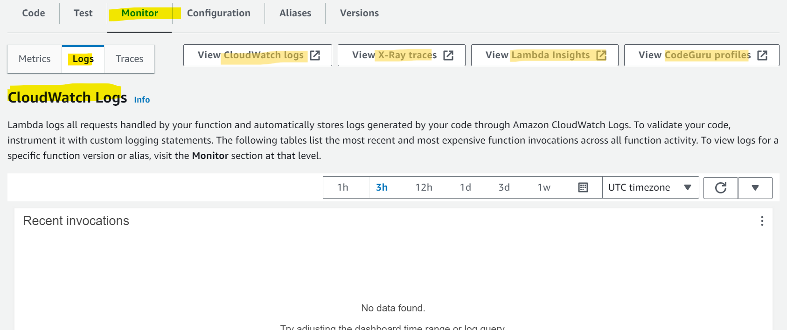

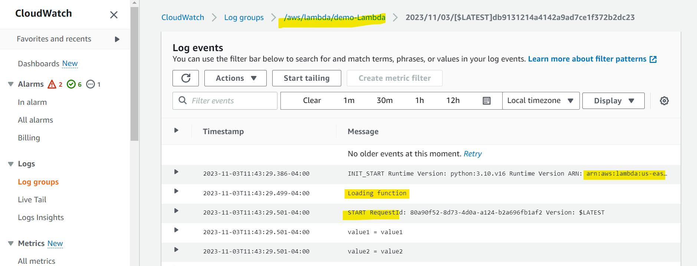

- Test for exception

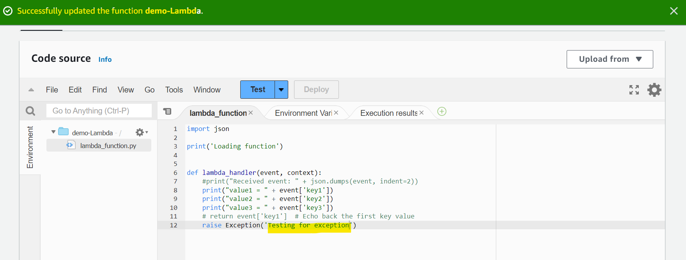

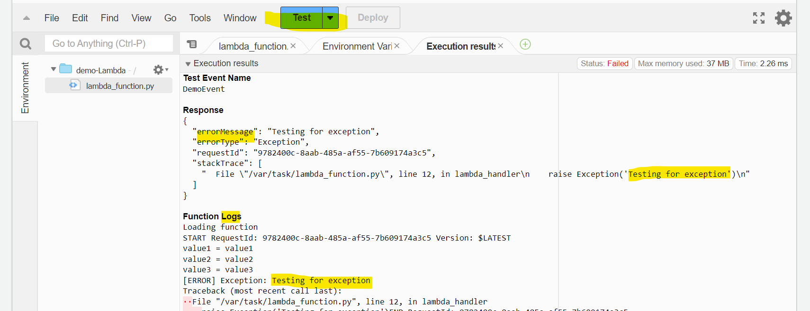

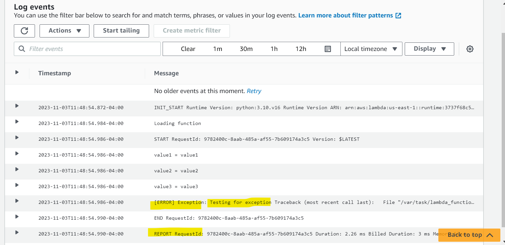

- advanced: function name

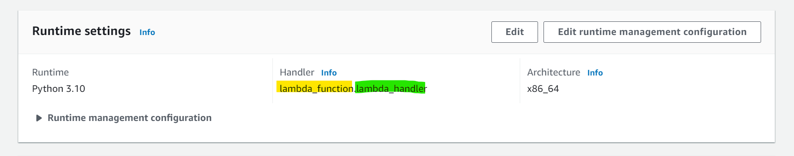

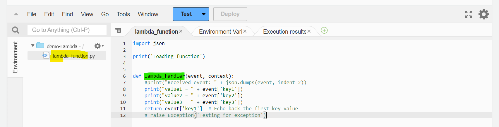

- advanced: permission

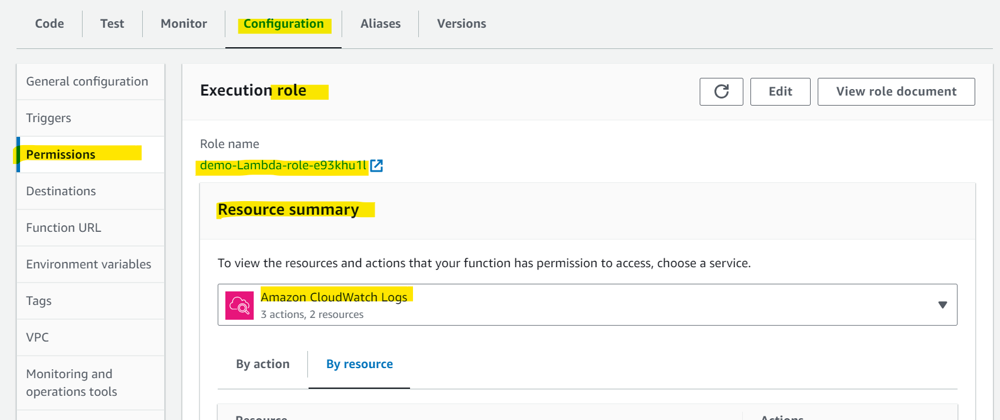

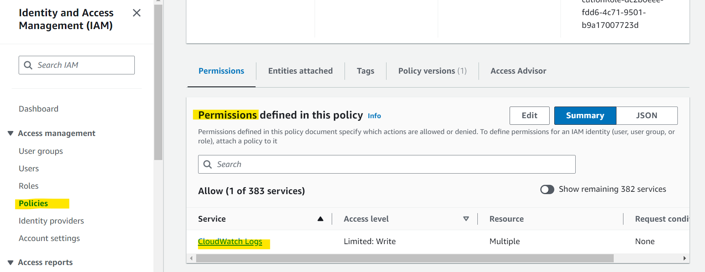

---

[TOP](#aws---lambda)
