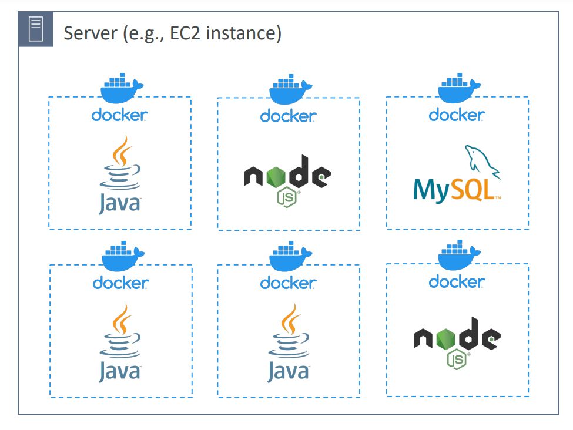
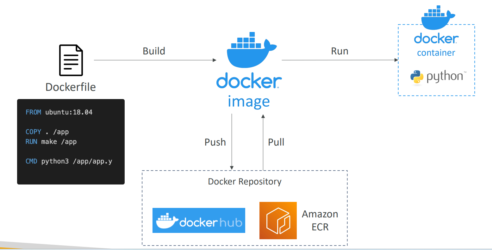
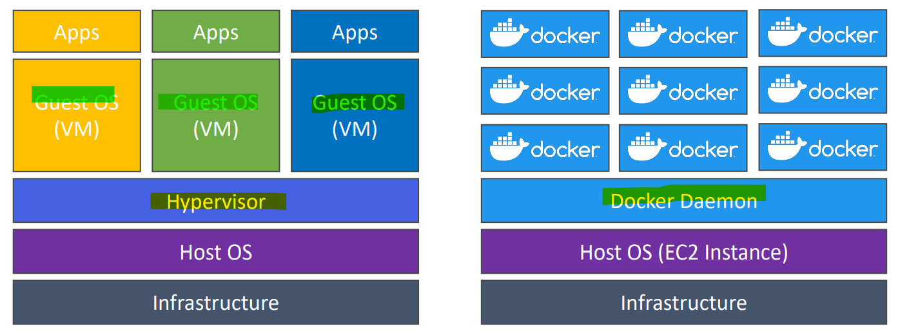
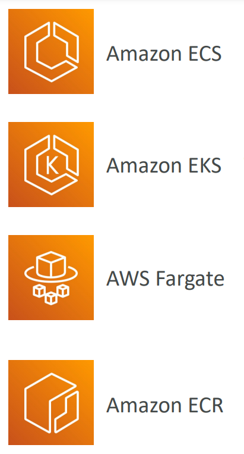

# AWS - Container

[Back](../index.md)

- [AWS - Container](#aws---container)
  - [Docker](#docker)
    - [Docker Repositories](#docker-repositories)
    - [Docker vs. Virtual Machines](#docker-vs-virtual-machines)
  - [Docker Containers Management on AWS](#docker-containers-management-on-aws)

---

## Docker

- `Docker`

  - a software development platform to deploy apps

- Apps are **packaged in containers** that can be **run on any OS**

  - Apps run the same, regardless of where they’re run
  - Any machine
  - No compatibility issues
  - Predictable behavior
  - Less work
  - Easier to maintain and deploy
  - Works with any language, any OS, any technology

- **Use cases**:
  - microservices architecture,
  - lift-and-shift apps from on-premises to the AWS cloud, …

---

### Docker Repositories

- `Docker images` are stored in `Docker Repositories`
- `Docker Hub` (https://hub.docker.com)

  - Public repository
  - Find base images for many technologies or OS (e.g., Ubuntu, MySQL, …)

- `Amazon ECR (Amazon Elastic Container Registry)`
  - Private repository
  - Public repository (Amazon ECR Public Gallery https://gallery.ecr.aws)

---

### Docker vs. Virtual Machines

- Docker is ”sort of” a virtualization technology, but not exactly
- **Resources** are **shared with the host** => many containers on one server

---

## Docker Containers Management on AWS

- `Amazon Elastic Container Service (Amazon ECS)`

  - Amazon’s own container platform

- `Amazon Elastic Kubernetes Service (Amazon EKS)`

  - Amazon’s managed Kubernetes (open source)

- `AWS Fargate`

  - Amazon’s own **Serverless** container platform
  - Works with `ECS` and with `EKS`

- `Amazon ECR`:
  - Store container **images**

---

[TOP](#aws---container)
