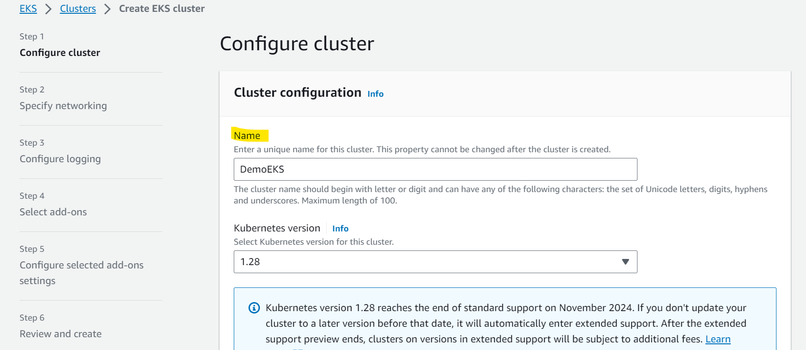

# AWS - EKS

[Back](../index.md)

- [AWS - EKS](#aws---eks)
  - [`Amazon EKS`](#amazon-eks)
  - [Node Types](#node-types)
  - [Data Volumes](#data-volumes)
  - [Hands-on](#hands-on)

---

## `Amazon EKS`

- `Kubernetes`

  - an open-source system for **automatic deployment**, scaling and management of **containerized (usually Docker) application**.
  - Kubernetes is **cloud-agnostic** (can be used in **any cloud** – Azure, GCP…)

- `Amazon EKS`

  - `Amazon Elastic Kubernetes Service`
  - a way to **launch managed `Kubernetes` clusters** on AWS
  - an alternative to ECS, similar goal but different API
  - **supports**
    - `EC2` if you want to deploy worker nodes
    - `Fargate` **to deploy serverless containers**

- For **multiple regions**, deploy one `EKS cluster` **per region**
- Collect logs and metrics using `CloudWatch Container Insights`

- **Use case**:

  - if your company is already using `Kubernetes` **on-premises** or in another cloud, and wants to **migrate to** AWS using Kubernetes

---

## Node Types

- **Managed Node Groups**

  - Creates and manages `Nodes` (`EC2 instances`) for you
  - Nodes are part of an `ASG` managed by `EKS`
  - Supports **On-Demand** or **Spot** Instances

- **Self-Managed Nodes**

  - Nodes **created** by you and **registered** to the EKS cluster and **managed by an ASG**
  - You can use prebuilt `AMI` - `Amazon EKS Optimized AMI`
  - Supports **On-Demand** or **Spot** Instances

- `AWS Fargate`

  - No maintenance required; no nodes managed

- Sample:
  - Amazon EKS supports the following node types, EXCEPT ………………..
  - Lambda.

---

## Data Volumes

- Need to specify `StorageClass` manifest on your EKS cluster
- Leverages a `Container Storage Interface (CSI)` compliant driver
- Support for…常考
  - Amazon `EBS`
  - Amazon `EFS` (only works with **Fargate**)
  - Amazon `FSx for Lustre`
  - Amazon `FSx for NetApp ONTAP`

---

## Hands-on

- Create role for EKS

- Create EKS Cluster

- Create Role for Node Group

- 2 Options:

  - Node group
  - Fargate

- Add node group

- Add storage

---

[TOP](#aws---eks)
