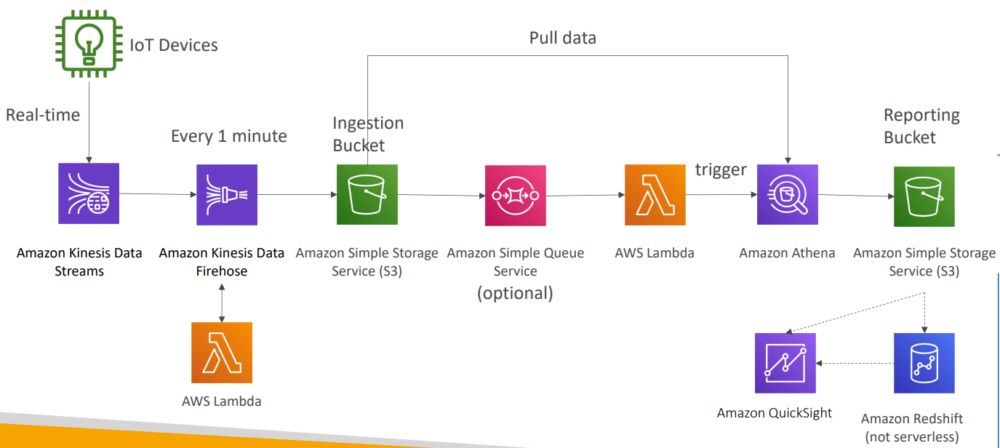

# AWS - Data & Analytics

[Back](../../index.md)

- [AWS - Data \& Analytics](#aws---data--analytics)
  - [Services](#services)
  - [Big Data Ingestion Pipeline](#big-data-ingestion-pipeline)

---

## Services

| Services         | Features                     |
| ---------------- | ---------------------------- |
| `Athena`         | SQL, `S3`                    |
| `Kinesis`        | real-time,SQL app, Flink app |
| `MSK`            | Kafka, = Kinesis             |
| `OpenSearch`     | Query                        |
| `EMR`            | MapReduce, Hadoop clusters   |
| `Glue`           | ELT                          |
| `Redshift`       | warehouse                    |
| `Lake Formation` | Data lake, access ctl        |
| `QuickSight`     | Dashboard                    |

- Sample:
  - You would like to have a database that is efficient at performing analytical queries on large sets of columnar data. You would like to connect to **this Data Warehouse** using a reporting and dashboard tool such as Amazon QuickSight. Which AWS technology do you recommend?
    - Redshift
  - You have a lot of log files stored in an **S3 bucket** that you want to perform a **quick analysis**, if possible Serverless, to filter the logs and find users that attempted to make an unauthorized action. Which AWS service allows you to do so?
    - Athena
  - You are running a gaming website that is using DynamoDB as its data store. Users have been asking for a **search feature** to find other gamers by name, with **partial matches** if possible. Which AWS technology do you recommend to implement this feature?
    - OpenSearch
  - An AWS service allows you to create, run, and monitor ETL (extract, transform, and load) jobs in a few clicks.
    - Glue
  - A company is using AWS to host its public websites and internal applications. Those different websites and applications generate a lot of logs and traces. There is a requirement to **centrally store those logs** and **efficiently search** and analyze those logs in real-time for detection of any errors and if there is a threat. Which AWS service can help them efficiently store and analyze logs?
    - OpenSearch
  - ……………………….. makes it easy and cost-effective for data engineers and analysts to **run applications built** using open source **big data frameworks** such as Apache Spark, Hive, or Presto without having to operate or manage clusters.
    - EMR
  - An e-commerce company has all its historical data such as orders, customers, revenues, and sales for the previous years hosted on a Redshift cluster. There is a requirement to generate some **dashboards and reports** indicating the revenues from the previous years and the total sales, so it will be easy to define the requirements for the next year. The DevOps team is assigned to find an AWS service that can help define those dashboards and have native integration with Redshift. Which AWS service is best suited?
    - QuickSight
  - Which AWS Glue feature allows you to save and **track** the data that has **already been processed** during a previous run of a Glue ETL job?
    - Job bookmark
  - You are a DevOps engineer in a machine learning company which 3 TB of JSON files stored in an S3 bucket. There’s a requirement to do some analytics on those files using Amazon Athena and you have been tasked to find a way to **convert** those files’ format from **JSON** to Apache **Parquet**. Which AWS service is best suited?
    - Glue
  - You have an on-premises application that is used together with an on-premises Apache Kafka to receive a stream of clickstream events from multiple websites. You have been tasked to migrate this application as soon as possible without any code changes. You decided to host the application on an EC2 instance. What is the best option you recommend to migrate Apache Kafka?
    - MSK
  - You have data stored in RDS, S3 buckets and you are using AWS Lake Formation as a data lake to collect, move and catalog data so you can do some analytics. You have a lot of big data and ML engineers in the company and you want to control access to part of the data as it might contain sensitive information. What can you use?
    - Access control
  - Which AWS service is most appropriate when you want to perform real-time analytics on streams of data?
    - Kinesis Data Analytics

---

## Big Data Ingestion Pipeline

- Concerns:

  - We want the ingestion pipeline to be fully **serverless**
  - We want to **collect** data in real time
  - We want to **transform** the data
  - We want to **query** the **transformed** data using SQL
  - The **reports** created using the queries should be in S3
  - We want to **load** that data into a warehouse and create **dashboards**

- Example:
  - IoT Core manage IoT devices data
  - collect, transform, and analyze these data.
  - Create a dashboard

- Solution:
  - `IoT Core` allows you to harvest data from IoT devices
  - `Kinesis` is great for real-time data **collection**
  - `Firehose` helps with data **delivery** to S3 in **near real-time** (1 minute)
  - `Lambda` can help Firehose with data **transformations**
  - Amazon `S3` can trigger **notifications** to `SQS`
  - `Lambda` can subscribe to `SQS` (we could have connecter S3 to Lambda)
  - `Athena` is a serverless **SQL service** and results are stored in S3
  - The reporting bucket contains analyzed data and can be used by
    reporting tool such as AWS `QuickSight`, `Redshift`, etc…

---

[TOP](#aws---data--analytics)
