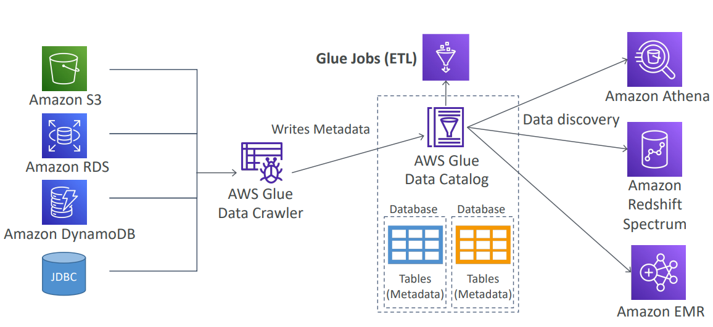
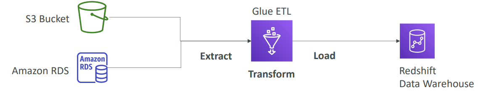
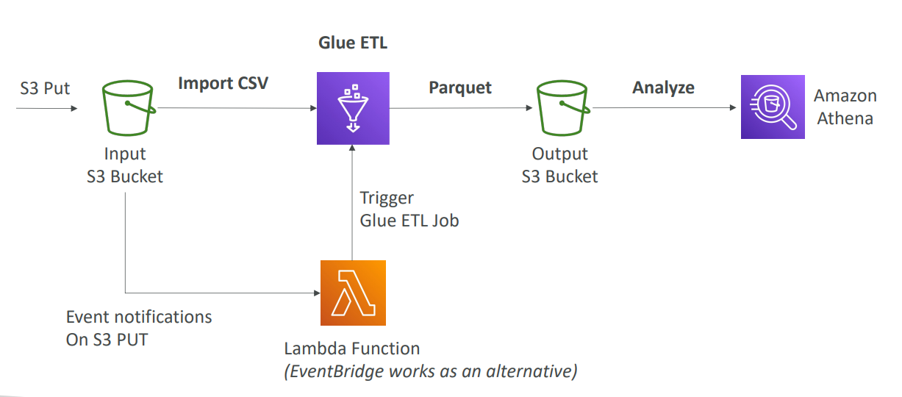

# AWS - Glue

[Back](../../index.md)

- [AWS - Glue](#aws---glue)
  - [AWS Glue](#aws-glue)
    - [Features](#features)
    - [`Glue Data Catalog`](#glue-data-catalog)
  - [Use Case:](#use-case)
    - [ETL](#etl)
    - [Convert data into Parquet format](#convert-data-into-parquet-format)

---

## AWS Glue

- `AWS Glue`

  - Managed `extract, transform, and load (ETL)` service

- Useful to prepare and transform data for analytics
- Fully serverless service

---

### Features

- `Glue Job Bookmarks`:
  - **prevent re-processing** old data in a new ETL job.
- `Glue Elastic Views`:
  - **Combine and replicate** data across multiple data stores using SQL
  - No custom code, Glue **monitors for changes** in the source data, **serverless**
  - Leverages a `“virtual table” (materialized view)`
- `Glue DataBrew`:
  - clean and **normalize** data using pre-built **transformation**
- `Glue Studio`:
  - new **GUI** to create, run and monitor `ETL jobs` in Glue
- `Glue Streaming ETL (built on Apache Spark Structured Streaming)`:
  - compatible with `Kinesis Data Streaming`, `Kafka`, `MSK (managed Kafka)`

---

### `Glue Data Catalog`

- `Glue Data Catalog`

  - a feature of glue to **catalog** datasets.
  - It will run `Glue Data Crawler`, which is connected to various data sources and writes all of the metadata into the `Glue Data Catalog`
  - will be leveraged by Glue jobs for ETL

- It is the central of many services, and used behind the scene like `Athena`, `Redshift`, `EMR`.

---

## Use Case:

### ETL

---

### Convert data into Parquet format

- **Parquet format**

  - a columar data format
  - a better form of data used in Athena.

- Convert CSV in the S3 into Parquet format, then using Athena to analyze.
  - For **existing** CSV, import, ELT, output to S3 Bucket.
  - For **new** CSV, put, trigger Lambda, trigger glue ETL job.

---

[TOP](#aws---glue)
