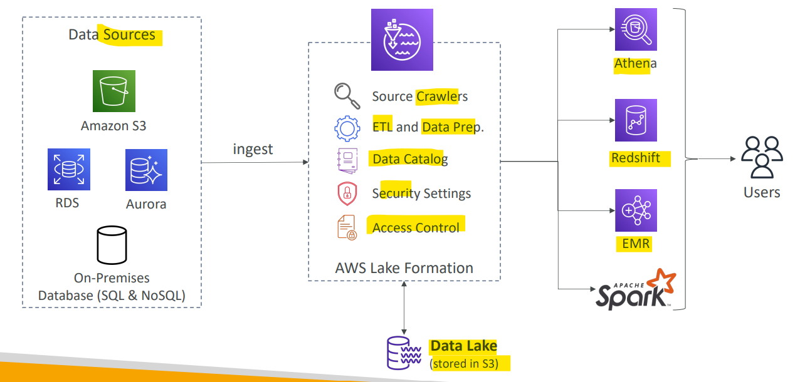
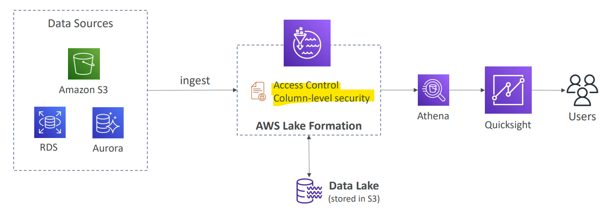

# AWS - Lake Formation

[Back](../../index.md)

- [AWS - Lake Formation](#aws---lake-formation)
  - [AWS Lake Formation](#aws-lake-formation)
    - [Example: Centralized Permissions](#example-centralized-permissions)

---

## AWS Lake Formation

- `Data lake`

  - **central place** to have all your data for **analytics purposes**

- `Lake Formation`

  - Built on top of `AWS Glue`
  - Fully managed service that makes it easy to setup a data lake in days
  - **Discover**, **cleanse**, **transform**, and **ingest** data into your Data Lake
  - It **automates** many complex manual steps (collecting, cleansing, moving, cataloging data, …) and **de-duplicate** (using **ML** Transforms)
  - Combine **structured** and **unstructured data** in the data lake

- **Out-of-the-box source blueprints**:

  - S3, RDS, Relational & NoSQL DB…

- Fine-grained **Access Control** for your applications (**row** and **column**-level)

---

### Example: Centralized Permissions

- Access control can be set in any aws services
  - A best practise is to setup in Lake Foramtion, providing a centralized access control.
  - The connected service can access the data under its permission defined in Lake Formation.

---

[TOP](#aws---lake-formation)
