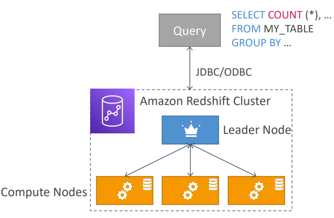
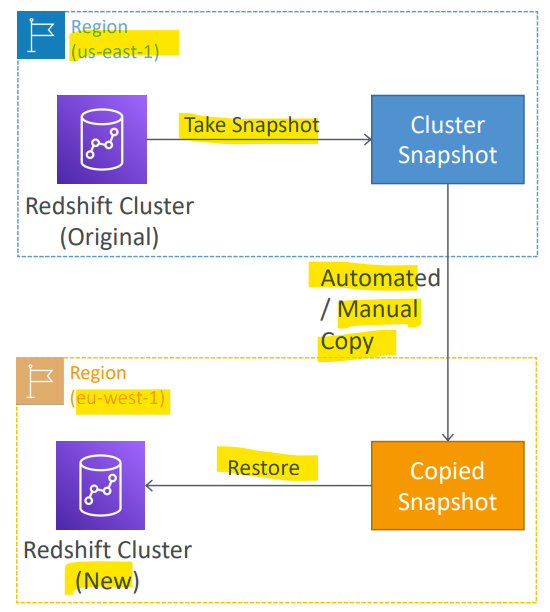
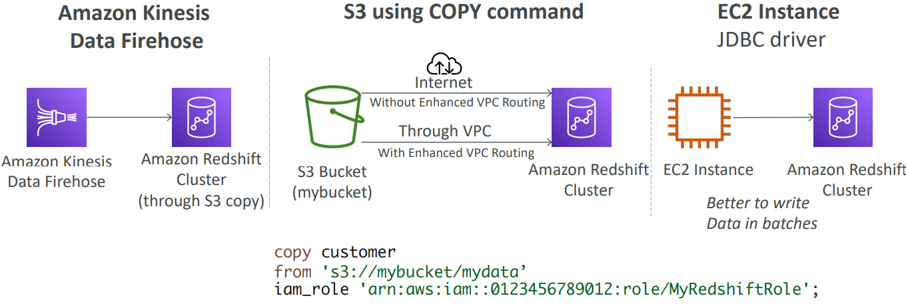
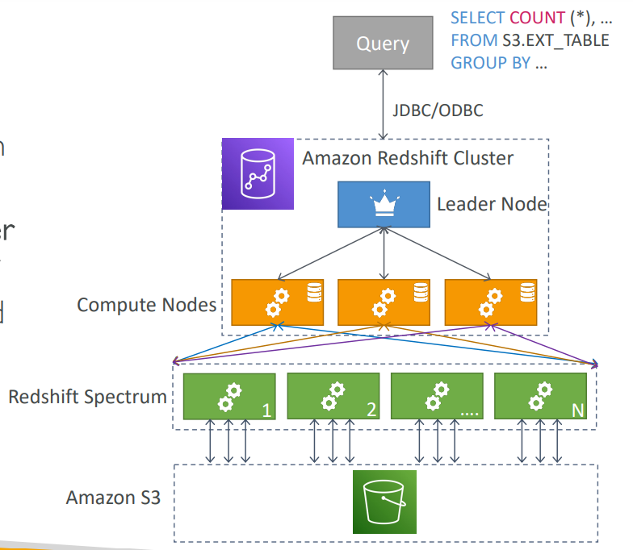

# AWS - Redshift

[Back](../../index.md)

- [AWS - Redshift](#aws---redshift)
  - [Redshift](#redshift)
    - [Redshift Cluster](#redshift-cluster)
    - [Snapshots \& Disaster Recovery](#snapshots--disaster-recovery)
    - [Loading data into Redshift](#loading-data-into-redshift)
    - [Redshift Spectrum](#redshift-spectrum)
    - [Enhanced VPC routing](#enhanced-vpc-routing)

---

## Redshift

- `Redshift`

  - It’s OLAP – `online analytical processing` (**analytics** and **data warehousing**), based on PostgreSQL

- features:

  - Has a **SQL interface** for performing the queries
  - **Columnar storage** of data (instead of row based) & **parallel query** engine
  - 10x better **performance** than other data warehouses, scale to **PBs** of data
  - **Pay as you go** based on the instances provisioned

- Integration:

  - BI tools such as `Amazon Quicksight` or `Tableau` integrate with it

- Redshift vs Athena:
  - `Athena`: ad hoc query on `S3`
  - `Redshift`: intensive data
    - **faster** queries / joins / aggregations thanks to **indexes**

---

### Redshift Cluster

- `Leader node`: for query **planning**, results **aggregation**
- `Compute node`: for performing the **queries**, **send results** to leader
- You **provision** the node size **in advance**
- You can used `Reserved Instances` for **cost** savings

---

### Snapshots & Disaster Recovery

- `Redshift` has **“Multi-AZ” mode** for some clusters

- **Snapshot**: Used for **Disater Recovery**

  - **Snapshots** are `point-in-time backups` of a cluster, stored internally in `S3`
  - Snapshots are **incremental** (only what has changed is saved)
  - You can **restore** a snapshot into a **new cluster**

- 2 modes to create snapshot:

  - **Automated**:
    - every 8 hours, every 5 GB, or on a schedule. Set retention between `1` to` 35` days
  - **Manual**:
    - snapshot is retained **until you delete** it

- Copy snapshot for DR
  - You can configure Amazon Redshift to automatically **copy snapshots** (**automated or manual**) of a cluster **to another AWS Region**

- Sample:
  - As a Solutions Architect, you have been instructed you to prepare a disaster recovery plan for a Redshift cluster. What should you do?
    - Auto snapshot, auto copy to another region

---

### Loading data into Redshift

- Large inserts are MUCH better

- 3 Ways to load data
  - Kinesis firehose collect data to S3, S3 copy command
  - S3 copy command
  - JDBC diver

---

### Redshift Spectrum

- `Redshift Spectrum`

  - a feature of Redshift
  - used to analyze data in S3 without loading data into Redshit

- Query data that is already in S3 without loading it
- **Must** have a **Redshift cluster available** to start the query
- The query is then submitted to thousands of `Redshift Spectrum nodes`

---

### Enhanced VPC routing

- When you use Amazon Redshift `enhanced VPC routing`, Amazon Redshift **forces** all `COPY` and `UNLOAD` **traffic** between your _cluster_ and your _data repositories_ through your `virtual private cloud (VPC)` based on the Amazon VPC service.

- Sample:
  - Which feature in Redshift forces all COPY and UNLOAD traffic moving between your cluster and data repositories through your VPCs?
    - Enhanced VPC routing

---

[TOP](#aws---redshift)
