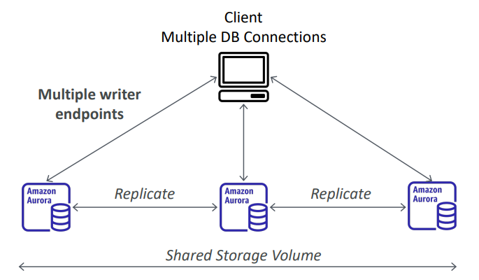

# AWS RDS - Aurora

[Back](../../index.md)

- [AWS RDS - Aurora](#aws-rds---aurora)
  - [`Aurora`](#aurora)
    - [Features](#features)
    - [High Availability and Read Scaling](#high-availability-and-read-scaling)
    - [Cluster](#cluster)
    - [`Aurora Replica`](#aurora-replica)
      - [Auto Scaling](#auto-scaling)
      - [Custom Endpoints](#custom-endpoints)
    - [Backups](#backups)
    - [Restore options](#restore-options)
    - [Hands-on](#hands-on)
  - [`Aurora Serverless`](#aurora-serverless)
  - [`Aurora Multi-Master`](#aurora-multi-master)
  - [`Global Aurora` (Cross Region)](#global-aurora-cross-region)
  - [`Aurora Machine Learning`](#aurora-machine-learning)
  - [`Aurora Database Cloning`](#aurora-database-cloning)

---

## `Aurora`

- Aurora is a proprietary technology from AWS (not open sourced)
- `Postgres` and `MySQL` are both **supported** as Aurora DB (that means your drivers will work as if Aurora was a Postgres or MySQL database)
- Aurora is **“AWS cloud optimized”** and claims **5x performance improvement** over MySQL on RDS, over **3x the performance** of Postgres on RDS
- Aurora **storage automatically grows** in increments of **10GB**, up to **128 TB**.
- Aurora can have up to **15 replicas** and the replication process is faster than MySQL (sub 10 ms replica lag)
- **Failover** in Aurora is instantaneous. (faster than failover from multi-AZ on MySQL RDS.)
  - It’s HA (High Availability) native.
- Aurora **costs more** than RDS (20% more) – but is more efficient

---

### Features

- Automatic **fail-over**
- **Backup** and **Recovery**
- **Isolation** and **security**
- Industry **compliance**
- Push-button **scaling**
- Automated **Patching** with **Zero Downtime**
- Advanced **Monitoring**
- Routine **Maintenance**
- Backtrack: restore data **at any point of time** _without using backups_

---

### High Availability and Read Scaling

- **6 copies** of your data across 3 AZ: (highly available)
  - 4 copies out of 6 needed for writes
  - 3 copies out of 6 need for reads
  - **Self healing** with peer-to-peer replication
  - **Storage is striped** across 100s of volumes (backend, managed by AWS, reduce sisk)
- **One** Aurora Instance takes **writes** (**master**)
- Automated **failover** for master in **less than 30 seconds** (instantaneous)
- Master + up to **15 Aurora Read Replicas** serve reads (this Read Replicas can become master, different from RDS Replica)
- Support for **Cross Region** Replication

---

### Cluster

- One Writer Endpoint (DNS name)

  - automatically point to master even if it failovers.

- One Reader Endpoint
  - load balancing
  - connects automatically to all replicas
  - on the connection level, not statement level.

---

### `Aurora Replica`

#### Auto Scaling

- When cpu usages create.

---

#### Custom Endpoints

- Define a **subset** of Aurora Instances **as a Custom Endpoint**

  - Example: Run analytical queries **on specific replicas**

- The Reader Endpoint is generally **not used** after defining Custom Endpoints

- Can set up multiple custom endpoints for different workload.

---

### Backups

- **Automated backups**

  - 1 to 35 days (**cannot be disabled**)
  - `point-in-time recovery` in that timeframe

- **Manual DB Snapshots**
  - Manually triggered by the user
  - **Retention** of backup for **as long as you want**

---

### Restore options

- Restoring a Aurora **backup** or a **snapshot** creates a new database

- Restoring MySQL Aurora cluster from S3

  - Create a **backup** of your on-premises database using **Percona XtraBackup**
  - **Store** the backup file on Amazon **S3**
  - **Restore** the backup file onto a new Aurora cluster running MySQ

- Restoring MySQL RDS database from S3
- Create a backup of your on-premises database
- Store it on Amazon S3 (object storage)
- Restore the backup file onto a new RDS instance running MySQL

---

### Hands-on

---

## `Aurora Serverless`

- **Automated** database instantiation and **auto scaling** based on actual usage
- Good for **infrequent**, **intermittent** or **unpredictable** workloads
- No capacity planning needed
- **Pay per second**, can be more cost-effective

---

## `Aurora Multi-Master`

- In case you want **continuous write** availability for the writer nodes

- Multi-Master vs Normal Aurora cluster

  - Multi-Master:

    - **Each** node does R/W
    - If one failover, client can write to other node.

  - Normal Aurora Cluster:
    - If the master failover, a Read Replica will be promoted as the new master.

---

## `Global Aurora` (Cross Region)

- Aurora `Cross Region Read Replicas`:
  - Useful for **disaster recovery**
  - Simple to put in place
- Aurora `Global Database` (recommended):
  - **1 Primary Region** (read / write)
  - Up to **5 secondary (read-only)** regions, replication lag is **less than 1 second**
  - Up to **16** Read Replicas **per secondary region**
  - Helps for decreasing **latency**
  - **Promoting another region** (for disaster recovery) has an RTO of **< 1 minute**
  - Typical cross-region replication takes **less than 1 second**

---

## `Aurora Machine Learning`

- Enables you to add ML-based predictions to your applications **via SQL**
- Simple, optimized, and secure integration between `Aurora` and `AWS ML services`
- Supported services
  - Amazon `SageMaker` (use with any ML model)
  - Amazon `Comprehend` (for sentiment analysis)
- You don’t need to have ML experience
- Use cases:
  - fraud detection
  - ads targeting
  - sentiment analysis
  - product recommendations

---

## `Aurora Database Cloning`

- Create a new Aurora DB Cluster **from an existing one**
- **Faster than snapshot & restore**
- Uses **copy-on-write protocol**
  - Initially, the new DB cluster **uses the same data volume** as the original DB cluster (fast and efficient–no copying is needed)
  - When updates are made to the new DB cluster data, then **additional** storage is allocated and data is copied to be **separated**
- Very **fast** & **cost-effective**
- Useful to create a “staging” database from a “production” database **without impacting the production database**

---

[TOP](#aws-rds---aurora)
