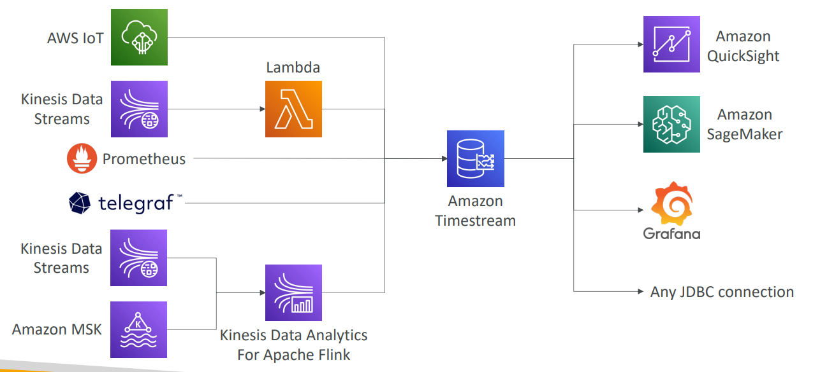

# AWS - Database Service

[Back](../index.md)

- [AWS - Database Service](#aws---database-service)
  - [Choosing the Right Database](#choosing-the-right-database)
  - [Database Types](#database-types)
  - [Summary](#summary)
    - [Amazon S3](#amazon-s3)
    - [Amazon RDS](#amazon-rds)
    - [Amazon Aurora](#amazon-aurora)
    - [Amazon ElastiCache](#amazon-elasticache)
    - [Amazon DynamoDB 常考](#amazon-dynamodb-常考)
    - [DocumentDB](#documentdb)
    - [Amazon Keyspaces (for `Apache Cassandra`)](#amazon-keyspaces-for-apache-cassandra)
    - [Amazon Neptune](#amazon-neptune)
    - [Amazon QLDB](#amazon-qldb)
    - [Amazon Timestream](#amazon-timestream)

---

## Choosing the Right Database

- We have a lot of **managed databases** on AWS to choose from
- Questions to choose the right database based on your architecture:
  - Read-heavy, write-heavy, or balanced **workload**? **Throughput** needs? Will it change, does it need to **scale or fluctuate** during the day?
  - How much data to store and for how long? Will it **grow**? Average object **size**? How are they accessed?
  - Data **durability**? **Source of truth** for the data ?
  - **Latency** requirements? **Concurrent** users?
  - Data **model**? How will you **query** the data? Joins? **Structured**? **Semi**-Structured?
  - Strong schema? More flexibility? Reporting? Search? **RDBMS / NoSQL**?
  - License **costs**? Switch to Cloud Native DB such as Aurora?

---

## Database Types

- **RDBMS (= SQL / OLTP)**: – great for **joins**

  - `RDS`
  - `Aurora`

- **NoSQL** database – **no joins**, **no SQL** :

  - `DynamoDB` (~JSON),
  - `ElastiCache` (key / value pairs),
  - `Neptune` (graphs),
  - `DocumentDB` (for MongoDB),
  - `Keyspaces` (for Apache Cassandra)

- **Object Store**:

  - `S3` (for big objects)
  - `Glacier` (for backups / archives)

- **Data Warehouse** (= SQL Analytics / BI):

  - `Redshift` (OLAP),
  - `Athena`,
  - `EMR`

- **Search**:

  - `OpenSearch` (JSON) – free text, unstructured searches

- **Graphs**:

  - `Amazon Neptune` – displays relationships between data

- **Ledger**:

  - `Amazon Quantum Ledger Database`

- **Time series**:

  - `Amazon Timestream`

- Note: some databases are being discussed in the Data & Analytics section

---

## Summary

|             | Laug      | K-V | File size |
| ----------- | --------- | --- | --------- |
| S3          |           | Y   | Big       |
| RDS         | SQL       |     |           |
| Aurora      | SQL       |     |           |
| ElastiCache |           | Y   |           |
| DynamoDB    | NoSQL     | Y   | Small     |
| DocumentDB  | NoSQL     | Y   |           |
| Keyspace    | NoSQL/CQL | Y   |           |
| Neptune     |           |     |           |
| QLDB        |           |     |           |
| Timestream  |           |     |           |

### Amazon S3

- Usage:

  - S3 is a… `key / value` store for objects

- Feature:

  - Great for **bigger objects**, **not so great** for many **small** objects
  - **Serverless**, scales **infinitely**, max object size is **5 TB**, versioning capability
  - Tiers:
    - S3 Standard, S3 Infrequent Access, S3 Intelligent, S3 Glacier + lifecycle policy
  - **Versioning, Encryption, Replication, MFA-Delete, Access Logs…**
  - **Batch** operations on objects using `S3 Batch`, listing files using `S3 Inventory`
  - Performance:
    - **Multi-part upload**, `S3 Transfer Acceleration`, `S3 Select`
  - Automation:
    - `S3 Event Notifications` (`SNS`, `SQS`, `Lambda`, `EventBridge`)

- Security:

  - `IAM`, `Bucket Policies`, `ACL`, **Access Points**, Object `Lambda`, `CORS`, `Object/Vault Lock`
  - Encryption:
    - SSE-S3, SSE-KMS, SSE-C, client-side, TLS in transit, default encryption

- **Use Cases**:
  - **static** files,
  - key value store for big files,
  - **website hosting**

---

### Amazon RDS

- Usage:

  - **Managed** `PostgreSQL` / `MySQL` / `Oracle` / `SQL Server` / `MariaDB` / **Custom**

- Features:

  - **Auto-scaling** capability for Storage
  - Provisioned **RDS Instance Size** and **EBS Volume Type & Size**
  - Support for `Read Replicas` and **Multi AZ**
  - `RDS Custom` for **access** to and customize the underlying **instance** (Oracle & SQL Server)

- Security

  - Security through `IAM`, `Security Groups`, `KMS` , `SSL` in transit
  - Support for `IAM Authentication`, integration with `Secrets Manager`

- Backup and maintenance

  - Automated Backup with `Point in time restore` feature (up to `35` days)
  - **Manual** DB **Snapshot** for longer-term recovery
  - Managed and **Scheduled maintenance** (with **downtime**)

- **Use case**:
  - Store relational datasets (RDBMS / OLTP),
  - perform SQL queries,
  - transactions

---

### Amazon Aurora

- Usage:

  - Compatible **API** for `PostgreSQL` / `MySQL`, separation of storage and compute

- Features:

  - **Storage**:
    - data is stored in `6` **replicas**, across `3` **AZ** – highly available, self-healing, **auto-scaling**
  - **Compute**:
    - Cluster of **DB Instance** across **multiple AZ**, auto-scaling of `Read Replicas`
  - **Cluster**:
    - Custom endpoints for **writer and reader** DB instances
  - `Aurora Serverless` – for **unpredictable** / intermittent workloads, no capacity planning
  - `Aurora Multi-Master` – for **continuous writes** failover (high **write availability**)
  - `Aurora Global`: up to `16` **DB Read Instances** in each region, < 1 second **storage replication**
  - `Aurora Machine Learning`: perform **ML** using `SageMaker` & `Comprehend` on Aurora
  - `Aurora Database Cloning`: **new cluster** from existing one, **faster than** restoring a **snapshot**

- Security

  - Same security / monitoring / maintenance features as RDS

- Backup and maintenance

  - Know the backup & restore options for Aurora

- **Use case**:
  - same as RDS, but with **less maintenance / more flexibility / more performance / more features**

---

### Amazon ElastiCache

- Usage

  - Managed `Redis` / `Memcached` (similar offering as RDS, but for caches)

- Featurea

  - **In-memory** data store, sub-millisecond latency
  - Select an `ElastiCache instance` type (e.g., cache.m6g.large)
  - Support for `Clustering (Redis)` and **Multi AZ**, `Read Replicas` (sharding)
  - **Requires some application code changes** to be leveraged(常考, 需要修改代码)

- Security

  - Security through `IAM`, `Security Groups`, `KMS`, `Redis Auth`

- Backup

  - Backup / Snapshot / `Point in time restore` feature
  - Managed and Scheduled maintenance

- Use Case:
  - `Key/Value` store,
  - **Frequent** reads, less writes,
  - cache results for DB **queries**,
  - store **session** data for websites,
  - **cannot** use **SQL**.

---

### Amazon DynamoDB 常考

- Usage

  - AWS proprietary technology, **managed** serverless `NoSQL` database, millisecond latency

- Features:

  - **Capacity modes**:
    - **provisioned** capacity with optional auto-scaling
    - **on-demand** capacity
  - Can replace `ElastiCache` as a `key/value` store (storing session data for example, using **TTL feature**)等价于 ElastiCache
  - Highly Available, **Multi AZ** by default, **Read and Writes are decoupled**, **transaction** capability
  - `DAX` cluster for **read cache**, microsecond **read latency**
  - Event Processing:
    - `DynamoDB Streams` to integrate with AWS Lambda, or `Kinesis Data Streams`
  - `Global Table` feature: active-active setup
  - **Export to S3** without using `RCU` within the `PITR` window, **import from S3** without using `WCU`
  - Great to **rapidly evolve schemas**

- Backups

  - Automated backups up to 35 days with `PITR` (restore to new table)
  - on-demand backups

- Security

  - Security, authentication and authorization is done through IAM

- **Use Case**:
  - **Serverless applications development** (**small** documents 100s KB),
  - distributed **serverless cache**

---

### DocumentDB

- Usage:

  - Aurora is an “AWS-implementation” of PostgreSQL / MySQL …
  - `DocumentDB` is the same for `MongoDB` (which is a `NoSQL` database)
  - `MongoDB` is used to store, query, and index `JSON` data

- Features
  - Similar “deployment concepts” as Aurora
    - **Fully Managed**, highly **available** with **replication** across `3` AZ
  - DocumentDB storage automatically grows in **increments** of `10GB`, up to `64 TB`.
  - Automatically scales to workloads with **millions of requests** per seconds

---

### Amazon Keyspaces (for `Apache Cassandra`)

- Usage:

  - `Apache Cassandra` is an open-source `NoSQL` **distributed** database
  - A **managed** Apache Cassandra-compatible database service

- Features:

  - **Serverless**, Scalable, highly available, fully managed by AWS
  - Automatically **scale** tables up/down based on the application’s traffic
  - Tables are **replicated** `3` times across **multiple AZ**
  - Using the `Cassandra Query Language (CQL)`
  - **Single-digit millisecond latency** at any scale, 1000s of requests per second
  - Capacity:
    - On-demand mode
    - provisioned mode with auto-scaling

- Security and backup:

  - Encryption, backup, P`oint-In-Time Recovery (PITR)` up to 35 days

- **Use cases**:
  - store **IoT devices info**,
  - time-series data, …

---

### Amazon Neptune

- Usage

  - Fully managed **graph database**
  - A popular `graph dataset` would be a social network
    - Users have friends
    - Posts have comments
    - Comments have likes from users
    - Users share and like posts…

- Features

  - Highly available across `3` AZ, with up to `15` read replicas
  - Build and run applications working with highly connected datasets - optimized for these complex and hard queries
  - Can store up to **billions** of relations and **query the graph** with **milliseconds latency**
  - Highly available with replications across **multiple AZs**

- **Usa Case**:
  - knowledge graphs (Wikipedia),
  - fraud detection,
  - recommendation engines,
  - social networking

---

### Amazon QLDB

- Usage:

  - `QLDB` stands for ”`Quantum Ledger Database`”
  - A `ledger` is a **book recording financial transactions**

- Features:
  - Fully **Managed**, **Serverless**, High available, **Replication** across **3 AZ**
  - Used to review **history of all the changes** made to your application data over time
  - **Immutable system**:
    - **no** entry can be **removed** or **modified**, **cryptographically** verifiable
  - 2-3x better performance than common **ledger blockchain frameworks**, manipulate data using `SQL`
  - Difference with `Amazon Managed Blockchain`:
    - **no decentralization component**, in accordance with financial **regulation** rules

---

### Amazon Timestream

- Usage:

  - Fully managed, fast, scalable, serverless **time series database**

- Features:

  - Automatically **scales** up/down to adjust capacity
  - Store and analyze **trillions** of events per day
  - 1000s times **faster** & 1/10th the **cost** of relational databases
  - Scheduled queries, multi-measure records, `SQL` compatibility
  - Data storage tiering:
    - **recent data** kept in **memory**
    - **historical data** kept in a cost-optimized **storage**
  - Built -in time series **analytics functions** (helps you identify patterns in your data in **near real-time**)

- Security:

  - Encryption in transit and at rest

- **Use cases**:
  - IoT apps,
  - operational applications,
  - **real-time analytics**, …

- Sample:
  - A startup is working on developing a new project to reduce forest fires due to climate change. The startup is developing sensors that will be spread across the entire forest to make some readings such as temperature, humidity, and pressures which will help detect the forest fires before it happens. They are going to have thousands of sensors that are going to store a lot of readings each second. There is a requirement to store those readings and do **fast analytics so they can predict** if there is a fire. Which AWS service can they use to store those readings?
    - Timestream
    - Iot, real-time analytics

---

[TOP](#aws---database-service)
