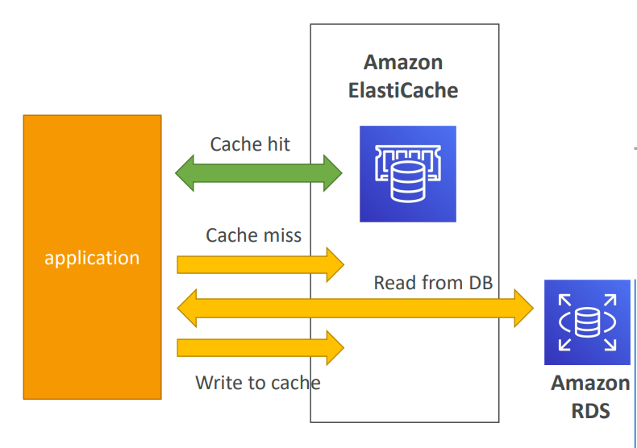
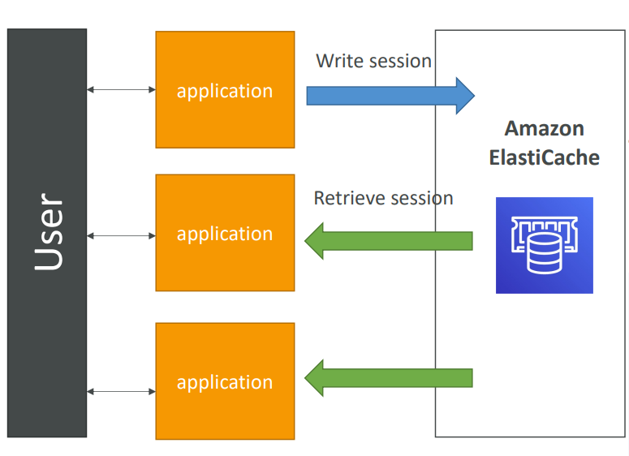
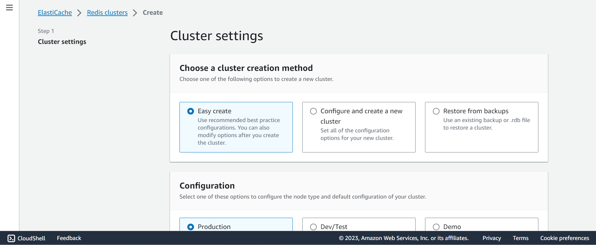
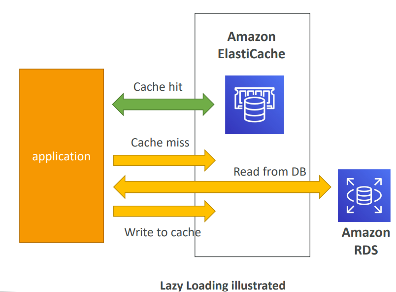
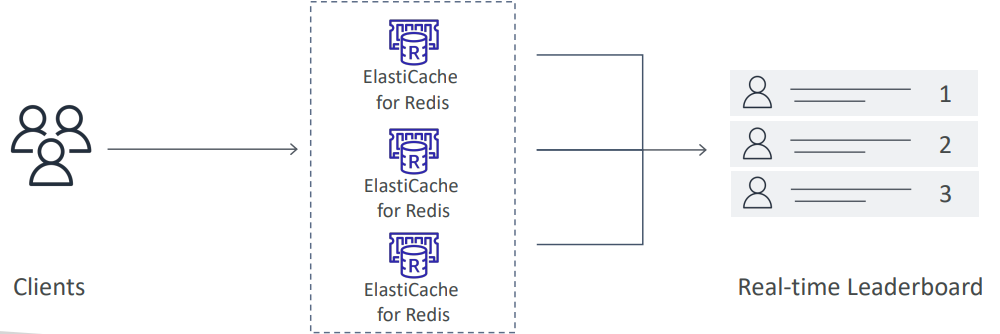

# AWS - ElastiCache

[Back](../../index.md)

- [AWS - ElastiCache](#aws---elasticache)
  - [Amazon ElastiCache](#amazon-elasticache)
    - [Solution Architecture](#solution-architecture)
    - [Redis vs Memcached](#redis-vs-memcached)
    - [Hands-on](#hands-on)
  - [Cache Security](#cache-security)
  - [Patterns for ElastiCache](#patterns-for-elasticache)
  - [Redis Use Case](#redis-use-case)

---

## Amazon ElastiCache

- The same way RDS is to get **managed Relational Databases**…
- `ElastiCache` is to get managed **Redis** or **Memcached**
- Caches are **in-memory databases** with really high performance, low latency
- Helps **reduce load off** of databases for read intensive workloads
- Helps make your application **stateless**
- AWS takes care of OS maintenance / patching, optimizations, setup, configuration, monitoring, failure recovery and backups
- Using `ElastiCache` involves **heavy application code changes**

---

### Solution Architecture

- **DB Cache**
  - Applications **queries** `ElastiCache`, if not available, **get** from `RDS` and **store** in `ElastiCache`.
  - Helps **relieve load in RDS**
  - Cache must have an **invalidation strategy** to make sure only the **most current data** is used in there.

- **User Session Store**

  - User logs into any of the application
  - The application **writes the session data into ElastiCache**
  - The user hits another instance of our application
  - The instance retrieves the data and the user is already logged in

---

### Redis vs Memcached

---

### Hands-on

---

## Cache Security

- `ElastiCache` supports `IAM Authentication` for **Redis**
- **IAM policies** on ElastiCache are only used for **AWS API-level security**

- **Redis AUTH**

  - You can set a “**password/token**” when you create a Redis cluster
  - This is an extra level of security for your cache (on top of security groups)
  - Support SSL **in flight encryption**

- **Memcached**
  - Supports **SASL-based authentication** (advanced)

---

## Patterns for ElastiCache

- **Lazy Loading**:

  - **all the read data** is cached, data can become stale in cache

- **Write Through**:
  - Adds or update data in the cache when **written to a DB** (no stale data)
- **Session Store**:
  - store **temporary session data** in a cache (using TTL features)
  - **Storing Session Data** in ElastiCache is a common pattern to ensuring different EC2 instances can **retrieve your user's state** if needed.
- **Quote**:
  - There are only two hard things in Computer Science: **cache invalidation** and **naming** things

---

## Redis Use Case

- Gaming Leaderboards are computationally complex.
- **Redis Sorted sets** guarantee both _uniqueness_ and element _ordering_.
- Each time a new element added, it’s ranked in real time, then added in correct **order**.

---

[Top](#aws---elastiCache)
