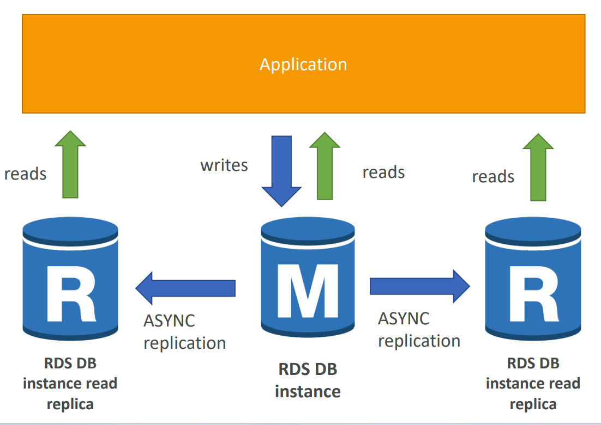

# AWS - RDS

[Back](../../index.md)

- [AWS - RDS](#aws---rds)
  - [RDS Overview](#rds-overview)
    - [Ports](#ports)
    - [Storage Auto Scaling](#storage-auto-scaling)
    - [`Read Replicas` for read scalability](#read-replicas-for-read-scalability)
    - [Multi AZ (Disaster Recovery)](#multi-az-disaster-recovery)
    - [Hands-On: Create](#hands-on-create)
  - [RDS Custom](#rds-custom)
  - [RDS Backups](#rds-backups)
  - [Restore options](#restore-options)
  - [RDS \& Aurora Security](#rds--aurora-security)
  - [RDS Proxy](#rds-proxy)

---

## RDS Overview

- `RDS`

  - stands for `Relational Database Service`
  - It’s a **managed DB service** for DB _use SQL_ as a query language.

- It allows to create databases in the cloud that are **managed by AWS**

  - Postgres
  - MySQL
  - MariaDB
  - Oracle
  - Microsoft SQL Server
  - Aurora (AWS Proprietary database)

---

- **Advantage** over using RDS versus deploying DB on EC2

  - RDS is a **managed service**:
    - Automated **provisioning**, OS **patching**
    - Continuous **backups** and **restore** to specific timestamp (Point in Time Restore)!
    - Monitoring **dashboards**
    - **Read replicas** for improved read performance
    - **Multi AZ** setup for DR (**Disaster Recovery**)
    - **Maintenance windows** for upgrades
    - **Scaling capability (vertical and horizontal)**
    - Storage backed by **EBS** (gp2 or io1)

- BUT you **can’t SSH** into your instances

---

### Ports

- Important ports:

| Protocol | Port  |
| -------- | ----- |
| `FTP`    | `21`  |
| `SSH`    | `22`  |
| `SFTP`   | `22`  |
| `HTTP`   | `80`  |
| `HTTPS`  | `443` |

- RDS Databases ports:

| Database                        | Port   |
| ------------------------------- | ------ |
| `PostgreSQL`                    | `5432` |
| `Aurora`(PostgreSQL compatible) | `5432` |
| `MySQL`                         | `3306` |
| `Aurora`(MySQL compatible)      | `3306` |
| `MariaDB`                       | `3306` |
| `Oracle RDS`                    | `1521` |
| `MSSQL Server`                  | `1433` |

---

### Storage Auto Scaling

- Helps **increase storage** on RDS DB instance **dynamically**

  - When RDS detects you are running out of free database storage, it **scales automatically**
  - Avoid manually scaling your database storage

- You have to **set Maximum Storage Threshold** (**maximum limit** for DB storage)

- Automatically modify storage if:
  - Free storage is **less than 10%** of allocated storage
  - Low-storage lasts at least **5 minutes**
  - **6 hours** have passed since last modification
- Useful for applications with unpredictable workloads
- Supports all RDS database engines (MariaDB, MySQL, PostgreSQL, SQL Server, Oracle)

---

### `Read Replicas` for read scalability

- Up to **15** Read Replicas
- Within **AZ**, **Cross AZ** or **Cross Region**
- Replication is **ASYNC**, so reads are eventually consistent
- Replicas can be promoted to their own DB 可以提升为数据库之一.
  - Applications must **update the connection string** to leverage read. replicas 必须升级连接字符串.

- **Network Cost**

  - In AWS there’s a network cost when data goes from one AZ to another

  - For RDS Read Replicas **within the same region**, **you don’t pay that fee**

---

- **Use Cases**

  - You have a production database that is taking on normal load
  - You want to run a reporting application to **run some analytics**
    - Read Replicas will help as your analytics application can now perform queries against it, and **these queries won't impact the main production RDS database.**
  - You create a Read Replica to run the new workload there
  - The production application is **unaffected**
  - Read replicas are used for **SELECT (=read)** only kind of statements **(not INSERT, UPDATE, DELETE)**

---

### Multi AZ (Disaster Recovery)

- **SYNC replication**
- One **DNS name** – automatic app failover(故障转移) to standby
  - Multi-AZ keeps the **same connection string** regardless of which database is up.
- Increase availability
- **Failover** in case of loss of AZ, loss of network, instance or storage failure
- **No manual** intervention in apps
- **Not used for scaling** 不是 scaling
- Note:The **Read Replicas be setup as Multi AZ** for Disaster Recovery (DR) 不只是数据库本身, read replica 也可以

---

- From Single-AZ to Multi-AZ 启用 multi 的原理:

  - Zero downtime operation (no need to stop the DB)无需下线
  - Just click on “modify” for the database and enable
  - The following happens internally:
    - A **snapshot** is taken 设 s3
    - A **new DB** is restored from the snapshot in a **new AZ**
    - **Synchronization** is established between the two databases

---

### Hands-On: Create

---

## RDS Custom

- Managed **Oracle** and **Microsoft SQL Server** Database with **OS** and **database** customization

- `RDS` vs. `RDS Custom`

  - `RDS`:

    - entire database and the OS to be managed by AWS
    - Automates setup, operation, and scaling of database in AWS

  - `Custom`:
    - **full admin access** to the underlying OS and the database
      - Configure settings
      - Install patches
      - Enable native features

- **Access** the underlying EC2 Instance using `SSH` or `SSM Session Manager`
- **De-activate Automation Mode** to perform your customization,
- Better to take a DB **snapshot** before

---

## RDS Backups

- **Automated backups**:

  - **Daily full backup** of the database (during the backup window)
  - Transaction logs are backed-up by RDS **every 5 minutes**
  - => ability to restore to any point in time (from oldest backup **to 5 minutes ago**)
  - 1 to **35** days of **retention**, set **0** to **disable** automated backups

- **Manual DB Snapshots**

  - Manually triggered by the user
  - **Retention** of backup for **as long as you want**

- Trick: for a RDS used in short period per month.
  - in a stopped RDS database, you will still pay for storage.
  - If you plan on stopping it for a long time, you should **snapshot**, **delete** & **restore** instead

---

## Restore options

- Restoring a RDS **backup** or a **snapshot** creates a new database.

- Restoring MySQL RDS database **from S3**
  - Create a **backup** of your on-premises database
  - **Store** it on Amazon **S3** (object storage)
  - **Restore** the backup file onto a new RDS instance running MySQL

---

## RDS & Aurora Security

- **Encryption**

  - **At-rest encryption**: 储存是加密

    - Database master & replicas encryption **using AWS KMS** – must be **defined as launch time**
      - If the master is not encrypted, the **read** replicas **cannot** be encrypted
      - can not create encrypted Read Replicas from an unencrypted RDS DB instance.
    - To **encrypt** an un-encrypted database, go through a DB **snapshot** & **restore as encrypted**

  - **In-flight encryption**: between db and clients

    - `TLS-ready` by **default**
    - use the `AWS TLS` root certificates client-side

- **Authentication**:

  - can enable `IAM Authentication` (Not default): **IAM roles** to connect to your database (instead of username/pw)
  - **Oracle NOT support** IAM Database Authentication

- **Network access**:

  - Security Groups: Control Network access to your RDS / Aurora DB
  - **No** SSH available except on `RDS Custom`

- **Audit**:
  - **Audit Logs** can be enabled and sent to **CloudWatch Logs** for longer retention

---

## RDS Proxy

- **Fully managed** database proxy for RDS
- Allows apps to **pool and share DB connections** established with the database
- Improving database efficiency by **reducing the stress** on database resources (e.g., CPU, RAM) and **minimize** open connections (and timeouts)
- **Serverless**, **autoscaling**, **highly available** (multi-AZ)
- **Reduced** RDS & Aurora **failover** time by up 66%
- Supports **RDS** (MySQL, PostgreSQL, MariaDB, MS SQL Server) and **Aurora** (MySQL, PostgreSQL)
- No code changes required for most apps
- Enforce **IAM Authentication** for DB, and securely **store credentials in AWS Secrets Manager**
- RDS Proxy is **never publicly accessible** (must be accessed from VPC)

---

[TOP](#aws---rds)
