# AWS - Kinesis

[Back](../index.md)

- [AWS - Kinesis](#aws---kinesis)
  - [Kinesis](#kinesis)
    - [`Kinesis Data Streams`](#kinesis-data-streams)
      - [Capacity Modes](#capacity-modes)
      - [Security](#security)
      - [Grouping and Ordering Data: `Kinesis Data Stream` with `Partition Key`](#grouping-and-ordering-data-kinesis-data-stream-with-partition-key)
      - [Grouping: Kinesis vs SQS](#grouping-kinesis-vs-sqs)
      - [Hands-on](#hands-on)
    - [`Kinesis Data Firehose`](#kinesis-data-firehose)
      - [Hands-on](#hands-on-1)
  - [`Kinesis Data Streams` vs `Firehose`](#kinesis-data-streams-vs-firehose)

---

## Kinesis

- used to collect, process, and analyze streaming data in real-time
- **Ingest real-time data**

  - ie: Application logs, Metrics, Website clickstreams, IoT telemetry data…

- 4 services:
  - `Kinesis Data Stream`s:
    - capture, process, and store **data streams**
  - `Kinesis Data Firehose`:
    - **load** data streams into AWS data stores
  - `Kinesis Data Analytics`:
    - **analyze** data streams with `SQL` or `Apache Flink`
  - `Kinesis Video Streams`:
    - capture, process, and store **video streams**

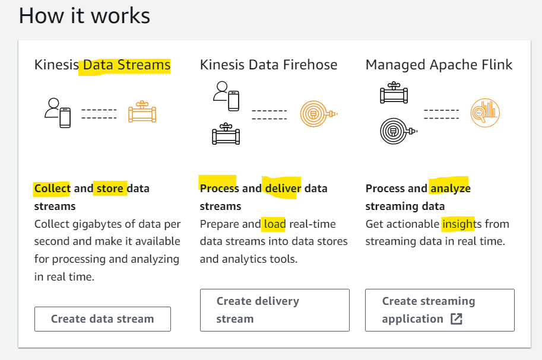

---

### `Kinesis Data Streams`

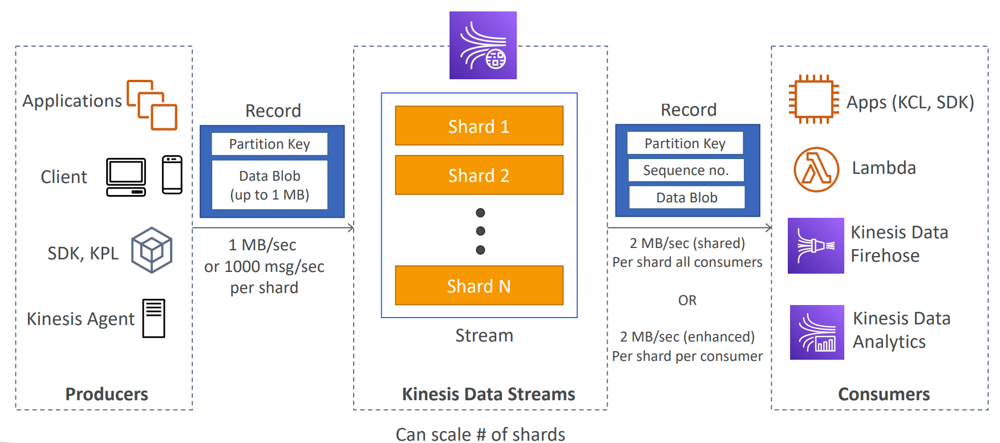

- `Kinesis Data Streams`

  - a service to stream big data in the systems.
  - composed of multiple shards.

- **Producers**

  - send records, consist of `partition key` and `data blob`, into Kinesis Data Streams.
  - `AWS SDK`, `Kinesis Producer Library (KPL)`, `Kinesis Agent`

- **Consumers**

  - consume records, consist of `partition key`, `sequence no.`, and `Data Blob`.
  - Write your own: `Kinesis Client Library (KCL)`, `AWS SDK`
  - Managed services: `AWS Lambda`, `Kinesis Data Firehose`, `Kinesis Data Analytics`

- **Features**:

  - Retention between `1` day to `365` days
  - Ability to **reprocess (replay) data**
  - Once data is inserted in Kinesis, it can’t be deleted (**immutability**)
  - Data that shares the **same partition** goes to the **same shard** (**ordering**)

- Sample:

  - You have a Kinesis data stream with 6 shards provisioned. This data stream usually receiving 5 MB/s of data and sending out 8 MB/s. Occasionally, your traffic spikes up to 2x and you get a `ProvisionedThroughputExceeded` exception. What should you do to resolve the issue?
  - Add more shard
  - 解析:The **capacity limits** of a Kinesis data stream are **defined by the number of shards** within the data stream. The limits can be **exceeded** by either **data throughput** or the number of **reading data calls**. Each shard allows for 1 MB/s incoming data and 2 MB/s outgoing data. You should increase the number of shards within your data stream to provide enough capacity.

- Sample:
  - You are running an application that produces a large amount of real-time data that you want to load into S3 and Redshift. Also, these data need to be transformed before being delivered to their destination. What is the best architecture would you choose?
  - Data Stream + Data Firehose
  - This is a perfect combo of technology for loading data **near real-time data** into `S3` and `Redshift`. Kinesis Data Firehose supports custom data **transformations** using `AWS Lambda`.

---

#### Capacity Modes

- **Provisioned mode**:(If the capacity events can be **predicted**)

  - You choose the **number of shards provisioned**, **scale manually** or using API
  - Each shard gets **1MB/s in** (or 1000 records per second)
  - Each shard gets **2MB/s out** (classic or enhanced fan-out consumer)
  - You **pay per shard provisioned per hour**

- **On-demand mode**:

  - No need to provision or manage the capacity
  - Default capacity provisioned (**4 MB/s in** or** 4000 records per second**)
  - **Scales automatically** based on observed throughput peak during the last 30 days
  - Pay **per stream per hour** & **data in/out per GB**

- Sample:
  - A company is using Amazon Kinesis Data Streams to ingest clickstream data and then do some analytical processes on it. There is a campaign in the next few days and the traffic is unpredictable which might grow up to 100x. What Kinesis Data Stream capacity mode do you recommend?
  - On-demand

---

#### Security

- **Encryption**:

  - **in flight** using `HTTPS` endpoints
  - **at rest** using `KMS`
  - You can implement encryption/decryption of data on **client side** (harder)

- **Control access / authorization**:

  - using `IAM policies`

- `VPC Endpoints` available for Kinesis to access **within VPC**

- **Monitor** API calls using `CloudTrail`

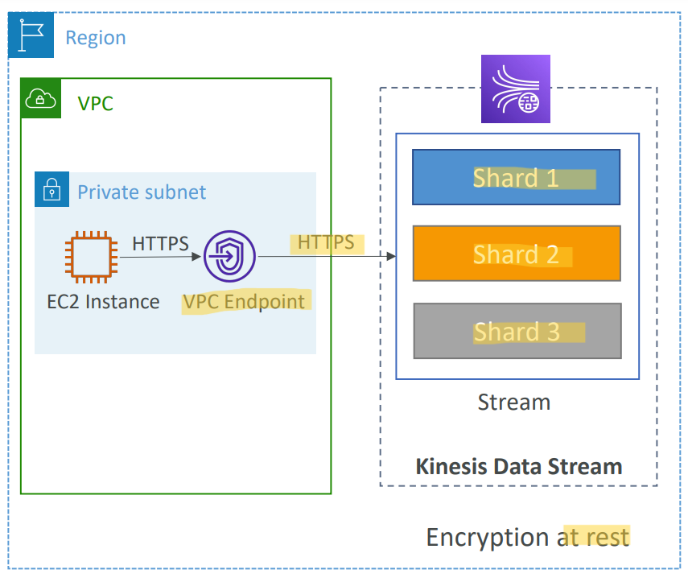

---

#### Grouping and Ordering Data: `Kinesis Data Stream` with `Partition Key`

- **Problem**:
  - Imagine you have 100 trucks (truck_1, truck_2, … truck_100) on the road sending their GPS positions regularly into AWS.
  - You want to consume the data in order for each truck, so that you can track their movement accurately.
  - How should you send that data into Kinesis?
- **Answer**:
  - send using a “**Partition Key**” value of the **“truck_id”**
  - The **same key** will always go to the **same shard**

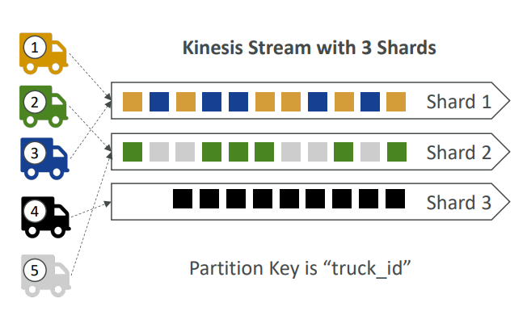

- Sample:
  - You have a website where you want to analyze clickstream data such as the sequence of clicks a user makes, the amount of time a user spends, and where the navigation begins and how it ends. You decided to use Amazon Kinesis, so you have configured the website to send these clickstream data all the way to a Kinesis data stream. While you checking the data sent to your Kinesis data stream, you found that the users' data **is not ordered** and the data for one individual user is **spread across many shards**. How would you fix this problem?
  - partition key
  - 解析: Kinesis Data Stream uses the partition key associated with each data record to determine which shard a given data record belongs to. When you use the identity of each user as the partition key, this ensures the data for each user is **ordered** hence **sent to the same shard**.

---

#### Grouping: Kinesis vs SQS

- Problem:

  - Let’s assume 100 trucks, 5 kinesis shards, 1 SQS FIFO

- `Kinesis Data Streams`: **Group # = Shard #**

  - On average you’ll have 20 trucks **per shard**
  - Trucks will have their data **ordered within each shard**
  - The **maximum amount of consumers** in parallel we can have is `5` (The number of shard)
  - Can receive up to 5 MB/s of data (1 MB/s each shard)

- `SQS FIFO`: **Group # = Message #**
  - You only have one SQS FIFO queue
  - You will have 100 `Group ID`
  - You can have **up to 100** Consumers (due to the **100 Group ID**)
  - You have up to 300 messages per second (or 3000 if using batching)

---

#### Hands-on

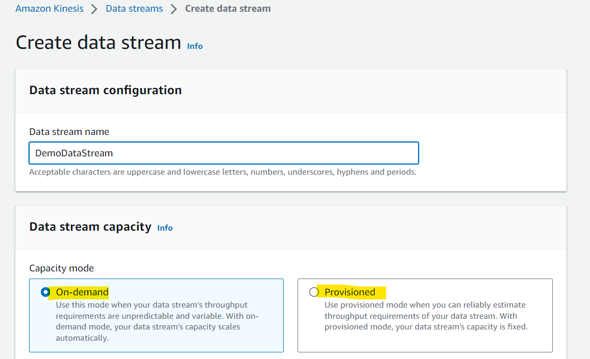

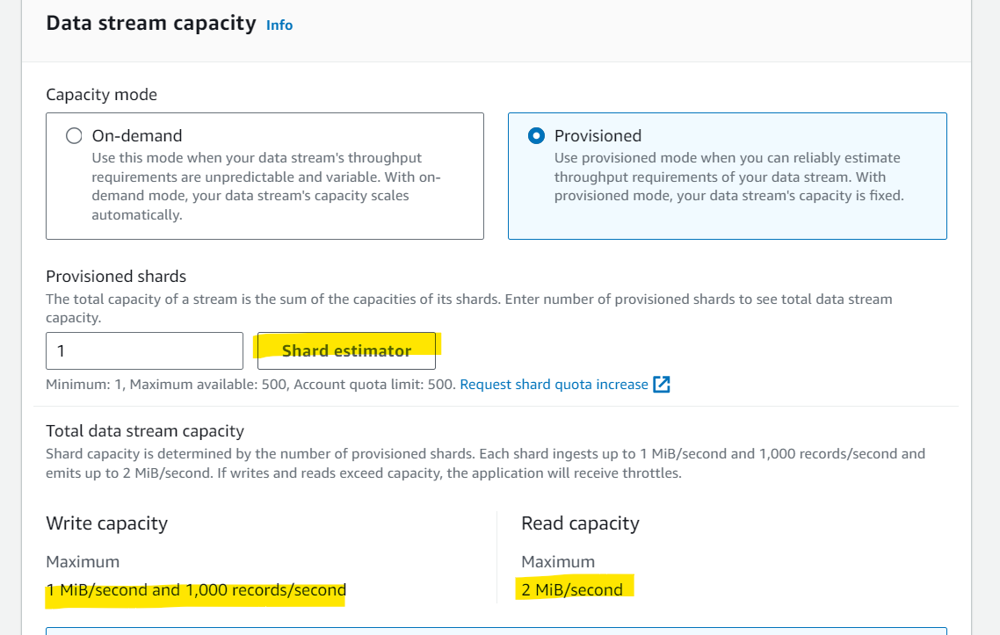

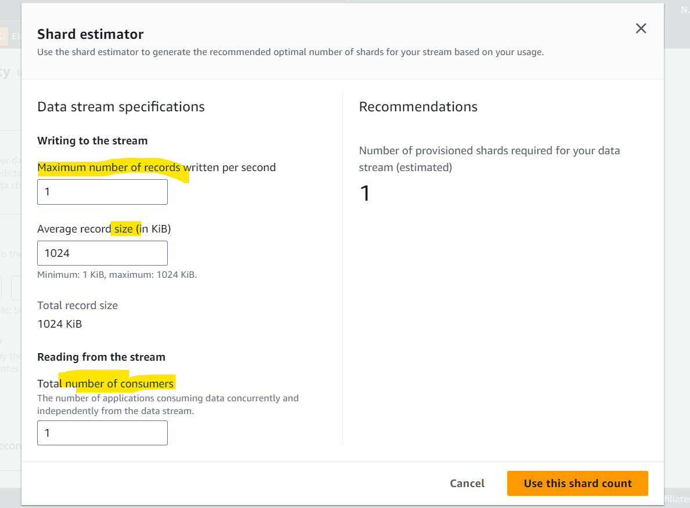
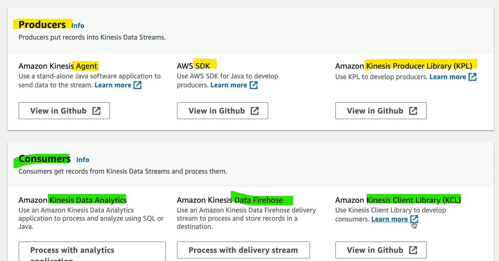

---

### `Kinesis Data Firehose`

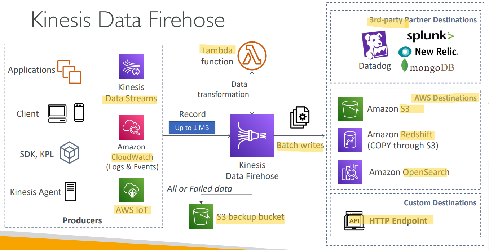

- `Kinesis Data Firehose`
  - Fully Managed Service, no administration, automatic scaling, serverless
    - AWS: `Redshift` / `Amazon S3` / `OpenSearch`
    - 3rd party partner: Splunk / MongoDB / DataDog / NewRelic / …
    - Custom: send to any HTTP endpoint
- **Pay for data** going through Firehose
- **Near Real Time**
  - 60 seconds latency minimum for non full batches
  - Or minimum 1 MB of data at a time
- Supports many **data formats, conversions, transformations, compression**
- Supports **custom data transformations** using `AWS Lambda`
- Can send **failed or all data** to a backup `S3 bucket`

---

#### Hands-on

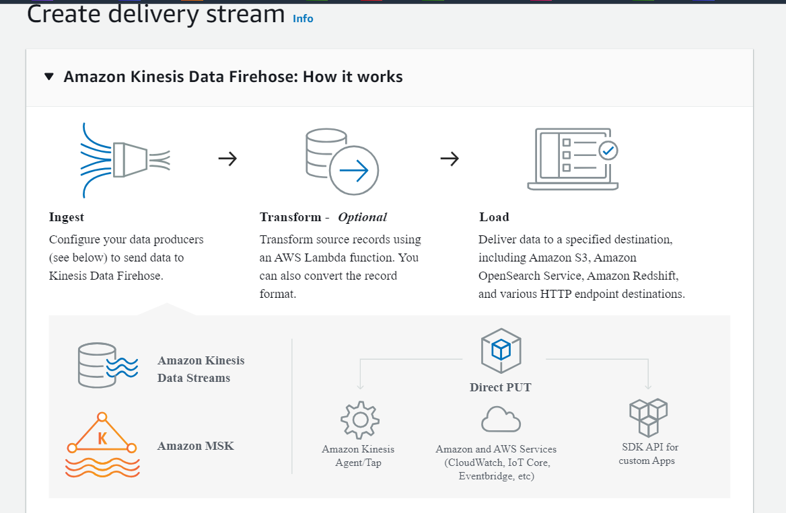

- Destination options: 3 AWS services.

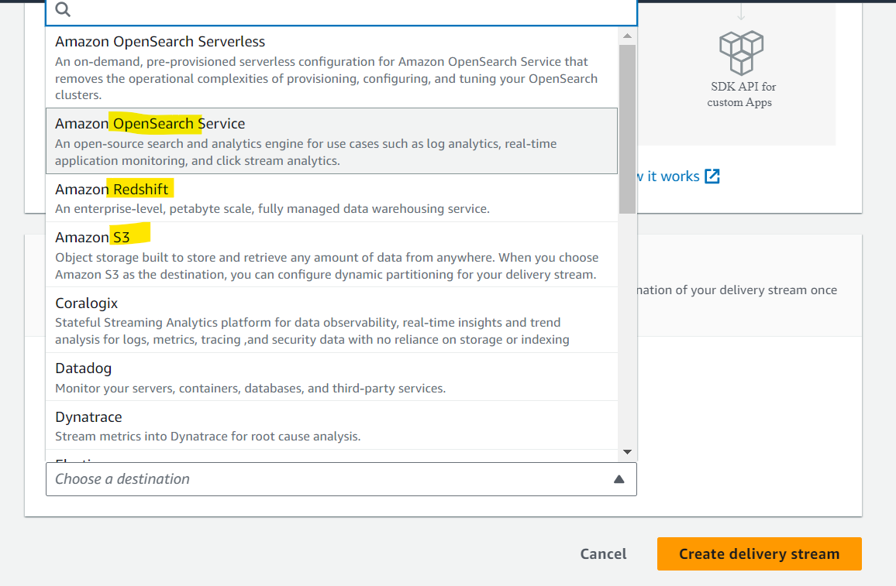

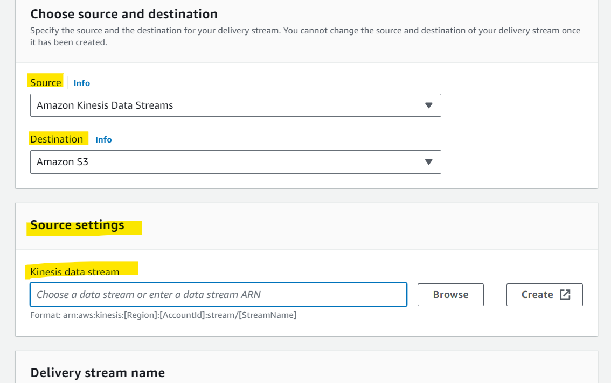

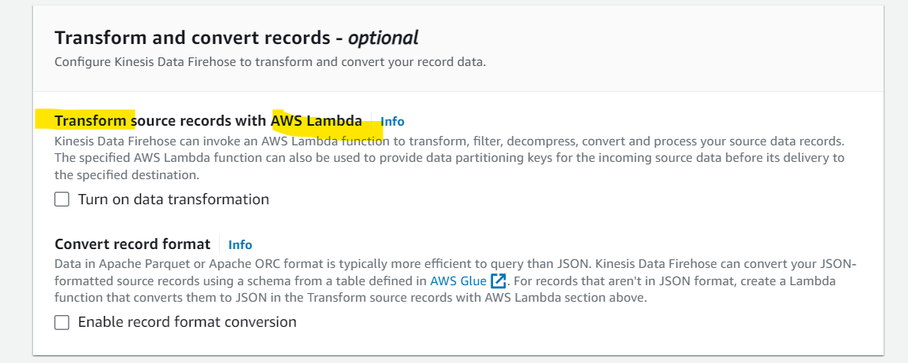

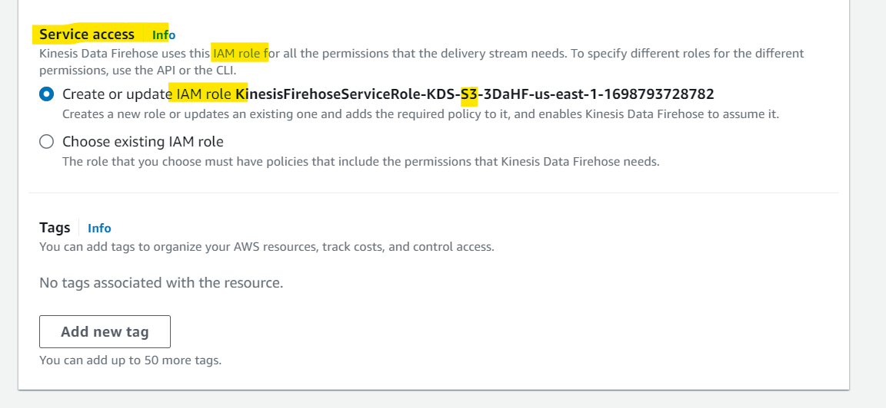

---

## `Kinesis Data Streams` vs `Firehose`

- `Kinesis Data Streams`

  - Streaming service for **ingest at scale**
  - Write custom code (producer / consumer)
  - **Real-time** (~200 ms)
  - **Manage scaling** (shard splitting / merging)
  - **Data storage** for 1 to 365 days
  - **Supports replay** capability

- `Kinesis Data Firehose`

  - **Load** streaming data into S3 / Redshift / OpenSearch / 3rd party / custom HTTP
  - **Fully managed**
  - **Near** real-time (buffer time min. 60 sec)
  - **Automatic scaling**
  - **No data storage**
  - **Doesn’t support replay** capability

---

[TOP](#aws---kinesis)
