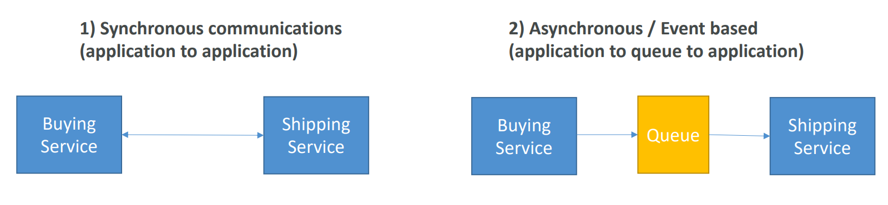
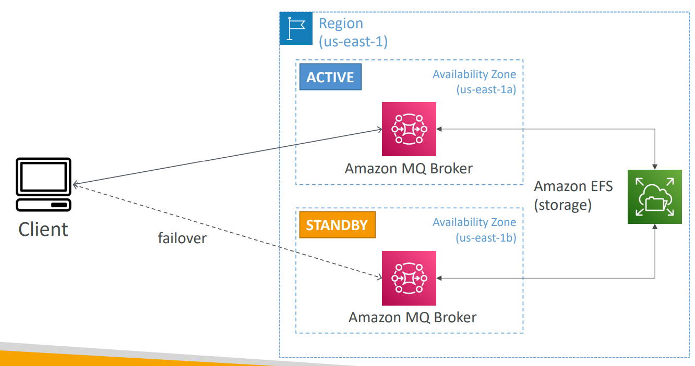

# AWS - Messaging and Integration

[Back](../index.md)

- [AWS - Messaging and Integration](#aws---messaging-and-integration)
  - [Synchronous vs Asynchronous](#synchronous-vs-asynchronous)
  - [`SQS` vs `SNS` vs `Kinesis`](#sqs-vs-sns-vs-kinesis)
  - [`Amazon MQ`: On-premises, SQS+SNS](#amazon-mq-on-premises-sqssns)
    - [Hight Availability](#hight-availability)

---

## Synchronous vs Asynchronous

- When we start deploying multiple applications, they will inevitably need to communicate with one another
- There are two patterns of application communication

- Synchronous between applications can be problematic if there are sudden spikes of traffic

  - What if you need to suddenly encode 1000 videos but usually it’s 10?

- In that case, it’s better to decouple your applications,

  - using `SQS`: **queue** model
  - using `SNS`: **pub/sub** model
  - using `Kinesis`: **real-time streaming** model

- These services can s**cale independently** from our application!

---

## `SQS` vs `SNS` vs `Kinesis`

- `SQS`:

  - **Consumer** **“pull** data”
  - Data is **deleted** after being consumed
  - Can have **as many workers** (consumers) as we want
  - No need to provision **throughput** (**unlimited**)
  - **Ordering** guarantees only on `FIFO` queues
  - Individual message **delay** capability

---

- `SNS`:

  - **Push** data to many subscribers
  - Up to **12**,500,000 **subscribers**
  - Data is **not persisted** (**lost if not delivered**)
  - **Pub/Sub**
  - Up to **100**,000 **topics**
  - No need to provision **throughput**
  - Integrates with `SQS` for `fan-out architecture` pattern
  - FIFO capability for `SQS FIFO`

---

- `Kinesis`:
  - Standard: **pull** data
    - 2 MB per shard
  - Enhanced-fan out: **push** data
    - 2 MB per shard per consumer
  - Possibility to **replay** data
  - Meant for **real-time** `big data`, **analytics** and `ETL`
  - **Ordering** at the **shard** level
  - Data **expires** after X days (Data store)
  - **Provisioned** mode or **ondemand** capacity mode

---

## `Amazon MQ`: On-premises, SQS+SNS

- SQS, SNS are “cloud-native” services: proprietary protocols from AWS
- Traditional applications running from **on-premises** may use open **protocols** such as: `MQTT`, `AMQP`, `STOMP`, `Openwire`, `WSS`

- `Amazon MQ`

  - used to **migrate** application from **on-premises** to the cloud, instead of re-engineering the application to use `SQS` and `SNS`
  - a managed message broker service for
    - `RabbitMQ`, `ACTIVEMQ`

- Amazon MQ doesn’t “scale” as much as SQS / SNS
- Amazon MQ runs **on servers**, can run in **Multi-AZ** with **failover**
- Amazon MQ has both **queue feature** (~SQS) and **topic features** (~SNS)

---

### Hight Availability

- On-premises client talks to MQ Broker in Active Zone.
- Has standby in another zone.
- Has EFS as backup
- Once failover, EFS mount to standby.
- Client talks to standby.

---

[TOP](#aws---decoupling)
