# AWS - SNS

[Back](../index.md)

- [AWS - SNS](#aws---sns)
  - [`Amazon SNS`](#amazon-sns)
  - [How to publish](#how-to-publish)
    - [Publishing to SNS: Integrates with a lot of AWS services](#publishing-to-sns-integrates-with-a-lot-of-aws-services)
    - [Publishing to Subscribers](#publishing-to-subscribers)
  - [Security](#security)
  - [Message Filtering](#message-filtering)
  - [Hands-On](#hands-on)
  - [Fan-out Pattern: `SNS` + `SQS`](#fan-out-pattern-sns--sqs)
    - [Use Case: S3 Events to multiple queues](#use-case-s3-events-to-multiple-queues)
  - [Fan-out Pattern: `SNS` + `FIFO`](#fan-out-pattern-sns--fifo)
    - [Use Case: SNS FIFO + SQS FIFO](#use-case-sns-fifo--sqs-fifo)
  - [Fan-out Pattern: `SNS` + `Kinesis`](#fan-out-pattern-sns--kinesis)
    - [Use Case: SNS to Amazon S3 through Kinesis Data Firehose](#use-case-sns-to-amazon-s3-through-kinesis-data-firehose)

---

## `Amazon SNS`

- What if you want to send one message to many receivers?

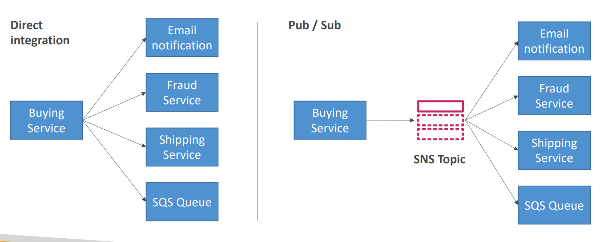

- Pub/Sub

- `Amazon SNS`
  - The “**event producer**” only **sends** message to one `SNS` topic
  - As many “**event receivers**” (**subscriptions**) as we want to **listen** to the SNS topic notifications
- **Each** subscriber to the topic will **get all the messages** (note: new feature to **filter** messages)
- Up to `12,500,000` subscriptions per topic
- `100,000` topics limit

---

## How to publish

- Topic Publish (using the SDK)

  - Create a **topic**
  - Create a **subscription** (or many)
  - **Publish** to the topic

- Direct Publish (for mobile apps SDK)
  - Create a platform **application**
  - Create a platform **endpoint**
  - **Publish** to the platform endpoint
  - Works with `Google GCM(Google Cloud Messaging)`, `Apple APNS(Apple Push Notification service)`, `Amazon ADM(Amazon Device Messaging)`…

---

### Publishing to SNS: Integrates with a lot of AWS services

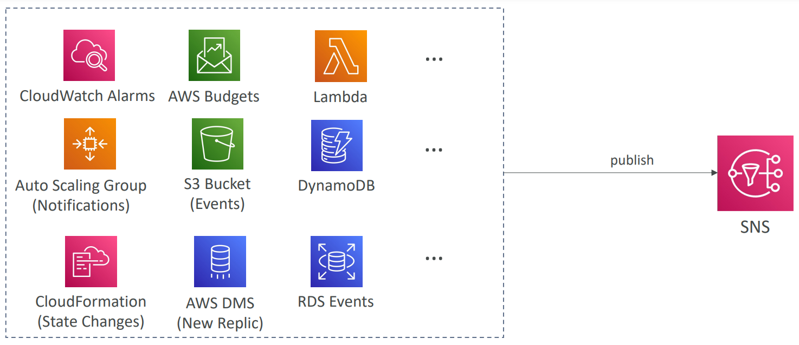

---

### Publishing to Subscribers

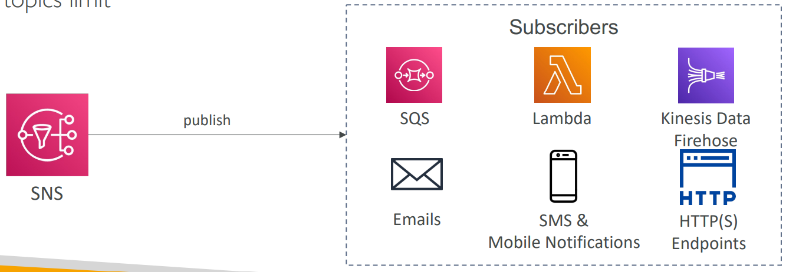

- 有例题:Note: Kinesis Data Firehose is now supported, but not Kinesis Data Streams.
- Sample:
  - Which AWS service helps you when you want to send **email** notifications to your users?
  - SNS

---

## Security

- **Encryption**:

  - **In-flight** encryption using `HTTPS API`
  - **At-rest** encryption using `KMS keys`
  - **Client-side** encryption if the client wants to perform encryption/decryption itself

- **Access Controls**:

  - `IAM policies` to regulate access to the `SNS API`

- **SNS Access Policies** (similar to S3 bucket policies)
  - Useful for **cross-account access** to SNS topics
  - Useful for allowing **other services** ( S3…) to write to an SNS topic

---

## Message Filtering

- **JSON policy** used to **filter** messages sent to SNS topic’s subscriptions
  - If a subscription doesn’t have a filter policy, it receives every message

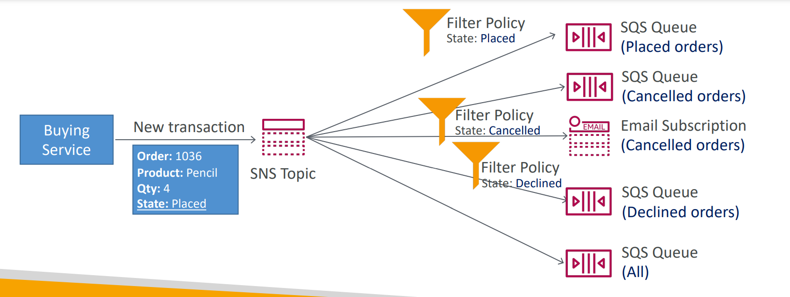

---

## Hands-On

- Create Topic

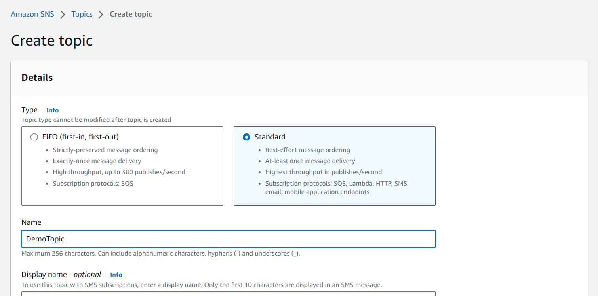

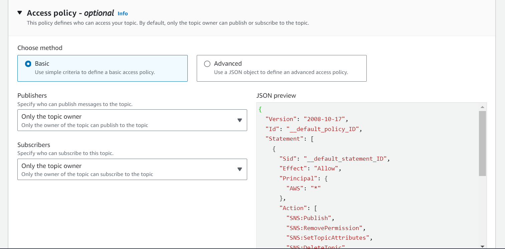

- Create Subscription

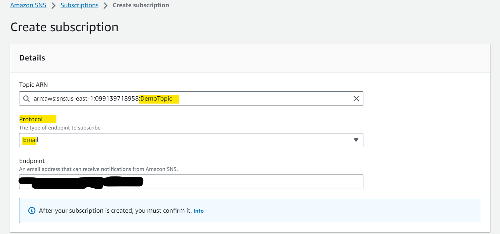

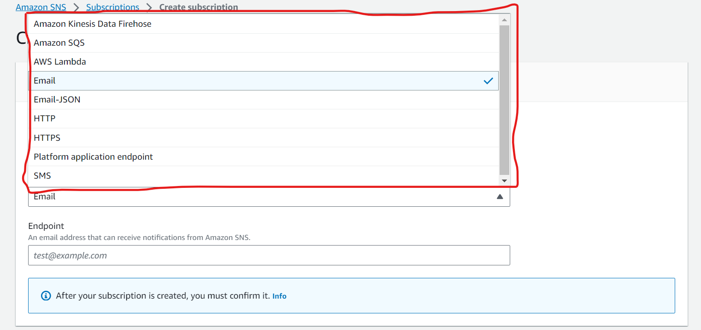

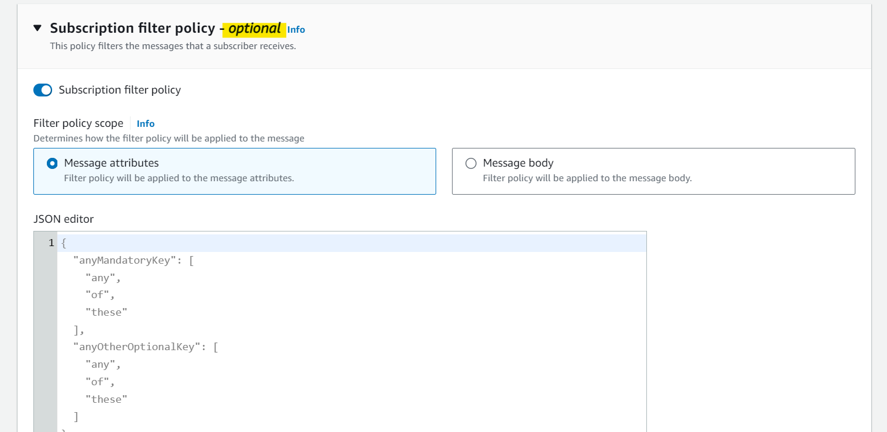

- Validate subscription in email box.

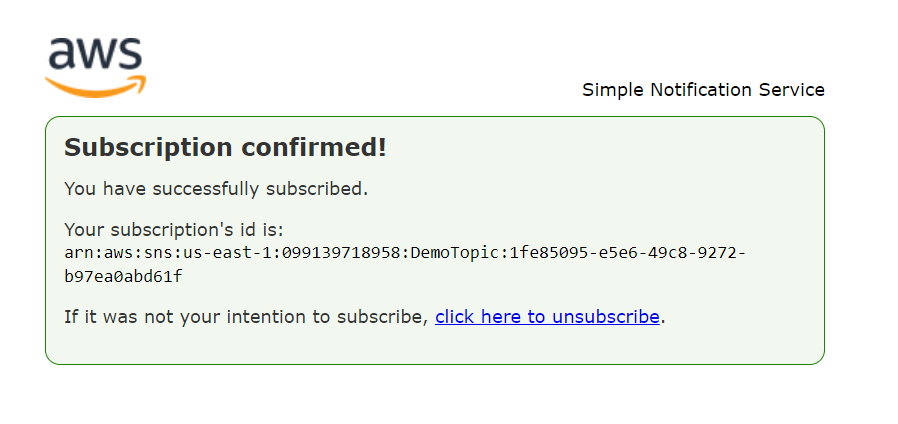

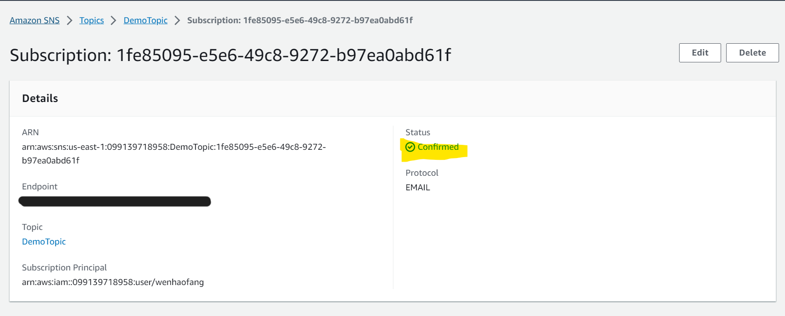

- Publish Message

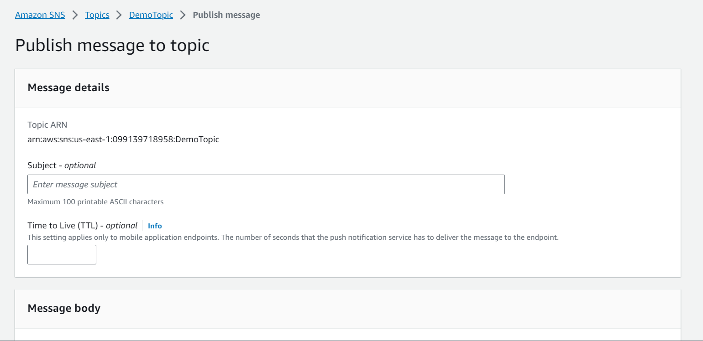

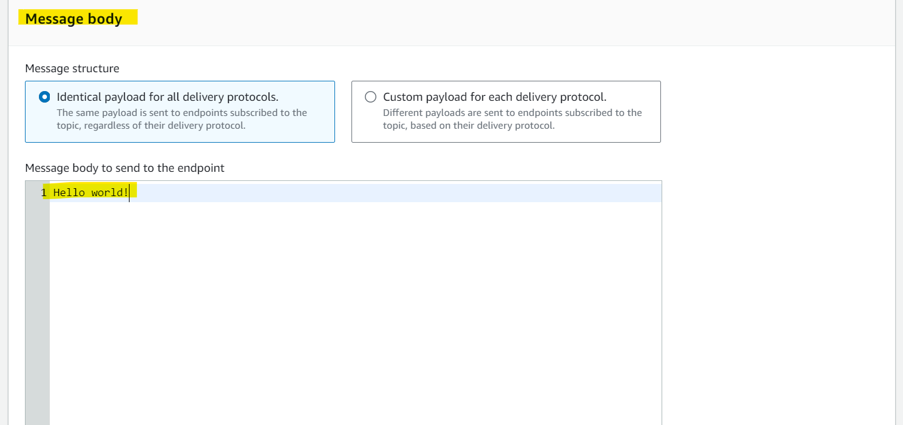

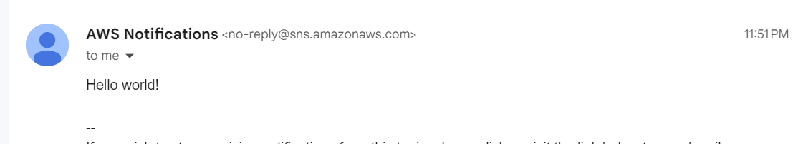

---

## Fan-out Pattern: `SNS` + `SQS`

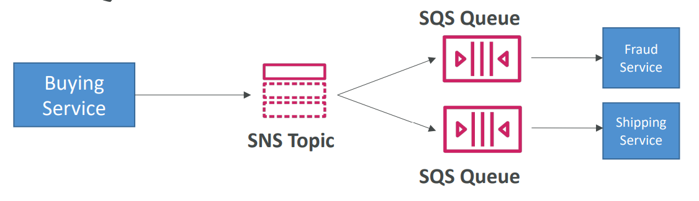

- **Push once** in `SNS`, receive in all `SQS` queues that are **subscribers**

- Make sure your SQS queue **access policy** **allows** for SNS to **write**

- Benefits:

  - Fully **decoupled**, **no data loss**
  - **Cross-Region** Delivery:
    - works with SQS Queues **in other regions**
  - Ability to **add** more **SQS subscribers** over time
  - SQS allows for:
    - data **persistence**
    - **delayed** processing
    - **retries** of work

- 小结:

  - SNS: 分层, 扩展
  - SQS: 缓冲
    - SQS FIFO: 按序

- This is a common pattern where **only one message** is sent to the `SNS` **topic** and then "fan-out" to **multiple** `SQS` queues.
- This approach has the following features:
  - it's **fully decoupled**, **no data loss**, and you have the ability to **add more SQS queues** (more applications) over time.

---

### Use Case: S3 Events to multiple queues

- Limitation:

  - For the same combination of: **event type** (e.g. object create) **prefix** (e.g. images/) you can **only have one S3 Event rule**

- Solution:
  - If you want to send the **same S3 event** to **many** SQS queues, use **fan-out**

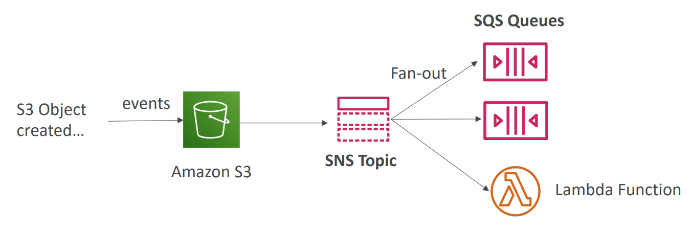

---

## Fan-out Pattern: `SNS` + `FIFO`

- Similar features as SQS FIFO:
  - **Ordering** by Message Group ID (all messages **in the same group** are **ordered**)
  - **Deduplication** using a Deduplication ID or Content Based Deduplication
- Can only have SQS FIFO queues as **subscribers** 按照订阅者分类且顺序.
- **Limited throughput** (same throughput as SQS FIFO)

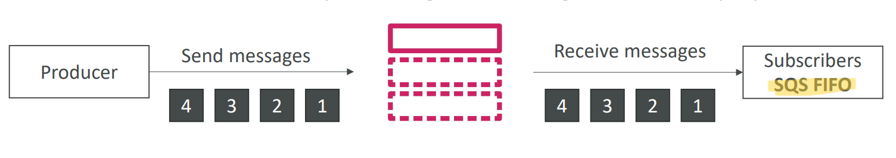

---

### Use Case: SNS FIFO + SQS FIFO

- In case you need **fan out** + **ordering** + **deduplication**

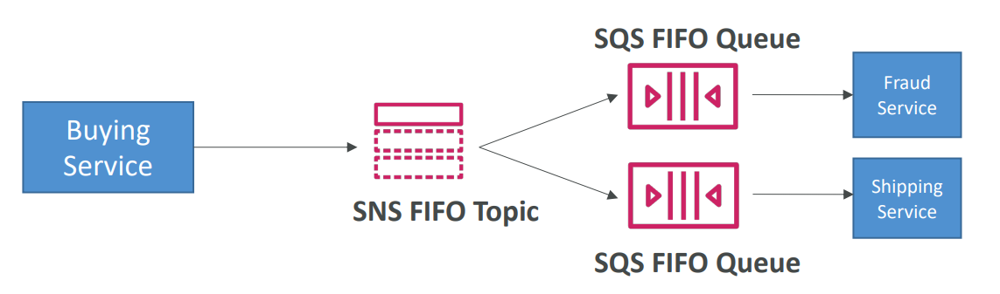

---

## Fan-out Pattern: `SNS` + `Kinesis`

### Use Case: SNS to Amazon S3 through Kinesis Data Firehose

- `SNS` can send to `Kinesis` and therefore we can have the following solutions architecture:

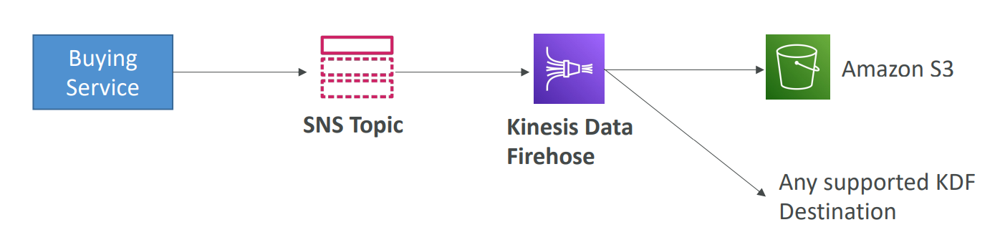

---

[TOP](#aws---sns)
