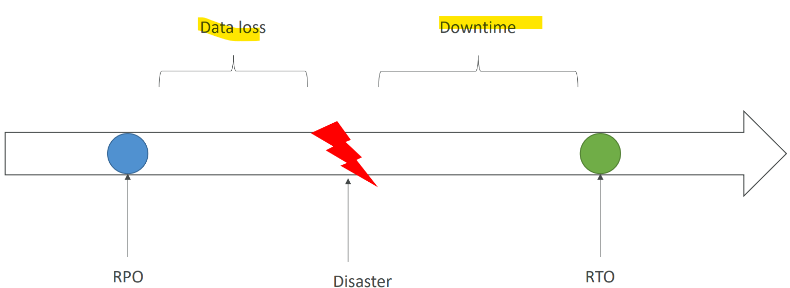
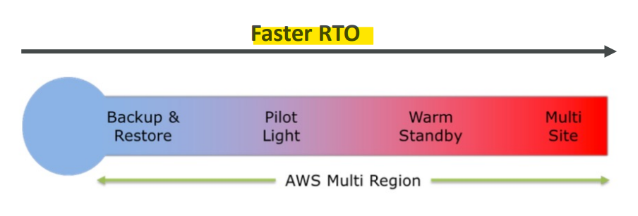
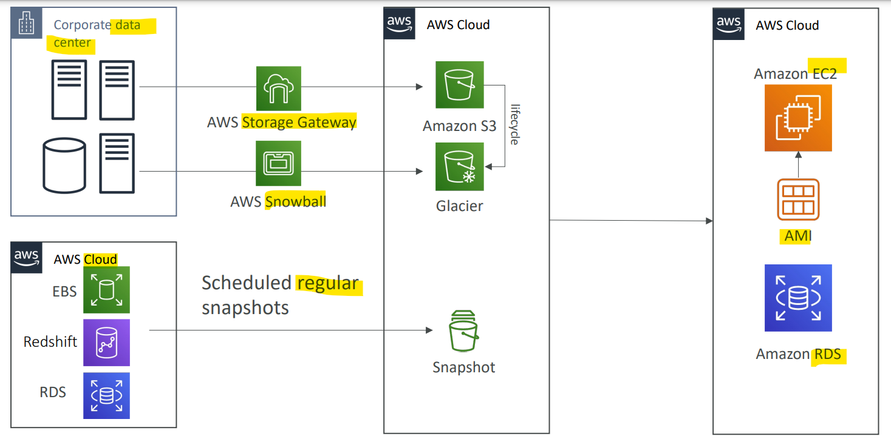
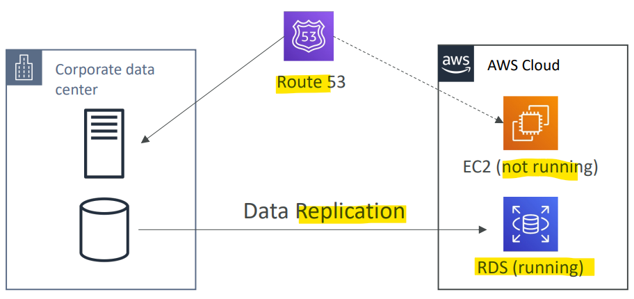
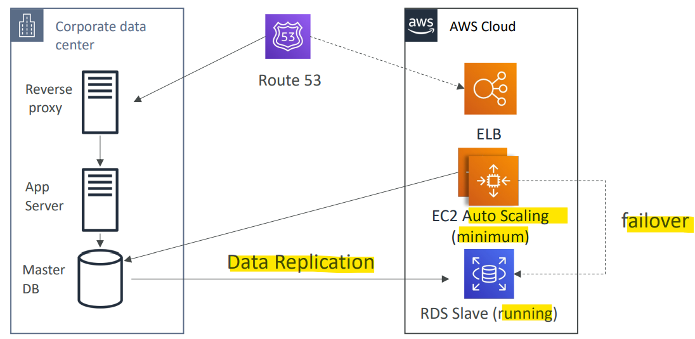
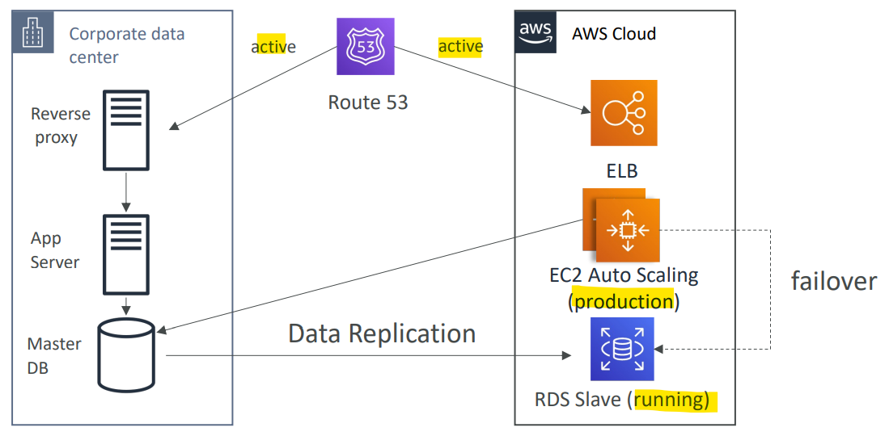
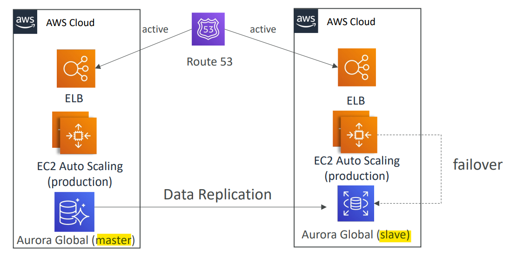

# AWS - Disaster Recovery

[Back](../index.md)

- [AWS - Disaster Recovery](#aws---disaster-recovery)
  - [Disaster Recovery](#disaster-recovery)
  - [Disaster Recovery Strategies](#disaster-recovery-strategies)
    - [Backup and Restore (High RPO, RTO)](#backup-and-restore-high-rpo-rto)
    - [Pilot Light](#pilot-light)
    - [Warm Standby](#warm-standby)
    - [Multi Site / Hot Site Approach](#multi-site--hot-site-approach)
    - [All AWS Multi Region (Cloud Native)](#all-aws-multi-region-cloud-native)
  - [Disaster Recovery Tips](#disaster-recovery-tips)

---

## Disaster Recovery

- `disaster`

  - the negative impact of any event on a company’s business continuity or finances

- `Disaster recovery (DR)`

  - about preparing for and recovering from a disaster

- Types of disaster recovery?

  - **On-premise => On-premise**:
    - **traditional** DR, and very **expensive**
  - **On-premise => AWS Cloud**:
    - **hybrid** recovery
  - AWS Cloud **Region** A => AWS Cloud **Region** B

- Need to define two terms:

  - `RPO`: `Recovery Point Objective`
  - `RTO`: `Recovery Time Objective`

---

- `RPO`: `Recovery Point Objective`

  - how much of a **data loss is to be accepted** in case of a disaster happens.
  - Depends on **how often the backups are run**.
  - when a disaster strikes, the time between `RPO` and the disaster is the **data loss**.

    - e.g., if data are backs up every hour and a disaster strikes, then can go back in time for an hour and lost one hour of data.

- `RTO`: `Recovery Time Objective`
  - When recover from disaster, between teh disaster and the RTO is the amount of downtime the application has.

- Optimizing for the `RPO` and the `RTO` drives solution architecture decisions.
  - The smaller these things to be, the higher the cost.

---

## Disaster Recovery Strategies

- Backup and Restore
- Pilot Light
- Warm Standby
- Hot Site / Multi Site Approach

---

### Backup and Restore (High RPO, RTO)

- **High** RPO
  - based on how frequently the snapshots are created.
- **High** RTO:
  - recreate infrastructure when has a disaster.
- **Cheap**
  - only need the cost of storing backups.

- Sample:
  - Which of the following Disaster Recovery strategies has a potentially high Recovery Point Objective (RPO) and Recovery Time Objective (RTO)?
    - Backup and Restore

---

### Pilot Light

- A **small version** of the app is **always running** in the cloud
- Useful for the **critical core (pilot light)**
- Very similar to Backup and Restore
- **Faster** than Backup and Restore as **critical systems are already up**

- Features:
  - only for critical core assistance.
  - lower RPO and RTO
    - only the RDS database is running for data replication.
  - manage costs

- Sample:
  - As part of your Disaster Recovery plan, you would like to have **only the critical infrastructure** up and running in AWS. You don't mind a longer Recovery Time Objective (RTO). Which DR strategy do you recommend?
    - Pilot Light

---

### Warm Standby

- **Full system** is up and running, but at **minimum size**
- Upon disaster, we can **scale to production load**

- Feature:
  - can descrease RPO and RTO
    - full system is running
  - more costly
    - need ELB and EC2 asg

- Sample:
  - You want to make a Disaster Recovery plan where you have a **scaled-down** version of your system **up and running**, and when a disaster happens, it **scales up** quickly. Which DR strategy should you choose?
    - Warm Standby

---

### Multi Site / Hot Site Approach

- Very **low** RTO: minutes or seconds
- very **expensive**
  - **Full Production Scale** is running AWS and On Premise

- Sample:
  - You would like to get the Disaster Recovery strategy with the **lowest Recovery Time Objective (RTO)** and Recovery Point Objective (RPO), **regardless of the cost**. Which DR should you choose?
    - Multi Site

---

### All AWS Multi Region (Cloud Native)

- Multi Region

---

## Disaster Recovery Tips

- **Backup**

  - `EBS` Snapshots, `RDS` automated backups / Snapshots, etc…
  - **Regular** pushes to `S3` / `S3 IA` / `Glacier`, **Lifecycle Policy**, **Cross Region Replication**
  - From On-Premise: `Snowball` or `Storage Gateway`

- **High Availability**

  - Use `Route53` to **migrate DNS over from Region to Region**
  - RDS **Multi-AZ**, ElastiCache **Multi-AZ**, EFS, S3
  - `Site to Site VPN` as a **recovery** from `Direct Connect`

- **Replication**

  - `RDS Replication` (Cross Region), AWS `Aurora` + `Global Databases`
  - **Database replication** from on-premises to RDS
  - `Storage Gateway`

- **Automation**

  - `CloudFormation` / `Elastic Beanstalk` to **re-create** a whole new environment
  - **Recover** / **Reboot** EC2 instances with `CloudWatch` if **alarms fail**
  - AWS `Lambda` functions for **customized automations**

- **Chaos**
  - Netflix has a “simian-army” randomly terminating EC2

---

[Top](#aws---disaster-recovery)
