# AWS - Amazon DynamoDB

[Back](../index.md)

- [AWS - Amazon DynamoDB](#aws---amazon-dynamodb)
  - [`Amazon DynamoDB` 常考篇目](#amazon-dynamodb-常考篇目)
    - [Basics](#basics)
    - [Read/Write Capacity Modes](#readwrite-capacity-modes)
    - [`DynamoDB Stream` Processing](#dynamodb-stream-processing)
    - [Time To Live (`TTL`)](#time-to-live-ttl)
    - [Backups for disaster recovery](#backups-for-disaster-recovery)
    - [Integration with Amazon S3](#integration-with-amazon-s3)
  - [`DynamoDB Accelerator (DAX)`](#dynamodb-accelerator-dax)
    - [`DynamoDB Accelerator (DAX)` vs. `ElastiCache`](#dynamodb-accelerator-dax-vs-elasticache)
  - [`DynamoDB Global Tables`](#dynamodb-global-tables)
  - [Hands-on](#hands-on)

---

## `Amazon DynamoDB` 常考篇目

- `NoSQL` database

  - **not** a **relational** database
  - with **transaction** support

- **Fully managed**, highly **available** with replication across **multiple AZs**
- **Scales** to massive workloads, **distributed** database

- **Millions** of requests per seconds, **trillions** of row, 100s of TB of storage
- Fast and consistent in **performance** (**single-digit millisecond**)即很快
- Integrated with `IAM` for **security**, **authorization** and administration
- **Low cost** and **auto-scaling** capabilities
- No **maintenance** or **patching**, always available
- `Standard` & `Infrequent Access (IA)` **Table Class**

---

### Basics

- **No need to create a database** like RDS / Aurora
- `DynamoDB` is made of **Tables**

  - Each `table` has a `Primary Key` (must be decided at creation time)
  - Each `table` can have an **infinite number** of `items` (= **rows**)
  - Each `item` has `attributes` (can be **added** over time – can be `null`)
    - Unlike RDS / Aurora, schema is easy to evolve.
  - Maximum size of an `item` is **400KB**(not suitable to store large objects)

- Data types supported are:
  - **Scalar Types**
    - String, Number, Binary, Boolean, Null
  - **Document Types**
    - List, Map
  - **Set Types**
    - String Set, Number Set, Binary Set
- Therefore, in `DynamoDB` you can **rapidly evolve schemas**

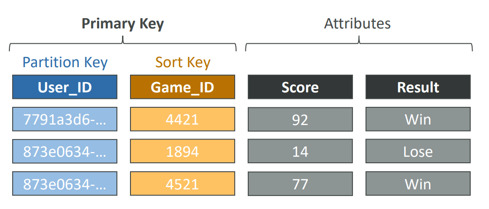

- Sample:
  - Before you create a DynamoDB table, you need to provision the EC2 instance the DynamoDB table will be running on.
    - False
  - DynamoDB is **serverless** with no servers to provision, patch, or manage and no software to install, maintain or operate. It automatically scales tables up and down to adjust for capacity and maintain performance. It provides both **provisioned** (specify RCU & WCU) and **on-demand** (pay for what you use) capacity **modes**.
    - The maximum size of an item in a DynamoDB table is **400kb**

---

### Read/Write Capacity Modes

- Control how you **manage your table’s capacity** (read/write throughput)

- **Provisioned Mode (default)**

  - You specify the **number** of **reads/writes** per second
  - You need to **plan** capacity **beforehand**
  - **Pay** for provisioned `Read Capacity Units (RCU)` & `Write Capacity Units (WCU)`
  - Possibility to add **auto-scaling mode** for RCU & WCU(but not scalling fast enough like On-Demand Mode)

- **On-Demand Mode**

  - Read/writes **automatically scale up/down** with your workloads
  - **No** capacity **planning** needed
  - Pay for what you use, **more expensive** ($$$)
  - Great for **unpredictable workloads**, steep **sudden spikes**

- Sample:
  - You have provisioned a DynamoDB table with 10 RCUs and 10 WCUs. A month later you want to increase the RCU to handle more read traffic. What should you do?
    - RCU and WCU are decoupled, so you can increase/decrease each value separately.
  - You are running an application in **production** that is leveraging DynamoDB as its datastore and is experiencing smooth **sustained usage**. There is a need to make the application run in **development** mode as well, where it will experience the **unpredictable** volume of requests. What is the most cost-effective solution that you recommend?
    - production=Provisioned mode+auto scaling, development=on-demand mode

---

### `DynamoDB Stream` Processing

- **Ordered** stream of **item-level modifications** (create/update/delete) in a table

- **Use cases**:

  - React to changes in **real-time** (welcome email to users)
  - Real-time usage **analytics**
  - Insert into **derivative tables**
  - Implement **cross-region replication**
  - **Invoke** `AWS Lambda` on changes to your DynamoDB table

- 2 Types of Stream processing in DynamoDB

  - `DynamoDB Streams`

    - **24** hours retention
    - **Limited** # of consumers
    - Process using `AWS Lambda Triggers`, or `DynamoDB Stream Kinesis` **adapter**

  - `Kinesis Data Streams` (newer)

    - **1 year** retention
    - **High** # of consumers
    - Process using `AWS Lambda`,` Kinesis Data Analytics`, `Kineis Data Firehose`, `AWS Glue Streaming ETL`

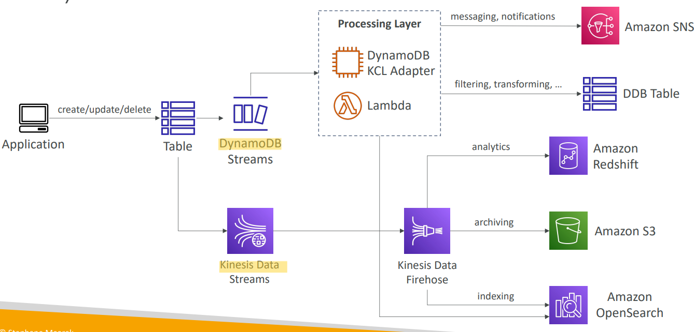

- Sample:
  - You have developed a mobile application that uses DynamoDB as its datastore. You want to automate sending welcome emails to new users after they sign up. What is the most efficient way to achieve this?
  - `DynamoDB Streams` allows you to capture a time-ordered sequence of item-level modifications in a DynamoDB table. It's integrated with `AWS Lambda` so that you create triggers that automatically respond to events in **real-time**.

---

### Time To Live (`TTL`)

- Automatically **delete items** after an expiry
  timestamp

- **Use cases**:

  - reduce stored data by keeping **only current items**,
  - adhere to **regulatory** obligations,
  - web **session handling**(常考)

- sample:
  - A website is currently in the development process and it is going to be hosted on AWS. There is a requirement to store **user sessions** for users logged in to the website with an **automatic expiry and deletion** of expired user sessions. Which of the following AWS services are best suited for this use case?
    - store session into dynamoDB enabling TTL

---

### Backups for disaster recovery

- **Continuous backups** using `point-in-time recovery (PITR)`

  - `Point-in-time recovery` to **any time** within the backup window
  - Optionally enabled for the **last 35 days**
  - The recovery process **creates a new table**

- **On-demand backups**

  - **Full backups** for **long-term retention**, until **explicitely deleted**
  - **Doesn’t affect performance** or latency
  - Can be configured and managed in `AWS Backup` (enables **cross-region copy**)
  - The recovery process **creates a new table**

---

### Integration with Amazon S3

- **Export** to `S3` (must **enable** `PITR`)
  - feature
    - Works for **any point of time** in the last **35 days**
    - **Doesn’t affect the read capacity** of your table
    - Export in DynamoDB `JSON` or `ION` **format**
  - Use Case:
    - Perform **data analysis** on top of DynamoDB
    - Retain snapshots for **auditing**
    - `ETL` on top of S3 data before importing back into `DynamoDB`

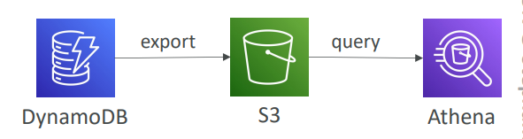

- **Import** from S3
  - Import `CSV`, DynamoDB `JSON` or `ION` **format**
  - **Doesn’t consume any write capacity**
  - Creates a new table
  - Import **errors** are logged in `CloudWatch Logs`

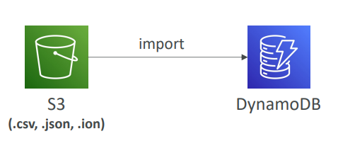

- Sample:
  - You are a DevOps engineer in a football company that has a website that is backed by a DynamoDB table. The table stores viewers’ feedback for football matches. You have been tasked to work with the **analytics** team to generate reports on the viewers’ feedback. The analytics team wants the data in DynamoDB in **json format** and hosted in an S3 bucket to start working on it and create the reports. What is the best and most cost-effective way to convert DynamoDB data to json files?
    - Select DynamoDB table then select Export to S3

---

## `DynamoDB Accelerator (DAX)`

- Fully-managed, highly available, seamless **inmemory cache** for `DynamoDB`
- Help solve **read congestion** by **caching**
- **Microseconds** **latency** for cached data
- Doesn’t require application logic modification(compatible with existing DynamoDB APIs)
- `5` minutes `TTL` for **cache** (default)

- Sample:
  - You have an e-commerce website where you are using DynamoDB as your database. You are about to enter the Christmas sale and you have a few items which are very popular and you expect that they will be read often. Unfortunately, last year due to the huge traffic you had the **`ProvisionedThroughputExceededException`** exception. What would you do to prevent this error from happening again?
    - Create DAX
    - DynamoDB Accelerator (DAX) is a fully managed, highly available, **in-memory cache** for DynamoDB that delivers up to **10x performance improvement**. It caches the **most frequently used data**, thus offloading the **heavy reads** on hot keys off your DynamoDB table, hence preventing the `ProvisionedThroughputExceededException` exception.
  - A company has a serverless application on AWS which consists of Lambda, DynamoDB, and Step Functions. In the last month, there are an **increase in the number of requests** against the application which results in an increase in DynamoDB costs, and requests started to be throttled. After further investigation, it shows that the **majority of requests are read requests** against some queries in the DynamoDB table. What do you recommend to prevent throttles and reduce costs efficiently?
    - DAX to cache most frequently read data.

---

### `DynamoDB Accelerator (DAX)` vs. `ElastiCache`

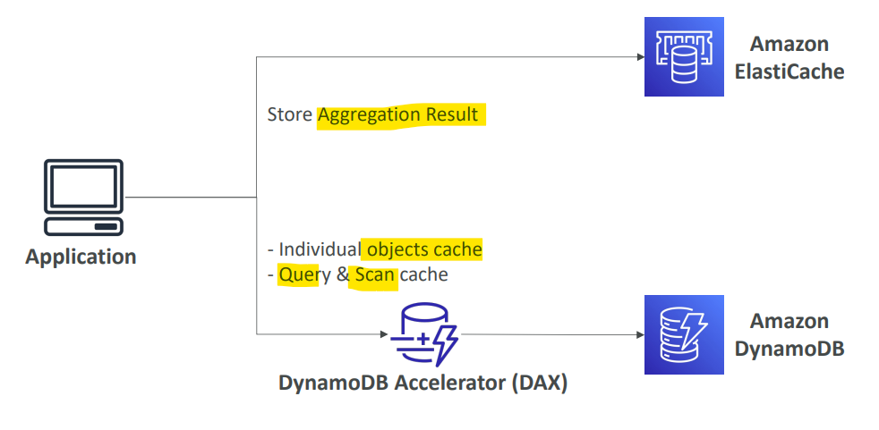

---

## `DynamoDB Global Tables`

- Make a DynamoDB table accessible with **low latency** in **multiple-regions**
- `Active-Active` replication
  - Applications can **READ** and **WRITE** to the table in any region
- **Must enable** `DynamoDB Streams` as a pre-requisite

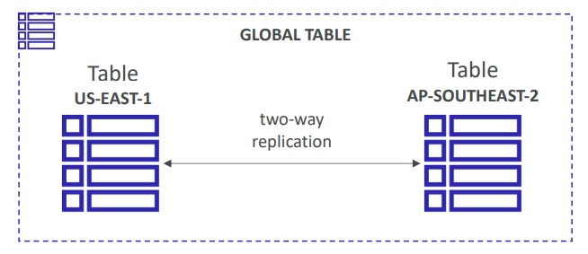

- sample:
  - You have created a DynamoDB table in ap-northeast-1 and would like to make it available in eu-west-1, so you decided to create a `DynamoDB Global Table`. What needs to be **enabled** first before you create a DynamoDB Global Table?
    - `DynamoDB Streams` enable DynamoDB to get a changelog and use that changelog to replicate data across replica tables in other AWS Regions.

---

## Hands-on

- Create table

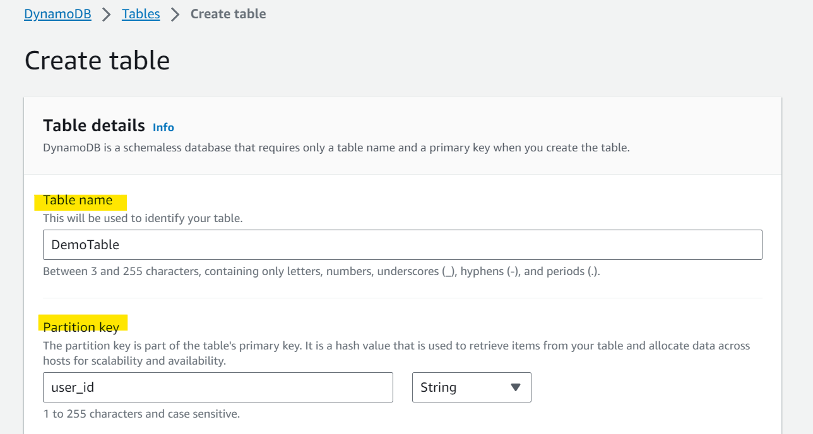

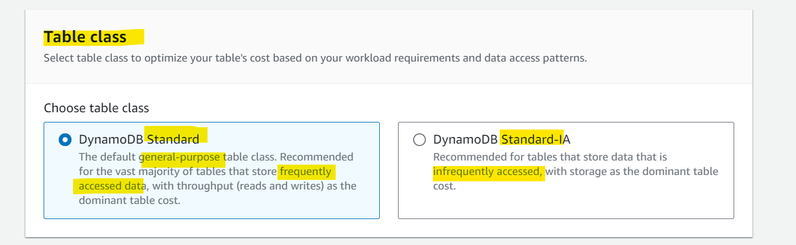

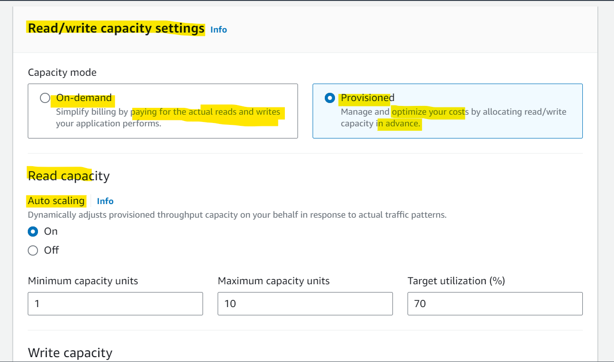

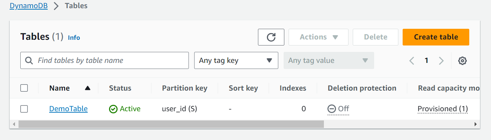

- Create Items

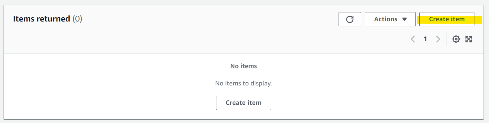

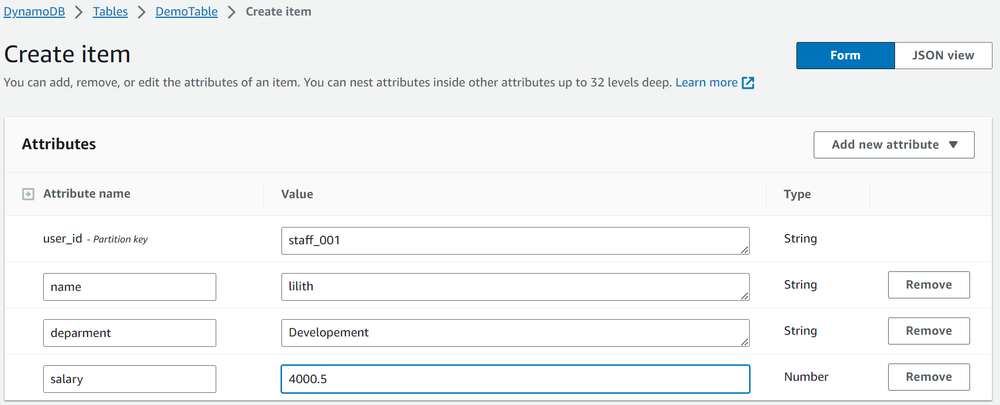

- Scan all items

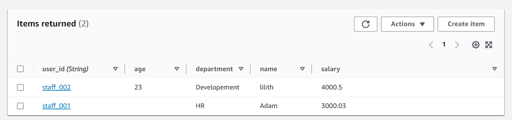

---

[TOP](#aws---dynamo)
