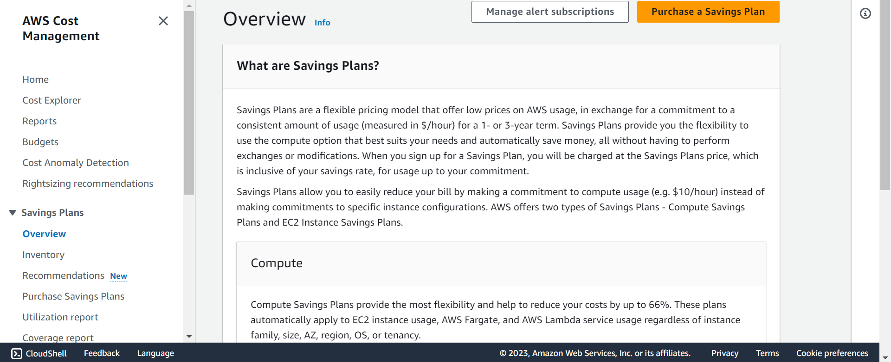
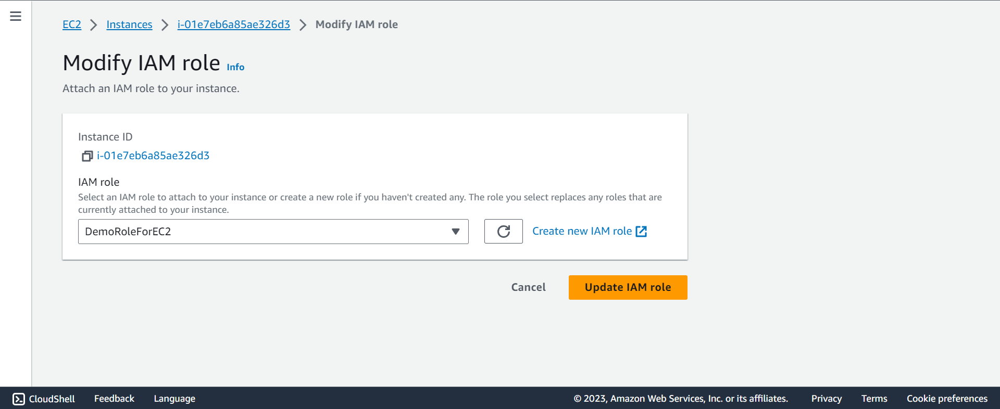
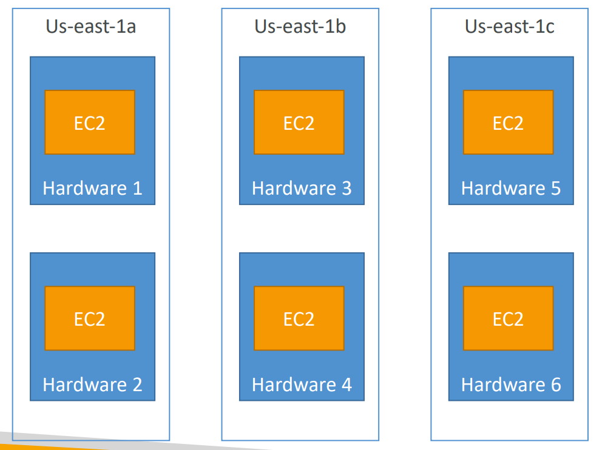
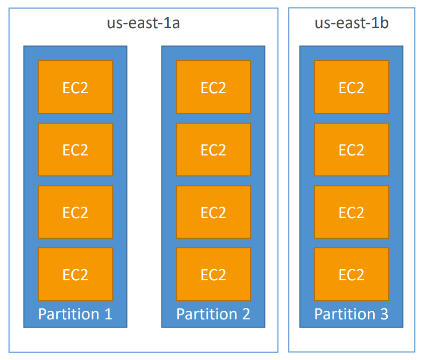
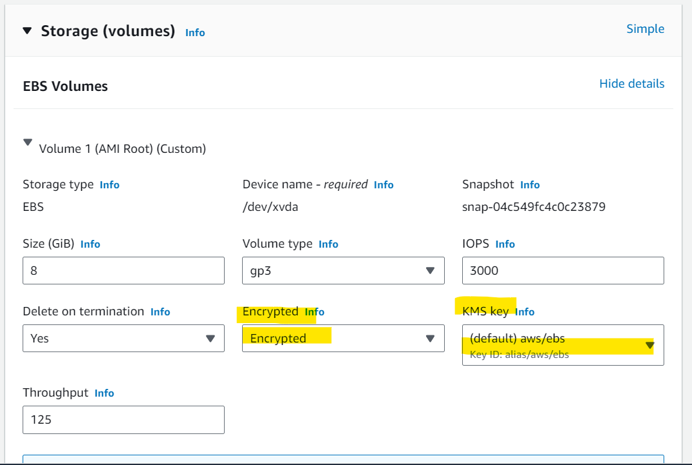
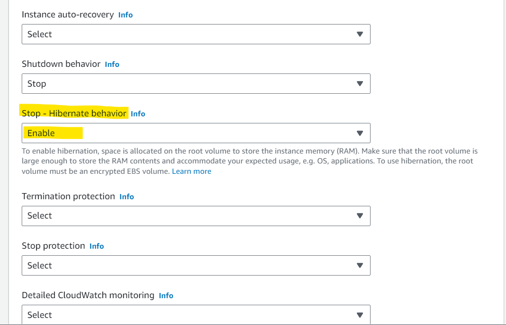
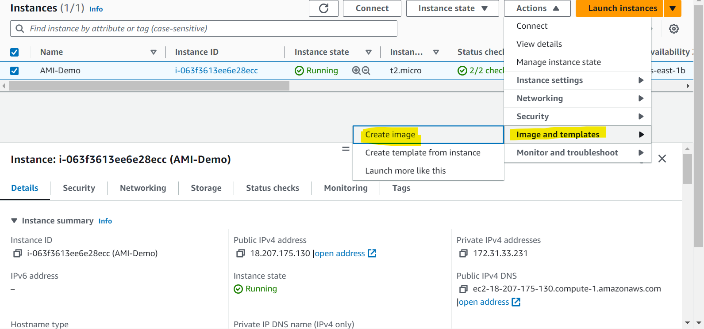
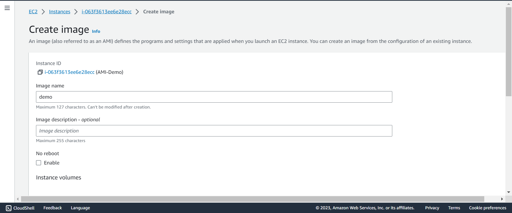

# AWS - EC2

[Back](../index.md)

- [AWS - EC2](#aws---ec2)
  - [Amazon EC2](#amazon-ec2)
  - [EC2 sizing \& configuration options](#ec2-sizing--configuration-options)
  - [EC2 Instance Types](#ec2-instance-types)
  - [Purchasing Options](#purchasing-options)
    - [On Demand](#on-demand)
    - [Reserved Instances](#reserved-instances)
      - [Hands-on: Reserved Instances](#hands-on-reserved-instances)
    - [Savings Plans](#savings-plans)
      - [Hands-on: Savings Plans](#hands-on-savings-plans)
    - [Spot Instances](#spot-instances)
      - [Spot Instance Requests](#spot-instance-requests)
      - [Hand-on: Spot Instance Requests](#hand-on-spot-instance-requests)
      - [Spot Fleets](#spot-fleets)
      - [Hands-on: Spot Fleets](#hands-on-spot-fleets)
    - [Dedicated Hosts](#dedicated-hosts)
    - [Dedicated Instances](#dedicated-instances)
    - [Capacity Reservations](#capacity-reservations)
    - [Right Option](#right-option)
  - [Advanced](#advanced)
    - [Attach aws role to EC2 instance](#attach-aws-role-to-ec2-instance)
    - [User Data](#user-data)
    - [Hands-on: User Data](#hands-on-user-data)
    - [Placement Groups](#placement-groups)
      - [Cluster](#cluster)
      - [Spread](#spread)
      - [Partition](#partition)
      - [Hands-on: Placement group](#hands-on-placement-group)
    - [Hibernate](#hibernate)
      - [Hands-on: Hibernate](#hands-on-hibernate)
    - [AMI](#ami)
      - [AMI Process (from an EC2 instance)](#ami-process-from-an-ec2-instance)
      - [Hands-on: AMI](#hands-on-ami)

---

## Amazon EC2

- `Amazon EC2`:
  - `Elastic Compute Cloud`
  - Infrastructure as a Service

- It mainly consists in the capability of :
  - Renting virtual machines (EC2)
  - Storing data on virtual drives (EBS)
  - Distributing load across machines (ELB)
  - Scaling the services using an auto-scaling group (ASG)

---

## EC2 sizing & configuration options


- **Operating System (OS)**: Linux, Windows or Mac OS
- How much **compute power & cores (CPU)**
- How much **random-access memory (RAM)**
- How much **storage** space:
  - Network-attached (EBS & EFS)
  - hardware (EC2 Instance Store)
- **Network card**: speed of the card, Public IP address
- **Firewall rules**: security group
- **Bootstrap script** (configure at first launch): EC2 User Data 

---


## EC2 Instance Types

- Naming convention: `[instance_class][generation].[size]`
  - eg: `m5.2xlarge`, `t2.micro`
 
- different types of EC2 instances that are optimised for different use cases
  - ref: https://aws.amazon.com/ec2/instance-types/

| Type              | Feature                                                  | Use Case            | Example |
| ----------------- | -------------------------------------------------------- | ------------------- | ------- |
| General Purpose   | for a diversity of workloads                             | web servers         | `t2`    |
| Compute Optimized | for compute-intensive tasks                              | ML, Gaming server   | `C6g`   |
| Memory Optimized  | for workloads that process large data sets in memory     | In-memory databases | `R5`    |
| Storage Optimized | for intensive access to large data sets on local storage | OLTP                | `I3`    |

---


## Purchasing Options

| Option                                                  | Feature                                                    |
| ------------------------------------------------------- | ---------------------------------------------------------- |
| On-Demand Instances                                     | short workload, predictable pricing, pay by second         |
| Reserved (1 & 3 years) - Reserved                       | long workloads                                             |
| Reserved (1 & 3 years) - Convertible Reserved Instances | long workloads with flexible instances                     |
| Savings Plans (1 & 3 years)                             | commitment to an amount of usage, long workload            |
| Spot Instances                                          | short workloads, cheap, can lose instances (less reliable) |
| Dedicated Hosts                                         | book an entire physical server, control instance placement |
| Dedicated Instances                                     | no other customers will share your hardware                |
| Capacity Reservations                                   | reserve capacity in a specific AZ for any duration         |

---

### On Demand

- Pay for what you use:
  - Linux or Windows - billing per second, after the first minute
  - All other operating systems - billing per hour
- Has the **highest cost** but **no upfront payment**
- No long-term commitment
- Recommended for** short-term** and **un-interrupted workloads**, where you can't predict how the application will behave 

---

### Reserved Instances

- Up to 72% **discount** compared to On-demand
- You reserve a specific **instance attributes** (Instance Type, Region, Tenancy, OS)
- Reservation **Period** 
  - 1 year (+discount)
  - 3 years (+++discount)

- **Payment** Options 
  - No Upfront (+), 
  - Partial Upfront (++), 
  - All Upfront (+++)

- Reserved Instance’s **Scope** 
  - Regional
  - Zonal (reserve capacity in an AZ)

- **Recommended** 
  - for **steady-state usage applications** (think database)

- You can buy and sell in the **Reserved Instance Marketplace**

- **Convertible Reserved Instance**
  - Can **change** the EC2 instance type, instance family, OS, scope and tenancy
  - Up to 66% discount

---

#### Hands-on: Reserved Instances


---

### Savings Plans

- Get a discount based on **long-term usage** (up to 72% - same as RIs)
- Commit to a **certain type of usage** ($10/hour for 1 or 3 years)
- Usage beyond EC2 Savings Plans is billed at the **On-Demand price**
- **Locked** to a specific instance family & AWS region (e.g., M5 in us-east-1)
- **Flexible** across:
  - Instance Size (e.g., m5.xlarge, m5.2xlarge)
  - OS (e.g., Linux, Windows)
  - Tenancy (Host, Dedicated, Default)

---

#### Hands-on: Savings Plans


- will redirect to Cost management



---

### Spot Instances

- Can get a **discount of up to 90%** compared to On-demand. Most discount
- Instances that you **can “lose”** at any point of time if your max price is less than the current spot price
- The **MOST cost-efficient instances** in AWS
- Useful for workloads that are **resilient to failure**
  - Batch jobs
  - Data analysis
  - Image processing
  - Any distributed workloads
  - Workloads with a flexible start and end time

- **Not suitable for critical jobs or databases**

---

#### Spot Instance Requests

- Can get a **discount of up to 90%** compared to On-demand
- Define **max spot price** and get the instance while current spot price < max
  - The hourly spot price varies based on offer and capacity
  - If the current spot price > your max price you can choose to **stop or terminate** your instance with a 2 minutes grace period.
- Other strategy: **Spot Block**
  - “block” spot instance during a specified time frame (1 to 6 hours) without interruptions
  - In rare situations, the instance may be reclaimed

- Used for batch jobs, data analysis, or workloads that are resilient to failures.
- Not great for critical jobs or databases

- terminate Spot Instances:
  - You can only cancel Spot Instance requests that are open, active, or disabled.
  - Cancelling a Spot Request **does not terminate instances**
  - You must **first cancel a Spot Request**, and then terminate the associated Spot Instance


---

#### Hand-on: Spot Instance Requests

- `EC2` > `Instances` > `Launch an instance`


---

#### Spot Fleets

- Spot Fleets allow us to automatically **request Spot Instances with the lowest price**

- `Spot Fleets`
  - set of **Spot Instances** + (optional) **On-Demand Instances**
- The Spot Fleet will try to meet the target capacity with **price constraints**
  - Define possible **launch pools**: instance type (m5.large), OS, Availability Zone
  - Can have multiple launch pools, so that the fleet can choose
  - Spot Fleet stops launching instances when reaching capacity or max cost


- **Strategies** to allocate Spot Instances:
  - **lowestPrice**: from the pool with the **lowest price** (cost optimization, short workload)
  - **diversified**: distributed across **all pools** (great for availability, long workloads)
  - **capacityOptimized**: pool with the **optimal capacity** for the number of instances
  - **priceCapacityOptimized** (recommended): pools with **highest capacity** available, then select the pool with the **lowest price** (best choice for most workloads)

---

#### Hands-on: Spot Fleets

- `EC2` > `Spot requests` > `Request Spot Instances`


---

### Dedicated Hosts

- A **physical server** with EC2 instance capacity **fully dedicated** to your use
- Allows you **address compliance requirements** and use your existing server-bound software **licenses** (per-socket, per-core, pe—VM software licenses)
- Purchasing Options:
  - On-demand – pay per second for active Dedicated Host
  - Reserved - 1 or 3 years (No Upfront, Partial Upfront, All Upfront)

- The **most expensive** option

- Useful
  - for software that have complicated **licensing** model (BYOL – Bring Your Own License)
  - for companies that have strong regulatory or **compliance** needs

- Hands-on


---

### Dedicated Instances

- Instances run on **hardware** that’s dedicated to you
- May **share** hardware with other instances **in same account**
- No control over instance placement (can move hardware after Stop / Start)

---

### Capacity Reservations

- Reserve On-Demand instances capacity **in a specific AZ** for **any duration**
  - You always have access to EC2 capacity when you need it
- No time commitment (create/cancel anytime), no billing discounts
- Combine with Regional Reserved Instances and Savings Plans to benefit from billing discounts
- You’re charged at **On-Demand rate** whether you **run instances or not**
- Suitable for short-term, uninterrupted workloads that needs to be in a specific AZ


---

### Right Option

- Spot instances: the hotel allows people to **bid for the empty rooms** and the highest bidder keeps the rooms. You can get kicked out at any time
- On demand: coming and staying in resort whenever we like, we pay the **full** price
- Reserved: like **planning ahead** and if we plan to stay **for a long time**, we may get a good discount.
- Savings Plans: pay **a certain amount** per hour **for certain period** and stay in any room **type** (e.g., King, Suite, Sea View, …)
- Capacity Reservations: you **book a room for a period** with full price even you don’t stay in it
- Dedicated Hosts: We book an **entire** building of the resort

---

## Advanced

### Attach aws role to EC2 instance

- After create an instance



- Result: 
  - Security: instance can access aws services without keep access key in the instance.


---

### User Data

- It is possible to **bootstrap** our instances using an EC2 User data script.
- `bootstrapping`:
  - **launching commands** when a machine starts
  - That script is only run once **at the instance first start**


- EC2 user data is used to automate boot tasks such as:
  - Installing updates
  - Installing software
  - Downloading common files from the internet
  - Anything you can think of
- The EC2 User Data Script runs with the **root user**. (script can skip `sudo`)

---

### Hands-on: User Data

- Create an EC2 as a linux server using user data

```sh
#!/bin/bash
# Use this for your user data (script from top to bottom)
# install httpd (Linux 2 version)
yum update -y
yum install -y httpd
systemctl start httpd
systemctl enable httpd
echo "<h1>Hello World from $(hostname -f)</h1>" > /var/www/html/index.html
```

---

### Placement Groups

- `placement groups`
  - used to define EC2 Instance **placement strategy**

- Strategies for the group:
  - `Cluster`:
    - clusters instances into a low-latency group **in a single Availability Zone**
  - `Spread`:
    - spreads instances **across underlying hardware** (max 7 instances per group per AZ)
  - `Partition`:
    - spreads instances **across many different partitions** (which rely on different sets of racks) within an AZ. Scales to **100s** of EC2 instances **per group** (Hadoop, Cassandra, Kafka)

---

#### Cluster


- **Same Rack, Same AZ**
- **Pros**: 
  - Great network (10 Gbps bandwidth between instances with Enhanced Networking enabled - recommended)
- **Cons**: 
  - If the rack fails, all instances fails at the same time
- **Use case**:
  - Big Data job that **needs to complete fast**
  - Application that needs extremely **low latency and high network throughput**

---

#### Spread



- **Different rack, same AZ or different AZ**
- **Pros**:
  - Can span across Availability Zones (AZ)
  - Reduced risk is simultaneous failure
  - EC2 Instances are on **different physical hardware**
- **Cons**:
  - Limited to **7 instances per AZ** per placement group
- **Use case**:
  - Application that needs to **maximize high availability**
  - Critical Applications where each instance must be **isolated** from failure from each other

---

#### Partition



- **Different partitions, different rack.**
- Up to **7 partitions per AZ**
- Can span across **multiple AZs** in the same region
- Up to **100s of EC2 instances**
- The instances in a partition do not share racks with the instances in the other partitions
- A partition failure can affect many EC2 but won’t affect other partitions
- EC2 instances get access to the partition information as metadata
- **Use cases**: 
  - HDFS, HBase, Cassandra, Kafka

---

#### Hands-on: Placement group

- EC2 > Placement groups > Create placement group


---

### Hibernate

- We know we can stop, terminate instances
  - **Stop** – the data on disk (`EBS`) is **kept** intact in the next start
  - **Terminate** – any EBS volumes (root) also set-up to be **destroyed** is lost.

- On start, the following happens:
  - First start: the OS boots & the EC2 User Data script is run
  - Following starts: the OS boots up
  - Then your application starts, caches get warmed up, and that can take time! 

- Introducing **EC2 Hibernate**:
  - The **in-memory (RAM) state** is preserved
  - The instance boot is much **faster**! (the OS is not stopped / restarted)
  - Under the hood: the RAM state is **written to a file in the root EBS volume**
  - The root EBS volume must be encrypted

- Use cases:
  - Long-running processing
  - Saving the RAM state
  - Services that take time to initialize

- Good to know
  - Supported **Instance Families** – C3, C4, C5, I3, M3, M4, R3, R4, T2, T3, …
  - Instance **RAM Size** – must be less than 150 GB.
  - Instance **Size** – not supported for bare metal instances.
  - **AMI** – Amazon Linux 2, Linux AMI, Ubuntu, RHEL, CentOS & Windows…
  - Root Volume – **must be EBS**, encrypted, **not instance store**, and large
  - Available for On-Demand, Reserved and Spot Instances
  - An instance can **NOT be hibernated more than 60 days**

---

#### Hands-on: Hibernate

- Enable Hibernate when creating EC2
  - instance memory < EBS
  - EBS Encrypted  
  - Advanced > Stop - Hibernate behavior: Enable





- Hibernate instance


---

### AMI

- `AMI`: `Amazon Machine Image`
  - a customization of an EC2 instance
  - You add your own software, configuration, operating system, monitoring…

- Faster boot / configuration time because all your software is pre-packaged
- AMI are built for **a specific region** (and can be copied across regions)

- You can launch EC2 instances from:
  - **A Public AMI**: 
    - AWS provided
  - **Your own AMI**: 
    - you make and maintain them yourself
  - **An AWS Marketplace AMI**: 
    - an AMI someone else made (and potentially sells)

---

#### AMI Process (from an EC2 instance)

- Start an EC2 instance and customize it
- Stop the instance (for data integrity)
- Build an AMI – this will also create EBS snapshots
- Launch instances from other AMIs


---

#### Hands-on: AMI

- Create





- List


---

[TOP](#aws---ec2)