# AWS EC2 - Storage

[Back](../index.md)

- [AWS EC2 - Storage](#aws-ec2---storage)
  - [EBS](#ebs)
    - [EBS Volume](#ebs-volume)
      - [Hands-on: EBS Volume](#hands-on-ebs-volume)
    - [EBS Snapshots](#ebs-snapshots)
      - [Hands-on: EBS Snapshots](#hands-on-ebs-snapshots)
    - [EBS Volume Types](#ebs-volume-types)
    - [EBS Volume Types Use cases](#ebs-volume-types-use-cases)
      - [General Purpose SSD](#general-purpose-ssd)
      - [Provisioned IOPS (PIOPS) SSD](#provisioned-iops-piops-ssd)
      - [Hard Disk Drives (HDD)](#hard-disk-drives-hdd)
    - [Multi-Attach – io1/io2 family](#multi-attach--io1io2-family)
    - [EBS Encryption](#ebs-encryption)
      - [Hands-on: Encryption](#hands-on-encryption)
  - [EC2 Instance Store](#ec2-instance-store)
  - [EFS](#efs)
    - [Elastic File System](#elastic-file-system)
    - [Performance](#performance)
    - [Storage Classes](#storage-classes)
    - [Hands-on: EFS](#hands-on-efs)
  - [EBS vs EFS](#ebs-vs-efs)
    - [Elastic Block Storage](#elastic-block-storage)
    - [Elastic File System](#elastic-file-system-1)

---

## EBS

### EBS Volume

- An `EBS (Elastic Block Store) Volume` is a network drive you can **attach to your instances** while they run
- 
- It allows your instances to **persist data**, even after their termination
- They can only be mounted to one instance at a time (at the CCP level)
- **Multi-attach** feature for **some** EBS (at the SAA level) 多个EBS连接到同一个instance
- Analogy: 
  - Think of them as a “network USB stick”
- Free tier: 
  - **30 GB** of free EBS storage of type General Purpose (**SSD**) or Magnetic per month

- It’s a **network** drive (i.e. not a physical drive)
  - It uses the network to communicate the instance, which means there might be a **bit of latency**
  - It can be detached from an EC2 instance and **attached** to another one quickly

- It’s locked to an **Availability Zone (AZ)**
  - An EBS Volume in us-east-1a cannot be attached to us-east-1b
  - To **move a volume across**, you first need to snapshot it

- Have a provisioned capacity (size in GBs, and IOPS)
  - You get billed for all the provisioned capacity
  - You can increase the capacity of the drive over time

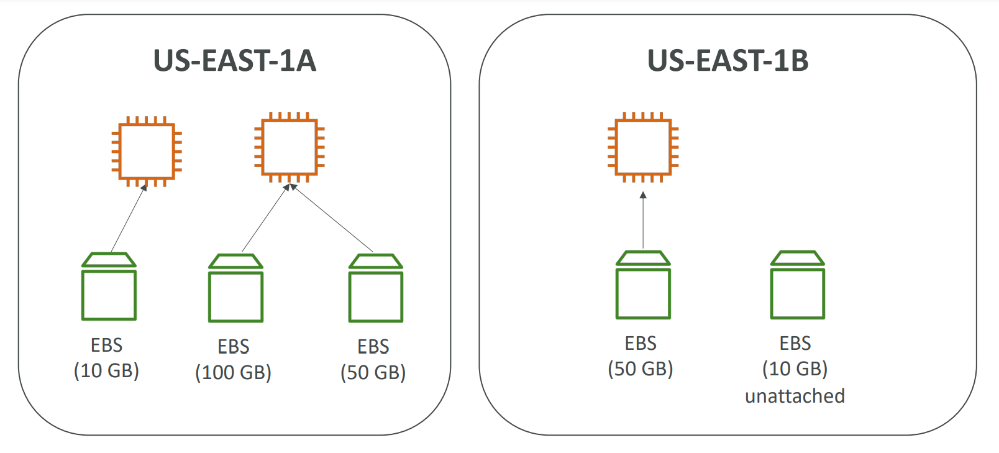

- Delete on Termination attribute
  - Controls the EBS behaviour when an EC2 instance terminates
    - By default, the **root** EBS volume is **deleted** (attribute enabled)
    - By default, any **other** attached EBS volume is **not deleted** (attribute disabled)
  - This can be controlled by the AWS console / AWS CLI
  - Use case: 
    - **preserve root volume** when instance is terminated

---

#### Hands-on: EBS Volume

- EBS on EC2

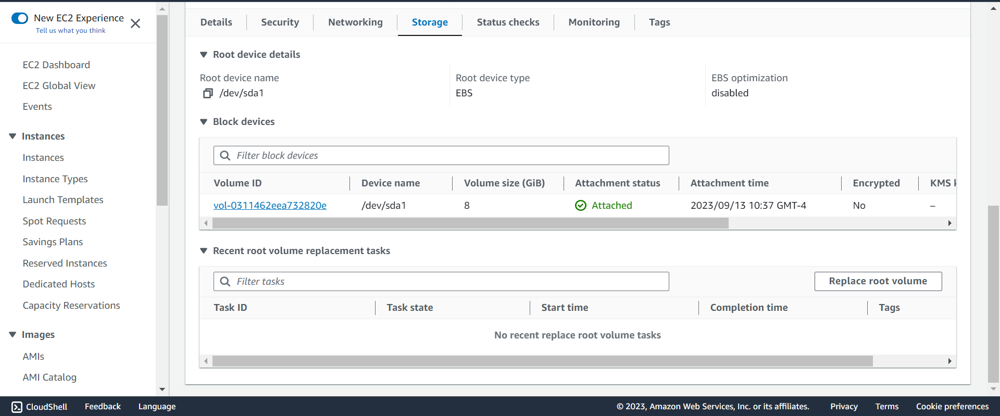

- List of EBS

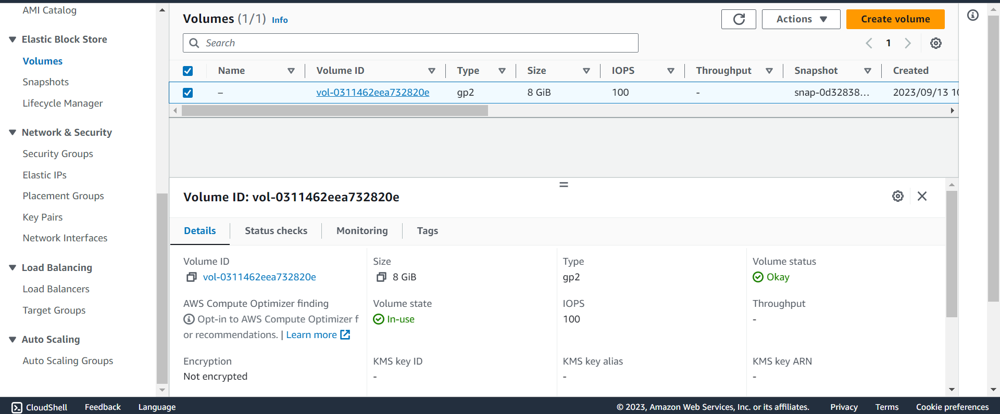

- Create EBS

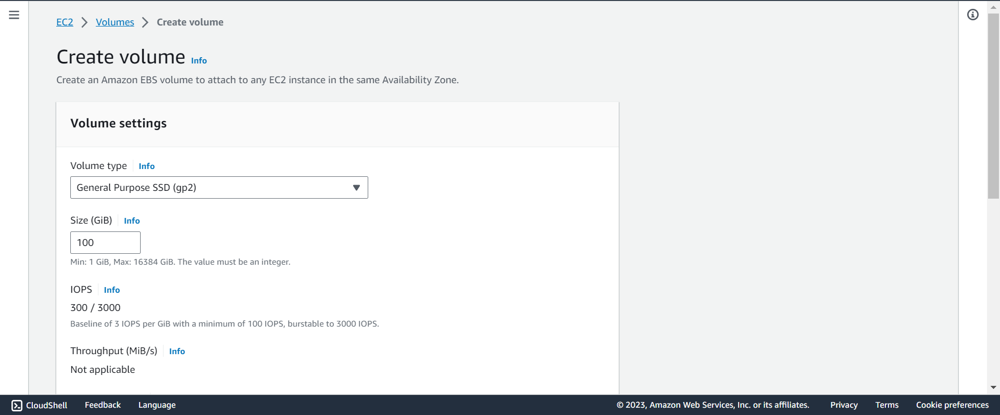

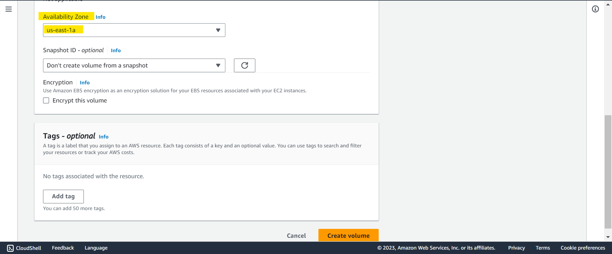

- Attach EBS

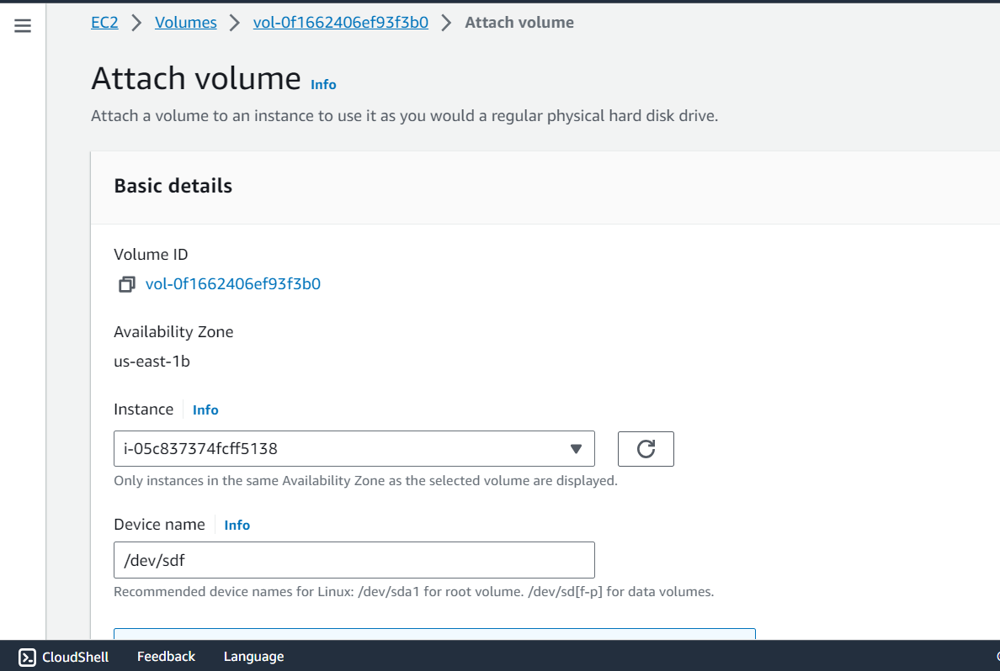

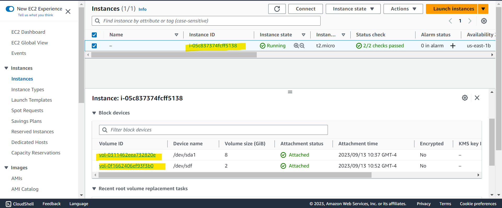

- Default **Delete on termination** attribute

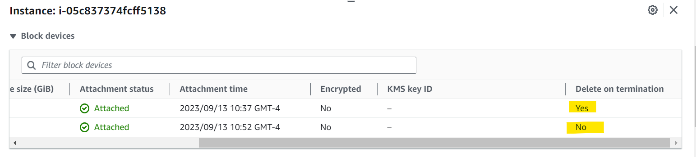

---

### EBS Snapshots

- Make a backup (snapshot) of your EBS volume at a point in time
- Not necessary to **detach volume to do snapshot**, but **recommended**
- Can copy snapshots **across AZ or Region**

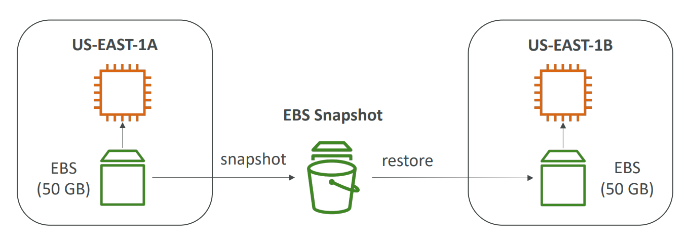

- `EBS Snapshot Archive`
  - Move a Snapshot to an ”archive tier” that is **75%** cheaper
  - Takes within 24 to 72 hours for restoring the archive

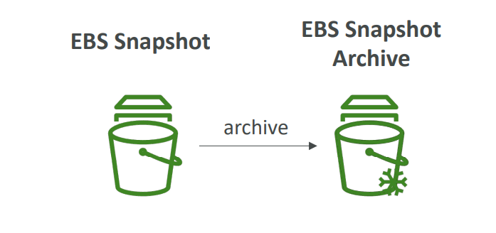

- **Recycle Bin** for EBS Snapshots
  - Setup rules to retain deleted snapshots so you can recover them after an accidental deletion
  - Specify retention (from 1 day to 1 year)

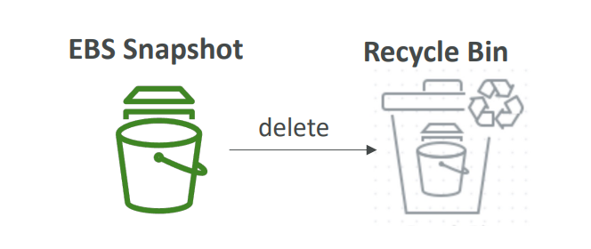

- `Fast Snapshot Restore (FSR)`
  - Force full initialization of snapshot to have no latency on the first use ($$$)

---

#### Hands-on: EBS Snapshots

- Create snapshot

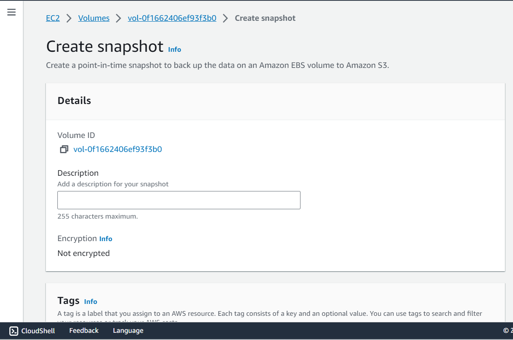

- List snapshot

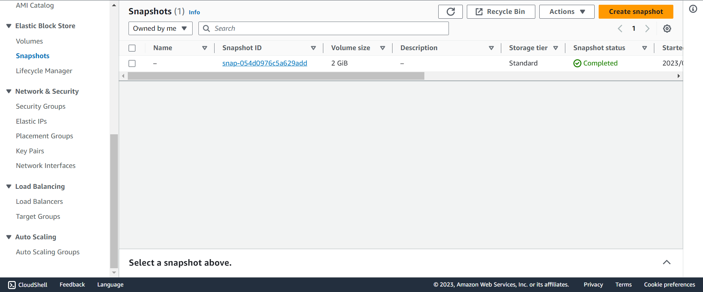

- Create volume from snapshot

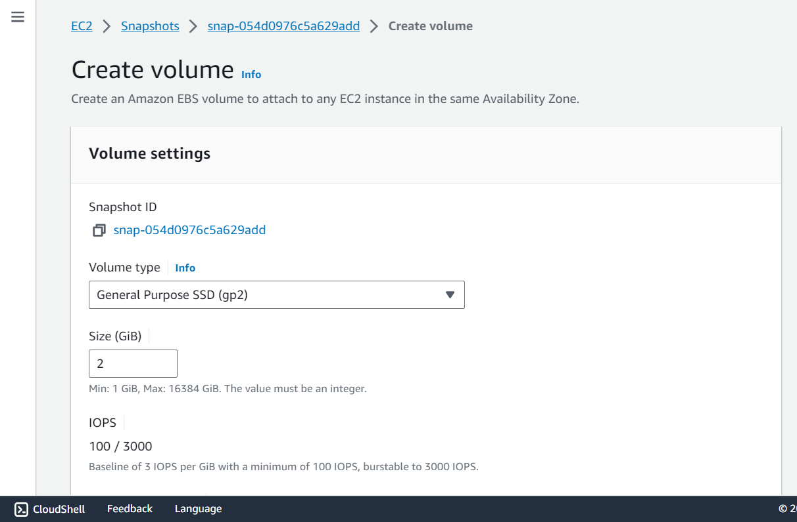

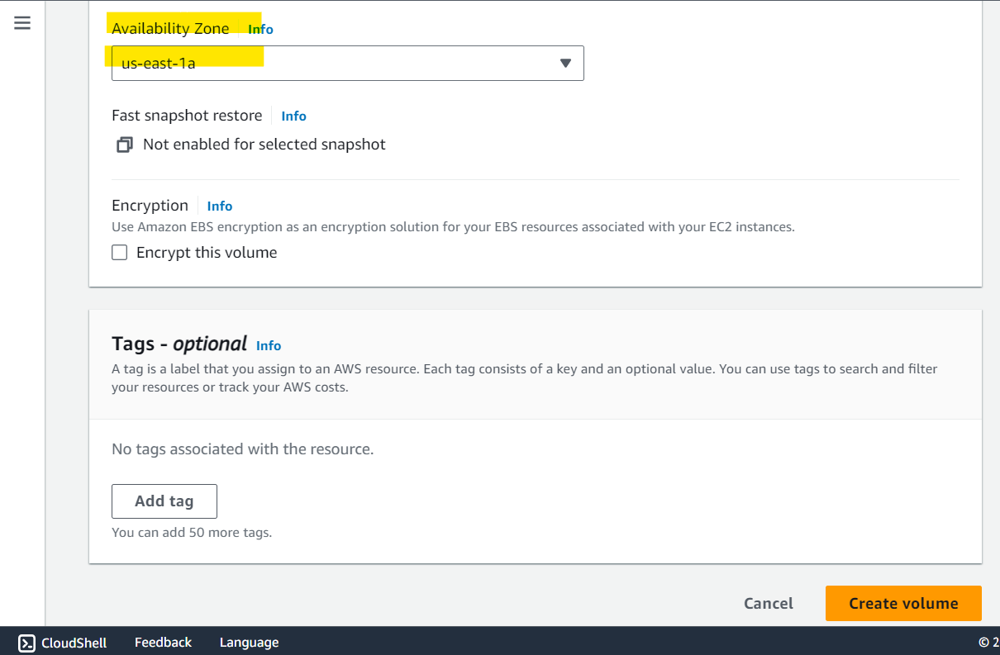

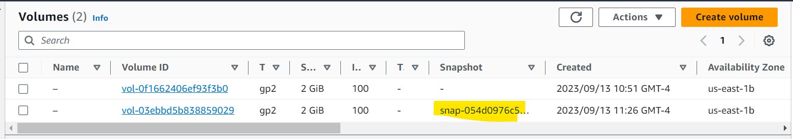

---

- Recycle Bin: Create rules

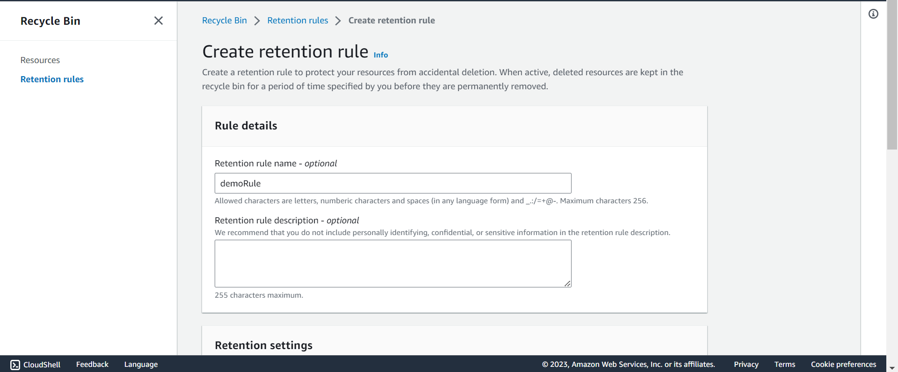

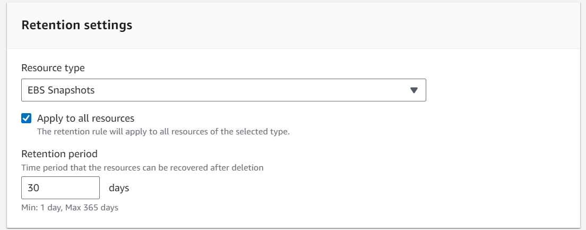

- Recycle Bin: Delete Snapshot

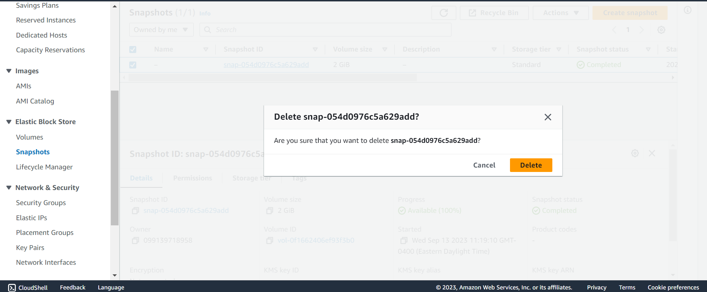

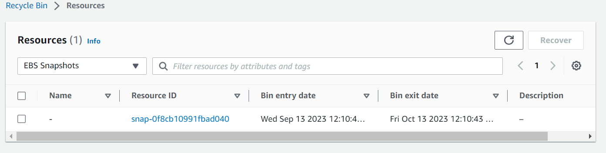

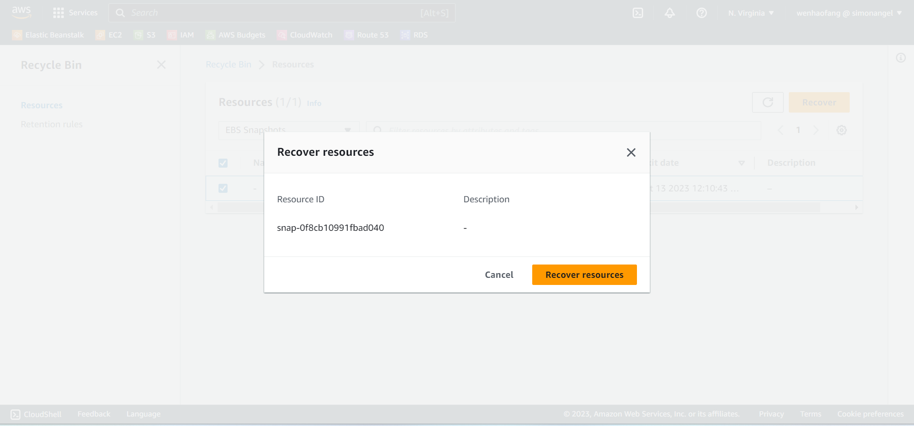

---

### EBS Volume Types

- EBS Volumes come in 6 types
  - `gp2 / gp3 (SSD)`: General purpose SSD volume that **balances price and performance** for a wide variety of workloads
  - `io1 / io2 (SSD)`: **Highest-performance** SSD volume for **mission-critical low-latency or   high-throughput workloads**
  - `st1 (HDD)`: Low cost HDD volume designed for **frequently accessed, throughput-intensive workloads**
  - `sc1 (HDD)`: **Lowest cost** HDD volume designed for **less frequently accessed workloads**

- EBS Volumes are characterized in **Size** | **Throughput** | **IOPS (I/O Ops Per Sec)**
- When in doubt always consult the AWS documentation – it’s good!
- Only gp2/gp3 and io1/io2 can be used as **boot volumes**

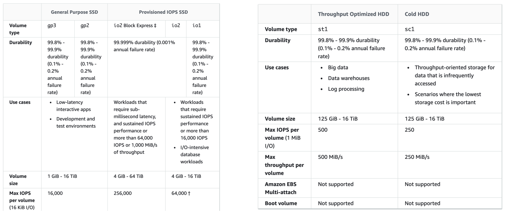

---

### EBS Volume Types Use cases

#### General Purpose SSD
  - Cost effective storage, low-latency
  - System boot volumes, Virtual desktops, Development and test environments
  - 1 GiB - 16 TiB
  
  - gp3:
    - Baseline of 3,000 IOPS and throughput of 125 MiB/s
    - Can increase IOPS up to 16,000 and throughput up to 1000 MiB/s independently (可以独立设置IOPS)
  
  - gp2:
    - Small gp2 volumes can burst IOPS to 3,000
    - Size of the volume and IOPS are linked, max IOPS is 16,000
    - 3 IOPS per GB, means at 5,334 GB we are at the max IOPS

---

#### Provisioned IOPS (PIOPS) SSD

- Critical business applications with sustained **IOPS performance**
- Or applications that need more than 16,000 IOPS
- Great for **databases workloads (sensitive to storage perf and consistency)**

- **io1/io2** (4 GiB - 16 TiB): 快
  - Max PIOPS: 64,000 for **Nitro** EC2 instances & 32,000 for other
  - Can **increase PIOPS independently** from storage size
  - io2 have more durability and more IOPS per GiB (at the same price as io1)

- **io2 Block Express** (4 GiB – 64 TiB): 量大
  - Sub-millisecond latency
  - Max PIOPS: 256,000 with an IOPS:GiB ratio of 1,000:1
  - Supports EBS **Multi-attach**

---

#### Hard Disk Drives (HDD)

- **Cannot be a boot volume**
- 125 GiB to 16 TiB

- Throughput Optimized HDD (st1)
 - **Big Data, Data Warehouses, Log Processing**
 - Max throughput 500 MiB/s – max IOPS 500

- **Cold** HDD (sc1):
 - For data that is **infrequently accessed**(archived)
 - Scenarios where lowest cost is important
 - Max throughput 250 MiB/s – max IOPS 250

---

### Multi-Attach – io1/io2 family

- Attach the **same EBS volume to multiple EC2 instances** in the **same AZ**
- Each instance has full read & write **permissions** to the high-performance volume
  
- Use case:
  - Achieve higher application availability in clustered Linux applications (ex: Teradata)
  - Applications must manage **concurrent** write operations

- Up to **16 EC2 Instances** at a time
- Must use a **file system that’s cluster-aware** (not XFS, EXT4, etc…) 

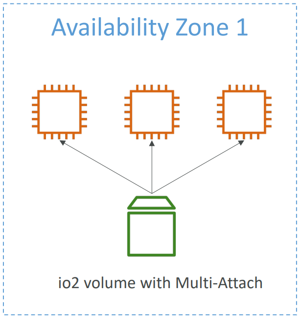

---

### EBS Encryption

- When you create an encrypted EBS volume, you get the following:
  - Data at rest is encrypted inside the volume
  - All the data in flight moving between the instance and the volume is encrypted
  - All snapshots are encrypted
  - All volumes created from the snapshot

- Encryption and decryption are handled transparently (you have nothing to do)

- Encryption has a minimal **impact on latency**

- EBS Encryption leverages **keys from KMS** (AES-256)

- Copying an **unencrypted** snapshot **allows encryption**

- **Snapshots** of encrypted volumes are **encrypted**

- encrypt an unencrypted EBS volume
    - **Create an EBS snapshot** of the volume
    - **Encrypt the EBS snapshot** ( using copy )
    - **Create new ebs** volume from the snapshot ( the volume will also be encrypted )
    - Now you can **attach** the encrypted volume to the original instance

---

#### Hands-on: Encryption

- Create volume from snapshot
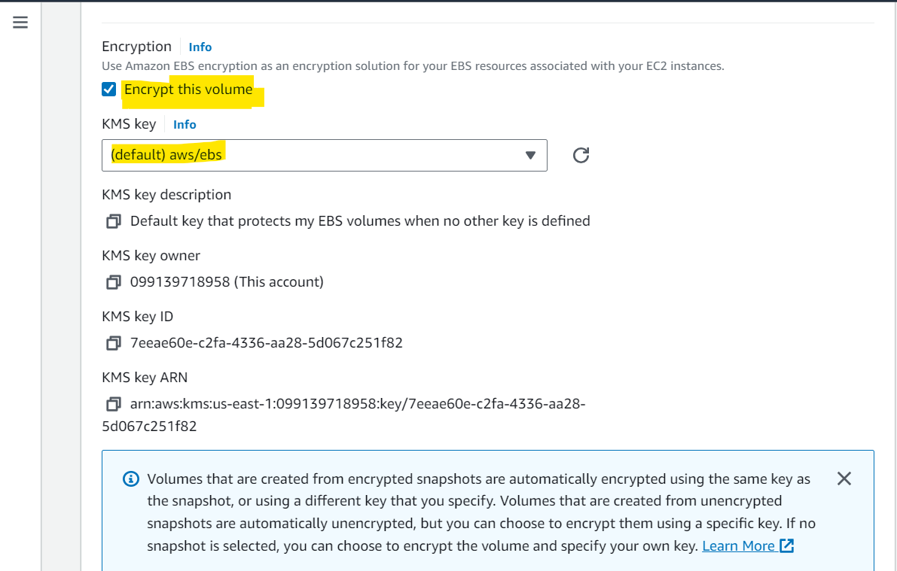

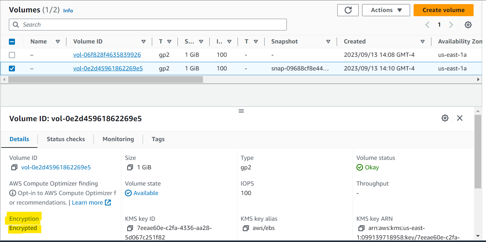

---

## EC2 Instance Store

- EBS volumes are **network drives** with good but “limited” performance
- If you need a **high-performance hardware disk**, use `EC2 Instance Store`

- Feature
  - Better I/O performance
  - EC2 Instance Store lose their storage if they’re stopped (ephemeral)

- Use Case
  - Good for buffer / cache / scratch data / **temporary content**
  - Risk of data loss if hardware fails
  - **Backups and Replication are your responsibility**

- Instance Size: `i3`, high write IOPS

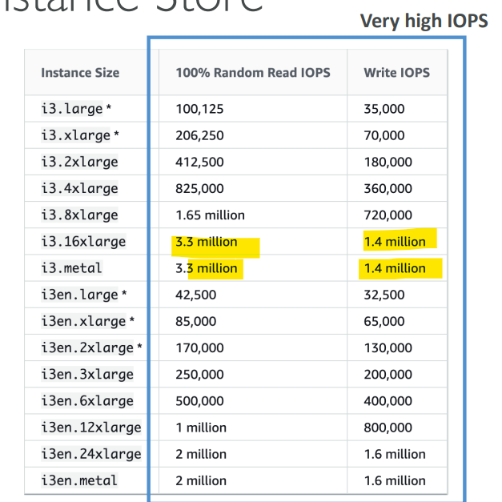

---

## EFS

### Elastic File System

- Managed `NFS (network file system)` that **can be mounted** on many EC2
- EFS works with EC2 instances in **multi-AZ**
- Highly available, scalable, expensive (3x gp2), **pay per use** 

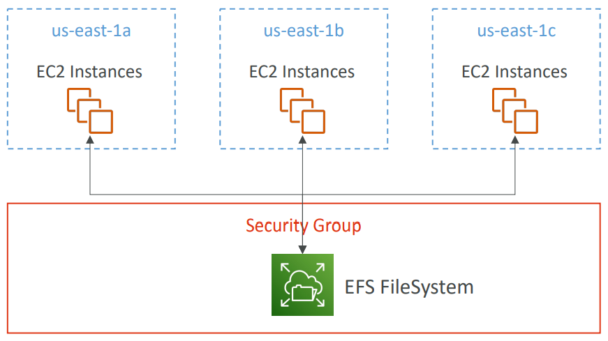

- **Use cases**: 
  - content management, web serving, data sharing, Wordpress

- Uses NFSv4.1 protocol
- Uses **security group** to control access to EFS
- Compatible with **Linux** based AMI (not Windows)
- Encryption at rest using KMS

- `POSIX` file system (~Linux) that has a standard file API
- File system **scales automatically**, pay-per-use, no capacity planning!

---

### Performance

- **EFS Scale**
  - 1000s of concurrent NFS clients, 10 GB+ /s throughput
  - Grow to Petabyte-scale network file system, automatically
  
- **Performance Mode** (set at EFS creation time)
  - **General Purpose (default)**:
    - latency-sensitive use cases (web server, CMS, etc…)
  - **Max I/O**
    - higher latency, throughput, highly parallel (big data, media processing)

- **Throughput Mode**
  - **Bursting** 
    - 1 TB = 50MiB/s + burst of up to 100MiB/s
  - **Provisioned**:
    - set your throughput regardless of storage size, ex: 1 GiB/s for 1 TB storage
  - **Elastic**
    - automatically scales throughput up or down based on your workloads
    - Up to 3GiB/s for reads and 1GiB/s for writes
    - Used for  workloads

---

### Storage Classes 

- **Storage Tiers (lifecycle management feature – move file after N days)**
  - **Standard**: for frequently accessed files
  - **Infrequent access (EFS-IA)**: cost to retrieve files, lower price to store. Enable EFS-IA with a Lifecycle Policy

- **Availability and durability**
  - **Standard**: Multi-AZ, great for prod
  - **One Zone**: One AZ, great for dev, backup enabled by default, compatible with IA (EFS One Zone-IA)

- Over 90% in cost savings

---

### Hands-on: EFS

- Create security group

- Create efs

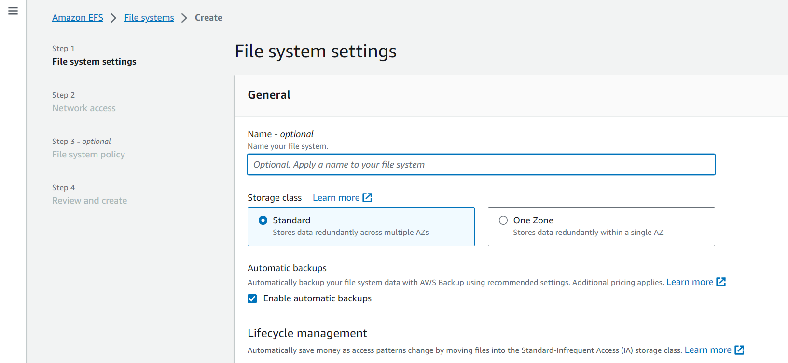

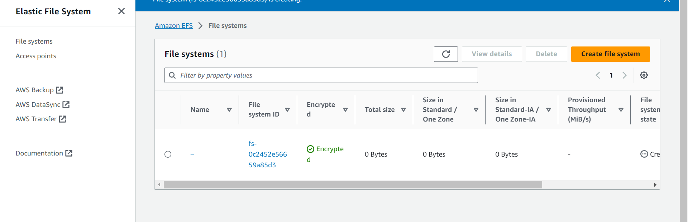

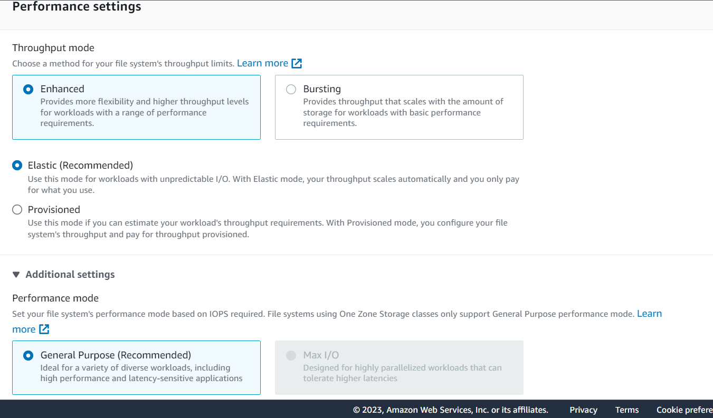

- Attach to multple EC2

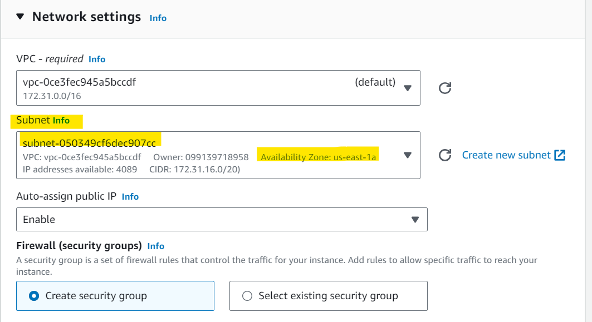

---

## EBS vs EFS 

### Elastic Block Storage

- EBS volumes…
  - one instance (**except multi-attach io1/io2**)
  - are locked at the **Availability Zone (AZ)** level
  - gp2: IO increases if the disk size increases
  - io1: can increase IO independently

- To migrate an EBS volume **across AZ**
  - Take a **snapshot**
  - Restore the snapshot to another AZ
  - EBS backups use IO and you shouldn’t run them while your application is handling a lot of traffic

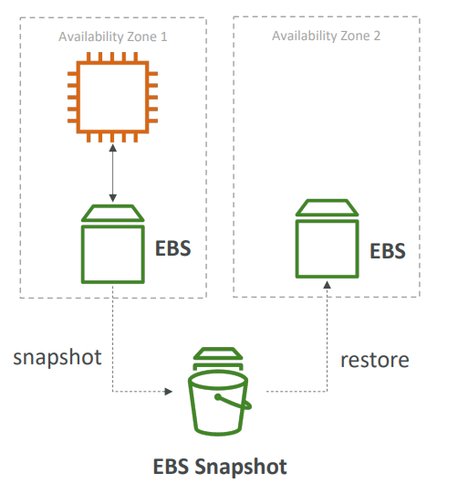

- Root EBS Volumes of instances get **terminated** by default if the EC2 instance gets terminated. (you can disable that)

---

### Elastic File System

- Mounting 100s of instances **across AZ**
- EFS **share** website files (WordPress)
- Only for **Linux** Instances (POSIX)
- EFS has a higher **price** point than EBS
- Can leverage **EFS-IA** for cost savings
- Remember: EFS vs EBS vs Instance Store

---

[TOP](#aws-ec2---storage)