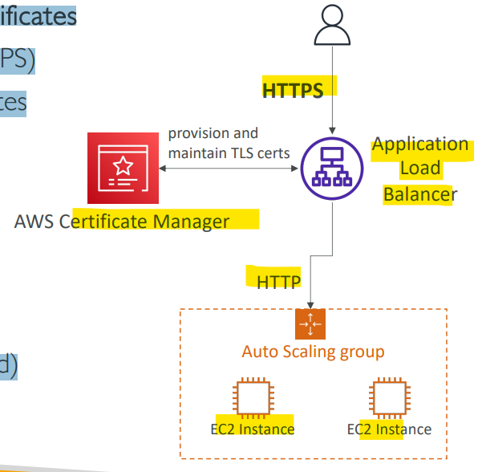
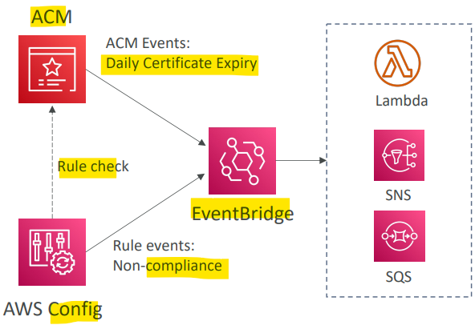
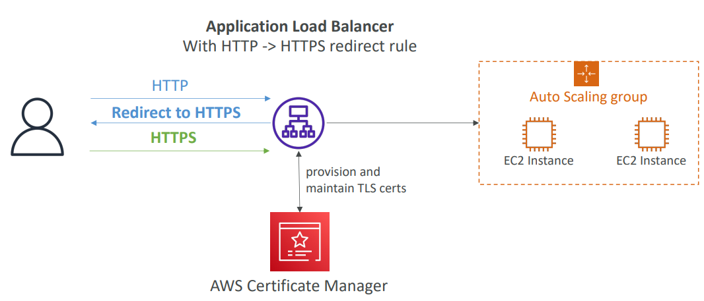
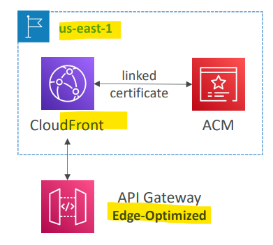
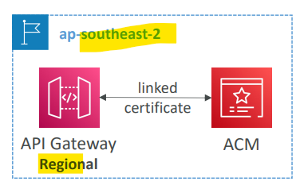

# AWS - Certificate Manager (ACM)

[Back](../index.md)

- [AWS - Certificate Manager (ACM)](#aws---certificate-manager-acm)
  - [`AWS Certificate Manager (ACM)`](#aws-certificate-manager-acm)
    - [Requesting Public Certificates](#requesting-public-certificates)
    - [Importing Public Certificates](#importing-public-certificates)
  - [Example: Integration with ALB](#example-integration-with-alb)
  - [Example: Integrate with API Gateway](#example-integrate-with-api-gateway)

---

## `AWS Certificate Manager (ACM)`

- Usage

  - Easily provision, manage, and deploy `TLS Certificates`
  - Provide `in-flight encryption` for websites (`HTTPS`)

- features

  - Supports both **public** and **private** TLS certificates
  - **Free of charge** for **public** TLS certificates
  - **Automatic** TLS certificate **renewal**

- **Integrations** with (load TLS certificates on)

  - `Elastic Load Balancers` (CLB, ALB, NLB)
  - `CloudFront` Distributions
  - APIs on `API Gateway`

- **Cannot** use `ACM` with EC2 (can’t be extracted)

---

### Requesting Public Certificates

1. **List domain names** to be included in the certificate
   - `Fully Qualified Domain Name (FQDN)`:
     - e.g.: `corp.example.com`
   - `Wildcard Domain`:
     - e.g.:`*.example.com`
2. Select Validation **Method**: `DNS Validation` or `Email validation`
   - `DNS Validation` is preferred for **automation purposes**
     - will leverage a `CNAME` record to `DNS config`(ex: Route 53)
   - `Email validation` will **send emails** to contact addresses in the WHOIS database
3. It will take a few **hours** to get **verified**
4. The `Public Certificate` will be enrolled for **automatic renewal**
   - ACM automatically **renews** ACM-generated certificates **60 days before** expiry

---

### Importing Public Certificates

- **Option** to **generate** the certificate outside of ACM and then **import** it
- **No automatic renewal**
  - **must import a new** certificate **before expiry**
- **ACM sends daily expiration events** starting **45** days prior to expiration
  - The # of days can be **configured** -
  - Events are appearing in `EventBridge`
- `AWS Config` has a managed **rule** named `cm-certificate-expiration-check` to **check for expiring certificates** (configurable number of days)

- Sample:
  - You have generated a public certificate using LetsEncrypt and uploaded it to the ACM so you can use and attach to an Application Load Balancer that forwards traffic to EC2 instances. As this certificate is generated outside of AWS, it does not support the automatic renewal feature. How would you be **notified** 30 days **before this certificate expires** so you can manually generate a new one?
    - Configure **EventBridge** for **Daily Expiration Events** from ACM to invoke **SNS** notifications to your email

---

## Example: Integration with ALB

- Set a redirect rule in ALB to redirect a `HTTP` request to a `HTTPS` request.

---

## Example: Integrate with API Gateway

- Based on different Endpoint Types

- **Create** a `Custom Domain Name` in API Gateway

- **Edge-Optimized (default)**:

  - For global clients
  - quests are routed through the CloudFront Edge locations (improves latency)
  - The API Gateway still **lives** in **only one region**
  - The `TLS Certificate` must be **in the same region** as `CloudFront`, i.e.: `us-east-1`
  - Then **setup CNAME or (better) A-Alias record** in Route 53

- **Regional:**

  - For clients within the same region
  - The TLS Certificate must be imported on API Gateway, **in the same region** as the API Stage
  - Then setup CNAME or (better) A-Alias record in Route 53

- **Private:**

  - Can **only** be accessed from **your VPC** using an interface VPC endpoint (ENI)
  - Use a resource **policy** to define access
  - Not mention.

- Sample:
  - You have created the **main** `Edge-Optimized API Gateway` in us-west-2 AWS region. This main Edge-Optimized API Gateway forwards traffic to the second level API Gateway in ap-southeast-1. You want to **secure the main API Gateway by attaching an ACM certificate** to it. Which AWS region are you going to create the ACM certificate in?
    - us-east-1
    - As the `Edge-Optimized API Gateway` is using a custom AWS managed CloudFront distribution behind the scene to route requests across the globe through CloudFront Edge locations, the ACM certificate must be created in `us-east-1`.

---

[TOP](#aws---certificate-manager-acm)
