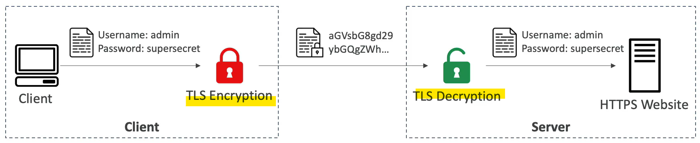
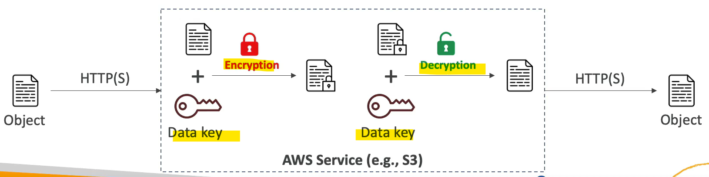
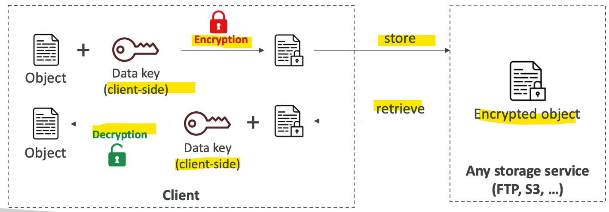

# AWS - Encryption

[Back](../index.md)

- [AWS - Encryption](#aws---encryption)
  - [Summary](#summary)
  - [Encryption in flight](#encryption-in-flight)
  - [Encryption at rest](#encryption-at-rest)
    - [Server side](#server-side)
    - [Client side](#client-side)

---

## Summary

| Service               | Features                                     |
| --------------------- | -------------------------------------------- |
| `KMS`                 | manages encryption keys                      |
| `SSM` Parameter Store | Centralized storage secret and configuration |
| `Secrets Manager`     | store secrets, force rotation                |
| `ACM`                 | TLS Certificates                             |

---

## Encryption in flight

- `Encryption in flight`
  - Data is **encrypted** _before sending_ and **decrypted** _after receiving_
  - ensures no `MITM (man in the middle attack)` can happen
  - `SSL` certificates help with encryption (`HTTPS`)

- Sample:
  - To enable In-flight Encryption (In-Transit Encryption), we need to have ......
    - `HTTPS` endpoint with an `SSL` certificate.
    - In-flight Encryption = HTTPS, and HTTPS can not be enabled without an SSL certificate.

---

## Encryption at rest

### Server side

- Data is **encrypted after being received** by the server
- Data is **decrypted before being sent**
- It is **stored in an encrypted form** thanks to a **key** (usually a `data key`)
- The encryption / decryption keys must be managed somewhere and the server must have access to it.

- Sample:
  - Server-Side Encryption means that the data is **sent encrypted to** the server.
    - False
    - Server-Side Encryption means the server will **encrypt the data** for us. We **don't** need to encrypt it **beforehand**.
  - In Server-Side Encryption, where do the **encryption** and **decryption** happen?
    - Both En and de happen on the server
    - In Server-Side Encryption, we can't do encryption/decryption ourselves as we don't have access to the corresponding encryption key.

---

### Client side

- Data is **encrypted by the client** and **never decrypted by the server**(该处表示数据由用户加密. 即使用户将加密数据上传到服务器,服务器也不会加密)
  - The server should not be able to decrypt the data
- Data will be **decrypted by a receiving client**(只有用户接受到数据后,才由用户自己解密.)
- Could leverage `Envelope Encryption`

- Sample:
  - In **Client-Side** Encryption, the **server** must know our encryption scheme before we can upload the data.
    - false
    - With Client-Side Encryption, the server doesn't need to know any information about the encryption scheme being used, as the server will not perform any encryption or decryption operations.

---

- Sample:
  - You have a Lambda function used to process some data in the database. You would like to give your **Lambda** function access to the **database password**. Which of the following options is the most secure?
    - encrypted environment variable and decrypt at runtime.

---

[TOP](#aws---encryption)
