# AWS - KMS

[Back](../index.md)

- [AWS - KMS](#aws---kms)
  - [`AWS KMS (Key Management Service)`](#aws-kms-key-management-service)
    - [Keys Types](#keys-types)
  - [Key Rotation](#key-rotation)
  - [Copying Snapshots across regions](#copying-snapshots-across-regions)
  - [Key Policies](#key-policies)
  - [Copying Snapshots across accounts](#copying-snapshots-across-accounts)
  - [Multi-Region Keys](#multi-region-keys)
    - [DynamoDB Global Tables and KMS MultiRegion Keys Client-Side encryption](#dynamodb-global-tables-and-kms-multiregion-keys-client-side-encryption)
    - [Global Aurora and KMS Multi-Region Keys Client-Side encryption](#global-aurora-and-kms-multi-region-keys-client-side-encryption)
    - [S3 Replication Encryption Considerations](#s3-replication-encryption-considerations)
  - [AMI Sharing Process Encrypted via KMS](#ami-sharing-process-encrypted-via-kms)
  - [Hands-on](#hands-on)

---

## `AWS KMS (Key Management Service)`

- Anytime you hear “encryption” for an AWS service, it’s most likely KMS
- AWS **manages encryption keys** for us
- Fully integrated with `IAM` for authorization
- Easy way to control access to your data
- Able to **audit** `KMS Key` usage using `CloudTrail`
- Seamlessly **integrated** into most AWS services (EBS, S3, RDS, SSM…)

- **Never** ever store your **secrets in plaintext**, especially in your code! (可以储存密钥, 但不能是明文)
  - `KMS Key Encryption` also available through API calls (`SDK`, `CLI`)
  - **Encrypted** secrets can be stored in the code / environment variables

---

### Keys Types

- `KMS Keys`

  - the new name of `KMS Customer Master Key`

- **Symmetric (AES-256 keys)**

  - **Single encryption key** that is used to **Encrypt** and **Decrypt**
  - AWS services that are integrated with KMS use `Symmetric CMKs(Customer Master Key)`
  - You **never** get access to the KMS Key **unencrypted**
    - **must** call `KMS API` to use

- **Asymmetric (RSA & ECC key pairs)**

  - **Public (Encrypt)** and **Private Key (Decrypt)** pair
  - Used for `Encrypt/Decrypt`, or `Sign/Verify` operations
  - The **public** key is **downloadable**, but you **can’t** access the `Private Key` **unencrypted**
  - **Use case:**
    - encryption outside of AWS by users who can’t call the KMS API(外人用 public key 加密, 自己用 private key 解密)

---

- Types of KMS Keys:

  - AWS **Owned** Keys (**free**):
    - e.g.:`SSE-S3`, `SSE-SQS`, `SSE-DDB` (default key)
  - AWS **Managed** Key: **free**
    - `aws/service-name`
    - e.g.: `aws/rds` or `aws/ebs`
  - **Customer managed** keys **created in KMS**:
    - $1 / month
  - **Customer managed** keys **imported** (must be **symmetric** key):
    - $1 / month

- pay for `API call` to KMS ($0.03 / 10000 calls)

- Sample:
  - You need to create `KMS Keys` in AWS KMS **before** you are able to use the encryption features for EBS, S3, RDS ...
    - false
    - You can use the `AWS Managed Service` keys in KMS, therefore we don't need to create our own KMS keys.
    - only customer keys need creation beforehand
  - AWS KMS supports both symmetric and asymmetric KMS keys.
    - true

---

## Key Rotation

- **Automatic** Key **rotation**:

  - AWS-**managed** KMS Key:
    - automatic every **1 year**
  - **Customer-managed** KMS Key:
    - (must be **enabled**) automatic every **1 year**
  - **Imported** KMS Key:
    - only **manual** rotation possible using **alias**

- Sample:
  - When you enable Automatic Rotation on your KMS Key, the backing key is rotated every .................
    - 1 year
  - You have created a Customer-managed CMK in KMS that you use to encrypt both S3 buckets and EBS snapshots. Your company policy mandates that your encryption keys be rotated every 3 months. What should you do?
    - Rotate CMK manually. Create new CMK and use aliases to reference the new CMK. Keep old CMK to decrypt.

---

- 技术方法

  - 对称, 单一钥
  - 非对称, 公钥密钥

- 所有权

| Types                 | Description            | Rotation      |
| --------------------- | ---------------------- | ------------- |
| AWS Owned Keys        | `SSE`, default, free   |               |
| AWS Managed Keys      | aws/service-name, free | 1Y            |
| Customer managed Keys | create, 1$/month       | 1Y, if enable |
| Customer managed Keys | import, 1$/month       | manual, alias |

---

## Copying Snapshots across regions

- KMS keys are scoped per region
  - diff regions, diff keys

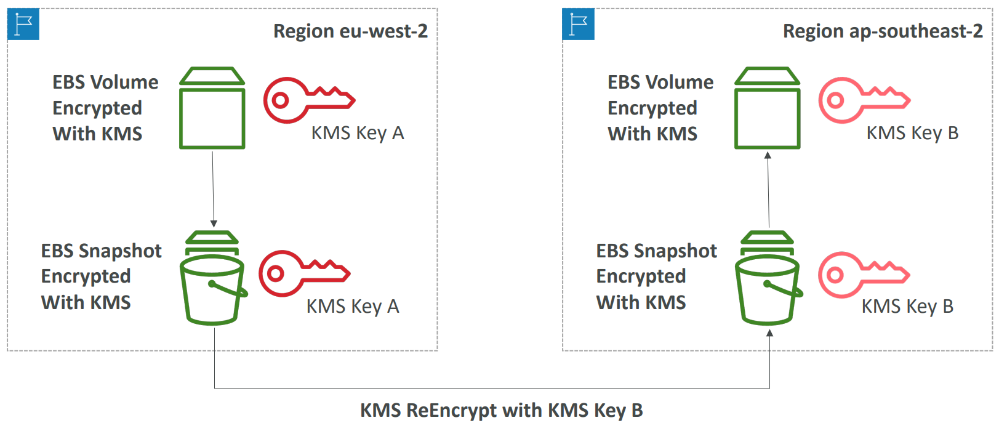

---

## Key Policies

- **Control access** to KMS keys, “similar” to S3 bucket policies
- Difference:

  - you cannot control access without them(if you don't define key policy, no one can access it.)

- **Default** KMS Key Policy:

  - Created if you don’t provide a specific KMS Key Policy
  - **Complete access** to the key to `root user` = entire AWS account (every users)

- **Custom** KMS Key Policy:

  - Define `users`, `roles` that can access the KMS key
  - Define who can **administer** the key
  - Useful for **cross-account access** of your KMS key

- Sample:
  - What should you use to control access to your KMS CMKs?
    - KMS Key Policies

---

## Copying Snapshots across accounts

1. Create a **Snapshot**, **encrypted** with your **own** KMS Key (**Customer Managed** Key)
2. Attach a KMS Key Policy to **authorize cross-account access**
3. **Share** the encrypted snapshot with target account.
4. (in target account) Create a **copy** of the Snapshot, encrypt it with a `CMK` in
   your account
5. Create a **volume** from the snapshot

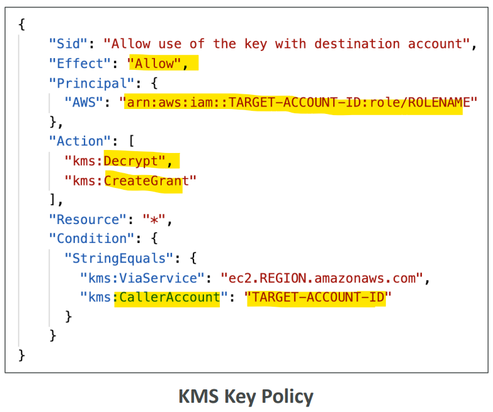

---

## Multi-Region Keys

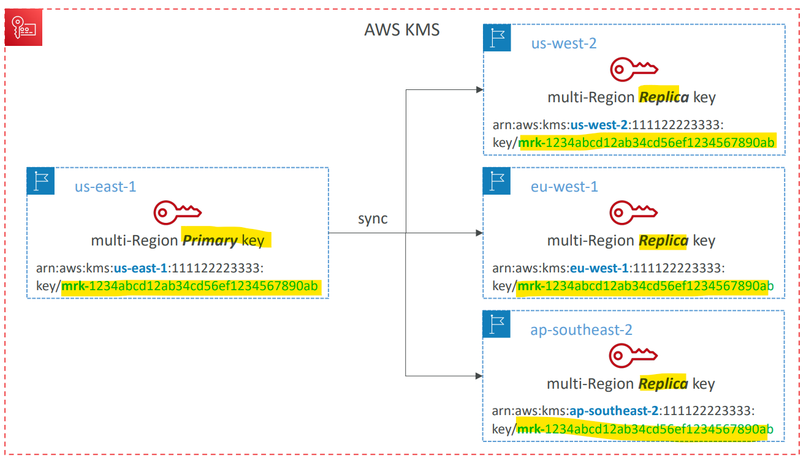

- **Identical** KMS keys in **different** AWS **Regions** that can be used interchangeably

  - allow to **Encrypt** in one Region and **decrypt** in **other** Regions
  - **No need** to **re-encrypt** or making **cross-Region API calls**
  - Multi-Region keys have the **same key ID**, key **material**, **automatic rotation**…

- KMS Multi-Region are **NOT global** **(Primary + Replicas**)
- Each Multi-Region key is **managed independently**
- **Use cases:**
  - global **client-side encryption**(have client-side encryption in one region, then have client-side decryption in another region)
  - **encryption** on **Global** DynamoDB, Global Aurora

---

### DynamoDB Global Tables and KMS MultiRegion Keys Client-Side encryption

- `DynamoDB Encryption Client`

  - used to **encrypt specific attributes client-side** in our DynamoDB table
  - Combined with `Global Tables`, the client-side encrypted data is **replicated to other regions**

- If we use a `multi-region key`, replicated in the same region as the DynamoDB Global table, then clients in these regions can use **lowlatency API calls to KMS** in their region to **decrypt the data client-side**
- Using `client-side encryption` we can **protect** specific fields and guarantee only decryption if the client has access to an API key
- Global table 保证跨区数据同步
- multi-region key 保证密钥跨区同步
- client-silde 实现数据在客户端能加解密, 防止传讯过程泄密.

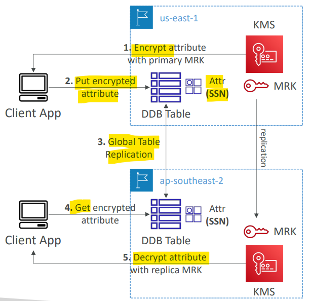

---

### Global Aurora and KMS Multi-Region Keys Client-Side encryption

- `AWS Encryption SDK`

  - used to **encrypt specific attributes client-side** in our `Aurora` table
  - Combined with `Aurora Global Tables`, the client-side encrypted data is **replicated to other regions**

- If we use a `multi-region key`, replicated in the same region as the Global Aurora DB, then clients in these regions can **use low-latency API calls to KMS** in their region to **decrypt the data client-side**
- Using `client-side encryption` we can protect specific fields and guarantee only decryption if the client has access to an API key, we can protect specific fields **even from database admins**

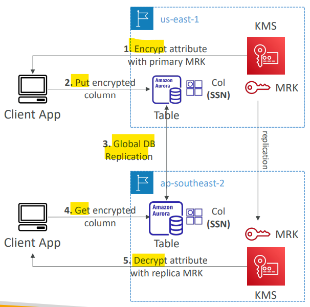

- Sample:
  - An online-payment company is using AWS to host its infrastructure. The frontend is created using VueJS and is hosted on an S3 bucket and the backend is developed using PHP and is hosted on EC2 instances in an Auto Scaling Group. As their customers are **worldwide**, they use both CloudFront and Aurora **Global database** to implement **multi-region deployments** to provide the lowest latency and provide availability, and resiliency. A new feature required which gives customers the ability to store data encrypted on the database and this data must **not be disclosed even by the company admins**. The data should be **encrypted on the client side** and stored in an encrypted format. What do you recommend to implement this?
    - Using Aurora Client-side Encryption and KMS Multi-region Keys.

---

### S3 Replication Encryption Considerations

- `SSE-S3`

  - **Unencrypted** objects and objects **encrypted** with `SSE-S3` are **replicated by default**

- `SSE-C`

  - Objects encrypted with `SSE-C (customer provided key)` are **never replicated**

- `SSE-KMS`

  - For objects encrypted with `SSE-KMS`, you need to **enable** the option

    - **Specify** which `KMS Key` to encrypt the objects within the target bucket
    - **Adapt** the `KMS Key Policy` for the target key
    - An `IAM Role` with `kms:Decrypt` for the **source** `KMS Key` and `kms:Encrypt` for the **target** `KMS Key`
    - You might get **KMS throttling errors**, in which case you can ask for a `Service Quotas` increase

- `multi-region AWS KMS Keys`

  - You can use `multi-region AWS KMS Keys`, but they are currently treated as **independent** keys by Amazon `S3`. 可以用 multi, 但实际上视作独立
    - the object will still be decrypted and then encrypted

- Sample:
  - You have an S3 bucket that is encrypted with `SSE-KMS`. You have been tasked to **replicate the objects** to a target bucket in the same AWS region but with a different KMS Key. You have configured the S3 replication, the target bucket, and the target KMS key and it is still **not working**. What is missing to make the S3 replication work?
    - have to configure permission for both Source KMS key `kms:Decrypt` and Target KMS Key `kms:Encrypt` to be used by S3 Replication service.

---

## AMI Sharing Process Encrypted via KMS

1. `AMI` in Source Account is **encrypted with** `KMS Key` from Source Account
2. Must modify the image attribute to **add a Launch Permission** which corresponds to the specified **target AWS account**
3. Must **share** the `KMS Keys` used to encrypted the snapshot the AMI references with the target account / IAM Role
4. The IAM Role/User in the target account must have the **permissions** to `DescribeKey`, `ReEncrypted`, `CreateGrant`, `Decrypt`
5. When **launching** an EC2 instance from the AMI, optionally the target account can specify a **new** `KMS key` in its own account to re-encrypt the volumes

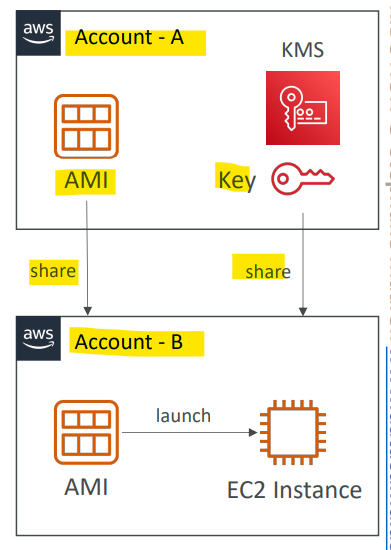

- Sample:
  - You have an AMI that has an encrypted EBS snapshot using `KMS CMK`. You want to **share this AMI with another AWS account**. You have shared the AMI with the desired AWS account, but the other AWS account still can't use it. How would you solve this problem?
    - need to share KMS CMK with other account

---

## Hands-on

- AWS managed keys

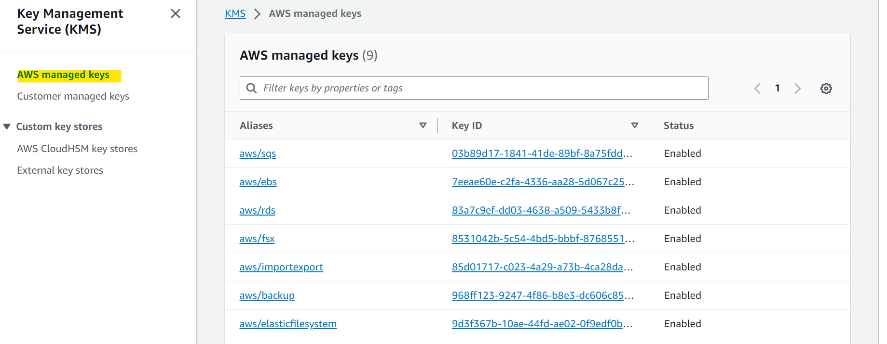

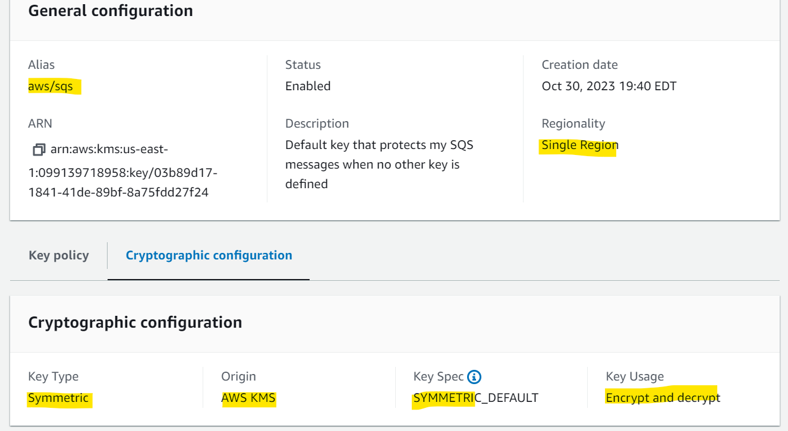

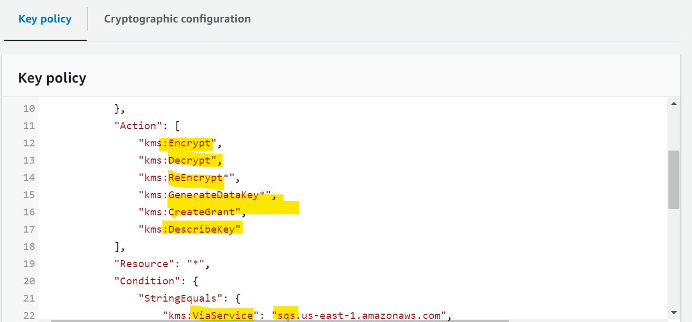

- Customer managed keys

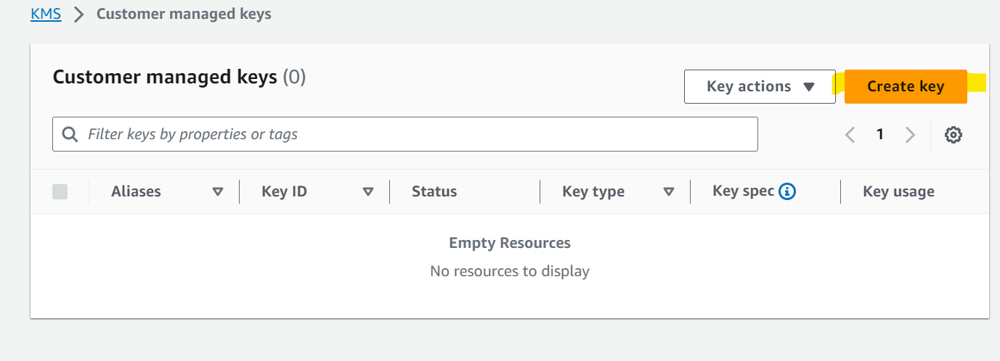

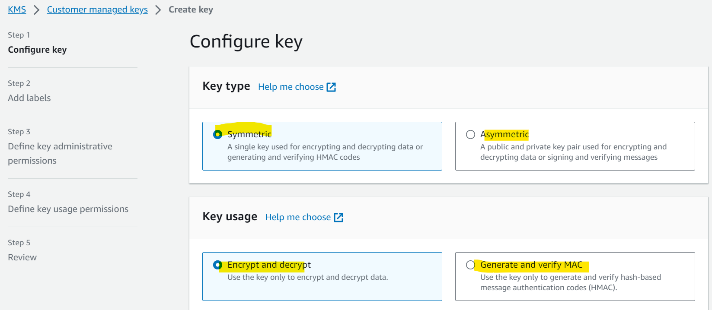

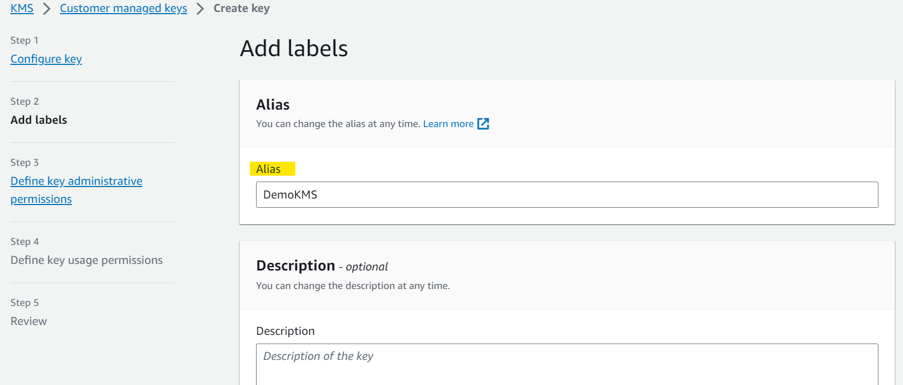

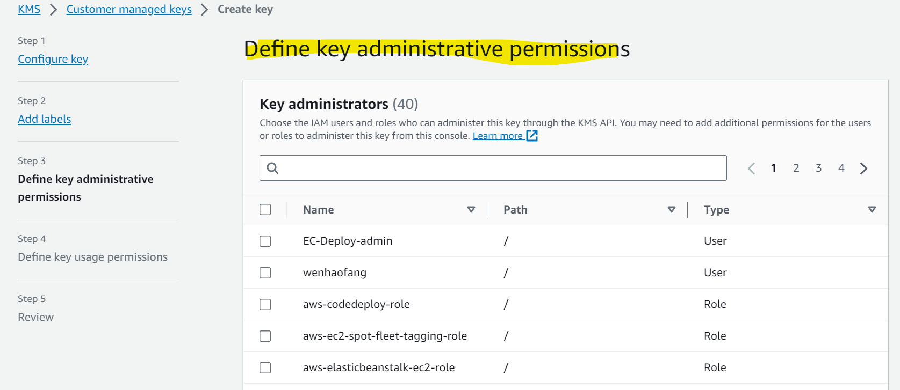

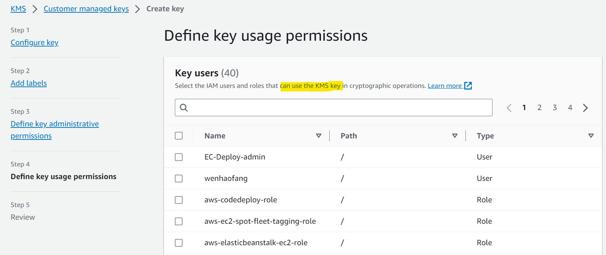

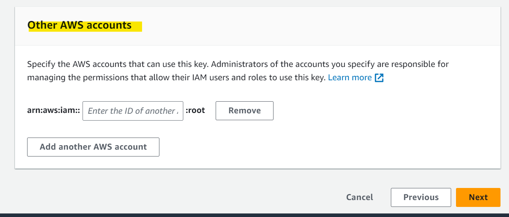

- Rotation
  - must enable
  - every year

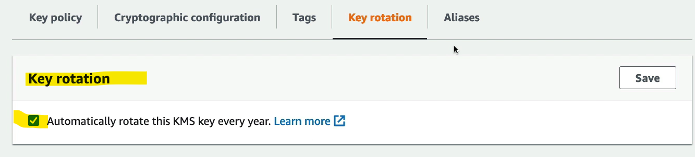

---

[TOP](#aws---kms)
