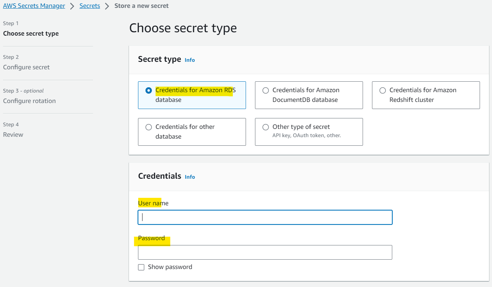
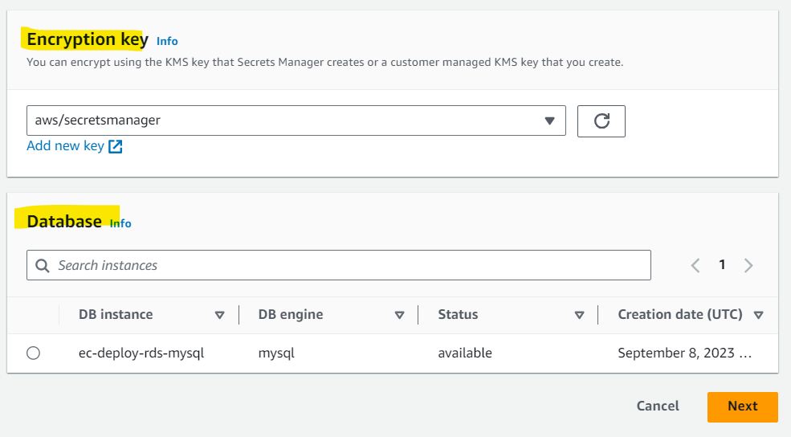
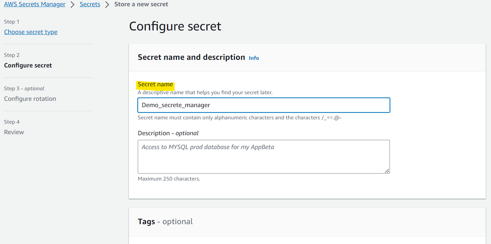
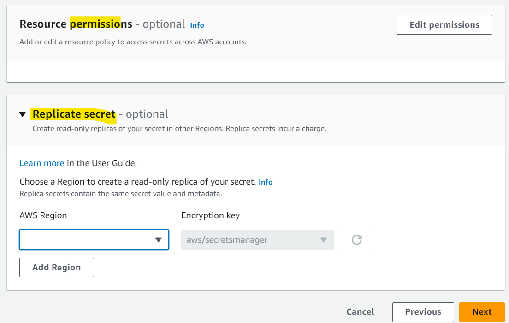
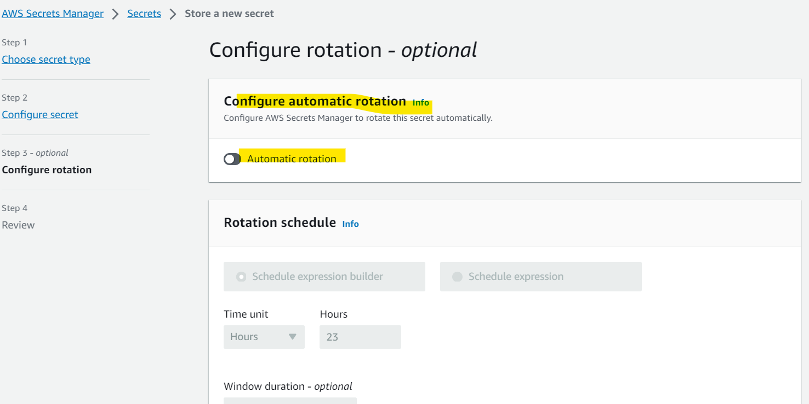
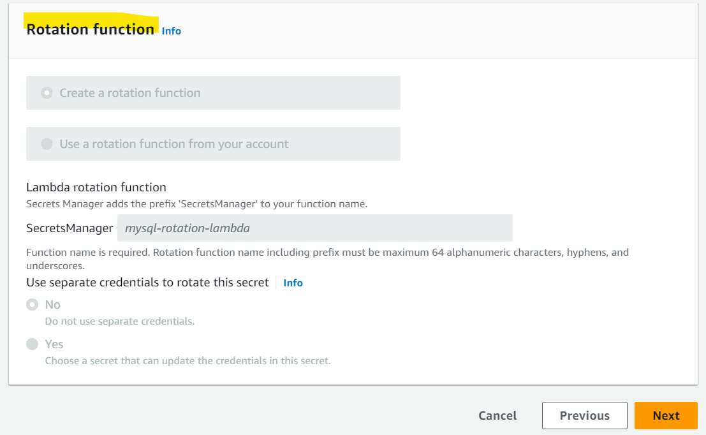

# AWS - Secrets Manager

[Back](../index.md)

- [AWS - Secrets Manager](#aws---secrets-manager)
  - [`AWS Secrets Manager`](#aws-secrets-manager)
    - [Multi-Region Secrets](#multi-region-secrets)
  - [Hands-on](#hands-on)

---

## `AWS Secrets Manager`

- `Secrets Manager`

  - Newer service, meant for **storing secrets**
  - Capability to **force rotation of secrets every X days**
    - different from `Systems Manager` parameter store which cannot force rotation.
  - Automate **generation of secrets** on rotation (uses `Lambda`)

- Integration

  - Mostly meant for RDS **integration**
    - Integration with Amazon `RDS` (MySQL, PostgreSQL, Aurora)
  - Secrets are **encrypted** using `KMS`

- Sample:
  - What is the most suitable AWS service for **storing** RDS DB passwords which also provides you **automatic rotation**?
    - Secrets Manager

---

### Multi-Region Secrets

- **Replicate** Secrets across multiple AWS Regions
- `Secrets Manager` keeps `read replicas` **in sync with** the `primary Secret`
- Ability to promote a `read replica Secret` to a `standalone Secret`
- **Use cases:**
  - multi-region apps,
  - disaster recovery strategies,
  - multi-region DB…

---

## Hands-on

---

[TOP](#aws---secrets-manager)
